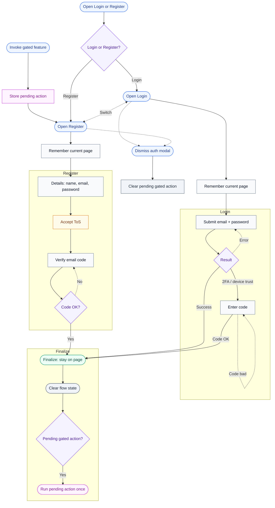

```mermaid
flowchart TD
  G0(["Invoke gated feature"]) --> G1[Store pending action]
  G1 --> AReg(["Open Register"])
  A0(["Open Login or Register"]) --> C{Login or Register?}
  C -->|Login| ALog(["Open Login"])
  C -->|Register| AReg
  ALog <-.->|Switch| AReg

  ALog --> B1[Remember current page]
  AReg --> B2[Remember current page]

  subgraph login [Login]
    D[Submit email + password]
    E{Result}
    F[Enter code]
    D --> E
    E -->|2FA / device trust| F
    E -.->|Error| D
    F -.->|Code bad| F
  end

  subgraph register [Register]
    G[Details: name, email, password]
    H[Accept ToS]
    I[Verify email code]
    J{Code OK?}
    G --> H --> I --> J
  end

  subgraph done [Finalize]
    Z(["Finalize: stay on page"])
    K(["Clear flow state"])
    P{Pending gated action?}
    R(["Run pending action once"])
    Z --> K --> P
    P -->|Yes| R
  end

  B1 --> D
  B2 --> G
  X(["Dismiss auth modal"]) --> XC[Clear pending gated action]

  E -->|Success| Z
  F -->|Code OK| Z
  J -->|Yes| Z
  J -.->|No| I
  ALog -.-> X
  AReg -.-> X

  classDef start fill:#eff6ff,stroke:#2563eb,color:#1e3a8a
  classDef step fill:#f8fafc,stroke:#64748b,color:#0f172a
  classDef decision fill:#f5f3ff,stroke:#7c3aed,color:#4c1d95
  classDef consent fill:#fffbeb,stroke:#d97706,color:#78350f
  classDef gated fill:#fdf4ff,stroke:#c026d3,color:#86198f
  classDef success fill:#ecfdf5,stroke:#059669,color:#064e3b
  classDef error fill:#fef2f2,stroke:#dc2626,color:#7f1d1d
  classDef cleanup fill:#f1f5f9,stroke:#475569,color:#1e293b

  class A0,ALog,AReg,G0,X start
  class B1,B2,D,F,G,I step
  class C,E,J,P decision
  class H consent
  class G1,R gated
  class Z success
  class K,XC cleanup
```
