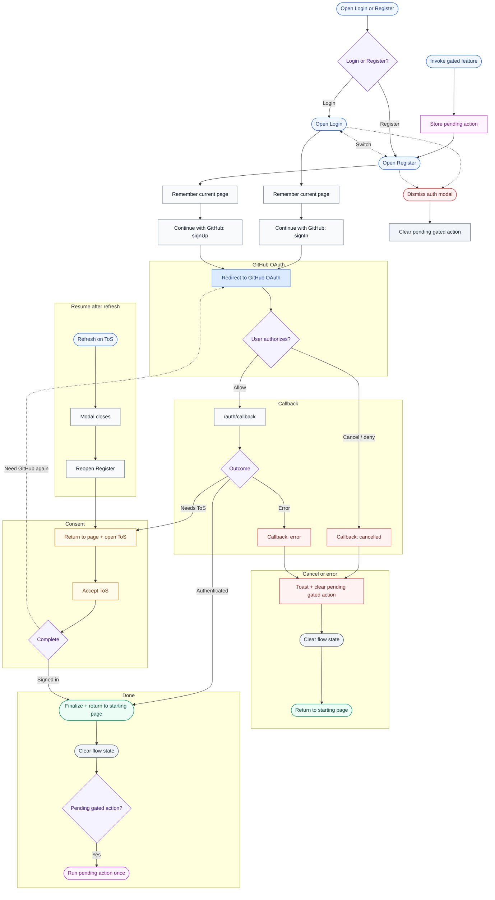

```mermaid
flowchart TD
  G0(["Invoke gated feature"]) --> G1[Store pending action]
  G1 --> AReg(["Open Register"])
  A0(["Open Login or Register"]) --> C{Login or Register?}
  C -->|Login| ALog(["Open Login"])
  C -->|Register| AReg
  ALog <-.->|Switch| AReg

  ALog --> B1[Remember current page]
  AReg --> B2[Remember current page]
  B1 --> GHIn[Continue with GitHub: signIn]
  B2 --> GHUp[Continue with GitHub: signUp]

  subgraph oauth [GitHub OAuth]
    D[Redirect to GitHub OAuth]
    E{User authorizes?}
    D --> E
  end

  subgraph callback [Callback]
    I["/auth/callback"]
    J{Outcome}
    F[Callback: cancelled]
    O[Callback: error]
    I --> J
  end

  subgraph consent [Consent]
    L[Return to page + open ToS]
    M[Accept ToS]
    N{Complete}
    L --> M --> N
  end

  subgraph resume [Resume after refresh]
    P(["Refresh on ToS"])
    Q[Modal closes]
    R[Reopen Register]
    P --> Q --> R
  end

  subgraph fail [Cancel or error]
    FC["Toast + clear pending gated action"]
    FF(["Clear flow state"])
    H(["Return to starting page"])
    FC --> FF --> H
  end

  subgraph done [Done]
    K(["Finalize + return to starting page"])
    CF(["Clear flow state"])
    GP{Pending gated action?}
    GR(["Run pending action once"])
    K --> CF --> GP
    GP -->|Yes| GR
  end

  X(["Dismiss auth modal"])
  GHIn --> D
  GHUp --> D
  E -->|Allow| I
  E -->|Cancel / deny| F
  F --> FC
  J -->|Error| O
  O --> FC
  J -->|Authenticated| K
  J -->|Needs ToS| L
  N -->|Signed in| K
  N -.->|Need GitHub again| D
  R --> L
  ALog -.-> X
  AReg -.-> X
  X --> XC[Clear pending gated action]

  classDef start fill:#eff6ff,stroke:#2563eb,color:#1e3a8a
  classDef step fill:#f8fafc,stroke:#64748b,color:#0f172a
  classDef oauth fill:#dbeafe,stroke:#2563eb,color:#1e3a8a
  classDef decision fill:#f5f3ff,stroke:#7c3aed,color:#4c1d95
  classDef consent fill:#fffbeb,stroke:#d97706,color:#78350f
  classDef gated fill:#fdf4ff,stroke:#c026d3,color:#86198f
  classDef success fill:#ecfdf5,stroke:#059669,color:#064e3b
  classDef error fill:#fef2f2,stroke:#dc2626,color:#7f1d1d
  classDef cleanup fill:#f1f5f9,stroke:#475569,color:#1e293b

  class A0,ALog,AReg,G0,P,X start
  class B1,B2,GHIn,GHUp,I,Q,R step
  class D oauth
  class C,E,J,N,GP decision
  class L,M consent
  class G1,GR gated
  class K,H success
  class F,O,FC,X error
  class CF,FF,XC cleanup
```
