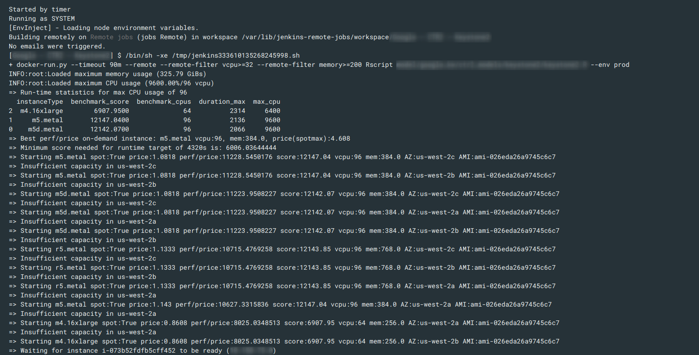
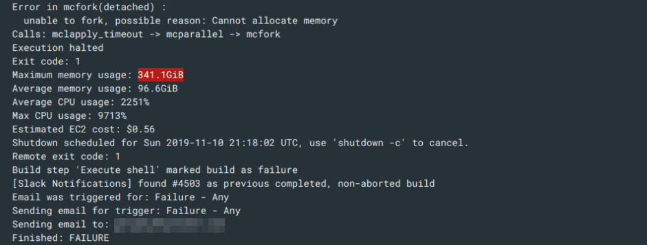
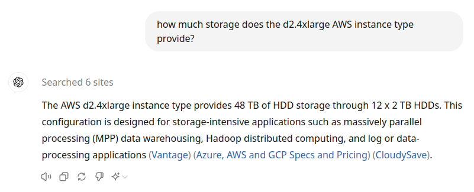
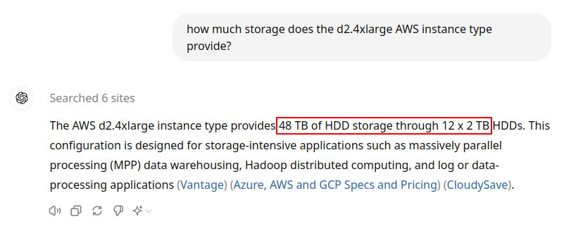
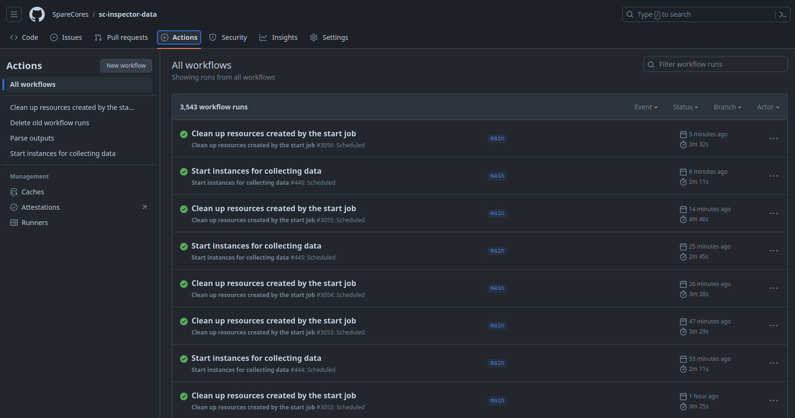
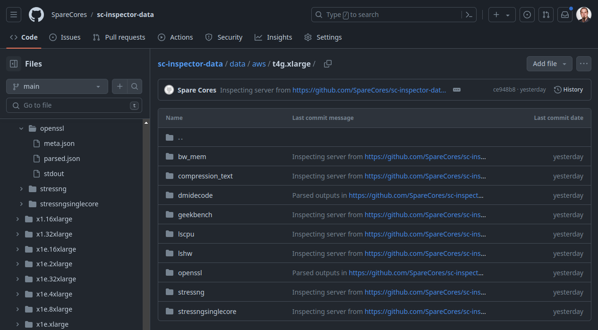
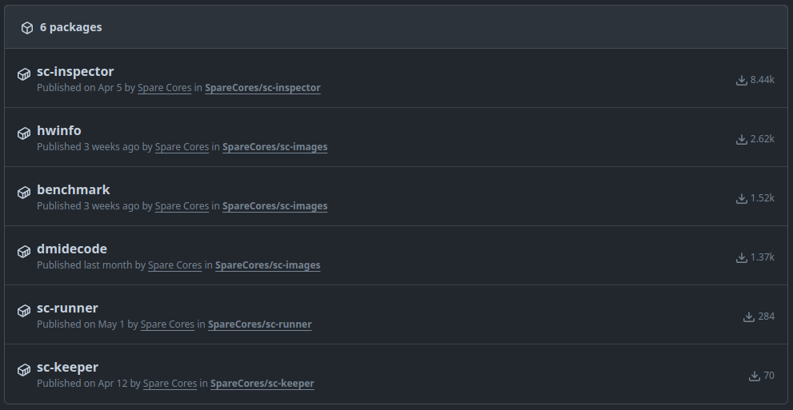
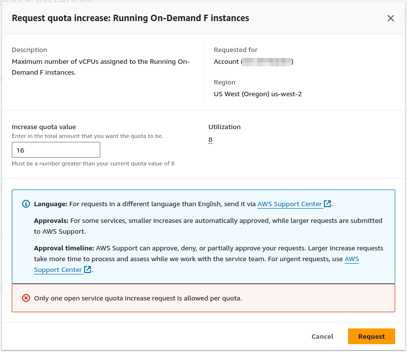
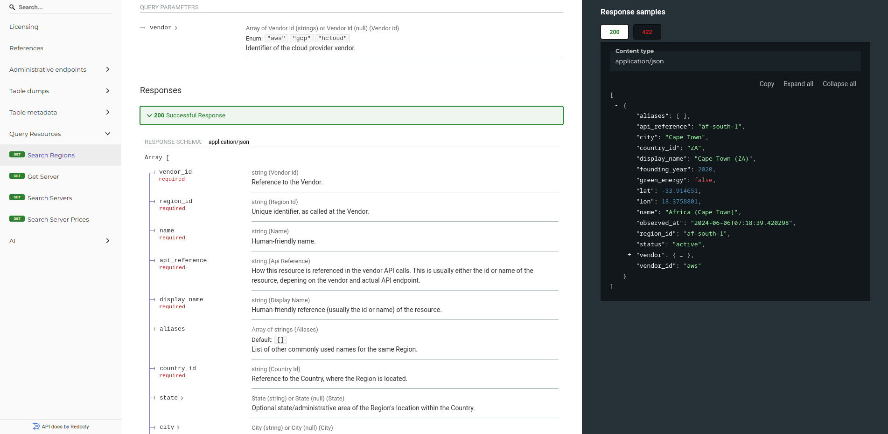
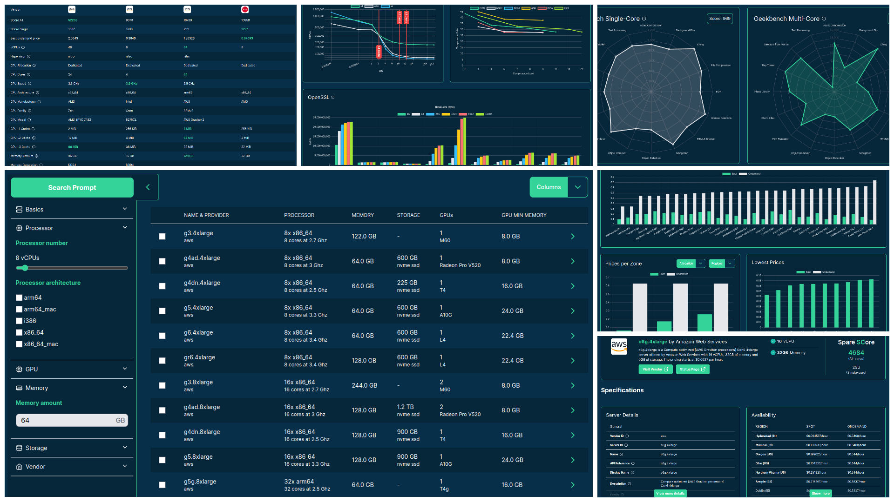

## dummy slide

<!--add custom CSS for the speaker view-->
<script>
  if (window.self !== window.top) {
    document.body.className += " speakerview";
  }
</script>

<!--javascript to remove dummy slide-->
<script>
document.getElementById("dummy-slide").remove();
document.getElementById("coverslide").remove();
</script>

<!--end dummy slide-->
</section>

<section id="coverslide">

::: {.centered}

:::

<h1 class="subtitle" style="color:#eee;font-size:1.75em;text-align: center; margin-top:325px; color:#34d399;">
  Harnessing Spare Cores to<br />Breeze Through Cloud Compute
</h1>

<h2 class="author" style="color:#eee;padding-top:15px;font-size:1.25em;text-align: center !important;margin-bottom: 0px;">
  Gergely Daróczi
</h2>

<h3 class="author" style="color:#eee;font-size:1.1em;text-align: center !important; font-weight: normal;">
  Spare Cores Team
</h3>

<h3 class="author" style="color:#eee;padding-top:25px;font-size:1.1em;text-align: center !important; padding-top: 10px;font-weight: normal; ">
  Slides: <a href="https://sparecores/assets/slides/berlin-buzzwords-2024.html#/coverslide" target="_blank">sparecores.com/talks</a>
</h3>

<div class="notes">
focus: how to utilize cloud compute resources in the most cost-efficient way
</div>

</section>

<section>
<section class="titleslide slide level1" data-transition="slide-in fade-out">
  <h2>&#62;&#62;&#62; from sparecores import why</h2>

<p class="fragment">Data Science / Machine Learning batch jobs:</p>

<ul>
  <li class="fragment">run SQL</li>
  <li class="fragment">run R or Python script</li>
  <ul>
    <li class="fragment">train a simple model, reporting, API integrations etc.</li>
    <li class="fragment">train hierarchical models/GBMs/neural nets etc.</li>
  </ul>
</ul>

<div class="notes">
I've been working as a DS/Dir of Analytics/Sr Dir of Data Ops in the past decade,
responsible for the DS infrastructure to run various algorithm, e.g.

- SQL: lightweight on the client side
- scripts: can be lightweight as well (e.g. API integrations or simple models),

BUT might require a lot of compute resource depending on the type of the model
</div>

## >>> from sparecores import why {data-transition="fade-in slide-out"}

<p class="gray">Data Science / Machine Learning batch jobs:</p>

<ul class="gray">
  <li>run SQL</li>
  <li>run R or Python script</li>
  <ul>
    <li>train a simple model, reporting, API integrations etc.</li>
    <li>train hierarchical models/GBMs/neural nets etc.</li>
  </ul>
</ul>

<p class="bold">Scaling (DS) infrastructure.</p>

<div class="notes">
in short, different tasks (DS in this example) have different compute requirements

NEXT after mentioning varying needs
</div>

## >>> from sparecores import why

::: {.centered}

:::

<div class="notes">
To give you an example: here's a job that we monitored every few seconds and saw that it doesn't really scale to multiple CPUs, but taking up to ~200 gigs of memory -- probably training a hierarchical model that cannot be paralellized.

so we had around 4k/day ...
</div>

## >>> from sparecores import why

::: {.centered}

:::

<div class="notes">
so we had around 4k jobs/day with varying needs

- Training hierarchical models on a large dataset using R required several hundreds GBs of RAM,
- NLP models in Python required GPUs,
- Parallelized time-series forecasting models required many CPUs,
- Many small jobs mostly waiting for SQL results running on a shared host.
- or submitting new bid amounts on ads on a social network
</div>

## >>> from sparecores import why

::: {.colcontainer .mt-60}
:::: {.col}

<p class="fragment mt--20 centered" data-fragment-index="1">AWS ECS</p>

<p class="fragment mt--20 centered" data-fragment-index="2">AWS Batch</p>
::::
:::: {.col}

<p class="fragment mt--20 centered" data-fragment-index="3" >Kubernetes</p>
::::
:::

<div class="notes">
to solve for that, at some point we used Amazon ECS ...
super excited when AWS Batch was announces with the promise of managing the clusters for us

... similarly how other teams got excited about Kubernetes

AWS Batch seemed like a good fit and relatively convenient solution,
but after a few months trial, we experienced unexpected costs
due to developers misconfiguring resource requirements

- overprovisioning to avoid errors
- forgot to update etc

and bin packing ...
</div>

## >>> from sparecores import why

::: {.centered}

:::

<p class="centered mt--20">Source: <a href="https://xkcd.com/2740/">xkcd</a></p>

<div class="notes">
AWS bin packing smaller jobs to already running larger nodes (started for heavy jobs), which resulted in keeping the expensive nodes running for a longer time.

so instead, we decided to roll our own solution after all .. building on the fact that the price of the cloud resources is not discounted by its size .. so running two containers on a larger node VS running on separate nodes make no difference from a pricing perspective
</div>

## >>> from sparecores import why

::: {.centered}

:::

<div class="notes">
here's an example of a job for which our monitoring system recorded that it can scale to many (100) CPUs, and needs high memory ... so filtered for the matching servers and ordered by price, and tried starting those based on availability
</div>

## >>> from sparecores import why {data-transition="slide-in none-out"}

::: {.centered}

:::

<div class="notes">
once the job finished, it updated the compute resource requirements, job status etc
and retries if more compute is needed
</div>

## >>> from sparecores import why {data-transition="none-in slide-out"}

::: {.centered}

:::

::: {.centered}

:::

## >>> from sparecores import why

<p class="bold">Other use-cases:</p>

- stats/ML/AI model training,
- ETL pipelines,
- traditional CI/CD workflows for compiling and testing software,
- building Docker images,
- rendering images and videos,
- etc.

<div class="notes">
so it's like AWS Fargate or Google Cloud Run ... but with auto-scaling and much much cheaper, especially while AWS supported spot instances with blocked duration (until a couple of months ago)

as it seemed useful for many use-cases, we decided and were supported to open-source most of the infra tooling ...
</div>

## >>> from sparecores import why

::: {.centered}

:::

::: {.centered}

:::

<div class="notes">
was released as "cloudperf" a couple years ago, and the team has been maintaining it since then

BUT, it was limited to a single vendor, we also had some new ideas, so it was time to build the next generation ... called Spare Cores, which started thanks to the generous support of the NGI Search project.
</div>

</section></section>

<section>
<section class="titleslide slide level1">
  <h2>&#62;&#62;&#62; from sparecores import intro</h2>

* Open-source tools, database schemas and documentation to inspect and inventory cloud vendors and their compute resource offerings.

. . .

* Managed infrastructure, databases, APIs, SDKs, and web applications to make these data sources publicly accessible.

. . .

* Helpers to start and manage instances in your own environment.

. . .

* SaaS to run containers in a managed environment without direct vendor engagement.

<aside class="notes">
- so Spare Cores is an open-source ecosystem, including software, database schemas, guides,
- and actual databases if you don't want to run the ETL tooling yourself .. also providing APIs, SDKs etc to make it easier to query data
- unified CLI to start machines
- and working on an an optional SaaS offering built on the top of the open-source tooling for folks who would rather avoid registering with all cloud providers etc: give us a Docker image, a command to run, and you credit card .. all set, we will run it wherever it's cheapest.

We help DevOps, DS, ML, AI, ETL, AV, and other engineering teams to find optimal instances for their batch jobs (e.g. “8 CPU cores, 64 GB of RAM, and a TPU needed in an EU datacenter to train ML models for 6 hours”) by providing:

* Open-source tools, database schemas and documentation to monitor cloud and flexible VPS/dedicated server vendors and their compute resource offerings in an innovative and truly comparative way, including vendor details (e.g. location, certificates, green power), compute capabilities (e.g. CPU, memory, GPU/TPU), pricing (especially of spot instances), and performance (by running task-specific benchmarks).
* Managed infrastructure, databases, APIs, SDKs, and web applications to make these continuously and transparently tracked data sources publicly available and comparable in a validated, unbiased, structured, and searchable manner.
* Helpers to easily start and manage instances at all the supported vendors with a standardized API.
* SaaS

BUT let's focus on the open-source and open-data components ..
</aside>

## >>> from sparecores import intro


<p class="centered" style="margin-top: -10px;">Source: <a href="https://sparecores.com">sparecores.com</a></p>

<aside class="notes">
<!-- TODO update img with no of benchmarks instead of AZs -->
To show you some stats on the data being tracked:
- we are limited to 3 vendors now, but in a month or two we should have a coverage of all major players,
- already tracking X servers ...
</aside>

## >>> from sparecores import intro

::: {.centered}

:::

<aside class="notes">
The easiest way to query this data is through our web component, as you can see on the screen ...
</aside>

## >>> from sparecores import intro

::: {.centered}

:::

<aside class="notes">
Clicking on a server shows you the technical details of the instance -- much more than what's provided publicly by the vendor, even more than what ChatGPT knows ... as we actually start each machine and inspect the hardware. More on that later.
</aside>

## >>> from sparecores import intro

::: {.centered}

:::

<aside class="notes">
Live and historical pricing
</aside>

## >>> from sparecores import intro

<!-- https://sparecores.com/server/aws/c5d.2xlarge -->

::: {.centered}

:::

<aside class="notes">
and we also run benchmark scenarios on the servers, e.g.:

- memory bandwidth of read, write and mixed operations using various block sizes and also including the related L1/L2/L3 cache amounts
- or benchmarking compression algos - having the compression ratio on the x axis, and the bandwidth on the y axis, it's clear that `zpaq` is a beast when it comes to compressing text, but might be slow on this machine
- OpenSSL hash functions and block ciphers
</aside>

## >>> from sparecores import intro


<aside class="notes">
also running Geekbench 6, which has been a standard tool for some time including workloads for text and image processing, compiling software etc
</aside>

## >>> from sparecores import intro

::: {.centered}

:::

<!-- https://deploy-preview-27--creative-choux-a3c817.netlify.app/compare?instances=W3sidmVuZG9yIjoiYXdzIiwic2VydmVyIjoiYzVhZC4xMnhsYXJnZSJ9LHsidmVuZG9yIjoiYXdzIiwic2VydmVyIjoiYzVkLjJ4bGFyZ2UifSx7InZlbmRvciI6ImF3cyIsInNlcnZlciI6ImM2Zy4xNnhsYXJnZSJ9LHsidmVuZG9yIjoiaGNsb3VkIiwic2VydmVyIjoiY2N4MzMifV0%3D -->
<aside class="notes">
and making all these data available in comparison tables as well for human inspection
</aside>


## >>> from sparecores import intro

::: {.centered}

:::

<aside class="notes">
for computers, we provide APIs ...
</aside>

## >>> from sparecores import intro

```py
>>> from rich import print as pp
>>> from sc_crawler.tables import Server
>>> from sqlmodel import create_engine, Session, select
>>> engine = create_engine("sqlite:///sc-data-all.db")
>>> session = Session(engine)
>>> server = session.exec(select(Server).where(Server.server_id == 'g4dn.xlarge')).one()
>>> pp(server)
Server(
    server_id='g4dn.xlarge',
    vendor_id='aws',
    display_name='g4dn.xlarge',
    api_reference='g4dn.xlarge',
    name='g4dn.xlarge',
    family='g4dn',
    description='Graphics intensive [Instance store volumes] [Network and EBS optimized] Gen4 xlarge',

    status=<Status.ACTIVE: 'active'>,
    observed_at=datetime.datetime(2024, 6, 6, 10, 18, 4, 127254),

    hypervisor='nitro',
    vcpus=4,
    cpu_cores=2,
    cpu_allocation=<CpuAllocation.DEDICATED: 'Dedicated'>,
    cpu_manufacturer='Intel',
    cpu_family='Xeon',
    cpu_model='8259CL',
    cpu_architecture=<CpuArchitecture.X86_64: 'x86_64'>,
    cpu_speed=3.5,
    cpu_l1_cache=None,
    cpu_l2_cache=None,
    cpu_l3_cache=None,
    cpu_flags=[],

    memory_amount=16384,
    memory_generation=<DdrGeneration.DDR4: 'DDR4'>,
    memory_speed=3200,
    memory_ecc=None,

    gpu_count=1,
    gpu_memory_min=16384,
    gpu_memory_total=16384,
    gpu_manufacturer='Nvidia',
    gpu_family='Turing',
    gpu_model='Tesla T4',
    gpus=[
        {
            'manufacturer': 'Nvidia',
            'family': 'Turing',
            'model': 'Tesla T4',
            'memory': 15360,
            'firmware_version': '535.171.04',
            'bios_version': '90.04.96.00.A0',
            'graphics_clock': 1590,
            'sm_clock': 1590,
            'mem_clock': 5001,
            'video_clock': 1470
        }
    ],

    storage_size=125,
    storage_type=<StorageType.NVME_SSD: 'nvme ssd'>,
    storages=[{'size': 125, 'storage_type': 'nvme ssd'}],

    network_speed=5.0,
    inbound_traffic=0.0,
    outbound_traffic=0.0,
    ipv4=0,
)
```

<aside class="notes">
and SDKs as well, e.g. querying the details of this instance type: SCROLL through!
</aside>

</section></section>

<section>
<section class="titleslide slide level1">
  <h2>&#62;&#62;&#62; sparecores.\_\_dir\_\_()</h2>


<aside class="notes">
As mentioned previously, this is made available via multiple components that I'd like to walk through in the next slides.
</aside>

</section></section>

<section>
<section class="titleslide slide level1">
  <h2>&#62;&#62;&#62; import sc_crawler</h2>

- ETL framework with database schema and inventory method definitions

. . .

- Database migration tool supporting multiple database engines

. . .

- Manual list of vendors and metadata

. . .

- Vendor API integrations to list regions, zones, servers, storages, prices, included free traffic and IPv4 addresses etc.

. . .

- Spare Cores Inspector integration for hardware discovery and benchmark scores

. . .

- Dependency for other Spare Cores components (schemas)

<aside class="notes">
Let me start with the Crawler, our data ingest framework, which defines database schemas, and knows how to interact with the cloud provider APIs.

,,,

vendor metadata: foundation year, or compliance frameworks implemented

how to get prices info at a vendor, e.g. for IPv4 addresses which became more and more important in the recent months

,,,,

sounds relatively straightforward .. but we had a few interesting experiences :) that I wanted to share
</aside>

## >>> import sc_crawler

::: {.centered}

:::

## >>> from sc_crawler import fks

::: {.centered}

:::

<p class="centered mt--30">Source: <a href="https://dbdocs.io/spare-cores/sc-crawler">dbdocs.io/spare-cores</a></p>

<aside class="notes">
for example, looking at the server price table definition, you can see that there are 5 primary keys our of which 4 are foreign keys as well: pointing to vendor, region, zone, and server. well, all these foreign keys have a vendor as well, so to set up the relationships between the tables properly, you have to use overlapping compound foreign keys ... which is not the most intuitive thing when it comes to ORMs
</aside>

## >>> from sc_crawler import scd

Need to optionally track price etc. changes.

. . .

<div style="margin-top: 75px;"></div>

```py
class Scd(ScModel):
    """Override the `observed_at` column to be primary key in SCD tables."""

    observed_at: datetime = Field(
        primary_key=True,
        default_factory=datetime.utcnow,
        sa_column_kwargs={"onupdate": datetime.utcnow},
        description="Timestamp of the last observation.",
    )
```

<aside class="notes">
this became even more complex when created the SCD versions of the tables to track prices
</aside>

## >>> from sc_crawler import alembic

Let's update the `cpu_cores` column to be optional, as some vendors as shy sharing that over their APIs. We will  backfill with the Spare Cores Inspector!

. . .

```py
"""v0.1.1 cores optional

Revision ID: 4691089690c2
Revises: 98894dffd37c
Create Date: 2024-04-10 00:59:03.509522

"""

from typing import Sequence, Union

import sqlalchemy as sa
import sqlmodel
from alembic import op

# revision identifiers, used by Alembic.
revision: str = "4691089690c2"
down_revision: Union[str, None] = "98894dffd37c"
branch_labels: Union[str, Sequence[str], None] = None
depends_on: Union[str, Sequence[str], None] = None

## need to provide the table schema for offline mode support
meta = sa.MetaData()
server_table = sa.Table(
    "server_scd" if op.get_context().config.attributes.get("scd") else "server",
    meta,
    sa.Column(
        "vendor_id",
        sqlmodel.sql.sqltypes.AutoString(),
        nullable=False,
    ),
    sa.Column(
        "server_id",
        sqlmodel.sql.sqltypes.AutoString(),
        nullable=False,
    ),
    sa.Column(
        "name",
        sqlmodel.sql.sqltypes.AutoString(),
        nullable=False,
    ),
    sa.Column(
        "vcpus",
        sa.Integer(),
        nullable=False,
    ),
    sa.Column(
        "hypervisor",
        sqlmodel.sql.sqltypes.AutoString(),
        nullable=True,
    ),
    sa.Column(
        "cpu_allocation",
        sa.Enum("SHARED", "BURSTABLE", "DEDICATED", name="cpuallocation"),
        nullable=False,
    ),
    sa.Column(
        "cpu_cores",
        sa.Integer(),
        nullable=False,
    ),
    sa.Column(
        "cpu_speed",
        sa.Float(),
        nullable=True,
    ),
    sa.Column(
        "cpu_architecture",
        sa.Enum(
            "ARM64",
            "ARM64_MAC",
            "I386",
            "X86_64",
            "X86_64_MAC",
            name="cpuarchitecture",
        ),
        nullable=False,
    ),
    sa.Column(
        "cpu_manufacturer",
        sqlmodel.sql.sqltypes.AutoString(),
        nullable=True,
    ),
    sa.Column(
        "cpu_family",
        sqlmodel.sql.sqltypes.AutoString(),
        nullable=True,
    ),
    sa.Column(
        "cpu_model",
        sqlmodel.sql.sqltypes.AutoString(),
        nullable=True,
    ),
    sa.Column(
        "cpus",
        sa.JSON(),
        nullable=False,
    ),
    sa.Column("memory", sa.Integer(), nullable=False),
    sa.Column(
        "gpu_count",
        sa.Integer(),
        nullable=False,
    ),
    sa.Column(
        "gpu_memory_min",
        sa.Integer(),
        nullable=True,
    ),
    sa.Column(
        "gpu_memory_total",
        sa.Integer(),
        nullable=True,
    ),
    sa.Column(
        "gpu_manufacturer",
        sqlmodel.sql.sqltypes.AutoString(),
        nullable=True,
    ),
    sa.Column(
        "gpu_model",
        sqlmodel.sql.sqltypes.AutoString(),
        nullable=True,
    ),
    sa.Column(
        "gpus",
        sa.JSON(),
        nullable=False,
    ),
    sa.Column(
        "storage_size",
        sa.Integer(),
        nullable=False,
    ),
    sa.Column(
        "storage_type",
        sa.Enum("HDD", "SSD", "NVME_SSD", "NETWORK", name="storagetype"),
        nullable=True,
    ),
    sa.Column(
        "storages",
        sa.JSON(),
        nullable=False,
    ),
    sa.Column(
        "network_speed",
        sa.Float(),
        nullable=True,
    ),
    sa.Column(
        "inbound_traffic",
        sa.Float(),
        nullable=False,
    ),
    sa.Column(
        "outbound_traffic",
        sa.Float(),
        nullable=False,
    ),
    sa.Column(
        "ipv4",
        sa.Integer(),
        nullable=False,
    ),
    sa.Column(
        "status",
        sa.Enum("ACTIVE", "INACTIVE", name="status"),
        nullable=False,
    ),
    sa.Column(
        "observed_at",
        sa.DateTime(),
        nullable=False,
    ),
    sa.ForeignKeyConstraint(
        ["vendor_id"],
        ["vendor.vendor_id"],
    ),
    sa.PrimaryKeyConstraint("vendor_id", "server_id", "observed_at")
    if op.get_context().config.attributes.get("scd")
    else sa.PrimaryKeyConstraint("vendor_id", "server_id"),
)

def upgrade() -> None:
    if op.get_context().config.attributes.get("scd"):
        with op.batch_alter_table(
            "server_scd", schema=None, copy_from=server_table
        ) as batch_op:
            batch_op.alter_column(
                "cpu_cores", existing_type=sa.INTEGER(), nullable=True
            )
    else:
        with op.batch_alter_table(
            "server", schema=None, copy_from=server_table
        ) as batch_op:
            batch_op.alter_column(
                "cpu_cores", existing_type=sa.INTEGER(), nullable=True
            )


def downgrade() -> None:
    if op.get_context().config.attributes.get("scd"):
        with op.batch_alter_table(
            "server_scd", schema=None, copy_from=server_table
        ) as batch_op:
            batch_op.alter_column(
                "cpu_cores", existing_type=sa.INTEGER(), nullable=False
            )
    else:
        with op.batch_alter_table(
            "server", schema=None, copy_from=server_table
        ) as batch_op:
            batch_op.alter_column(
                "cpu_cores", existing_type=sa.INTEGER(), nullable=False
            )
```

<aside class="notes">
Another complexity was due supporting multiple database engines, e.g. publishing most recent data in SQLite and collecting SCD data in Postges and CockrochDB, and maintaining the database migration tool with support for all of these. In this example we just changed a single column from `NOT NULL` to nullable, as it turned out that even the number of cores of a server might be unknown at some vendors.

offline mode support -> table def for both the SCD and non-SCD tables, same for PKs
supporting upgrade and downgrade path

but once that's done ..
</aside>

## >>> from sc_crawler import alembic

```sh
$ sc-crawler schemas upgrade --sql
```

. . .

```SQL
CREATE TABLE _alembic_tmp_server (
    vendor_id VARCHAR NOT NULL,
    server_id VARCHAR NOT NULL,
    name VARCHAR NOT NULL,
    vcpus INTEGER NOT NULL,
    hypervisor VARCHAR,
    cpu_allocation VARCHAR(9) NOT NULL,
    cpu_cores INTEGER,
    cpu_speed FLOAT,
    cpu_architecture VARCHAR(10) NOT NULL,
    cpu_manufacturer VARCHAR,
    cpu_family VARCHAR,
    cpu_model VARCHAR,
    cpus JSON NOT NULL,
    memory INTEGER NOT NULL,
    gpu_count INTEGER NOT NULL,
    gpu_memory_min INTEGER,
    gpu_memory_total INTEGER,
    gpu_manufacturer VARCHAR,
    gpu_model VARCHAR,
    gpus JSON NOT NULL,
    storage_size INTEGER NOT NULL,
    storage_type VARCHAR(8),
    storages JSON NOT NULL,
    network_speed FLOAT,
    inbound_traffic FLOAT NOT NULL,
    outbound_traffic FLOAT NOT NULL,
    ipv4 INTEGER NOT NULL,
    status VARCHAR(8) NOT NULL,
    observed_at DATETIME NOT NULL,
    description VARCHAR,
    PRIMARY KEY (vendor_id, server_id),
    FOREIGN KEY(vendor_id) REFERENCES vendor (vendor_id)
);

INSERT INTO _alembic_tmp_server (vendor_id, server_id, name, vcpus, hypervisor, cpu_allocation, cpu_cores, cpu_speed, cpu_architecture, cpu_manufacturer, cpu_family, cpu_model, cpus, memory, gpu_count, gpu_memory_min, gpu_memory_total, gpu
_manufacturer, gpu_model, gpus, storage_size, storage_type, storages, network_speed, inbound_traffic, outbound_traffic, ipv4, status, observed_at) SELECT server.vendor_id, server.server_id, server.name, server.vcpus, server.hypervisor, ser
ver.cpu_allocation, server.cpu_cores, server.cpu_speed, server.cpu_architecture, server.cpu_manufacturer, server.cpu_family, server.cpu_model, server.cpus, server.memory, server.gpu_count, server.gpu_memory_min, server.gpu_memory_total, se
rver.gpu_manufacturer, server.gpu_model, server.gpus, server.storage_size, server.storage_type, server.storages, server.network_speed, server.inbound_traffic, server.outbound_traffic, server.ipv4, server.status, server.observed_at
FROM server;

DROP TABLE server;

ALTER TABLE _alembic_tmp_server RENAME TO server;

UPDATE alembic_version SET version_num='4691089690c2' WHERE alembic_version.version_num = '98894dffd37c';
```

<aside class="notes">
but once that's done .. the user-facing command is straighforward, and can support most database engines both online and offline as well, as you can see in the generated SQL for offline mode
</aside>

## >>> from sc_crawler import hwinfo {data-transition="slide-in none-out"}

<ul style="margin-top: -20px;">
  <li>Varying quality and availability of data at different vendors.</li>
</ul>



<aside class="notes">
as mentioned previously, data quality and availability on the server details is pretty random .. and I'm not even talking about structured data, but in most cases the data doesn't exist in any form. and before anyone asks .. not, not even ChatGPT knows:

,,,


I mean ... after searching for 6 or 7 sources online .. this guy failed heavily
</aside>

## >>> from sc_crawler import hwinfo {data-transition="none"}

<ul style="margin-top: -20px;">
  <li>Varying quality and availability of data at different vendors.</li>
</ul>



<aside class="notes">
multiplying 12 by 2 ... so we really hoped there's a better way.
</aside>

## >>> from sc_crawler import hwinfo {data-transition="none-in slide-out"}

<ul style="margin-top: -20px;">
  <li>Varying quality and availability of data at different vendors.</li>
  <ul>
    <li class="fragment">No SSD info via the API. Parse from server description! 🙀</li>
    <li class="fragment">No CPU info via the API. Extracting from homepage! 😿</li>
    <li class="fragment">No hypervisor info via the API. Manual mappings! 🙀😿</li>
  </ul>
  <li class="fragment">Region, right?</li>
</ul>

<div class="colcontainer mt-0">
 <div class="col">
   <ul><ul>
     <li class="fragment">ID, eg `eu-west-1`</li>
     <li class="fragment">Name, eg `Europe (Ireland)`</li>
     <li class="fragment">Alias, eg `EU (Ireland)`</li>
   </ul></ul>
 </div>
 <div class="col">
   <ul><ul>
     <li class="fragment">API reference, eg `eu-west-1`</li>
     <li class="fragment">Display name, eg `Dublin (IE)`</li>
     <li class="fragment">Exact location? Energy source?</li>
   </ul></ul>
 </div>
</div>

<aside class="notes">
So that storage data is sometimes missing from the API response .. at least in a structured way.
And we need to parse the availability of an attached local SSD from the server description.

Sometimes it's not even there .. need to extract CPU info from the vendor homepage.

And sometimes data is not even there ... we had to look that up and provide manual mappings, later automated scripts to collect that data right from the nodes.

But looking at simpler things, e.g. region definitions. Straightforward, right?
</aside>

## >>> from sc_crawler import pricing

- No way to find SKUs by filtering in the API call. Get all, search locally.

. . .

- `f1-micro` is one out of 2 instances with simple pricing.

    - For other instances, lookup SKUs for CPU + RAM and do the math.

. . .

- Match instance family with SKU via search in description, e.g. `C2D`.

. . .

- Except for `c2`, which is  called “Compute optimized”.

. . .

- And `m2` is actually priced at a premium on the top of `m1`.

. . .

- The `n1` resource group is not CPU/RAM, but `N1Standard`, extract if it’s CPU or RAM price from description.

<aside class="notes">
Anyone from Google here today?

- Great, because I have some examples to share.
- Okay, I'll politely avoid naming which vendor might have one of the most interestingly implemented pricing schema ...

2 x 2 numbers .. don't ask ChatGPT to do that for you!!!

,,,

m2 pricing: look up m1 cpu/ram pricing + add the premium skus and do the math (2 times 2 numbers added and multiplied – involving 5 api lookups)

Don’t bother with zones reported that are not existing (us-west8 on May 22 .. edge network?)

it's a mess ...

okay, enough horror stories. beleive me ... it's good to have a standardize database schema and data
</aside>

## >>> import sc_crawler

::: {.centered}

:::

<p class="centered mt--30">Source: <a href="https://dbhub.io/sparecores/sc-data-priceless.db">dbhub.io/sparecores</a></p>

<aside class="notes">
so I'm super happy to introduce this cleaned up dataset to you all, which is actually another component of the SC ecocystem, as we license all our software by MPL, but the data by creative commons attribution/share-alike
</aside>

</section></section>

<section>
<section class="titleslide slide level1">
  <h2>&#62;&#62;&#62; import sc_data</h2>

<ul style="margin-top: -20px;">
  <li class="fragment">GitHub Action set up to run the Crawler every 5 minutes.</li>
  <div class="colcontainer mt-0">
  <div class="col">
  <ul>
  <li class="fragment">~9000 GHA runs</li>
  </ul>
  </div>
  <div class="col2">
  <ul>
  <li class="fragment">~100 releases (with non-price changes)</li>
  </ul>
  </div>
 </div>
 <li class="fragment">Make the data available in a public (CC BY-SA) SQLite database:</li>
  <ul>
    <li class="fragment">60MiB SQLite</li>
    <li class="fragment">1,120 active servers and their ~135k prices tracked</li>
    <li class="fragment">~130k measured scores across 24 benchmarks</li>
  </ul>
  <li class="fragment">Thin Python package to keep the data updated from S3.</li>
  <ul>
    <li class="fragment">Package version is tied to Crawler version.</li>
  </ul>
</ul>

<aside class="notes">
so we have a separate GitHub repo set up for the data, including GH Actions to run the Crawler every 5 minutes

and publishing the most recent data as an SQLite database and Python package

This data includes data collected outside of the vendor APIs ...
</aside>

</section></section>

<section>
<section class="titleslide slide level1">
  <h2>&#62;&#62;&#62; import sc_inspector</h2>

Information collected from vendor APIs is very limited, so we run:

```{=html}
<div class="colcontainer mt-0">
  <div class="col">
    <ul style="margin-top: -20px;">
      <li class="fragment">Hardware inspection tools:</li>
      <ul>
        <li class="fragment"><code>dmidecode</code></li>
        <li class="fragment"><code>lscpu</code></li>
        <li class="fragment"><code>lshw</code></li>
      </ul>
    </ul>
  </div>
  <div class="col">
    <ul style="margin-top: -20px;">
      <li class="fragment">Benchmarking workloads:</li>
      <ul>
        <li class="fragment"><code>bw_mem</code></li>
        <li class="fragment">Compression algos</li>
        <li class="fragment">OpenSSL hash functions and block ciphers</li>
        <li class="fragment">Geekbench 6</li>
        <li class="fragment"><code>stress-ng</code></li>
      </ul>
    </ul>
  </div>
</ul>
```

<aside class="notes">
This data includes data collected outside of the vendor APIs ... in the means of our Inspector tool.

which runs ...

And we indeed start all cloud servers (more than a 1000), and run all these things on them, so that you don't have to :)
</aside>

## >>> import sc_inspector

<p class="mt-0">Data is collected in public: `sc-inspector-data` repo on GitHub.</p>

::: {.centered}

:::

<aside class="notes">
This data is also collected in public, running GH Actions to start the machines, run the benchmarks, parse results, clean up the resources etc.
</aside>

## >>> import sc_inspector

::: {.centered}

:::

<aside class="notes">
And besides integrating in the Data package, everything is stored in the GitHub repo, like:

- stout
- stderr
- parsed results
- metadata
</aside>

## >>> import sc_inspector

```sh
docker run --rm -ti -v /var/run/docker.sock:/var/run/docker.sock \
    -e GITHUB_TOKEN=${GITHUB_TOKEN} \
    -e BENCHMARK_SECRETS_PASSPHRASE=${BENCHMARK_SECRETS_PASSPHRASE} \
    ghcr.io/sparecores/sc-inspector:main \
    inspect --vendor ${VENDOR} --instance ${INSTANCE} --gpu-count ${GPU_COUNT}
```
::: {.centered}

:::

<aside class="notes">
If you want, you can run the inspector on any machine .. by using our related Docker images.
</aside>

</section></section>


<section>
<section class="titleslide slide level1">
  <h2>&#62;&#62;&#62; import sc_runner</h2>

```sh
$ docker run --rm -ti \
  ghcr.io/sparecores/sc-runner:main \
    create aws --instance t4g.nano

Updating (aws.us-west-2.None.t4g.nano):

    pulumi:pulumi:Stack runner-aws.us-west-2.None.t4g.nano running
 +  pulumi:providers:aws us-west-2 creating (0s)
@ updating....
 +  pulumi:providers:aws us-west-2 created (0.29s)
 +  aws:ec2:SecurityGroup t4g.nano creating (0s)
@ updating.....
 +  aws:ec2:SecurityGroup t4g.nano created (2s)
@ updating....
 +  aws:vpc:SecurityGroupIngressRule t4g.nano-0 creating (0s)
 +  aws:vpc:SecurityGroupIngressRule t4g.nano-1 creating (0s)
 +  aws:ec2:Instance t4g.nano creating (0s)
 +  aws:vpc:SecurityGroupEgressRule t4g.nano-1 creating (0s)
 +  aws:vpc:SecurityGroupEgressRule t4g.nano-0 creating (0s)
@ updating....
 +  aws:vpc:SecurityGroupIngressRule t4g.nano-0 created (1s)
 +  aws:vpc:SecurityGroupIngressRule t4g.nano-1 created (1s)
 +  aws:vpc:SecurityGroupEgressRule t4g.nano-1 created (1s)
@ updating....
 +  aws:vpc:SecurityGroupEgressRule t4g.nano-0 created (1s)
@ updating..............
 +  aws:ec2:Instance t4g.nano created (13s)
@ updating....
    pulumi:pulumi:Stack runner-aws.us-west-2.None.t4g.nano
Resources:
    + 7 created
    1 unchanged
```

<aside class="notes">
To start the machines, we are heavily relying on the open-source version of Pulumi,
and we have created Pulumi stack templates to spin up machines, as you can see here.

The command is super simple: provide vendor and instance type, make sure you have the credentials,
and we take care of the rest using this unified CLI.
</aside>

## >>> import sc_runner {data-transition="slide-in none-out"}

::: {.centered}

:::

<aside class="notes">
We faced only a few problems while starting almost 1K sever types at AWS for benchmarking ... namely not being allowed to spin up that many instances due to quotas.
</aside>

## >>> import sc_runner {data-transition="none-in slide-out"}

::: {.centered}

:::

<aside class="notes">
Never imagined we would be hitting the "quote update request quota" 🤐

Quite an achievement!
</aside>

</section></section>

<section>
<section class="titleslide slide level1">
  <h2>&#62;&#62;&#62; import sc_keeper</h2>

```sh
$ curl https://keeper.sparecores.net/server/aws/g4dn.xlarge | jq
  % Total    % Received % Xferd  Average Speed   Time    Time     Time  Current
                                 Dload  Upload   Total   Spent    Left  Speed
100  111k  100  111k    0     0  79795      0  0:00:01  0:00:01 --:--:-- 79799
```

```json
{
  "vendor_id": "aws",
  "server_id": "g4dn.xlarge",
  "name": "g4dn.xlarge",
  "api_reference": "g4dn.xlarge",
  "display_name": "g4dn.xlarge",
  "description": "Graphics intensive [Instance store volumes] [Network and EBS optimized] Gen4 xlarge",
  "family": "g4dn",
  "vcpus": 4,
  "hypervisor": "nitro",
  "cpu_allocation": "Dedicated",
  "cpu_cores": 2,
  "cpu_speed": 3.5,
  "cpu_architecture": "x86_64",
  "cpu_manufacturer": "Intel",
  "cpu_family": "Xeon",
  "cpu_model": "8259CL",
  "cpu_l1_cache": 131072,
  "cpu_l2_cache": 2097152,
  "cpu_l3_cache": 37486592,
  "cpu_flags": [
    "fpu",
    "vme",
    "de",
    "pse",
    "tsc",
    "msr",
    "pae",
    ...
  ],
  "cpus": [],
  "memory_amount": 16384,
  "memory_generation": "DDR4",
  "memory_speed": 2933,
  "memory_ecc": null,
  "gpu_count": 1,
  "gpu_memory_min": 16384,
  "gpu_memory_total": 16384,
  "gpu_manufacturer": "Nvidia",
  "gpu_family": "Turing",
  "gpu_model": "Tesla T4",
  "gpus": [
    {
      "manufacturer": "Nvidia",
      "family": "Turing",
      "model": "Tesla T4",
      "memory": 15360,
      "firmware_version": "535.171.04",
      "bios_version": "90.04.96.00.A0",
      "graphics_clock": 1590,
      "sm_clock": 1590,
      "mem_clock": 5001,
      "video_clock": 1470
    }
  ],
  "storage_size": 125,
  "storage_type": "nvme ssd",
  "storages": [
    {
      "size": 125,
      "storage_type": "nvme ssd"
    }
  ],
  "network_speed": 5.0,
  "inbound_traffic": 0.0,
  "outbound_traffic": 0.0,
  "ipv4": 0,
  "status": "active",
  "observed_at": "2024-06-09T21:20:22.005194",
  "vendor": {
    "logo": "https://sc-data-public-40e9d310.s3.amazonaws.com/cdn/logos/aws.svg",
    "address_line": "410 Terry Ave N",
    "name": "Amazon Web Services",
    "zip_code": "98109",
    "founding_year": 2002,
    "state": "Washington",
    "status_page": "https://health.aws.amazon.com/health/status",
    "vendor_id": "aws",
    "homepage": "https://aws.amazon.com",
    "country_id": "US",
    "status": "active",
    "observed_at": "2024-06-09T21:50:32.658281",
    "city": "Seattle"
  },
  "prices": [
    {
      "vendor_id": "aws",
      "region_id": "af-south-1",
      "zone_id": "afs1-az1",
      "server_id": "g4dn.xlarge",
      "operating_system": "Linux",
      "allocation": "ondemand",
      "unit": "hour",
      "price": 0.698,
      "price_upfront": 0.0,
      "price_tiered": [],
      "currency": "USD",
      "status": "active",
      "observed_at": "2024-06-09T21:21:10.015921",
      "region": {
        "country_id": "ZA",
        "state": null,
        "founding_year": 2020,
        "green_energy": false,
        "name": "Africa (Cape Town)",
        "city": "Cape Town",
        "status": "active",
        "address_line": null,
        "observed_at": "2024-06-09T21:19:37.529944",
        "zip_code": null,
        "lon": 18.3758801,
        "region_id": "af-south-1",
        "display_name": "Cape Town (ZA)",
        "lat": -33.914651,
        "vendor_id": "aws",
        "api_reference": "af-south-1",
        "aliases": []
      },
      "zone": {
        "region_id": "af-south-1",
        "zone_id": "afs1-az1",
        "api_reference": "af-south-1a",
        "status": "active",
        "vendor_id": "aws",
        "name": "af-south-1a",
        "display_name": "af-south-1a",
        "observed_at": "2024-06-09T21:19:40.425499"
      }
    },
    {
      "vendor_id": "aws",
      "region_id": "af-south-1",
      "zone_id": "afs1-az2",
      "server_id": "g4dn.xlarge",
      "operating_system": "Linux",
      "allocation": "spot",
      "unit": "hour",
      "price": 0.2251,
      "price_upfront": 0.0,
      "price_tiered": [],
      "currency": "USD",
      "status": "active",
      "observed_at": "2024-06-09T18:16:26",
      "region": {
        "country_id": "ZA",
        "state": null,
        "founding_year": 2020,
        "green_energy": false,
        "name": "Africa (Cape Town)",
        "city": "Cape Town",
        "status": "active",
        "address_line": null,
        "observed_at": "2024-06-09T21:19:37.529944",
        "zip_code": null,
        "lon": 18.3758801,
        "region_id": "af-south-1",
        "display_name": "Cape Town (ZA)",
        "lat": -33.914651,
        "vendor_id": "aws",
        "api_reference": "af-south-1",
        "aliases": []
      },
      "zone": {
        "region_id": "af-south-1",
        "zone_id": "afs1-az2",
        "api_reference": "af-south-1b",
        "status": "active",
        "vendor_id": "aws",
        "name": "af-south-1b",
        "display_name": "af-south-1b",
        "observed_at": "2024-06-09T21:19:40.425554"
      }
    },
    ...
  ],
  "benchmark_scores": [
    {
      "server_id": "g4dn.xlarge",
      "config": {},
      "status": "active",
      "vendor_id": "aws",
      "benchmark_id": "bogomips",
      "score": 5000.0,
      "note": null,
      "observed_at": "2024-06-07T04:26:48.643640"
    },
    {
      "server_id": "g4dn.xlarge",
      "config": {
        "cores": 1,
        "framework_version": "0.17.08"
      },
      "status": "active",
      "vendor_id": "aws",
      "benchmark_id": "stress_ng:cpu_all",
      "score": 1385.583093,
      "note": null,
      "observed_at": "2024-06-07T04:27:14.552982"
    },
    {
      "server_id": "g4dn.xlarge",
      "config": {
        "cores": 4,
        "framework_version": "0.17.08"
      },
      "status": "active",
      "vendor_id": "aws",
      "benchmark_id": "stress_ng:cpu_all",
      "score": 4013.022928,
      "note": null,
      "observed_at": "2024-06-07T04:27:02.508145"
    }
  ]
}
```

<aside class="notes">
python sdk to search the database and also to make that available as a public HTTP API

- note size
- relationships loaded
- even pricing and benchmarks

,,,

SCROLL DOWN FOR ChatGPT integration!
</aside>

## >>> import sc_keeper

::: {.centered}

:::

## >>> import sc_keeper

::: {.centered}

:::

</section></section>

<section>
<section class="titleslide slide level1">
  <h2>import { AppModule } from 'sc-www';</h2>

::: {.centered}

:::

<aside class="notes">
TODO
</aside>

## import { AppModule } from 'sc-www';


<p class="centered mt--30">Source: <a href="https://sparecores.com">sparecores.com</a></p>

<aside class="notes">
First of all, we have a pretty cool slot machine ... TODO
</aside>

<aside class="notes">
TODO
</aside>

</section></section>

<section class="titleslide slide level1">
  <h2>&#62;&#62;&#62; import \_\_future\_\_</h2>


<ul style="margin-top: -20px;">
  <li class="fragment">Add support for more vendors</li>
  <ul>
    <li class="fragment">Crawler (vendor API integration)</li>
    <li class="fragment">Runner (pulumi)</li>
  </ul>
  <li class="fragment">More SDKs (PyPI, npm, CRAN, etc.)</li>
  <li class="fragment">Data analysis, blog posts</li>
  <li class="fragment">My Spare Cores (dashboard)</li>
  <li class="fragment">SaaS 👀</li>

<aside class="notes">
TODO
</aside>

</section></section>

<section>
<section class="titleslide slide level1" data-transition="slide-in none-out">
  <h2>&#62;&#62;&#62; from sparecores import team</h2>

::: {.colcontainer .mt-60 .centered}
:::: {.col}

<p class="bold mt-0">@bra-fsn</p>
::::
:::: {.col}

<p class="bold mt-0">@palabola</p>
::::
:::: {.col}

<p class="bold mt-0">@daroczig</p>
::::
:::

<aside class="notes">
TODO
</aside>

## >>> from sparecores import team  {data-transition="none-in slide-out"}

::: {.colcontainer .mt-60 .centered}
:::: {.col}

<p class="bold mt-0">@bra-fsn</p>
<p class="mt-0">Infrastructure and Python veteran.</p>
::::
:::: {.col}

<p class="bold mt-0">@palabola</p>
<p class="mt-0">Guardian of the front-end and Node.js tools.</p>
::::
:::: {.col}

<p class="bold mt-0">@daroczig</p>
<p class="mt-0">Hack of all trades, master of <code>NaN</code>.</p>
::::
:::

<aside class="notes">
TODO
</aside>

## >>> from sparecores import support

::: {.centered}

:::

<aside class="notes">
TODO
</aside>


</section></section>

<section>
<section class="titleslide slide level1" data-transition="slide-in none-out">
    <!-- https://carbon.now.sh/?bg=rgba%288%2C47%2C73%2C1%29&t=nord&wt=none&l=r&width=680&ds=false&dsyoff=20px&dsblur=68px&wc=true&wa=true&pv=56px&ph=56px&ln=false&fl=1&fm=Hack&fs=18px&lh=161%25&si=false&es=2x&wm=false&code=%253E%2520q%28save%2520%253D%2520%27ask%27%29%250AProcess%2520finished%2520at%2520June%252012%252009%253A50%253A00%25202024%2520%250A%250A%253E%2520visit%28%27https%253A%252F%252Fsparecores.com%27%29%250A%253E%2520email%28%27daroczig%2540sparecores.com%27%29%250A%253E%2520follow%28%27%2540SpareCores%27%29 -->
    <!-- https://carbon.now.sh/?bg=rgba%288%2C47%2C73%2C1%29&t=nord&wt=none&l=python&width=680&ds=false&dsyoff=20px&dsblur=68px&wc=true&wa=true&pv=5px&ph=5px&ln=false&fl=1&fm=Hack&fs=18px&lh=161%25&si=false&es=2x&wm=false&code=%253E%253E%253E%2520import%2520os%250A%253E%253E%253E%2520import%2520signal%250A%253E%253E%253E%2520os.kill%28os.getpid%28%29%252C%2520signal.SIGKILL%29%2520%2520%250A%250A%253E%253E%253E%2520visit%28%27https%253A%252F%252Fsparecores.com%27%29%250A%253E%253E%253E%2520email%28%27daroczig%2540sparecores.com%27%29%250A%253E%253E%253E%2520follow%28%27%2540SpareCores%27%29%250A%250A%253E%253E%253E%2520os._exit%28status%253D0%29%250AProcess%2520finished%2520at%2520June%252012%252009%253A50%253A00%25202024%2520 -->
    <!-- https://carbon.now.sh/?bg=rgba%288%2C47%2C73%2C1%29&t=theme%3A0bcewbfyk9yl&wt=none&l=python&width=680&ds=false&dsyoff=20px&dsblur=68px&wc=true&wa=true&pv=5px&ph=5px&ln=false&fl=1&fm=Hack&fs=18px&lh=161%25&si=false&es=2x&wm=false&code=%253E%253E%253E%2520import%2520os%250A%253E%253E%253E%2520import%2520signal%250A%253E%253E%253E%2520os.kill%28os.getpid%28%29%252C%2520signal.SIGKILL%29%2520%2520%250A%250A%253E%253E%253E%2520visit%28%27https%253A%252F%252Fsparecores.com%27%29%250A%253E%253E%253E%2520email%28%27daroczig%2540sparecores.com%27%29%250A%253E%253E%253E%2520follow%28%27%2540SpareCores%27%29%250A%250A%253E%253E%253E%2520os._exit%28status%253D0%29%250AProcess%2520finished%2520at%2520June%252012%252009%253A50%253A00%25202024%2520 -->

::: {.centered}

:::

<aside class="notes">
TODO
</aside>

</section>
<section data-transition="none">

::: {.centered}

:::

<aside class="notes">
TODO
</aside>

</section>
<section data-transition="none">

::: {.centered}

:::

<aside class="notes">
TODO
</aside>

</section>
