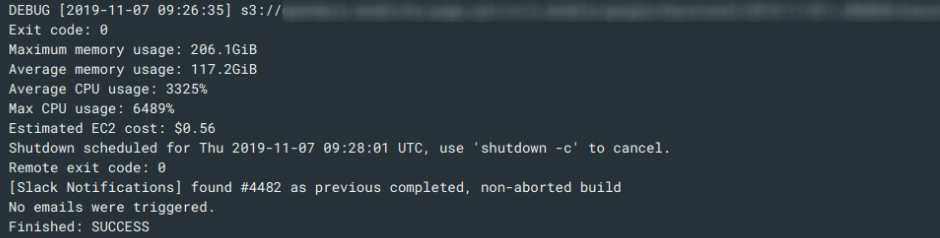
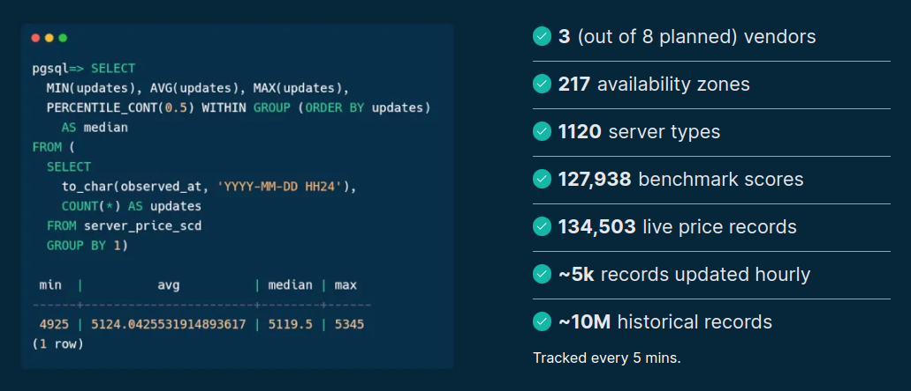

## dummy slide

<!--add custom CSS for the speaker view-->
<script>
  if (window.self !== window.top) {
    document.body.className += " speakerview";
  }
</script>

<!--javascript to remove dummy slide-->
<script>
document.getElementById("dummy-slide").remove();
document.getElementById("coverslide").remove();
</script>

<!--end dummy slide-->
</section>

<section id="coverslide">

::: {.centered}

:::

<h1 class="subtitle" style="color:#eee;font-size:1.75em;text-align: center; margin-top:325px; color:#34d399;">
  Harnessing Spare Cores to<br />Breeze Through Cloud Compute
</h1>

<h2 class="author" style="color:#eee;padding-top:15px;font-size:1.25em;text-align: center !important;margin-bottom: 0px;">
  Gergely Daróczi
</h2>

<h3 class="author" style="color:#eee;font-size:1.1em;text-align: center !important; font-weight: normal;">
  Spare Cores Team
</h3>

<h3 class="author" style="color:#eee;padding-top:25px;font-size:1.1em;text-align: center !important; padding-top: 10px;font-weight: normal; ">
  Slides: <a href="https://sparecores/assets/slides/berlin-buzzwords-2024.html#/coverslide" target="_blank">sparecores.com/talks</a>
</h3>

<div class="notes">
TODO
</div>

</section>

<section>
<section class="titleslide slide level1" data-transition="slide-in fade-out">
  <h2>&#62;&#62;&#62; from sparecores import why</h2>

<p class="fragment">Data Science / Machine Learning batch jobs:</p>

<ul>
  <li class="fragment">run SQL</li>
  <li class="fragment">run R or Python script</li>
  <ul>
    <li class="fragment">train a simple model, reporting, API integrations etc.</li>
    <li class="fragment">train hierarchical models/GBMs/neural nets etc.</li>
  </ul>
</ul>

<div class="notes">
TODO
</div>

## >>> from sparecores import why {data-transition="fade-in slide-out"}

<p class="gray">Data Science / Machine Learning batch jobs:</p>

<ul class="gray">
  <li>run SQL</li>
  <li>run R or Python script</li>
  <ul>
    <li>train a simple model, reporting, API integrations etc.</li>
    <li>train hierarchical models/GBMs/neural nets etc.</li>
  </ul>
</ul>

<p class="bold">Scaling DS infrastructure.</p>

<div class="notes">
- e.g. submit new bid amounts on ads on a social network
</div>

## >>> from sparecores import why


<div class="notes">
To give you an example: here's a job that we monitored every few seconds and saw that it doesn't really scale to multiple CPUs, but taking up to ~200 gigs of memory -- probably training a hierarchical model that cannot be paralellized.
</div>

## >>> from sparecores import why


<div class="notes">
4k jobs/day with varying needs

- Training hierarchical models on a large dataset using R required several hundreds GBs of RAM,
- NLP models in Python required GPUs,
- Parallelized time-series forecasting models required many CPUs,
- Many small jobs mostly waiting for SQL results running on a shared host.
</div>

## >>> from sparecores import why

::: {.colcontainer .mt-60}
:::: {.col}

<p class="fragment mt--20 centered" data-fragment-index="1">AWS ECS</p>

<p class="fragment mt--20 centered" data-fragment-index="2">AWS Batch</p>
::::
:::: {.col}

<p class="fragment mt--20 centered" data-fragment-index="3" >Kubernetes</p>
::::
:::

<div class="notes">
TODO
</div>

## >>> from sparecores import why

::: {.centered}

:::

<p class="centered mt--20">Source: <a href="https://xkcd.com/2740/">xkcd</a></p>

<div class="notes">
- first of all: it's not easy
- second: it will fail

AWS Batch seemed like a good fit and relatively convenient solution,
but after a few months trial, we experienced unexpected costs
due to developers misconfiguring resource requirements

- overprovisioning to avoid errors
- forgot to update etc

and AWS bin packing smaller jobs to already running larger nodes (started for heavy jobs), which resulted in keeping the expensive nodes running for a longer time.

</div>

## >>> from sparecores import why


<div class="notes">
TODO
</div>

## >>> from sparecores import why {data-transition="slide-in none-out"}

::: {.centered}

:::

<div class="notes">
TODO
</div>

## >>> from sparecores import why {data-transition="none-in slide-out"}

::: {.centered}

:::

::: {.centered}

:::

<div class="notes">
TODO
</div>

## >>> from sparecores import why

<p class="bold">Other use-cases:</p>

- stats/ML/AI model training,
- ETL pipelines,
- traditional CI/CD workflows for compiling and testing software,
- building Docker images,
- rendering images and videos,
- etc.

<div class="notes">
TODO
</div>

</section></section>

<section>
<section class="titleslide slide level1">
  <h2>&#62;&#62;&#62; from sparecores import intro</h2>

. . .


<p class="centered mt--30">Source: <a href="https://sparecores.com">sparecores.com</a></p>

<aside class="notes">
First of all, we have a pretty cool slot machine ... TODO
</aside>

## >>> from sparecores import intro

* Open-source tools, database schemas and documentation to inspect and inventory cloud vendors and their compute resource offerings.

. . .

* Managed infrastructure, databases, APIs, SDKs, and web applications to make these data sources publicly accessible.

. . .

* Helpers to start and manage instances in your own environment.

. . .

* SaaS to run containers in a managed environment without direct vendor engagement.

<aside class="notes">
We help DevOps, DS, ML, AI, ETL, AV, and other engineering teams to find optimal instances for their batch jobs (e.g. “8 CPU cores, 64 GB of RAM, and a TPU needed in an EU datacenter to train ML models for 6 hours”) by providing:

* Open-source tools, database schemas and documentation to monitor cloud and flexible VPS/dedicated server vendors and their compute resource offerings in an innovative and truly comparative way, including vendor details (e.g. location, certificates, green power), compute capabilities (e.g. CPU, memory, GPU/TPU), pricing (especially of spot instances), and performance (by running task-specific benchmarks).
* Managed infrastructure, databases, APIs, SDKs, and web applications to make these continuously and transparently tracked data sources publicly available and comparable in a validated, unbiased, structured, and searchable manner.
* Helpers to easily start and manage instances at all the supported vendors with a standardized API.
* SaaS

BUT let's focus on the open-source and open-data components ..
</aside>

## >>> from sparecores import intro



<p class="centered" style="margin-top: -10px;">Source: <a href="https://sparecores.com">sparecores.com</a></p>

<aside class="notes">
<!-- TODO update img with no of benchmarks instead of AZs -->
TODO
</aside>

## >>> from sparecores import intro


<aside class="notes">
TODO
</aside>

## >>> from sparecores import intro

::: {.centered}

:::

<aside class="notes">
TODO
</aside>

## >>> from sparecores import intro

::: {.centered}

:::

<aside class="notes">
TODO
</aside>

## >>> from sparecores import intro

::: {.centered}

:::

<aside class="notes">
TODO
</aside>

## >>> from sparecores import intro


<aside class="notes">
TODO
</aside>

## >>> from sparecores import intro


<!-- https://deploy-preview-27--creative-choux-a3c817.netlify.app/compare?instances=W3sidmVuZG9yIjoiYXdzIiwic2VydmVyIjoiYzVhZC4xMnhsYXJnZSJ9LHsidmVuZG9yIjoiYXdzIiwic2VydmVyIjoiYzVkLjJ4bGFyZ2UifSx7InZlbmRvciI6ImF3cyIsInNlcnZlciI6ImM2Zy4xNnhsYXJnZSJ9LHsidmVuZG9yIjoiaGNsb3VkIiwic2VydmVyIjoiY2N4MzMifV0%3D -->
<aside class="notes">
TODO
</aside>


## >>> from sparecores import intro


<aside class="notes">
TODO
</aside>

## >>> from sparecores import intro

```py
>>> from rich import print as pp
>>> from sc_crawler.tables import Server
>>> from sqlmodel import create_engine, Session, select
>>> engine = create_engine("sqlite:///sc-data-all.db")
>>> session = Session(engine)
>>> server = session.exec(select(Server).where(Server.server_id == 'g4dn.xlarge')).one()
>>> pp(server)
Server(
    server_id='g4dn.xlarge',
    vendor_id='aws',
    display_name='g4dn.xlarge',
    api_reference='g4dn.xlarge',
    name='g4dn.xlarge',
    family='g4dn',
    description='Graphics intensive [Instance store volumes] [Network and EBS optimized] Gen4 xlarge',

    status=<Status.ACTIVE: 'active'>,
    observed_at=datetime.datetime(2024, 6, 6, 10, 18, 4, 127254),

    hypervisor='nitro',
    vcpus=4,
    cpu_cores=2,
    cpu_allocation=<CpuAllocation.DEDICATED: 'Dedicated'>,
    cpu_manufacturer='Intel',
    cpu_family='Xeon',
    cpu_model='8259CL',
    cpu_architecture=<CpuArchitecture.X86_64: 'x86_64'>,
    cpu_speed=3.5,
    cpu_l1_cache=None,
    cpu_l2_cache=None,
    cpu_l3_cache=None,
    cpu_flags=[],

    memory_amount=16384,
    memory_generation=<DdrGeneration.DDR4: 'DDR4'>,
    memory_speed=3200,
    memory_ecc=None,

    gpu_count=1,
    gpu_memory_min=16384,
    gpu_memory_total=16384,
    gpu_manufacturer='Nvidia',
    gpu_family='Turing',
    gpu_model='Tesla T4',
    gpus=[
        {
            'manufacturer': 'Nvidia',
            'family': 'Turing',
            'model': 'Tesla T4',
            'memory': 15360,
            'firmware_version': '535.171.04',
            'bios_version': '90.04.96.00.A0',
            'graphics_clock': 1590,
            'sm_clock': 1590,
            'mem_clock': 5001,
            'video_clock': 1470
        }
    ],

    storage_size=125,
    storage_type=<StorageType.NVME_SSD: 'nvme ssd'>,
    storages=[{'size': 125, 'storage_type': 'nvme ssd'}],

    network_speed=5.0,
    inbound_traffic=0.0,
    outbound_traffic=0.0,
    ipv4=0,
)
```

<aside class="notes">
TODO
</aside>

</section></section>

<section>
<section class="titleslide slide level1">
  <h2>&#62;&#62;&#62; sparecores.\_\_dir\_\_()</h2>


<aside class="notes">
TODO
</aside>

</section></section>

<section>
<section class="titleslide slide level1">
  <h2>import { AppModule } from 'sc-www';</h2>

TODO add components overview sections
TODO move slot machine here?

<aside class="notes">
TODO
</aside>

</section></section>

<section>
<section class="titleslide slide level1">
  <h2>&#62;&#62;&#62; import sc_crawler</h2>

<aside class="notes">
TODO
</aside>

## >>> from sparecores import code

```py
from sc_crawler.tables import Server
from sqlmodel import create_engine, Session, select

engine = create_engine("sqlite:///sc-data-all.db")
session = Session(engine)
server = session.exec(select(Server).where(Server.server_id == 'trn1.32xlarge')).one()

from rich import print as pp
pp(server)
pp(server.vendor)
```
<aside class="notes">
TODO
</aside>

</section></section>

<section class="titleslide slide level1">
  <h2>&#62;&#62;&#62; import \_\_future\_\_</h2>


<aside class="notes">
TODO
</aside>

</section></section>

<section>
<section class="titleslide slide level1" data-transition="slide-in none-out">
  <h2>&#62;&#62;&#62; from sparecores import team</h2>

::: {.colcontainer .mt-60 .centered}
:::: {.col}

<p class="bold mt-0">@bra-fsn</p>
::::
:::: {.col}

<p class="bold mt-0">@palabola</p>
::::
:::: {.col}

<p class="bold mt-0">@daroczig</p>
::::
:::

<aside class="notes">
TODO
</aside>

## >>> from sparecores import team  {data-transition="none-in slide-out"}

::: {.colcontainer .mt-60 .centered}
:::: {.col}

<p class="bold mt-0">@bra-fsn</p>
<p class="mt-0">Infrastructure and Python veteran.</p>
::::
:::: {.col}

<p class="bold mt-0">@palabola</p>
<p class="mt-0">Guardian of the front-end and Node.js tools.</p>
::::
:::: {.col}

<p class="bold mt-0">@daroczig</p>
<p class="mt-0">Hack of all trades, master of <code>NaN</code>.</p>
::::
:::

<aside class="notes">
TODO
</aside>

## >>> from sparecores import support

TODO NGI Search

<aside class="notes">
TODO
</aside>


</section></section>

<section>
<section class="titleslide slide level1" data-transition="slide-in none-out">
    <!-- https://carbon.now.sh/?bg=rgba%288%2C47%2C73%2C1%29&t=nord&wt=none&l=r&width=680&ds=false&dsyoff=20px&dsblur=68px&wc=true&wa=true&pv=56px&ph=56px&ln=false&fl=1&fm=Hack&fs=18px&lh=161%25&si=false&es=2x&wm=false&code=%253E%2520q%28save%2520%253D%2520%27ask%27%29%250AProcess%2520finished%2520at%2520June%252012%252009%253A50%253A00%25202024%2520%250A%250A%253E%2520visit%28%27https%253A%252F%252Fsparecores.com%27%29%250A%253E%2520email%28%27daroczig%2540sparecores.com%27%29%250A%253E%2520follow%28%27%2540SpareCores%27%29 -->
    <!-- https://carbon.now.sh/?bg=rgba%288%2C47%2C73%2C1%29&t=nord&wt=none&l=python&width=680&ds=false&dsyoff=20px&dsblur=68px&wc=true&wa=true&pv=5px&ph=5px&ln=false&fl=1&fm=Hack&fs=18px&lh=161%25&si=false&es=2x&wm=false&code=%253E%253E%253E%2520import%2520os%250A%253E%253E%253E%2520import%2520signal%250A%253E%253E%253E%2520os.kill%28os.getpid%28%29%252C%2520signal.SIGKILL%29%2520%2520%250A%250A%253E%253E%253E%2520visit%28%27https%253A%252F%252Fsparecores.com%27%29%250A%253E%253E%253E%2520email%28%27daroczig%2540sparecores.com%27%29%250A%253E%253E%253E%2520follow%28%27%2540SpareCores%27%29%250A%250A%253E%253E%253E%2520os._exit%28status%253D0%29%250AProcess%2520finished%2520at%2520June%252012%252009%253A50%253A00%25202024%2520 -->

::: {.centered}

:::

<aside class="notes">
TODO
</aside>

</section>
<section data-transition="none">

::: {.centered}

:::

<aside class="notes">
TODO
</aside>

</section>
<section data-transition="none">

::: {.centered}

:::

<aside class="notes">
TODO
</aside>

</section>
