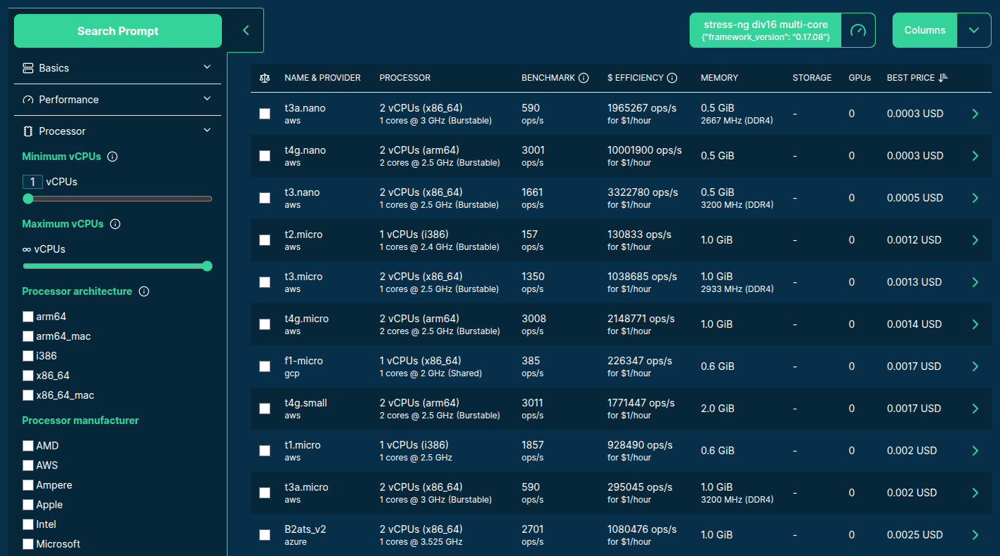
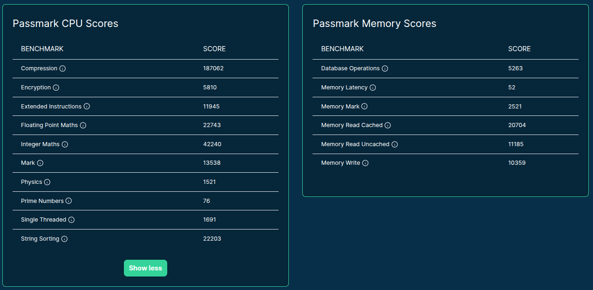
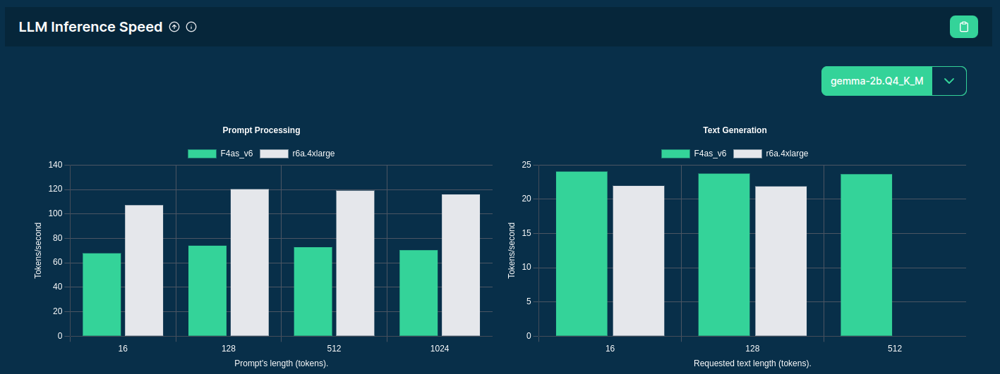
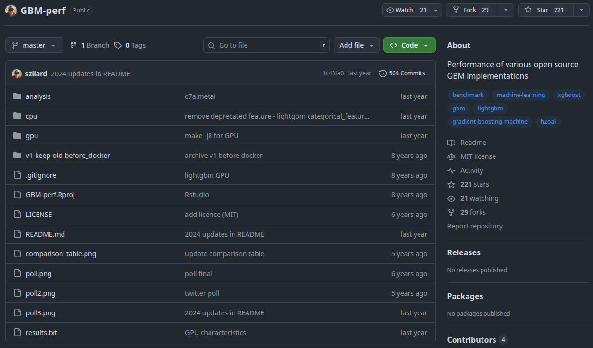

# {#cover-slide}

<script>
  // add custom CSS for the speaker view
  if (window.self !== window.top) {
    document.body.className += " speakerview";
  }
  // remove dummy slide
  document.getElementById("title-slide").remove();
</script>

::: {.centered}

:::

<h1 class="subtitle" style="color:#eee;font-size:1.5em;text-align: center; margin-top:325px; color:#34d399;">
  Benchmarking 2000+ Cloud Servers for<br />DS/ML/AI Workloads
</h1>

<h2 class="author" style="color:#eee;padding-top:40px;font-size:1.1em;text-align: center !important;margin-bottom: 0px;">
  Gergely Daroczi, Spare Cores
</h2>

<h3 class="author" style="color:#eee;font-size:1.1em;text-align: center !important; font-weight: normal;">
  Jan 29, 2026 @ Budapest Data Science Meetup
</h3>

<h3 class="author onlineMode" style="color:#eee;padding-top:65px;font-size:1.1em;text-align: center !important; padding-top: 10px;font-weight: normal; ">
  Slides: <a href="https://sparecores.com/talks" target="_blank">sparecores.com/talks</a>
</h3>

<p class="author offlineMode" style="color:#eee;font-size:0.75em;text-align: right !important; padding-top: 0px;font-weight: normal;margin-top:30px; ">
  Press Space or click the green arrow icons to navigate the slides ->
</p>

::: {.notes}
TODO
:::

# >>> from sparecores import badges {#badges transition="convex-in convex-out"}

<ul style="font-size: 0.9em;">
  <li class="fragment" data-fragment-index=1>Funded by NGI Search (EU consortium under Horizon Europe)</li>
  <ul>
    <li class="fragment" data-fragment-index=2>Vendor independent, open-source project</li>
  </ul>
  <li class="fragment" data-fragment-index=3>Accepted into the NVIDIA Inception Program</li>
  <li class="fragment" data-fragment-index=4>Beneficiary of cloud credits from 6 vendors (overall ~$100k)</li>
  <li class="fragment" data-fragment-index=5>10+ conference talks in 7 countries (e.g. PyData, useR!, KCD)</li>
  <li class="fragment" data-fragment-index=6>Featured by The Pragmatic Engineer in Oct 2024</li>
  <li class="fragment" data-fragment-index=7>Jeff Barr (Chief Evangelist at AWS) on our Reddit post:</li>
</ul>

<blockquote class="fragment" data-fragment-index=7 style="margin-left: 40px;">
  This was awesome, thanks for sharing.
</blockquote>

<ul style="font-size: 0.9em;">
  <li class="fragment" data-fragment-index=8>Raised a pre-seed round to start a new product line (Dec 2025)</li>
</ul>

::: {.notes}
first of all, just to build some credibility for the project:
we are committed to be vendor-agnostic, open-source, and transparent about our data
:::

# >>> from sparecores import intro {#intro transition="convex-in convex-out"}

<ul style="font-size: 0.9em;">
  <li class="fragment">Open-source tools, database schemas and documentation to inspect and inventory cloud vendors and their offerings, including pricing and measured performance.</li>
  <li class="fragment">Managed infrastructure, databases, APIs, SDKs, and web applications to make this data publicly accessible.</li>
  <li class="fragment">Open-source helpers to select, start and manage instances in your own environment.</li>
  <li class="fragment">Open-source Python/R packages and workflow orchestration extensions (e.g. Metaflow) to track resource usage and cost of DS/ML/AI jobs. Open-source tooling to right-size instances.</li>
  <li class="fragment">Add-on services to scale data science workflows, even without direct vendor engagement.</li>
</ul>

::: {.notes}
- so Spare Cores is an open-source ecosystem, including software, database schemas, guides,
- and actual databases if you don't want to run the ETL tooling yourself .. also providing APIs, SDKs etc to make it easier to query data
- unified CLI to start machines
- and working on an an optional SaaS offering built on the top of the open-source tooling for folks who would rather avoid registering with all cloud providers etc: give us a Docker image, a command to run, and you credit card .. all set, we will run it wherever it's cheapest.
:::

# >>> from sparecores import navigator {transition="convex-in slide-out"}


<p class="centered" style="margin-top: -10px;">Source: <a href="https://sparecores.com">sparecores.com</a></p>

::: {.notes}
high level numbers about the data we collect and make available
:::

## >>> from sparecores import navigator

::: {.centered}

:::

<aside class="notes">
FTR this dataset was generated, collected, standardized, and published in public GHA if ou are interested in the details.
running around 100k jobs over 10k hours...
</aside>

## >>> from navigator.www import search

::: {.centered}
<a href="https://sparecores.com/servers" target="_blank">
  
</a>
:::

::: {.notes}
The easiest way to query this data is through our web component, as you can see on the screen ...

This is not only a list of servers, but you can filter, order, and search for specific instances.
We already show some performance metrics by default, along with the cost efficiency based on the spot or on-demand pricing.
:::

## >>> from navigator.www import server

::: {.centered}
<a href="https://sparecores.com/server/gcp/g2-standard-16" target="_blank">
  
</a>
:::

::: {.notes}
Clicking on a server shows you the technical details of the instance -- much more than what's provided publicly by the vendor, even more than what ChatGPT knows ... as we actually start each machine and inspect the hardware.
:::

## >>> from navigator.www import server

::: {.centered}
<a href="https://sparecores.com/server/gcp/g2-standard-16" target="_blank">
  
</a>
:::

::: {.notes}
Live and historical pricing
:::

## >>> from navigator.www import server

<!--
<iframe
 src="https://sparecores.com/embed/server/gcp/g2-standard-16/bw_mem"
 style="height: 510px; width: 100%; border: 1px solid #34d399; border-radius: 8px; min-height: 400px">
</iframe>
-->

::: {.centered}
<a href="https://sparecores.com/server/gcp/g2-standard-16" target="_blank">
  
</a>
:::

::: {.notes}
and we also run benchmark scenarios on the servers, e.g.:

- memory bandwidth of read, write and mixed operations using various block sizes and also including the related L1/L2/L3 cache amounts
- or benchmarking compression algos - having the compression ratio on the x axis, and the bandwidth on the y axis, it's clear that `zpaq` is a beast when it comes to compressing text, but might be slow on this machine
- OpenSSL hash functions and block ciphers
:::

## >>> from navigator.www import server

<a href="https://sparecores.com/server/gcp/g2-standard-16" target="_blank">
  
</a>

::: {.notes}
also running test suites like PassMark or ...
:::

## >>> from navigator.www import server

<a href="https://sparecores.com/server/gcp/g2-standard-16" target="_blank">
  
</a>

::: {.notes}
Geekbench 6, which has been a standard tool for some time including workloads for text and image processing, compiling software etc
:::

## >>> from navigator.www import server

<a href="https://sparecores.com/server/gcp/g2-standard-16" target="_blank">
  
</a>

::: {.notes}
visualizations on how well the machine can scale tasks to multiple CPU cores -- e.g. showing the diminishing return on this Intel Xeon due to hyperthreading
:::

## >>> from navigator.www import server

<a href="https://sparecores.com/server/gcp/g2-standard-16" target="_blank">
  
</a>

::: {.notes}
Or looking at LLM Inference Speed both for prompt processing and text generation,
using smaller models with 135M parameters up to 70B larger models.
:::

## >>> from navigator.www import server

<a href="https://sparecores.com/server/gcp/g2-standard-16" target="_blank">
  
</a>

::: {.notes}
and other application-specific benchmarks, like serving a static website or running a key-value store database
:::

## >>> from navigator.www import servers

::: {.centered}
<a href="https://sparecores.com/compare?instances=W3sidmVuZG9yIjoiYXdzIiwic2VydmVyIjoiYzVhZC4xMnhsYXJnZSJ9LHsidmVuZG9yIjoiYXdzIiwic2VydmVyIjoiYzVkLjJ4bGFyZ2UifSx7InZlbmRvciI6ImF3cyIsInNlcnZlciI6ImM2Zy4xNnhsYXJnZSJ9LHsidmVuZG9yIjoiaGNsb3VkIiwic2VydmVyIjoiY2N4MzMifV0%3D" target="_blank">
  
</a>
:::

::: {.notes}
and making all these data available in comparison tables,
e.g. you can see "Best performance servers for Redis below ¢50/hour" here
:::

## >>> from navigator.www import servers

::: {.centered}
<a href="https://sparecores.com/compare?instances=W3sidmVuZG9yIjoiYXdzIiwic2VydmVyIjoiYzVhZC4xMnhsYXJnZSJ9LHsidmVuZG9yIjoiYXdzIiwic2VydmVyIjoiYzVkLjJ4bGFyZ2UifSx7InZlbmRvciI6ImF3cyIsInNlcnZlciI6ImM2Zy4xNnhsYXJnZSJ9LHsidmVuZG9yIjoiaGNsb3VkIiwic2VydmVyIjoiY2N4MzMifV0%3D" target="_blank">
  
</a>
:::

::: {.notes}
or plots as well for human inspection
:::

## >>> from navigator import api

::: {.centered}

:::

::: {.notes}
for computers, we provide APIs ...
:::

## >>> from navigator import data

```py {code-line-numbers="2-3|4-5|6|9-10|15|20-28|34-37|39-58|51-52|60-67" style="margin-top: 20px !important; height: 640px;"}
>>> from rich import print as pp
>>> from sc_crawler.tables import Server
>>> from sqlmodel import create_engine, Session, select
>>> engine = create_engine("sqlite:///sc-data-all.db")
>>> session = Session(engine)
>>> server = session.exec(select(Server).where(Server.server_id == 'g4dn.xlarge')).one()
>>> pp(server)
Server(
    server_id='g4dn.xlarge',
    vendor_id='aws',
    display_name='g4dn.xlarge',
    api_reference='g4dn.xlarge',
    name='g4dn.xlarge',
    family='g4dn',
    description='Graphics intensive [Instance store volumes] [Network and EBS optimized] Gen4 xlarge',

    status=<Status.ACTIVE: 'active'>,
    observed_at=datetime.datetime(2024, 6, 6, 10, 18, 4, 127254),

    hypervisor='nitro',
    vcpus=4,
    cpu_cores=2,
    cpu_allocation=<CpuAllocation.DEDICATED: 'Dedicated'>,
    cpu_manufacturer='Intel',
    cpu_family='Xeon',
    cpu_model='8259CL',
    cpu_architecture=<CpuArchitecture.X86_64: 'x86_64'>,
    cpu_speed=3.5,
    cpu_l1_cache=None,
    cpu_l2_cache=None,
    cpu_l3_cache=None,
    cpu_flags=[],

    memory_amount=16384,
    memory_generation=<DdrGeneration.DDR4: 'DDR4'>,
    memory_speed=3200,
    memory_ecc=None,

    gpu_count=1,
    gpu_memory_min=16384,
    gpu_memory_total=16384,
    gpu_manufacturer='Nvidia',
    gpu_family='Turing',
    gpu_model='Tesla T4',
    gpus=[
        {
            'manufacturer': 'Nvidia',
            'family': 'Turing',
            'model': 'Tesla T4',
            'memory': 15360,
            'firmware_version': '535.171.04',
            'bios_version': '90.04.96.00.A0',
            'graphics_clock': 1590,
            'sm_clock': 1590,
            'mem_clock': 5001,
            'video_clock': 1470
        }
    ],

    storage_size=125,
    storage_type=<StorageType.NVME_SSD: 'nvme ssd'>,
    storages=[{'size': 125, 'storage_type': 'nvme ssd'}],

    network_speed=5.0,
    inbound_traffic=0.0,
    outbound_traffic=0.0,
    ipv4=0,
)
```

::: {.notes}
and SDKs as well, e.g. querying the details of this instance type: SCROLL through!
:::

## >>> from navigator export sqlite {transition="slide-in convex-out"}

::: {.centered}

:::

<aside class="notes">
database files are also available
</aside>


# >>> sparecores.navigator.\_\_dir\_\_() {#components transition="convex-in convex-out"}


::: {.notes}
As mentioned previously, this is made available via multiple components that
you can find on GitHub. We don't have time to go through all of them, but
I'd be happy to answer any related questions on Slack, or ping me on LinkedIn :)

WE will focus on the inspector now!
:::

# >>> from sc_inspector import llm {transition="convex-in slide-out"}

::: {.centered}

:::

<aside class="notes">
We have created a Docker image that includes llama.ccp build for various CPU architectures and CUDA as well -- so with a single command we can run this on x86, ARM, and most of the GPU-accelerated machines as well.
</aside>

## >>> from sc_inspector import llm

::: {.centered}

:::

<aside class="notes">
The compulsary AI-generated image .. with transparent background .. CUDA approved!
</aside>

## $ docker build -t llm-benchmark .

<ul>
  <li class="fragment">Multi-arch Docker build with x86 and ARM support.</li>
  <li class="fragment">Bundles `llama.cpp` binaries built for various CPU architectures and CUDA as well.</li>
  <ul style="font-size: 0.9em;">
    <li class="fragment">Recursive lookup of linked libraries from multiple parent images and mixing them in a single image under different paths 🫣</li>
  </ul>
  <li class="fragment">Python script to run the benchmark:</li>
  <ul style="font-size: 0.9em;">
    <li class="fragment">Hardware discovery to pick the correct binary, `$PATH` overrides.</li>
    <li class="fragment">Download models in a background thread, sequentially from Hugging Face with sane timeouts.</li>
    <li class="fragment">Find optimal `ngl` setting for each model when GPU is available.</li>
    <li class="fragment">Run the benchmarks in sequence with sane timeouts.</li>
  </ul>
</ul>

<aside class="notes">
Describe how `ngl` was found!
</aside>

## >>> from bencmark-llm import models

<style>
td.file-size span.num {
  display: inline-block;
  min-width: 3em; /* Adjust width as needed */
  text-align: right;
  padding-right: 0.5em; /* Space before unit */
}
td.file-size span.unit {
  display: inline-block;
  min-width: 2em; /* Adjust width as needed */
  text-align: left;
}
</style>

<style>
td.file-size span.num,
td.param-size span.num {
  display: inline-block;
  min-width: 3em;
  text-align: right;
  padding-right: 5px;
}
td.file-size span.num {
  padding-right: 10px;
}
td.file-size span.unit,
td.param-size span.unit {
  display: inline-block;
  min-width: 2em;
  text-align: left;
}
</style>

<table style="margin-top: 50px; margin-bottom: -20px; font-size: 2rem; margin-left: 0px;">
  <thead>
    <tr>
      <th>Model</th>
      <th>Parameters</th>
      <th style="text-align: center;">File Size</th>
    </tr>
  </thead>
  <tbody>
    <tr>
      <td>SmolLM-135M.Q4_K_M.gguf</td>
      <td class="param-size"><span class="num">135</span><span class="unit">M</span></td>
      <td class="file-size"><span class="num">100</span><span class="unit">MB</span></td>
    </tr>
    <tr>
      <td>qwen1_5-0_5b-chat-q4_k_m.gguf</td>
      <td class="param-size"><span class="num">500</span><span class="unit">M</span></td>
      <td class="file-size"><span class="num">400</span><span class="unit">MB</span></td>
    </tr>
    <tr>
      <td>gemma-2b.Q4_K_M.gguf</td>
      <td class="param-size"><span class="num">2</span><span class="unit">B</span></td>
      <td class="file-size"><span class="num">1.5</span><span class="unit">GB</span></td>
    </tr>
    <tr>
      <td>llama-7b.Q4_K_M.gguf</td>
      <td class="param-size"><span class="num">7</span><span class="unit">B</span></td>
      <td class="file-size"><span class="num">4</span><span class="unit">GB</span></td>
    </tr>
    <tr>
      <td>phi-4-q4.gguf</td>
      <td class="param-size"><span class="num">14</span><span class="unit">B</span></td>
      <td class="file-size"><span class="num">9</span><span class="unit">GB</span></td>
    </tr>
    <tr>
      <td>Llama-3.3-70B-Instruct-Q4_K_M.gguf</td>
      <td class="param-size"><span class="num">70</span><span class="unit">B</span></td>
      <td class="file-size"><span class="num">42</span><span class="unit">GB</span></td>
    </tr>
  </tbody>
</table>

## >>> from bencmark-llm import workloads

<style>
.reveal table td.right {
  text-align: right;
}
</style>

:::: {.columns style="display: block; margin-top: 40px;"}

::: {.column width="50%" }

- Prompt processing

<table style="font-size: 2rem; margin-left: 0px;">
  <thead>
    <tr>
      <th>Token length</th>
      <th>Expected TPS</th>
    </tr>
  </thead>
  <tbody>
    <tr>
      <td class="right">16</td>
      <td class="right">2</td>
    </tr>
    <tr class="fragment">
      <td class="right">128</td>
      <td class="right">10</td>
    </tr>
    <tr class="fragment">
      <td class="right">512</td>
      <td class="right">25</td>
    </tr>
    <tr class="fragment">
      <td class="right">1,024</td>
      <td class="right">50</td>
    </tr>
    <tr class="fragment">
      <td class="right">4,096</td>
      <td class="right">250</td>
    </tr>
    <tr class="fragment">
      <td class="right">16,384</td>
      <td class="right">1,000</td>
    </tr>
  </tbody>
</table>

:::

::: {.column .fragment width="50%" }

- Text generation

<table style="font-size: 2rem; margin-left: 0px;">
  <thead>
    <tr>
      <th>Token length</th>
      <th>Expected TPS</th>
    </tr>
  </thead>
  <tbody>
    <tr>
      <td class="right">16</td>
      <td class="right">1</td>
    </tr>
    <tr>
      <td class="right">128</td>
      <td class="right">5</td>
    </tr>
    <tr>
      <td class="right">512</td>
      <td class="right">25</td>
    </tr>
    <tr>
      <td class="right">1,024</td>
      <td class="right">50</td>
    </tr>
    <tr>
      <td class="right">4,096</td>
      <td class="right">250</td>
    </tr>
  </tbody>
</table>

:::

::::

<div class="fragment">
<p style="margin-top: 20px;">Timeout: model load into memory (250 MB/s) + 5 iterations with expected TPS + 1s overhead</p>
</div>

## >>> from bencmark-llm import example

```shell {code-line-numbers="1-2|3-5,7|6|8-9|10|11|12|13-14|16-17|15,18-19|20-24|25|70-79|80-81" style="font-size:24px; margin-top: 50px; height: 620px;" }
2025-04-16 13:41:53,991 - INFO - Using CPU-build of llama.cpp
load_backend: loaded CPU backend from ./libggml-cpu-haswell.so
2025-04-16 13:41:54,017 - INFO - Benchmarking model SmolLM-135M.Q4_K_M.gguf ...
2025-04-16 13:41:54,019 - DEBUG - Downloading model SmolLM-135M.Q4_K_M.gguf from https://huggingface.co/QuantFactory/SmolLM-135M-GGUF/resolve/main/SmolLM-135M.Q4_K_M.gguf
2025-04-16 13:41:54,401 - DEBUG - Downloaded model SmolLM-135M.Q4_K_M.gguf (100.57 MB) in 0.38 sec (264.17 MB/s)
2025-04-16 13:41:54,403 - DEBUG - Downloading model qwen1_5-0_5b-chat-q4_k_m.gguf from https://huggingface.co/Qwen/Qwen1.5-0.5B-Chat-GGUF/resolve/main/qwen1_5-0_5b-chat-q4_k_m.gguf
2025-04-16 13:41:54,404 - DEBUG - Model SmolLM-135M.Q4_K_M.gguf found at /models/SmolLM-135M.Q4_K_M.gguf (0.10 GB)
2025-04-16 13:41:54,404 - DEBUG - Using ngl 0 for model SmolLM-135M.Q4_K_M.gguf
2025-04-16 13:41:54,404 - DEBUG - Benchmarking prompt processing with 16 tokens for max 41 sec
2025-04-16 13:41:54,773 - DEBUG - Benchmarking prompt processing with 128 tokens for max 65 sec
2025-04-16 13:41:56,499 - DEBUG - Benchmarking prompt processing with 512 tokens for max 104 sec
2025-04-16 13:42:03,289 - DEBUG - Benchmarking prompt processing with 1024 tokens for max 104 sec
2025-04-16 13:42:03,637 - DEBUG - Downloaded model qwen1_5-0_5b-chat-q4_k_m.gguf (388.29 MB) in 9.23 sec (42.05 MB/s)
2025-04-16 13:42:03,684 - DEBUG - Downloading model gemma-2b.Q4_K_M.gguf from https://huggingface.co/mlabonne/gemma-2b-GGUF/resolve/main/gemma-2b.Q4_K_M.gguf
2025-04-16 13:42:20,270 - DEBUG - Benchmarking prompt processing with 4096 tokens for max 83 sec
2025-04-16 13:42:54,763 - DEBUG - Downloaded model gemma-2b.Q4_K_M.gguf (1425.83 MB) in 51.08 sec (27.91 MB/s)
2025-04-16 13:42:54,860 - DEBUG - Downloading model llama-7b.Q4_K_M.gguf from https://huggingface.co/TheBloke/LLaMA-7b-GGUF/resolve/main/llama-7b.Q4_K_M.gguf
2025-04-16 13:43:43,279 - ERROR - Error: Command '['./llama-bench', '-t', '4', '-sm', 'layer', '-fa', '1', '-ub', '512', '-b', '2048', '-o', 'jsonl', '-m', '/models/SmolLM-135M.Q4_K_M.gguf', '-ngl', '0', '-p', '4096', '-n', '0']' timed out after 82.99997042499999 seconds
2025-04-16 13:43:43,279 - INFO - Skipping prompt processing benchmarks with 4096+ tokens due to time constraints.
2025-04-16 13:43:43,279 - DEBUG - Benchmarking text generation with 16 tokens for max 81 sec
2025-04-16 13:43:43,997 - DEBUG - Benchmarking text generation with 128 tokens for max 129 sec
2025-04-16 13:43:47,728 - DEBUG - Benchmarking text generation with 512 tokens for max 104 sec
2025-04-16 13:44:04,864 - DEBUG - Benchmarking text generation with 1024 tokens for max 104 sec
2025-04-16 13:44:45,497 - ERROR - Skipping text generation benchmarks with 1024+ tokens as it's unlikely to hit the expected 250 tokens/sec.
2025-04-16 13:44:45,497 - INFO - Benchmarking model qwen1_5-0_5b-chat-q4_k_m.gguf ...
2025-04-16 13:44:45,501 - DEBUG - Model qwen1_5-0_5b-chat-q4_k_m.gguf found at /models/qwen1_5-0_5b-chat-q4_k_m.gguf (0.38 GB)
2025-04-16 13:44:45,501 - DEBUG - Using ngl 0 for model qwen1_5-0_5b-chat-q4_k_m.gguf
2025-04-16 13:44:45,501 - DEBUG - Benchmarking prompt processing with 16 tokens for max 43 sec
2025-04-16 13:44:47,523 - DEBUG - Benchmarking prompt processing with 128 tokens for max 67 sec
2025-04-16 13:44:48,115 - DEBUG - Downloaded model llama-7b.Q4_K_M.gguf (3891.95 MB) in 113.23 sec (34.37 MB/s)
2025-04-16 13:44:48,167 - DEBUG - Downloading model phi-4-q4.gguf from https://huggingface.co/microsoft/phi-4-gguf/resolve/main/phi-4-q4.gguf
2025-04-16 13:44:51,206 - DEBUG - Benchmarking prompt processing with 512 tokens for max 105 sec
2025-04-16 13:45:05,527 - DEBUG - Benchmarking prompt processing with 1024 tokens for max 105 sec
2025-04-16 13:45:38,910 - ERROR - Skipping prompt processing benchmarks with 1024+ tokens as it's unlikely to hit the expected 250 tokens/sec.
2025-04-16 13:45:38,911 - DEBUG - Benchmarking text generation with 16 tokens for max 83 sec
2025-04-16 13:45:40,231 - DEBUG - Benchmarking text generation with 128 tokens for max 131 sec
2025-04-16 13:45:48,681 - DEBUG - Benchmarking text generation with 512 tokens for max 105 sec
2025-04-16 13:46:25,599 - DEBUG - Benchmarking text generation with 1024 tokens for max 105 sec
2025-04-16 13:47:58,761 - ERROR - Skipping text generation benchmarks with 1024+ tokens as it's unlikely to hit the expected 250 tokens/sec.
2025-04-16 13:47:58,761 - INFO - Benchmarking model gemma-2b.Q4_K_M.gguf ...
2025-04-16 13:47:58,765 - DEBUG - Model gemma-2b.Q4_K_M.gguf found at /models/gemma-2b.Q4_K_M.gguf (1.39 GB)
2025-04-16 13:47:58,765 - DEBUG - Using ngl 0 for model gemma-2b.Q4_K_M.gguf
2025-04-16 13:47:58,765 - DEBUG - Benchmarking prompt processing with 16 tokens for max 47 sec
2025-04-16 13:48:02,795 - DEBUG - Benchmarking prompt processing with 128 tokens for max 71 sec
2025-04-16 13:48:18,069 - DEBUG - Benchmarking prompt processing with 512 tokens for max 109 sec
2025-04-16 13:49:18,691 - DEBUG - Benchmarking prompt processing with 1024 tokens for max 109 sec
2025-04-16 13:51:07,724 - ERROR - Error: Command '['./llama-bench', '-t', '4', '-sm', 'layer', '-fa', '1', '-ub', '512', '-b', '2048', '-o', 'jsonl', '-m', '/models/gemma-2b.Q4_K_M.gguf', '-ngl', '0', '-p', '1024', '-n', '0']' timed out after 108.99997727900006 seconds
2025-04-16 13:51:07,724 - INFO - Skipping prompt processing benchmarks with 1024+ tokens due to time constraints.
2025-04-16 13:51:07,724 - DEBUG - Benchmarking text generation with 16 tokens for max 87 sec
2025-04-16 13:51:11,557 - DEBUG - Benchmarking text generation with 128 tokens for max 135 sec
2025-04-16 13:51:36,713 - DEBUG - Benchmarking text generation with 512 tokens for max 109 sec
2025-04-16 13:52:31,657 - DEBUG - Downloaded model phi-4-q4.gguf (8633.72 MB) in 463.27 sec (18.64 MB/s)
2025-04-16 13:52:31,783 - DEBUG - Downloading model Llama-3.3-70B-Instruct-Q4_K_M.gguf from https://huggingface.co/unsloth/Llama-3.3-70B-Instruct-GGUF/resolve/main/Llama-3.3-70B-Instruct-Q4_K_M.gguf
2025-04-16 13:53:17,342 - DEBUG - Benchmarking text generation with 1024 tokens for max 109 sec
2025-04-16 13:55:06,375 - ERROR - Error: Command '['./llama-bench', '-t', '4', '-sm', 'layer', '-fa', '1', '-ub', '512', '-b', '2048', '-o', 'jsonl', '-m', '/models/gemma-2b.Q4_K_M.gguf', '-ngl', '0', '-n', '1024', '-p', '0']' timed out after 108.99998397000002 seconds
2025-04-16 13:55:06,375 - INFO - Skipping text generation benchmarks with 1024+ tokens due to time constraints.
2025-04-16 13:55:06,375 - INFO - Benchmarking model llama-7b.Q4_K_M.gguf ...
2025-04-16 13:55:06,378 - DEBUG - Model llama-7b.Q4_K_M.gguf found at /models/llama-7b.Q4_K_M.gguf (3.80 GB)
2025-04-16 13:55:06,378 - DEBUG - Using ngl 0 for model llama-7b.Q4_K_M.gguf
2025-04-16 13:55:06,378 - DEBUG - Benchmarking prompt processing with 16 tokens for max 56 sec
2025-04-16 13:55:17,076 - DEBUG - Benchmarking prompt processing with 128 tokens for max 80 sec
2025-04-16 13:56:05,012 - DEBUG - Benchmarking prompt processing with 512 tokens for max 119 sec
2025-04-16 13:58:04,139 - ERROR - Error: Command '['./llama-bench', '-t', '4', '-sm', 'layer', '-fa', '1', '-ub', '512', '-b', '2048', '-o', 'jsonl', '-m', '/models/llama-7b.Q4_K_M.gguf', '-ngl', '0', '-p', '512', '-n', '0']' timed out after 118.99998227699996 seconds
2025-04-16 13:58:04,140 - INFO - Skipping prompt processing benchmarks with 512+ tokens due to time constraints.
2025-04-16 13:58:04,140 - DEBUG - Benchmarking text generation with 16 tokens for max 96 sec
2025-04-16 13:58:13,091 - DEBUG - Benchmarking text generation with 128 tokens for max 144 sec
2025-04-16 13:59:20,008 - DEBUG - Benchmarking text generation with 512 tokens for max 119 sec
2025-04-16 14:01:19,103 - ERROR - Error: Command '['./llama-bench', '-t', '4', '-sm', 'layer', '-fa', '1', '-ub', '512', '-b', '2048', '-o', 'jsonl', '-m', '/models/llama-7b.Q4_K_M.gguf', '-ngl', '0', '-n', '512', '-p', '0']' timed out after 118.99996960299995 seconds
2025-04-16 14:01:19,103 - INFO - Skipping text generation benchmarks with 512+ tokens due to time constraints.
2025-04-16 14:01:19,103 - INFO - Benchmarking model phi-4-q4.gguf ...
2025-04-16 14:01:19,108 - DEBUG - Model phi-4-q4.gguf found at /models/phi-4-q4.gguf (8.43 GB)
2025-04-16 14:01:19,108 - DEBUG - Using ngl 0 for model phi-4-q4.gguf
2025-04-16 14:01:19,108 - DEBUG - Benchmarking prompt processing with 16 tokens for max 75 sec
2025-04-16 14:02:22,300 - DEBUG - Benchmarking prompt processing with 128 tokens for max 99 sec
2025-04-16 14:04:01,479 - ERROR - Error: Command '['./llama-bench', '-t', '4', '-sm', 'layer', '-fa', '1', '-ub', '512', '-b', '2048', '-o', 'jsonl', '-m', '/models/phi-4-q4.gguf', '-ngl', '0', '-p', '128', '-n', '0']' timed out after 98.99997493299998 seconds
2025-04-16 14:04:01,490 - INFO - Skipping prompt processing benchmarks with 128+ tokens due to time constraints.
2025-04-16 14:04:01,491 - DEBUG - Benchmarking text generation with 16 tokens for max 115 sec
2025-04-16 14:05:56,724 - ERROR - Error: Command '['./llama-bench', '-t', '4', '-sm', 'layer', '-fa', '1', '-ub', '512', '-b', '2048', '-o', 'jsonl', '-m', '/models/phi-4-q4.gguf', '-ngl', '0', '-n', '16', '-p', '0']' timed out after 114.99991323800009 seconds
2025-04-16 14:05:56,729 - INFO - Benchmarking failed with simplest task, so skipping larger models.
2025-04-16 14:05:56,732 - INFO - Received interrupt signal, cleaning up...
2025-04-16 14:05:56,734 - DEBUG - Deleted partially downloaded model file: Llama-3.3-70B-Instruct-Q4_K_M.gguf.part
```

<p style="font-size: 1rem; margin-top: 10px;">Source: <a href="https://github.com/SpareCores/sc-inspector-data/blob/main/data/hcloud/cpx31/llm/stderr">https://github.com/SpareCores/sc-inspector-data/blob/main/data/hcloud/cpx31/llm/stderr</a></p>

## >>> from bencmark-llm import example


```shell {code-line-numbers="1-1" style="font-size:24px; margin-top: 50px; height: 620px;" }
{"build_commit": "51f311e0", "build_number": 4753, "cpu_info": "AMD EPYC-Rome Processor", "gpu_info": "", "backends": "CPU", "model_filename": "/models/SmolLM-135M.Q4_K_M.gguf", "model_type": "llama ?B Q4_K - Medium", "model_size": 103668480, "model_n_params": 134515008, "n_batch": 2048, "n_ubatch": 512, "n_threads": 4, "cpu_mask": "0x0", "cpu_strict": false, "poll": 50, "type_k": "f16", "type_v": "f16", "n_gpu_layers": 0, "split_mode": "layer", "main_gpu": 0, "no_kv_offload": false, "flash_attn": true, "tensor_split": "0.00", "use_mmap": true, "embeddings": false, "n_prompt": 16, "n_gen": 0, "test_time": "2025-04-16T13:41:54Z", "avg_ns": 29425803, "stddev_ns": 2633928, "avg_ts": 547.524574, "stddev_ts": 52.956226, "samples_ns": [ 31321572, 31803362, 29934339, 25189353, 28880389 ],"samples_ts": [ 510.83, 503.091, 534.503, 635.189, 554.009 ]}
{"build_commit": "51f311e0", "build_number": 4753, "cpu_info": "AMD EPYC-Rome Processor", "gpu_info": "", "backends": "CPU", "model_filename": "/models/SmolLM-135M.Q4_K_M.gguf", "model_type": "llama ?B Q4_K - Medium", "model_size": 103668480, "model_n_params": 134515008, "n_batch": 2048, "n_ubatch": 512, "n_threads": 4, "cpu_mask": "0x0", "cpu_strict": false, "poll": 50, "type_k": "f16", "type_v": "f16", "n_gpu_layers": 0, "split_mode": "layer", "main_gpu": 0, "no_kv_offload": false, "flash_attn": true, "tensor_split": "0.00", "use_mmap": true, "embeddings": false, "n_prompt": 128, "n_gen": 0, "test_time": "2025-04-16T13:41:54Z", "avg_ns": 233632645, "stddev_ns": 9120854, "avg_ts": 548.527531, "stddev_ts": 21.101188, "samples_ns": [ 240395549, 227846673, 224613694, 246016255, 229291056 ],"samples_ts": [ 532.456, 561.781, 569.867, 520.291, 558.242 ]}
{"build_commit": "51f311e0", "build_number": 4753, "cpu_info": "AMD EPYC-Rome Processor", "gpu_info": "", "backends": "CPU", "model_filename": "/models/SmolLM-135M.Q4_K_M.gguf", "model_type": "llama ?B Q4_K - Medium", "model_size": 103668480, "model_n_params": 134515008, "n_batch": 2048, "n_ubatch": 512, "n_threads": 4, "cpu_mask": "0x0", "cpu_strict": false, "poll": 50, "type_k": "f16", "type_v": "f16", "n_gpu_layers": 0, "split_mode": "layer", "main_gpu": 0, "no_kv_offload": false, "flash_attn": true, "tensor_split": "0.00", "use_mmap": true, "embeddings": false, "n_prompt": 512, "n_gen": 0, "test_time": "2025-04-16T13:41:56Z", "avg_ns": 1107877439, "stddev_ns": 34935205, "avg_ts": 462.513620, "stddev_ts": 14.616548, "samples_ns": [ 1127364831, 1064661879, 1081647591, 1114166670, 1151546228 ],"samples_ts": [ 454.156, 480.904, 473.352, 459.536, 444.62 ]}
{"build_commit": "51f311e0", "build_number": 4753, "cpu_info": "AMD EPYC-Rome Processor", "gpu_info": "", "backends": "CPU", "model_filename": "/models/SmolLM-135M.Q4_K_M.gguf", "model_type": "llama ?B Q4_K - Medium", "model_size": 103668480, "model_n_params": 134515008, "n_batch": 2048, "n_ubatch": 512, "n_threads": 4, "cpu_mask": "0x0", "cpu_strict": false, "poll": 50, "type_k": "f16", "type_v": "f16", "n_gpu_layers": 0, "split_mode": "layer", "main_gpu": 0, "no_kv_offload": false, "flash_attn": true, "tensor_split": "0.00", "use_mmap": true, "embeddings": false, "n_prompt": 1024, "n_gen": 0, "test_time": "2025-04-16T13:42:03Z", "avg_ns": 2735385583, "stddev_ns": 125973030, "avg_ts": 374.988808, "stddev_ts": 17.260522, "samples_ns": [ 2832889408, 2740268018, 2604040465, 2615189266, 2884540762 ],"samples_ts": [ 361.468, 373.686, 393.235, 391.559, 354.996 ]}
{"build_commit": "51f311e0", "build_number": 4753, "cpu_info": "AMD EPYC-Rome Processor", "gpu_info": "", "backends": "CPU", "model_filename": "/models/SmolLM-135M.Q4_K_M.gguf", "model_type": "llama ?B Q4_K - Medium", "model_size": 103668480, "model_n_params": 134515008, "n_batch": 2048, "n_ubatch": 512, "n_threads": 4, "cpu_mask": "0x0", "cpu_strict": false, "poll": 50, "type_k": "f16", "type_v": "f16", "n_gpu_layers": 0, "split_mode": "layer", "main_gpu": 0, "no_kv_offload": false, "flash_attn": true, "tensor_split": "0.00", "use_mmap": true, "embeddings": false, "n_prompt": 0, "n_gen": 16, "test_time": "2025-04-16T13:43:43Z", "avg_ns": 87002061, "stddev_ns": 6566828, "avg_ts": 184.729581, "stddev_ts": 13.687935, "samples_ns": [ 92503974, 95323826, 80012676, 84203122, 82966710 ],"samples_ts": [ 172.966, 167.849, 199.968, 190.017, 192.848 ]}
{"build_commit": "51f311e0", "build_number": 4753, "cpu_info": "AMD EPYC-Rome Processor", "gpu_info": "", "backends": "CPU", "model_filename": "/models/SmolLM-135M.Q4_K_M.gguf", "model_type": "llama ?B Q4_K - Medium", "model_size": 103668480, "model_n_params": 134515008, "n_batch": 2048, "n_ubatch": 512, "n_threads": 4, "cpu_mask": "0x0", "cpu_strict": false, "poll": 50, "type_k": "f16", "type_v": "f16", "n_gpu_layers": 0, "split_mode": "layer", "main_gpu": 0, "no_kv_offload": false, "flash_attn": true, "tensor_split": "0.00", "use_mmap": true, "embeddings": false, "n_prompt": 0, "n_gen": 128, "test_time": "2025-04-16T13:43:44Z", "avg_ns": 690783893, "stddev_ns": 8557061, "avg_ts": 185.319590, "stddev_ts": 2.306403, "samples_ns": [ 698437313, 689595912, 678290911, 688381890, 699213443 ],"samples_ts": [ 183.266, 185.616, 188.71, 185.943, 183.063 ]}
{"build_commit": "51f311e0", "build_number": 4753, "cpu_info": "AMD EPYC-Rome Processor", "gpu_info": "", "backends": "CPU", "model_filename": "/models/SmolLM-135M.Q4_K_M.gguf", "model_type": "llama ?B Q4_K - Medium", "model_size": 103668480, "model_n_params": 134515008, "n_batch": 2048, "n_ubatch": 512, "n_threads": 4, "cpu_mask": "0x0", "cpu_strict": false, "poll": 50, "type_k": "f16", "type_v": "f16", "n_gpu_layers": 0, "split_mode": "layer", "main_gpu": 0, "no_kv_offload": false, "flash_attn": true, "tensor_split": "0.00", "use_mmap": true, "embeddings": false, "n_prompt": 0, "n_gen": 512, "test_time": "2025-04-16T13:43:47Z", "avg_ns": 3370098262, "stddev_ns": 97732646, "avg_ts": 152.023246, "stddev_ts": 4.263015, "samples_ns": [ 3326730840, 3297454249, 3357141922, 3328364047, 3540800254 ],"samples_ts": [ 153.905, 155.271, 152.511, 153.829, 144.6 ]}
{"build_commit": "51f311e0", "build_number": 4753, "cpu_info": "AMD EPYC-Rome Processor", "gpu_info": "", "backends": "CPU", "model_filename": "/models/SmolLM-135M.Q4_K_M.gguf", "model_type": "llama ?B Q4_K - Medium", "model_size": 103668480, "model_n_params": 134515008, "n_batch": 2048, "n_ubatch": 512, "n_threads": 4, "cpu_mask": "0x0", "cpu_strict": false, "poll": 50, "type_k": "f16", "type_v": "f16", "n_gpu_layers": 0, "split_mode": "layer", "main_gpu": 0, "no_kv_offload": false, "flash_attn": true, "tensor_split": "0.00", "use_mmap": true, "embeddings": false, "n_prompt": 0, "n_gen": 1024, "test_time": "2025-04-16T13:44:04Z", "avg_ns": 8001929540, "stddev_ns": 262150259, "avg_ts": 128.079991, "stddev_ts": 4.231092, "samples_ns": [ 8287642141, 8221401731, 7906358169, 7635775657, 7958470003 ],"samples_ts": [ 123.557, 124.553, 129.516, 134.106, 128.668 ]}
{"build_commit": "51f311e0", "build_number": 4753, "cpu_info": "AMD EPYC-Rome Processor", "gpu_info": "", "backends": "CPU", "model_filename": "/models/qwen1_5-0_5b-chat-q4_k_m.gguf", "model_type": "qwen2 0.5B Q4_K - Medium", "model_size": 401210368, "model_n_params": 619570176, "n_batch": 2048, "n_ubatch": 512, "n_threads": 4, "cpu_mask": "0x0", "cpu_strict": false, "poll": 50, "type_k": "f16", "type_v": "f16", "n_gpu_layers": 0, "split_mode": "layer", "main_gpu": 0, "no_kv_offload": false, "flash_attn": true, "tensor_split": "0.00", "use_mmap": true, "embeddings": false, "n_prompt": 16, "n_gen": 0, "test_time": "2025-04-16T13:44:46Z", "avg_ns": 67276867, "stddev_ns": 1251593, "avg_ts": 237.888581, "stddev_ts": 4.393434, "samples_ns": [ 66863667, 66620213, 67924660, 69093364, 65882433 ],"samples_ts": [ 239.293, 240.167, 235.555, 231.571, 242.857 ]}
{"build_commit": "51f311e0", "build_number": 4753, "cpu_info": "AMD EPYC-Rome Processor", "gpu_info": "", "backends": "CPU", "model_filename": "/models/qwen1_5-0_5b-chat-q4_k_m.gguf", "model_type": "qwen2 0.5B Q4_K - Medium", "model_size": 401210368, "model_n_params": 619570176, "n_batch": 2048, "n_ubatch": 512, "n_threads": 4, "cpu_mask": "0x0", "cpu_strict": false, "poll": 50, "type_k": "f16", "type_v": "f16", "n_gpu_layers": 0, "split_mode": "layer", "main_gpu": 0, "no_kv_offload": false, "flash_attn": true, "tensor_split": "0.00", "use_mmap": true, "embeddings": false, "n_prompt": 128, "n_gen": 0, "test_time": "2025-04-16T13:44:47Z", "avg_ns": 511944655, "stddev_ns": 5021439, "avg_ts": 250.046093, "stddev_ts": 2.429916, "samples_ns": [ 520395778, 511979406, 509989116, 507215609, 510143370 ],"samples_ts": [ 245.967, 250.01, 250.986, 252.358, 250.91 ]}
{"build_commit": "51f311e0", "build_number": 4753, "cpu_info": "AMD EPYC-Rome Processor", "gpu_info": "", "backends": "CPU", "model_filename": "/models/qwen1_5-0_5b-chat-q4_k_m.gguf", "model_type": "qwen2 0.5B Q4_K - Medium", "model_size": 401210368, "model_n_params": 619570176, "n_batch": 2048, "n_ubatch": 512, "n_threads": 4, "cpu_mask": "0x0", "cpu_strict": false, "poll": 50, "type_k": "f16", "type_v": "f16", "n_gpu_layers": 0, "split_mode": "layer", "main_gpu": 0, "no_kv_offload": false, "flash_attn": true, "tensor_split": "0.00", "use_mmap": true, "embeddings": false, "n_prompt": 512, "n_gen": 0, "test_time": "2025-04-16T13:44:51Z", "avg_ns": 2303963981, "stddev_ns": 45209596, "avg_ts": 222.294383, "stddev_ts": 4.376013, "samples_ns": [ 2359587656, 2328058309, 2312741678, 2275658058, 2243774208 ],"samples_ts": [ 216.987, 219.926, 221.382, 224.99, 228.187 ]}
{"build_commit": "51f311e0", "build_number": 4753, "cpu_info": "AMD EPYC-Rome Processor", "gpu_info": "", "backends": "CPU", "model_filename": "/models/qwen1_5-0_5b-chat-q4_k_m.gguf", "model_type": "qwen2 0.5B Q4_K - Medium", "model_size": 401210368, "model_n_params": 619570176, "n_batch": 2048, "n_ubatch": 512, "n_threads": 4, "cpu_mask": "0x0", "cpu_strict": false, "poll": 50, "type_k": "f16", "type_v": "f16", "n_gpu_layers": 0, "split_mode": "layer", "main_gpu": 0, "no_kv_offload": false, "flash_attn": true, "tensor_split": "0.00", "use_mmap": true, "embeddings": false, "n_prompt": 1024, "n_gen": 0, "test_time": "2025-04-16T13:45:05Z", "avg_ns": 5487183417, "stddev_ns": 37689507, "avg_ts": 186.623698, "stddev_ts": 1.275571, "samples_ns": [ 5449746916, 5474790612, 5547228579, 5497393560, 5466757421 ],"samples_ts": [ 187.899, 187.039, 184.597, 186.27, 187.314 ]}
{"build_commit": "51f311e0", "build_number": 4753, "cpu_info": "AMD EPYC-Rome Processor", "gpu_info": "", "backends": "CPU", "model_filename": "/models/qwen1_5-0_5b-chat-q4_k_m.gguf", "model_type": "qwen2 0.5B Q4_K - Medium", "model_size": 401210368, "model_n_params": 619570176, "n_batch": 2048, "n_ubatch": 512, "n_threads": 4, "cpu_mask": "0x0", "cpu_strict": false, "poll": 50, "type_k": "f16", "type_v": "f16", "n_gpu_layers": 0, "split_mode": "layer", "main_gpu": 0, "no_kv_offload": false, "flash_attn": true, "tensor_split": "0.00", "use_mmap": true, "embeddings": false, "n_prompt": 0, "n_gen": 16, "test_time": "2025-04-16T13:45:39Z", "avg_ns": 175408498, "stddev_ns": 3296649, "avg_ts": 91.241421, "stddev_ts": 1.714235, "samples_ns": [ 177546108, 179614622, 175199022, 171256868, 173425870 ],"samples_ts": [ 90.1174, 89.0796, 91.3247, 93.4269, 92.2584 ]}
{"build_commit": "51f311e0", "build_number": 4753, "cpu_info": "AMD EPYC-Rome Processor", "gpu_info": "", "backends": "CPU", "model_filename": "/models/qwen1_5-0_5b-chat-q4_k_m.gguf", "model_type": "qwen2 0.5B Q4_K - Medium", "model_size": 401210368, "model_n_params": 619570176, "n_batch": 2048, "n_ubatch": 512, "n_threads": 4, "cpu_mask": "0x0", "cpu_strict": false, "poll": 50, "type_k": "f16", "type_v": "f16", "n_gpu_layers": 0, "split_mode": "layer", "main_gpu": 0, "no_kv_offload": false, "flash_attn": true, "tensor_split": "0.00", "use_mmap": true, "embeddings": false, "n_prompt": 0, "n_gen": 128, "test_time": "2025-04-16T13:45:40Z", "avg_ns": 1549490379, "stddev_ns": 30772494, "avg_ts": 82.633558, "stddev_ts": 1.621123, "samples_ns": [ 1540490469, 1555864331, 1515722193, 1598212797, 1537162108 ],"samples_ts": [ 83.0904, 82.2694, 84.4482, 80.0895, 83.2703 ]}
{"build_commit": "51f311e0", "build_number": 4753, "cpu_info": "AMD EPYC-Rome Processor", "gpu_info": "", "backends": "CPU", "model_filename": "/models/qwen1_5-0_5b-chat-q4_k_m.gguf", "model_type": "qwen2 0.5B Q4_K - Medium", "model_size": 401210368, "model_n_params": 619570176, "n_batch": 2048, "n_ubatch": 512, "n_threads": 4, "cpu_mask": "0x0", "cpu_strict": false, "poll": 50, "type_k": "f16", "type_v": "f16", "n_gpu_layers": 0, "split_mode": "layer", "main_gpu": 0, "no_kv_offload": false, "flash_attn": true, "tensor_split": "0.00", "use_mmap": true, "embeddings": false, "n_prompt": 0, "n_gen": 512, "test_time": "2025-04-16T13:45:48Z", "avg_ns": 7304242594, "stddev_ns": 60524587, "avg_ts": 70.100115, "stddev_ts": 0.583384, "samples_ns": [ 7209987783, 7310762724, 7376312174, 7326387204, 7297763087 ],"samples_ts": [ 71.0126, 70.0337, 69.4114, 69.8844, 70.1585 ]}
{"build_commit": "51f311e0", "build_number": 4753, "cpu_info": "AMD EPYC-Rome Processor", "gpu_info": "", "backends": "CPU", "model_filename": "/models/qwen1_5-0_5b-chat-q4_k_m.gguf", "model_type": "qwen2 0.5B Q4_K - Medium", "model_size": 401210368, "model_n_params": 619570176, "n_batch": 2048, "n_ubatch": 512, "n_threads": 4, "cpu_mask": "0x0", "cpu_strict": false, "poll": 50, "type_k": "f16", "type_v": "f16", "n_gpu_layers": 0, "split_mode": "layer", "main_gpu": 0, "no_kv_offload": false, "flash_attn": true, "tensor_split": "0.00", "use_mmap": true, "embeddings": false, "n_prompt": 0, "n_gen": 1024, "test_time": "2025-04-16T13:46:25Z", "avg_ns": 18507470660, "stddev_ns": 622845912, "avg_ts": 55.380380, "stddev_ts": 1.908991, "samples_ns": [ 17506323616, 18690681024, 19216102218, 18499857045, 18624389398 ],"samples_ts": [ 58.4931, 54.7867, 53.2886, 55.3518, 54.9817 ]}
{"build_commit": "51f311e0", "build_number": 4753, "cpu_info": "AMD EPYC-Rome Processor", "gpu_info": "", "backends": "CPU", "model_filename": "/models/gemma-2b.Q4_K_M.gguf", "model_type": "gemma 2B Q4_K - Medium", "model_size": 1489055744, "model_n_params": 2506172416, "n_batch": 2048, "n_ubatch": 512, "n_threads": 4, "cpu_mask": "0x0", "cpu_strict": false, "poll": 50, "type_k": "f16", "type_v": "f16", "n_gpu_layers": 0, "split_mode": "layer", "main_gpu": 0, "no_kv_offload": false, "flash_attn": true, "tensor_split": "0.00", "use_mmap": true, "embeddings": false, "n_prompt": 16, "n_gen": 0, "test_time": "2025-04-16T13:48:00Z", "avg_ns": 320691221, "stddev_ns": 6013047, "avg_ts": 49.906014, "stddev_ts": 0.919069, "samples_ns": [ 319556305, 330864550, 317777341, 320138415, 315119497 ],"samples_ts": [ 50.0694, 48.3582, 50.3497, 49.9784, 50.7744 ]}
{"build_commit": "51f311e0", "build_number": 4753, "cpu_info": "AMD EPYC-Rome Processor", "gpu_info": "", "backends": "CPU", "model_filename": "/models/gemma-2b.Q4_K_M.gguf", "model_type": "gemma 2B Q4_K - Medium", "model_size": 1489055744, "model_n_params": 2506172416, "n_batch": 2048, "n_ubatch": 512, "n_threads": 4, "cpu_mask": "0x0", "cpu_strict": false, "poll": 50, "type_k": "f16", "type_v": "f16", "n_gpu_layers": 0, "split_mode": "layer", "main_gpu": 0, "no_kv_offload": false, "flash_attn": true, "tensor_split": "0.00", "use_mmap": true, "embeddings": false, "n_prompt": 128, "n_gen": 0, "test_time": "2025-04-16T13:48:03Z", "avg_ns": 2461361005, "stddev_ns": 59088511, "avg_ts": 52.027430, "stddev_ts": 1.233112, "samples_ns": [ 2545829132, 2501576257, 2415216417, 2422378521, 2421804702 ],"samples_ts": [ 50.2783, 51.1677, 52.9973, 52.8406, 52.8531 ]}
{"build_commit": "51f311e0", "build_number": 4753, "cpu_info": "AMD EPYC-Rome Processor", "gpu_info": "", "backends": "CPU", "model_filename": "/models/gemma-2b.Q4_K_M.gguf", "model_type": "gemma 2B Q4_K - Medium", "model_size": 1489055744, "model_n_params": 2506172416, "n_batch": 2048, "n_ubatch": 512, "n_threads": 4, "cpu_mask": "0x0", "cpu_strict": false, "poll": 50, "type_k": "f16", "type_v": "f16", "n_gpu_layers": 0, "split_mode": "layer", "main_gpu": 0, "no_kv_offload": false, "flash_attn": true, "tensor_split": "0.00", "use_mmap": true, "embeddings": false, "n_prompt": 512, "n_gen": 0, "test_time": "2025-04-16T13:48:18Z", "avg_ns": 10036688731, "stddev_ns": 118930086, "avg_ts": 51.018583, "stddev_ts": 0.605756, "samples_ns": [ 9885559022, 9944975140, 10086923750, 10179108474, 10086877272 ],"samples_ts": [ 51.7927, 51.4833, 50.7588, 50.2991, 50.759 ]}
{"build_commit": "51f311e0", "build_number": 4753, "cpu_info": "AMD EPYC-Rome Processor", "gpu_info": "", "backends": "CPU", "model_filename": "/models/gemma-2b.Q4_K_M.gguf", "model_type": "gemma 2B Q4_K - Medium", "model_size": 1489055744, "model_n_params": 2506172416, "n_batch": 2048, "n_ubatch": 512, "n_threads": 4, "cpu_mask": "0x0", "cpu_strict": false, "poll": 50, "type_k": "f16", "type_v": "f16", "n_gpu_layers": 0, "split_mode": "layer", "main_gpu": 0, "no_kv_offload": false, "flash_attn": true, "tensor_split": "0.00", "use_mmap": true, "embeddings": false, "n_prompt": 0, "n_gen": 16, "test_time": "2025-04-16T13:51:08Z", "avg_ns": 625071993, "stddev_ns": 24333484, "avg_ts": 25.627274, "stddev_ts": 0.970688, "samples_ns": [ 663217000, 635181545, 609708673, 612766256, 604486494 ],"samples_ts": [ 24.1248, 25.1896, 26.242, 26.1111, 26.4687 ]}
{"build_commit": "51f311e0", "build_number": 4753, "cpu_info": "AMD EPYC-Rome Processor", "gpu_info": "", "backends": "CPU", "model_filename": "/models/gemma-2b.Q4_K_M.gguf", "model_type": "gemma 2B Q4_K - Medium", "model_size": 1489055744, "model_n_params": 2506172416, "n_batch": 2048, "n_ubatch": 512, "n_threads": 4, "cpu_mask": "0x0", "cpu_strict": false, "poll": 50, "type_k": "f16", "type_v": "f16", "n_gpu_layers": 0, "split_mode": "layer", "main_gpu": 0, "no_kv_offload": false, "flash_attn": true, "tensor_split": "0.00", "use_mmap": true, "embeddings": false, "n_prompt": 0, "n_gen": 128, "test_time": "2025-04-16T13:51:11Z", "avg_ns": 4923532121, "stddev_ns": 111396914, "avg_ts": 26.008117, "stddev_ts": 0.581379, "samples_ns": [ 4940674596, 5097103357, 4800498462, 4919597333, 4859786860 ],"samples_ts": [ 25.9074, 25.1123, 26.6639, 26.0184, 26.3386 ]}
{"build_commit": "51f311e0", "build_number": 4753, "cpu_info": "AMD EPYC-Rome Processor", "gpu_info": "", "backends": "CPU", "model_filename": "/models/gemma-2b.Q4_K_M.gguf", "model_type": "gemma 2B Q4_K - Medium", "model_size": 1489055744, "model_n_params": 2506172416, "n_batch": 2048, "n_ubatch": 512, "n_threads": 4, "cpu_mask": "0x0", "cpu_strict": false, "poll": 50, "type_k": "f16", "type_v": "f16", "n_gpu_layers": 0, "split_mode": "layer", "main_gpu": 0, "no_kv_offload": false, "flash_attn": true, "tensor_split": "0.00", "use_mmap": true, "embeddings": false, "n_prompt": 0, "n_gen": 512, "test_time": "2025-04-16T13:51:37Z", "avg_ns": 19952116080, "stddev_ns": 430963946, "avg_ts": 25.671116, "stddev_ts": 0.560122, "samples_ns": [ 20445111740, 19800455920, 19305439257, 20182460909, 20027112575 ],"samples_ts": [ 25.0427, 25.858, 26.521, 25.3686, 25.5653 ]}
{"build_commit": "51f311e0", "build_number": 4753, "cpu_info": "AMD EPYC-Rome Processor", "gpu_info": "", "backends": "CPU", "model_filename": "/models/llama-7b.Q4_K_M.gguf", "model_type": "llama 7B Q4_K - Medium", "model_size": 4080263168, "model_n_params": 6738415616, "n_batch": 2048, "n_ubatch": 512, "n_threads": 4, "cpu_mask": "0x0", "cpu_strict": false, "poll": 50, "type_k": "f16", "type_v": "f16", "n_gpu_layers": 0, "split_mode": "layer", "main_gpu": 0, "no_kv_offload": false, "flash_attn": true, "tensor_split": "0.00", "use_mmap": true, "embeddings": false, "n_prompt": 16, "n_gen": 0, "test_time": "2025-04-16T13:55:10Z", "avg_ns": 994448946, "stddev_ns": 13778245, "avg_ts": 16.091779, "stddev_ts": 0.222546, "samples_ns": [ 990369161, 977862789, 987192172, 1011953542, 1004867069 ],"samples_ts": [ 16.1556, 16.3622, 16.2076, 15.811, 15.9225 ]}
{"build_commit": "51f311e0", "build_number": 4753, "cpu_info": "AMD EPYC-Rome Processor", "gpu_info": "", "backends": "CPU", "model_filename": "/models/llama-7b.Q4_K_M.gguf", "model_type": "llama 7B Q4_K - Medium", "model_size": 4080263168, "model_n_params": 6738415616, "n_batch": 2048, "n_ubatch": 512, "n_threads": 4, "cpu_mask": "0x0", "cpu_strict": false, "poll": 50, "type_k": "f16", "type_v": "f16", "n_gpu_layers": 0, "split_mode": "layer", "main_gpu": 0, "no_kv_offload": false, "flash_attn": true, "tensor_split": "0.00", "use_mmap": true, "embeddings": false, "n_prompt": 128, "n_gen": 0, "test_time": "2025-04-16T13:55:17Z", "avg_ns": 7939737769, "stddev_ns": 19317778, "avg_ts": 16.121515, "stddev_ts": 0.039163, "samples_ns": [ 7925913791, 7924160621, 7968858935, 7929611024, 7950144478 ],"samples_ts": [ 16.1496, 16.1531, 16.0625, 16.142, 16.1003 ]}
{"build_commit": "51f311e0", "build_number": 4753, "cpu_info": "AMD EPYC-Rome Processor", "gpu_info": "", "backends": "CPU", "model_filename": "/models/llama-7b.Q4_K_M.gguf", "model_type": "llama 7B Q4_K - Medium", "model_size": 4080263168, "model_n_params": 6738415616, "n_batch": 2048, "n_ubatch": 512, "n_threads": 4, "cpu_mask": "0x0", "cpu_strict": false, "poll": 50, "type_k": "f16", "type_v": "f16", "n_gpu_layers": 0, "split_mode": "layer", "main_gpu": 0, "no_kv_offload": false, "flash_attn": true, "tensor_split": "0.00", "use_mmap": true, "embeddings": false, "n_prompt": 0, "n_gen": 16, "test_time": "2025-04-16T13:58:04Z", "avg_ns": 1672142392, "stddev_ns": 33119213, "avg_ts": 9.571578, "stddev_ts": 0.190255, "samples_ns": [ 1680191447, 1699128019, 1640933001, 1634083066, 1706376430 ],"samples_ts": [ 9.52272, 9.41659, 9.75055, 9.79142, 9.37659 ]}
{"build_commit": "51f311e0", "build_number": 4753, "cpu_info": "AMD EPYC-Rome Processor", "gpu_info": "", "backends": "CPU", "model_filename": "/models/llama-7b.Q4_K_M.gguf", "model_type": "llama 7B Q4_K - Medium", "model_size": 4080263168, "model_n_params": 6738415616, "n_batch": 2048, "n_ubatch": 512, "n_threads": 4, "cpu_mask": "0x0", "cpu_strict": false, "poll": 50, "type_k": "f16", "type_v": "f16", "n_gpu_layers": 0, "split_mode": "layer", "main_gpu": 0, "no_kv_offload": false, "flash_attn": true, "tensor_split": "0.00", "use_mmap": true, "embeddings": false, "n_prompt": 0, "n_gen": 128, "test_time": "2025-04-16T13:58:13Z", "avg_ns": 13262760196, "stddev_ns": 301316448, "avg_ts": 9.655080, "stddev_ts": 0.219917, "samples_ns": [ 12869155074, 13097432097, 13595745046, 13524903313, 13226565452 ],"samples_ts": [ 9.94626, 9.77291, 9.41471, 9.46402, 9.67749 ]}
{"build_commit": "51f311e0", "build_number": 4753, "cpu_info": "AMD EPYC-Rome Processor", "gpu_info": "", "backends": "CPU", "model_filename": "/models/phi-4-q4.gguf", "model_type": "phi3 14B Q4_K - Medium", "model_size": 9049559040, "model_n_params": 14659507200, "n_batch": 2048, "n_ubatch": 512, "n_threads": 4, "cpu_mask": "0x0", "cpu_strict": false, "poll": 50, "type_k": "f16", "type_v": "f16", "n_gpu_layers": 0, "split_mode": "layer", "main_gpu": 0, "no_kv_offload": false, "flash_attn": true, "tensor_split": "0.00", "use_mmap": true, "embeddings": false, "n_prompt": 16, "n_gen": 0, "test_time": "2025-04-16T14:01:28Z", "avg_ns": 8871663562, "stddev_ns": 517599918, "avg_ts": 1.808353, "stddev_ts": 0.104175, "samples_ns": [ 9091521129, 9598508214, 8334751597, 8914518010, 8419018861 ],"samples_ts": [ 1.75988, 1.66693, 1.91967, 1.79483, 1.90046 ]}
```

<p style="font-size: 1rem; margin-top: 10px;">Source: <a href="https://github.com/SpareCores/sc-inspector-data/blob/main/data/hcloud/cpx31/llm/stdout">https://github.com/SpareCores/sc-inspector-data/blob/main/data/hcloud/cpx31/llm/stdout</a></p>

## >>> from bencmark-llm import example

::: {.columns style="display: block; margin-top:50px;"}

::: {.column}

<iframe
 src="https://sparecores.com/embed/server/hcloud/cpx31/llm_prompt"
 style="height: 510px; width: 100%; border: 1px solid #34d399; border-radius: 8px; min-height: 400px">
</iframe>

:::

::: {.column .fragment}

<iframe
 src="https://sparecores.com/embed/server/hcloud/cpx31/llm_generation"
 style="height: 510px; width: 100%; border: 1px solid #34d399; border-radius: 8px; min-height: 400px">
</iframe>

:::

::::

## >>> from bencmarks import count

```sh {code-line-numbers="3-4,13" style="margin-top: 30px !important;"}
$ benchmark_config=$(jq -nc \
  --arg version "51f311e0" \
  --arg model "SmolLM-135M.Q4_K_M.gguf" \
  --argjson tokens 16 \
  '{framework_version: $version, model: $model, tokens: $tokens}')

$ curl -s -D - "https://keeper.sparecores.net/servers" \
  -G \
  --data-urlencode "benchmark_score_min=1" \
  --data-urlencode "add_total_count_header=true" \
  --data-urlencode "limit=25" \
  --data-urlencode "benchmark_config=$benchmark_config" \
  --data-urlencode "benchmark_id=llm_speed:prompt_processing" \
  -o /dev/null | grep -i x-total-count

```

```sh {.fragment style="margin-top: 30px !important;"}
x-total-count: 2461
```

## >>> from bencmarks import count

```sh {code-line-numbers="3-3" style="margin-top: 30px !important;"}
$ benchmark_config=$(jq -nc \
  --arg version "51f311e0" \
  --arg model "Llama-3.3-70B-Instruct-Q4_K_M.gguf" \
  --argjson tokens 16 \
  '{framework_version: $version, model: $model, tokens: $tokens}')

$ curl -s -D - "https://keeper.sparecores.net/servers" \
  -G \
  --data-urlencode "benchmark_score_min=1" \
  --data-urlencode "add_total_count_header=true" \
  --data-urlencode "limit=25" \
  --data-urlencode "benchmark_config=$benchmark_config" \
  --data-urlencode "benchmark_id=llm_speed:prompt_processing" \
  -o /dev/null | grep -i x-total-count

```

```sh {.fragment style="margin-top: 30px !important;"}
x-total-count: 1425
```

## >>> from bencmarks import count

```sh {code-line-numbers="4,13" style="margin-top: 30px !important;"}
$ benchmark_config=$(jq -nc \
  --arg version "51f311e0" \
  --arg model "Llama-3.3-70B-Instruct-Q4_K_M.gguf" \
  --argjson tokens 128 \
  '{framework_version: $version, model: $model, tokens: $tokens}')

$ curl -s -D - "https://keeper.sparecores.net/servers" \
  -G \
  --data-urlencode "benchmark_score_min=1" \
  --data-urlencode "add_total_count_header=true" \
  --data-urlencode "limit=25" \
  --data-urlencode "benchmark_config=$benchmark_config" \
  --data-urlencode "benchmark_id=llm_speed:text_generation" \
  -o /dev/null | grep -i x-total-count

```

```sh {.fragment style="margin-top: 30px !important;"}
x-total-count: 1201
```

::: {.notes}
5 tokens per second
:::

## >>> from models import performance

<a target="_blank" href="https://sparecores.com/servers?order_by=selected_benchmark_score_per_price&order_dir=desc&columns=1253032&benchmark=eyJpZCI6ImxsbV9zcGVlZDp0ZXh0X2dlbmVyYXRpb24iLCJjb25maWciOiJ7XCJmcmFtZXdvcmtfdmVyc2lvblwiOiBcIjUxZjMxMWUwXCIsIFwibW9kZWxcIjogXCJsbGFtYS03Yi5RNF9LX00uZ2d1ZlwiLCBcInRva2Vuc1wiOiAxMjh9In0=">
  
</a>

::: {.notes}
1. open sparecores.com/servers in a new tab
2. explaing columns
3. select LLM benchmark / filter for Llama 7B instead of 70B!!!!
4. pick text gen 128
5. explain missing values
6. sort by benchmark score: 160 TPOS max with A100
7. explain GPU limits of `llama-cpp` -- cannot really utilize multiple GPUs
8. sort by cost efficiency: 1st is a smaller GPU that can probably load most layers into VRAM ... but comes cheap
9. 2nd is a CPU-only server .. that is a super cheap in some random region
10. let's add a few extra columns: cpu model, best ondemand price
11. let's compare the top 5 (skip g2-standard-8 as it's the same)
12. note that AMD 9V74 is pretty new .. no hyperthreading
13. switch llm speed dropdown to llama
:::

## >>> from models import performance

<a target="_blank" href="https://sparecores.com/servers?order_by=selected_benchmark_score_per_price&order_dir=desc&columns=1253032&benchmark=eyJpZCI6ImxsbV9zcGVlZDp0ZXh0X2dlbmVyYXRpb24iLCJjb25maWciOiJ7XCJmcmFtZXdvcmtfdmVyc2lvblwiOiBcIjUxZjMxMWUwXCIsIFwibW9kZWxcIjogXCJsbGFtYS03Yi5RNF9LX00uZ2d1ZlwiLCBcInRva2Vuc1wiOiAxMjh9In0=">
  
</a>

## >>> from models import performance

<a target="_blank" href="https://sparecores.com/servers?order_by=selected_benchmark_score_per_price&order_dir=desc&columns=1253032&benchmark=eyJpZCI6ImxsbV9zcGVlZDp0ZXh0X2dlbmVyYXRpb24iLCJjb25maWciOiJ7XCJmcmFtZXdvcmtfdmVyc2lvblwiOiBcIjUxZjMxMWUwXCIsIFwibW9kZWxcIjogXCJsbGFtYS03Yi5RNF9LX00uZ2d1ZlwiLCBcInRva2Vuc1wiOiAxMjh9In0=">
  
</a>

## >>> from models import performance

<iframe
 src="https://sparecores.com/embed/compare/llm_inference?instances=W3siZGlzcGxheV9uYW1lIjoiZzItc3RhbmRhcmQtNCIsInZlbmRvciI6ImdjcCIsInNlcnZlciI6ImcyLXN0YW5kYXJkLTQiLCJ6b25lc1JlZ2lvbnMiOltdfSx7ImRpc3BsYXlfbmFtZSI6IkY0YW1zX3Y2IiwidmVuZG9yIjoiYXp1cmUiLCJzZXJ2ZXIiOiJTdGFuZGFyZF9GNGFtc192NiIsInpvbmVzUmVnaW9ucyI6W119LHsiZGlzcGxheV9uYW1lIjoiZzRkbi54bGFyZ2UiLCJ2ZW5kb3IiOiJhd3MiLCJzZXJ2ZXIiOiJnNGRuLnhsYXJnZSIsInpvbmVzUmVnaW9ucyI6W119LHsiZGlzcGxheV9uYW1lIjoiZzUueGxhcmdlIiwidmVuZG9yIjoiYXdzIiwic2VydmVyIjoiZzUueGxhcmdlIiwiem9uZXNSZWdpb25zIjpbXX0seyJkaXNwbGF5X25hbWUiOiJhMi11bHRyYWdwdS0xZyIsInZlbmRvciI6ImdjcCIsInNlcnZlciI6ImEyLXVsdHJhZ3B1LTFnIiwiem9uZXNSZWdpb25zIjpbXX1d"
 style="margin-top:15px; height: 610px; width: 100%; border: 1px solid #34d399; border-radius: 8px; min-height: 600px">
</iframe>

## sqlite> SELECT * FROM scores ORDER BY price;

<blockquote class="fragment" style="margin-top: 50px; margin-left: 40px;">
  So .. which is the best server type to serve LLMs?
</blockquote>

<blockquote class="fragment yellow" style="margin-top: 50px; margin-left: 40px;">
  Well .. it depends!
</blockquote>

## sqlite> SELECT * FROM scores ORDER BY price;

::: {.centered}


<p>Source: <a href="https://sparecores.com/compare?instances=W3siZGlzcGxheV9uYW1lIjoiRjRhc192NiIsInZlbmRvciI6ImF6dXJlIiwic2VydmVyIjoiU3RhbmRhcmRfRjRhc192NiIsInpvbmVzUmVnaW9ucyI6W119LHsiZGlzcGxheV9uYW1lIjoicjZhLjR4bGFyZ2UiLCJ2ZW5kb3IiOiJhd3MiLCJzZXJ2ZXIiOiJyNmEuNHhsYXJnZSIsInpvbmVzUmVnaW9ucyI6W119XQ%3D%3D" target="_blank">F4AS_V6 vs r6a.4xlarge</a></p>
:::

<aside class="notes">
E.g. looking at 4 vs 8 vCPU AMD EPYC (9V74 vs 7R13) and 16 VS 128 gigs of memory for a super small model, there's a slight advantage for the Azure server
</aside>

## sqlite> SELECT * FROM scores ORDER BY price;

::: {.centered}


<p>Source: <a href="https://sparecores.com/compare?instances=W3siZGlzcGxheV9uYW1lIjoiRjRhc192NiIsInZlbmRvciI6ImF6dXJlIiwic2VydmVyIjoiU3RhbmRhcmRfRjRhc192NiIsInpvbmVzUmVnaW9ucyI6W119LHsiZGlzcGxheV9uYW1lIjoicjZhLjR4bGFyZ2UiLCJ2ZW5kb3IiOiJhd3MiLCJzZXJ2ZXIiOiJyNmEuNHhsYXJnZSIsInpvbmVzUmVnaW9ucyI6W119XQ%3D%3D" target="_blank">F4AS_V6 vs r6a.4xlarge</a></p>
:::

<aside class="notes">
but when looking at a larger model, although the Azure server is still a bit faster for text generataion than the AWS machine and can even do 512 tokens request (despite older CPU and much less memory), AWS is the clear winner for prompt processing
</aside>

# >>> print(llm-benchmarks.disclaimer) { data-transition="convex" }

. . .

- Cannot scale to multiple GPUs with small models

. . .

- Needs CUDA for GPU-accelerated inference
    - Only CPU is utilized in the AMD, Habana etc. servers
    - Even some NVIDIA GPUs (e.g. T4G) are incompatible

. . .

More details:<br /><a href="https://sparecores.com/servers?vendor=aws&gpu_min=1&limit=100&columns=1187496&benchmark=eyJpZCI6ImxsbV9zcGVlZDpwcm9tcHRfcHJvY2Vzc2luZyIsImNvbmZpZyI6IntcImZyYW1ld29ya192ZXJzaW9uXCI6IFwiNTFmMzExZTBcIiwgXCJtb2RlbFwiOiBcImdlbW1hLTJiLlE0X0tfTS5nZ3VmXCIsIFwidG9rZW5zXCI6IDEwMjR9In0=&order_by=selected_benchmark_score&order_dir=desc" target="_blank">Spare Cores listing for GPU-accelerated instances</a>

# $ pip show navigator | grep -i license { data-transition="convex-in none-out" }

<span class="fragment">🤓 100% open-source! <span class="fragment"> 🤐 BUT ...</span></span>

. . .

::: {.centered}

:::


## $ pip show navigator | grep -i license { data-transition="none-in slide-out" }

🤓 100% open-source! 🤐 BUT ...

::: {.centered}

:::

::: {.notes}
In this case, we are happy to be your friend .. and help out!
:::

## >>> from llm-benchmarks import budget { data-transition="slide-in convex-out" }

<style>
td.cost-value span.num {
  display: inline-block;
  min-width: 5em;
  text-align: right;
  padding-right: 0.5em;
  font-family: monospace;
}
</style>

::: {.colcontainer .mt-60 .centered .fragment}
:::: {.col}

::::
:::: {.col}
<table style="margin-top: 20px;font-size: 1em;" class="fragment">
<thead>
  <tr>
  <th>
    <b>Vendor</b>
  </th>
  <th style="text-align: right; padding-right: 10px;">
    <b>Cost</b>
  </th>
  </tr>
</thead>
<tr><td>AWS</td><td class="cost-value"><span class="num">2153.68</span> <span class="unit">USD</span></td></tr>
<tr><td>GCP</td><td class="cost-value"><span class="num">696.90</span> <span class="unit">USD</span></td></tr>
<tr><td>Azure</td><td class="cost-value"><span class="num">8036.71</span> <span class="unit">USD</span></td></tr>
<tr><td>Hetzner</td><td class="cost-value"><span class="num">8.65</span> <span class="unit">EUR</span></td></tr>
<tr><td>Upcloud</td><td class="cost-value"><span class="num">170.21</span> <span class="unit">EUR</span></td></tr>
<tr><td class="fragment" colspan="2">+2 new vendors</td></tr>
</table>

<div class="fragment" style="margin-top: -60px;">
  <p style="color: #34d399;">
    <b>Overall: </b>€0.00
  </p>
  <p style="margin-top: 0px; font-size: 0.8em;">
    Thanks for the cloud credits! 🙇
  </p>
</div>

::::
:::

# $ head -n 3 ROADMAP.md { data-transition="convex-in slide-out" }

- Main focus: `Resource Tracker`

. . .

- Extend `crawler` and `runner`: onboard new vendors

. . .

- Extend `inspector`: implement new benchmark workloads

. . .

<ul style="font-size: 0.75em; margin-left: 70px;">
  <li>Memory benchmark</li>
  <li>Compressions algos</li>
  <li>OpenSSL speed</li>
  <li>General benchmarking tools (e.g. GeekBench, PassMark)</li>
  <li>Static web serving</li>
  <li>Database operations (e.g. Redis)</li>
  <li>LLM inference speed</li>
</ul>

## $ head -n 3 ROADMAP.md | tail -n 1

Next benchmark?

. . .

::: {.centered}

:::

## $ head -n 3 ROADMAP.md | tail -n 1

::: {.centered}

:::

## $ head -n 3 ROADMAP.md | tail -n 1

::: {.centered}

:::


<aside class="notes">
GBM: share @szilard repo .. ask for feedback from the community, it's the time to make a diff on this .. before we burn another $10k. visit at the booth!
</aside>

## $ curl -X POST -d @README.md chat.gpt

Airline dataset:

<ul style="font-size: 0.8em;">
  <li>Training data: 100K, 1M, 10M records from 2005/2006</li>
  <li>Response variable: `if a flight is delayed by more than 15 minutes`</li>
  <li>Test data: 100K records from 2007</li>
</ul>

::: {.columns}
:::: {.column .fragment}

GBM implementations:

<ul style="font-size: 0.8em;">
  <li>h2o</li>
  <li>xgboost</li>
  <li>lightgbm</li>
  <li>catboost</li>
</ul>
::::

:::: {.column .fragment width="25%"}

Metrics:

<ul style="font-size: 0.8em;">
  <li>Training time</li>
  <li>AUC</li>
</ul>

::::

:::: {.column .fragment width="25%"}

Hardware:

<ul style="font-size: 0.8em;">
  <li>CPU</li>
  <li>GPU</li>
</ul>

::::
:::

## $ curl -X POST -d @README.md chat.gpt

<table style="font-size: 0.8em; margin-top: 30px;">
  <thead>
    <tr>
      <td>`r4.8xlarge`</td>
      <td>Train 100K</td>
      <td>Train 1M</td>
      <td>Train 10M</td>
    </tr>
  </thead>
  <tbody>
    <tr>
      <td>h2o</td>
      <td class="right">11.0 s</td>
      <td class="right">12.0 s</td>
      <td class="right">60.0 s</td>
    </tr>
    <tr>
      <td>xgboost</td>
      <td class="right"><span class="greeen">0.4 s</span></td>
      <td class="right"><span class="greeen">2.7 s</span></td>
      <td class="right">40.0 s</td>
    </tr>
    <tr>
      <td>lightgbm</td>
      <td class="right">2.3 s</td>
      <td class="right">4.0 s</td>
      <td class="right"><span class="greeen">20.0 s</span></td>
    </tr>
    <tr>
      <td>catboost</td>
      <td class="right">1.9 s</td>
      <td class="right">7.0 s</td>
      <td class="right">70.0 s</td>
    </tr>
  </tbody>
</table>

. . .

<table style="font-size: 0.8em; margin-top: 30px;">
  <thead>
    <tr>
      <td>`p3.2xlarge`</td>
      <td>Train 100K</td>
      <td>Train 1M</td>
      <td>Train 10M</td>
    </tr>
  </thead>
  <tbody>
    <tr>
      <td>h2o</td>
      <td class="right">6.4 s</td>
      <td class="right">14.0 s</td>
      <td class="right">42.0 s</td>
    </tr>
    <tr>
      <td>xgboost</td>
      <td class="right"><span class="greeen">0.7 s</span></td>
      <td class="right"><span class="greeen">1.3 s</span></td>
      <td class="right"><span class="greeen">5.0 s</span></td>
    </tr>
    <tr>
      <td>lightgbm</td>
      <td class="right">7.0 s</td>
      <td class="right">9.0 s</td>
      <td class="right">40.0 s</td>
    </tr>
    <tr>
      <td>catboost</td>
      <td class="right">1.6 s</td>
      <td class="right">3.4 s</td>
      <td class="right">23.0 s</td>
    </tr>
  </tbody>
</table>

::: {.notes}
32 cores without HT
NVIDIA V100
:::

## $ curl -X POST -d @README.md chat.gpt

- Up-to 2x speed-up on newer generation CPUs
- Up-to 1.3x speed-up on newer generation GPUs

. . .

- Multi-core and multi-CPU scaling

::: {.centered}

:::

::: {.notes}

:::

## $ todo.sh listall +gbm { data-transition="slide-in convex-out" }

<ul style="font-size: 0.8em;">
  <li>Use `@szilard`'s training and test files</li>
  <li class="fragment">Port R benchmarking scripts to Python</li>
  <li class="fragment">Single Docker image with CPU and GPU builds of GBM implementations</li>
  <ul class="fragment" style="font-size: 0.75em;">
    <li>One or more implementations? Which one of the existing ones? Anything to add?</li>
    <li>Pin package versions for reproducibility ... even on servers to be released in the future.</li>
    <li>When to rerun?</li>
  </ul>
  <li class="fragment">Use GPU when available</li>
  <li class="fragment">Disable hyperthreading, use all physical cores</li>
</ul>

. . .

<hr />

<ul style="font-size: 0.8em;">
  <li>Is GBM the right training method to benchmark?</li>
  <li>Would you find it useful?</li>
  <li>What would you like to really see?</li>
</ul>

# >>> import polars as pandas3 {transition="convex-in convex-out"}

```sql {code-line-numbers="|2,7" style="font-size:24px; margin-top: 60px; height: 650px;"}
WITH prices AS (
  SELECT vendor_id, continent, server_id, ROUND(AVG(price), 6) AS price
  FROM server_price AS p
  LEFT JOIN region AS r USING (vendor_id, region_id)
  LEFT JOIN country AS c USING (country_id)
  WHERE p.allocation = 'ONDEMAND'
  GROUP BY vendor_id, continent, server_id
),
benchmarks AS (
  SELECT vendor_id, server_id, score
  FROM benchmark_score
  WHERE benchmark_id = 'llm_speed:prompt_processing' AND
        config = '{"framework_version": "51f311e0", "model": "gemma-2b.Q4_K_M.gguf", "tokens": 128}'
)
SELECT
  s.vendor_id as vendor,
  s.display_name as server,
  continent,
  s.vcpus,
  s.memory_amount AS memory,
  s.gpu_count,
  coalesce(s.gpu_memory_total, 0) AS vram,
  s.gpu_model,
  s.storage_size AS storage,
  price,
  score,
  ROUND(score / price, 4) AS cost_efficiency
FROM server AS s
LEFT JOIN prices AS p USING (vendor_id, server_id)
LEFT JOIN benchmarks AS bs USING (vendor_id, server_id)
WHERE price IS NOT NULL AND price > 0
ORDER BY cost_efficiency DESC;
```

## > libary(data.table)

```r {style="margin-top: 60px; height: 650px;"}
> str(df)

Classes ‘data.table’ and 'data.frame':  16190 obs. of  13 variables:
 $ vendor         : chr  "gcp" "gcp" "gcp" "gcp" ...
 $ server         : chr  "g2-standard-4" "g2-standard-4" "g2-standard-4" "g2-standard-4" ...
 $ continent      : Factor w/ 6 levels "North America",..: 1 4 3 5 2 6 1 4 3 5 ...
 $ vcpus          : int  4 4 4 4 4 4 8 8 8 8 ...
 $ memory         : int  16384 16384 16384 16384 16384 16384 32768 32768 32768 32768 ...
 $ gpu_count      : int  1 1 1 1 1 1 1 1 1 1 ...
 $ vram           : int  23034 23034 23034 23034 23034 23034 23034 23034 23034 23034 ...
 $ gpu_model      : chr  "L4" "L4" "L4" "L4" ...
 $ storage        : int  0 0 0 0 0 0 0 0 0 0 ...
 $ price          : num  0.16 0.178 0.185 0.187 0.192 ...
 $ score          : num  6107 6107 6107 6107 6107 ...
 $ cost_efficiency: num  38121 34364 32965 32642 31808 ...
 $ ram_per_vcpu   : num  4096 4096 4096 4096 4096 ...
 - attr(*, ".internal.selfref")=<externalptr> 
 - attr(*, "index")= int(0) 
  ..- attr(*, "__vendor")= int [1:16190] 1488 2067 2072 2546 3707 11218 11219 11220 11221 11222 ...
```

## > libary(data.table)

```r {style="margin-top: 90px; height: 550px;"}
> head(df, 12)

    vendor        server     continent vcpus memory gpu_count  vram gpu_model storage    price    score cost_efficiency ram_per_vcpu
    <char>        <char>        <fctr> <int>  <int>     <int> <int>    <char>   <int>    <num>    <num>           <num>        <num>
 1:    gcp g2-standard-4 North America     4  16384         1 23034        L4       0 0.160205 6107.163        38120.93         4096
 2:    gcp g2-standard-4        Europe     4  16384         1 23034        L4       0 0.177722 6107.163        34363.57         4096
 3:    gcp g2-standard-4          Asia     4  16384         1 23034        L4       0 0.185262 6107.163        32965.01         4096
 4:    gcp g2-standard-4       Oceania     4  16384         1 23034        L4       0 0.187095 6107.163        32642.04         4096
 5:    gcp g2-standard-4        Africa     4  16384         1 23034        L4       0 0.192000 6107.163        31808.14         4096
 6:    gcp g2-standard-4 South America     4  16384         1 23034        L4       0 0.221500 6107.163        27571.84         4096
 7:    gcp g2-standard-8 North America     8  32768         1 23034        L4       0 0.320413 6023.594        18799.47         4096
 8:    gcp g2-standard-8        Europe     8  32768         1 23034        L4       0 0.355444 6023.594        16946.67         4096
 9:    gcp g2-standard-8          Asia     8  32768         1 23034        L4       0 0.370522 6023.594        16257.05         4096
10:    gcp g2-standard-8       Oceania     8  32768         1 23034        L4       0 0.374185 6023.594        16097.90         4096
11:    gcp g2-standard-8        Africa     8  32768         1 23034        L4       0 0.384010 6023.594        15686.03         4096
12:    gcp g2-standard-8 South America     8  32768         1 23034        L4       0 0.443005 6023.594        13597.12         4096
```

## > libary(fixest)

```r {code-line-numbers="|1|3|6-9|10-15" style="margin-top: 80px; height: 650px;"}
OLS estimation, Dep. Var.: log(price)
Observations: 16,190
Fixed-effects: vendor: 7,  continent: 6
Standard-errors: IID 
                            Estimate Std. Error    t value   Pr(>|t|)
log(vcpus)                1.05204405 0.00793547 132.574971  < 2.2e-16 ***
ram_per_vcpu              0.00004305 0.00000100  43.036372  < 2.2e-16 ***
storage                   0.00000706 0.00000100   7.052788 1.8247e-12 ***
gpu_count                 0.12503137 0.00336449  37.162088  < 2.2e-16 ***
log(vcpus):vendor....    -0.02332380 0.00867223  -2.689481 7.1637e-03 **
log(vcpus):vendor....    -0.01661340 0.00872237  -1.904689 5.6838e-02 .
log(vcpus):vendor....    -0.03232596 0.00987283  -3.274234 1.0617e-03 **
log(vcpus):vendor....     0.04401789 0.04387972   1.003149 3.1580e-01
log(vcpus):vendor....    -0.00564495 0.02240173  -0.251987 8.0105e-01
log(vcpus):vendor....     0.13554400 0.01703462   7.956970 1.8791e-15 ***
---
Signif. codes:  0 '***' 0.001 '**' 0.01 '*' 0.05 '.' 0.1 ' ' 1
RMSE: 0.399378     Adj. R2: 0.944417
                 Within R2: 0.940089
```

## > libary(fixest)

::: {.centered}

:::

## > libary(fixest)

::: {.centered}

:::

## > libary(fixest)

::: {.centered}

:::

## > ??vCPU

::: {.centered}

:::

## > library(fixest)

```r {code-line-numbers="|1|6|7-8|9-10|11-23|20|17,23,24" style="font-size:28px; margin-top: 80px; height: 660px;"}
OLS estimation, Dep. Var.: log(price/score * 1e+06)
Observations: 11,217
Fixed-effects: vendor: 7,  continent: 6
Standard-errors: IID 
                           Estimate Std. Error    t value   Pr(>|t|)    
vcpus                   0.000376343 0.00015776   2.385495 1.7073e-02 *  
memory                  0.000000483 0.00000100   0.482650 6.2935e-01    
storage                 0.000008695 0.00000100   8.680191  < 2.2e-16 ***
cpu_architectureI386   -1.334620626 0.29885318  -4.465807 8.0549e-06 ***
cpu_architectureX86_64 -0.072669446 0.01901092  -3.822510 1.3282e-04 ***
gpu_modelA10           -2.889297644 0.39091329  -7.391147 1.5595e-13 ***
gpu_modelA100          -3.161830938 0.10223349 -30.927546  < 2.2e-16 ***
gpu_modelA10G          -3.263855387 0.11476188 -28.440239  < 2.2e-16 ***
gpu_modelH100          -2.566740868 0.47549412  -5.398050 6.8746e-08 ***
gpu_modelL4            -3.046668278 0.06793575 -44.846316  < 2.2e-16 ***
gpu_modelL40S          -3.440737580 0.13608463 -25.283807  < 2.2e-16 ***
gpu_modelM60           -1.035948800 0.17058666  -6.072859 1.2973e-09 ***
gpu_modelRTX 5000      -3.345449268 0.39043689  -8.568476  < 2.2e-16 ***
gpu_modelT4            -2.994630341 0.11467318 -26.114478  < 2.2e-16 ***
gpu_modelT4G            0.375192158 0.15977362   2.348273 1.8878e-02 *  
gpu_modelV100          -2.020845917 0.15146706 -13.341818  < 2.2e-16 ***
gpu_modelV100S         -1.985784483 0.20364977  -9.750978  < 2.2e-16 ***
gpu_modelV520          -0.103030343 0.17536975  -0.587504 5.5688e-01    
gpu_count               0.145067914 0.01664163   8.717171  < 2.2e-16 ***
---
Signif. codes:  0 '***' 0.001 '**' 0.01 '*' 0.05 '.' 0.1 ' ' 1
RMSE: 0.666145     Adj. R2: 0.578168
                 Within R2: 0.474027
```

## > library(fixest)

::: {.centered}

:::

# >>> from sparecores import team

::: {.colcontainer .mt-60 .centered}
:::: {.col}

<p class="bold mt-0" style="font-size: 18px;">@bra-fsn</p>
<p class="mt-0" style="font-size: 18px;">Infrastructure and Python veteran.</p>
::::
:::: {.col}

<p class="bold mt-0" style="font-size: 18px;">@palabola</p>
<p class="mt-0" style="font-size: 18px;">Guardian of the front-end and Node.js tools.</p>
::::
:::: {.col}

<p class="bold mt-0" style="font-size: 18px;">@daroczig</p>
<p class="mt-0" style="font-size: 18px;">Hack of all trades, master of <code>NaN</code>.</p>
::::
:::

. . .

::: {.colcontainer .mt-60 .centered}
:::: {.col}

<p class="bold mt-0" style="font-size: 18px;">@bridgend84</p>
<p class="mt-0" style="font-size: 18px;">Python developer</p>
::::
:::: {.col}

<p class="bold mt-0" style="font-size: 18px;">@martonszak</p>
<p class="mt-0" style="font-size: 18px;">Frontend developer</p>
::::
:::: {.col .fragment}

<p class="bold mt-0" style="font-size: 18px;">@contractors</p>
<p class="mt-0" style="font-size: 18px;">DevOps, legal, design</p>
::::
:::: {.col .fragment}
 <!-- AI generated -->
<p class="bold mt-0" style="font-size: 18px;">@BNL & @FPI</p>
<p class="mt-0" style="font-size: 18px;">Pre-seed investors</p>
::::
:::

# {#bye transition="convex-in none-out"}

<!-- https://carbon.now.sh/?bg=rgba%288%2C47%2C73%2C1%29&t=theme%3A0bcewbfyk9yl&wt=none&l=python&width=680&ds=false&dsyoff=20px&dsblur=68px&wc=true&wa=true&pv=5px&ph=5px&ln=false&fl=1&fm=Hack&fs=18px&lh=161%25&si=false&es=2x&wm=false&code=%253E%253E%253E%2520import%2520os%250A%253E%253E%253E%2520import%2520signal%250A%253E%253E%253E%2520os.kill%28os.getpid%28%29%252C%2520signal.SIGKILL%29%2520%2520%250A%250A%250A%250A%250A%250A%250A%2520 -->

::: {.centered}

:::

## {#bye-bye transition="none"}

::: {.centered}

:::

## {#bye-bye-bye transition="none"}

::: {.centered}

:::

<p class="author offlineMode" style="color:#eee;font-size:0.75em;text-align: center !important; margin-top:-30px; padding-top:0px;">
  Slides: <a href="https://sparecores.com/talks" target="_blank">sparecores.com/talks</a>
</p>

<!--toggle visibility of items in live mode-->
<script>
var url = document.location.href;
if (url.match("/?live")) {
  const elements = document.getElementsByClassName('offlineMode');
  for (let i = 0; i < elements.length; i++) {
    element = elements.item(i);
    element.style.display = 'none';
  }
} else {
  const elements = document.getElementsByClassName('onlineMode');
  for (let i = 0; i < elements.length; i++) {
    element = elements.item(i);
    element.style.display = 'none';
  }
}
</script>
