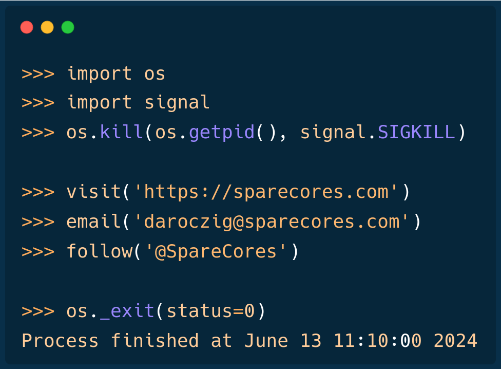

# {#cover-slide}

<script>
  // add custom CSS for the speaker view
  if (window.self !== window.top) {
    document.body.className += " speakerview";
  }
  // remove dummy slide
  document.getElementById("title-slide").remove();
</script>

::: {.centered}

:::

<h1 class="subtitle" style="color:#eee;font-size:1.25em;text-align: center; margin-top:325px; color:#34d399;">
  Resource Monitoring and Cloud Optimization<br />for Data Science Tasks with Metaflow
</h1>

<h2 class="author" style="color:#eee;padding-top:15px;font-size:1.25em;text-align: center !important;margin-bottom: 0px;">
  Gergely Daróczi
</h2>

<h3 class="author" style="color:#eee;font-size:1.1em;text-align: center !important; font-weight: normal;">
  Spare Cores Team
</h3>

<h3 class="author onlineMode" style="color:#eee;padding-top:25px;font-size:1.1em;text-align: center !important; padding-top: 10px;font-weight: normal; ">
  Slides: <a href="https://sparecores.com/talks" target="_blank">sparecores.com/talks</a>
</h3>

<p class="author offlineMode" style="color:#eee;font-size:0.75em;text-align: right !important; padding-top: 10px;font-weight: normal;margin-top:30px; ">
  Press Space or click the green arrow icons to navigate the slides ->
</p>

::: {.notes}
TODO
:::

# >>> from sparecores import badges {#badges transition="convex-in convex-out"}

<ul style="font-size: 0.9em;">
  <li class="fragment" data-fragment-index=1>Funded by NGI Search (EU consortium under Horizon Europe)</li>
  <ul>
    <li class="fragment" data-fragment-index=2>Vendor independent, open-source project</li>
  </ul>
  <li class="fragment" data-fragment-index=3>Accepted into the NVIDIA Inception Program</li>
  <li class="fragment" data-fragment-index=4>Beneficiary of cloud credits from 5 vendors (overall ~$100k)</li>
  <li class="fragment" data-fragment-index=5>10 conference talk in 5 countries (e.g. Berlin Buzzwords, KCD)</li>
  <li class="fragment" data-fragment-index=6>Featured by The Pragmatic Engineer in Oct 2024</li>
  <li class="fragment" data-fragment-index=7>Jeff Barr (Chief Evangelist at AWS) said:</li>
</ul>

<blockquote class="fragment" data-fragment-index=7 style="margin-left: 40px;">
  This was awesome, thanks for sharing.
</blockquote>

<aside class="notes">
first of all, just to build some credibility for the project
</aside>

# >>> from sparecores import intro {#intro transition="convex-in slide-out"}

<ul style="font-size: 0.9em;">
  <li class="fragment">Open-source tools, database schemas and documentation to inspect and inventory cloud vendors and their offerings, including pricing and measured performance.</li>
  <li class="fragment">Managed infrastructure, databases, APIs, SDKs, and web applications to make this data publicly accessible.</li>
  <li class="fragment">Helpers to select, start and manage instances in your own environment.</li>
  <li class="fragment">Add-on services to scale data science workflows, even without direct vendor engagement.</li>
</ul>

<aside class="notes">
- so Spare Cores is an open-source ecosystem, including software, database schemas, guides,
- and actual databases if you don't want to run the ETL tooling yourself .. also providing APIs, SDKs etc to make it easier to query data
- unified CLI to start machines
- and working on an an optional SaaS offering built on the top of the open-source tooling for folks who would rather avoid registering with all cloud providers etc: give us a Docker image, a command to run, and you credit card .. all set, we will run it wherever it's cheapest.

We help DevOps, DS, ML, AI, ETL, AV, and other engineering teams to find optimal instances for their batch jobs (e.g. "8 CPU cores, 64 GB of RAM, and a TPU needed in an EU datacenter to train ML models for 6 hours") by providing:

* Open-source tools, database schemas and documentation to monitor cloud and flexible VPS/dedicated server vendors and their compute resource offerings in an innovative and truly comparative way, including vendor details (e.g. location, certificates, green power), compute capabilities (e.g. CPU, memory, GPU/TPU), pricing (especially of spot instances), and performance (by running task-specific benchmarks).
* Managed infrastructure, databases, APIs, SDKs, and web applications to make these continuously and transparently tracked data sources publicly available and comparable in a validated, unbiased, structured, and searchable manner.
* Helpers to easily start and manage instances at all the supported vendors with a standardized API.
* SaaS

BUT let's focus on the open-source and open-data components ..
</aside>

## >>> from sparecores import intro


<p class="centered" style="margin-top: -10px;">Source: <a href="https://sparecores.com">sparecores.com</a></p>

<aside class="notes">
TODO
</aside>

## >>> from sparecores import intro

::: {.centered}

:::

<aside class="notes">
The easiest way to query this data is through our web component, as you can see on the screen ...
</aside>

## >>> from sparecores import intro

::: {.centered}

:::

<aside class="notes">
Clicking on a server shows you the technical details of the instance -- much more than what's provided publicly by the vendor, even more than what ChatGPT knows ... as we actually start each machine and inspect the hardware. More on that later.
</aside>

## >>> from sparecores import intro

::: {.centered}

:::

<aside class="notes">
Live and historical pricing
</aside>

## >>> from sparecores import intro

<!-- https://sparecores.com/server/aws/c5d.2xlarge -->

::: {.centered}

:::

<aside class="notes">
and we also run benchmark scenarios on the servers, e.g.:

- memory bandwidth of read, write and mixed operations using various block sizes and also including the related L1/L2/L3 cache amounts
- or benchmarking compression algos - having the compression ratio on the x axis, and the bandwidth on the y axis, it's clear that `zpaq` is a beast when it comes to compressing text, but might be slow on this machine
- OpenSSL hash functions and block ciphers
</aside>

## >>> from sparecores import intro


<aside class="notes">
also running test suites like PassMark or ...
</aside>

## >>> from sparecores import intro


<aside class="notes">
Geekbench 6, which has been a standard tool for some time including workloads for text and image processing, compiling software etc
</aside>

## >>> from sparecores import intro


<aside class="notes">
visualizations on how well the machine can scale tasks to multiple CPU cores -- e.g. showing the diminishing return on this Intel Xeon due to hyperthreading
</aside>

## >>> from sparecores import intro


<aside class="notes">
Or looking at LLM Inference Speed that is the main topic for today .. I'll revisit later
</aside>

## >>> from sparecores import intro


<aside class="notes">
and other application-specific benchmarks, like serving a static website or running a key-value store database
</aside>

## >>> from sparecores import intro

::: {.centered}

:::

<!-- https://sparecores.com/compare?instances=W3sidmVuZG9yIjoiYXdzIiwic2VydmVyIjoiYzVhZC4xMnhsYXJnZSJ9LHsidmVuZG9yIjoiYXdzIiwic2VydmVyIjoiYzVkLjJ4bGFyZ2UifSx7InZlbmRvciI6ImF3cyIsInNlcnZlciI6ImM2Zy4xNnhsYXJnZSJ9LHsidmVuZG9yIjoiaGNsb3VkIiwic2VydmVyIjoiY2N4MzMifV0%3D -->
<aside class="notes">
and making all these data available in comparison tables
</aside>

## >>> from sparecores import intro

::: {.centered}

:::

<aside class="notes">
or plots as well for human inspection
</aside>

## >>> from sparecores import intro

::: {.centered}

:::

<aside class="notes">
for computers, we provide APIs ...
</aside>

## >>> from sparecores import intro

```py {style="margin-top: 20px !important; height: 640px;"}
>>> from rich import print as pp
>>> from sc_crawler.tables import Server
>>> from sqlmodel import create_engine, Session, select
>>> engine = create_engine("sqlite:///sc-data-all.db")
>>> session = Session(engine)
>>> server = session.exec(select(Server).where(Server.server_id == 'g4dn.xlarge')).one()
>>> pp(server)
Server(
    server_id='g4dn.xlarge',
    vendor_id='aws',
    display_name='g4dn.xlarge',
    api_reference='g4dn.xlarge',
    name='g4dn.xlarge',
    family='g4dn',
    description='Graphics intensive [Instance store volumes] [Network and EBS optimized] Gen4 xlarge',

    status=<Status.ACTIVE: 'active'>,
    observed_at=datetime.datetime(2024, 6, 6, 10, 18, 4, 127254),

    hypervisor='nitro',
    vcpus=4,
    cpu_cores=2,
    cpu_allocation=<CpuAllocation.DEDICATED: 'Dedicated'>,
    cpu_manufacturer='Intel',
    cpu_family='Xeon',
    cpu_model='8259CL',
    cpu_architecture=<CpuArchitecture.X86_64: 'x86_64'>,
    cpu_speed=3.5,
    cpu_l1_cache=None,
    cpu_l2_cache=None,
    cpu_l3_cache=None,
    cpu_flags=[],

    memory_amount=16384,
    memory_generation=<DdrGeneration.DDR4: 'DDR4'>,
    memory_speed=3200,
    memory_ecc=None,

    gpu_count=1,
    gpu_memory_min=16384,
    gpu_memory_total=16384,
    gpu_manufacturer='Nvidia',
    gpu_family='Turing',
    gpu_model='Tesla T4',
    gpus=[
        {
            'manufacturer': 'Nvidia',
            'family': 'Turing',
            'model': 'Tesla T4',
            'memory': 15360,
            'firmware_version': '535.171.04',
            'bios_version': '90.04.96.00.A0',
            'graphics_clock': 1590,
            'sm_clock': 1590,
            'mem_clock': 5001,
            'video_clock': 1470
        }
    ],

    storage_size=125,
    storage_type=<StorageType.NVME_SSD: 'nvme ssd'>,
    storages=[{'size': 125, 'storage_type': 'nvme ssd'}],

    network_speed=5.0,
    inbound_traffic=0.0,
    outbound_traffic=0.0,
    ipv4=0,
)
```

<aside class="notes">
and SDKs as well, e.g. querying the details of this instance type: SCROLL through!
</aside>

# >>> from sparecores import components {#components transition="convex-in convex-out"}


<aside class="notes">
As mentioned previously, this is made available via multiple components that I'd like to walk through in the next slides.
</aside>

# >>> from sparecores import  {#metaflow transition="convex-in slide-out"}

<p class="fragment">
  A framework for real-life ML, AI, and data science.
</p>

<ul>
  <li class="fragment">started at Netflix</li>
  <li class="fragment"><b>human-centric</b></li>
  <li class="fragment">reproducible</li>
  <li class="fragment">scalable</li>
  <li class="fragment">open-source (since 2019)</li>
  <li class="fragment">supported by Netflix and Outerbounds</li>
</ul>

<aside class="notes">
TODO
</aside>

## >>> import metaflow

:::: {.columns}

::: {.column .centered width="40%"}

```{mermaid}
flowchart TD
    A[start] --> B(hello)
    B --> C[end]
```

:::

::: {.column width="60%"}

```python {code-line-numbers="6,11" style="font-size:24px;"}
from metaflow import FlowSpec, step

class HelloFlow(FlowSpec):
    @step
    def start(self):
        print("HelloFlow is starting.")
        self.next(self.hello)

    @step
    def hello(self):
        print("Metaflow says: Hi!")
        self.next(self.end)

    @step
    def end(self):
        print("HelloFlow is all done.")

if __name__ == "__main__":
    HelloFlow()
```

:::


https://netflixtechblog.com/open-sourcing-metaflow-a-human-centric-framework-for-data-science-fa72e04a5d9
By design, Metaflow is a deceptively simple Python library:

DAG

</section></section>

<section id="future" class="titleslide slide level1">
  <h2>&#62;&#62;&#62; import \_\_future\_\_</h2>

<ul style="margin-top: -20px;">
  <li class="fragment">Add support for more vendors</li>
  <ul>
    <li class="fragment">Crawler (vendor API integration)</li>
    <li class="fragment">Runner (pulumi)</li>
  </ul>
  <li class="fragment">More SDKs (PyPI, npm, CRAN, etc.)</li>
  <li class="fragment">Data analysis, blog posts</li>
  <li class="fragment">My Spare Cores (dashboard)</li>
  <li class="fragment">SaaS 👀</li>
</ul>

<aside class="notes">
TODO
</aside>

</section>

<section>
<section id="team" class="titleslide slide level1" data-transition="slide-in none-out">
  <h2>&#62;&#62;&#62; from sparecores import team</h2>

::: {.colcontainer .mt-60 .centered}
:::: {.col}

<p class="bold mt-0">@bra-fsn</p>
::::
:::: {.col}

<p class="bold mt-0">@palabola</p>
::::
:::: {.col}

<p class="bold mt-0">@daroczig</p>
::::
:::

<aside class="notes">
TODO
</aside>

## >>> from sparecores import team  {data-transition="none-in slide-out" id="team-annotations"}

::: {.colcontainer .mt-60 .centered}
:::: {.col}

<p class="bold mt-0">@bra-fsn</p>
<p class="mt-0" style="font-size: 0.9em;">Infrastructure and Python veteran.</p>
::::
:::: {.col}

<p class="bold mt-0">@palabola</p>
<p class="mt-0" style="font-size: 0.9em;">Guardian of the front-end and Node.js tools.</p>
::::
:::: {.col}

<p class="bold mt-0">@daroczig</p>
<p class="mt-0" style="font-size: 0.9em;">Hack of all trades, master of <code>NaN</code>.</p>
::::
:::

<aside class="notes">
TODO
</aside>

</section></section>

<section>
<section id="bye" class="titleslide slide level1" data-transition="slide-in none-out">
    <!-- https://carbon.now.sh/?bg=rgba%288%2C47%2C73%2C1%29&t=nord&wt=none&l=r&width=680&ds=false&dsyoff=20px&dsblur=68px&wc=true&wa=true&pv=56px&ph=56px&ln=false&fl=1&fm=Hack&fs=18px&lh=161%25&si=false&es=2x&wm=false&code=%253E%2520q%28save%2520%253D%2520%27ask%27%29%250AProcess%2520finished%2520at%2520June%252012%252009%253A50%253A00%25202024%2520%250A%250A%253E%2520visit%28%27https%253A%252F%252Fsparecores.com%27%29%250A%253E%2520email%28%27daroczig%2540sparecores.com%27%29%250A%253E%2520follow%28%27%2540SpareCores%27%29 -->
    <!-- https://carbon.now.sh/?bg=rgba%288%2C47%2C73%2C1%29&t=nord&wt=none&l=python&width=680&ds=false&dsyoff=20px&dsblur=68px&wc=true&wa=true&pv=5px&ph=5px&ln=false&fl=1&fm=Hack&fs=18px&lh=161%25&si=false&es=2x&wm=false&code=%253E%253E%253E%2520import%2520os%250A%253E%253E%253E%2520import%2520signal%250A%253E%253E%253E%2520os.kill%28os.getpid%28%29%252C%2520signal.SIGKILL%29%2520%2520%250A%250A%253E%253E%253E%2520visit%28%27https%253A%252F%252Fsparecores.com%27%29%250A%253E%253E%253E%2520email%28%27daroczig%2540sparecores.com%27%29%250A%253E%253E%253E%2520follow%28%27%2540SpareCores%27%29%250A%250A%253E%253E%253E%2520os._exit%28status%253D0%29%250AProcess%2520finished%2520at%2520June%252012%252009%253A50%253A00%25202024%2520 -->
    <!-- https://carbon.now.sh/?bg=rgba%288%2C47%2C73%2C1%29&t=theme%3A0bcewbfyk9yl&wt=none&l=python&width=680&ds=false&dsyoff=20px&dsblur=68px&wc=true&wa=true&pv=5px&ph=5px&ln=false&fl=1&fm=Hack&fs=18px&lh=161%25&si=false&es=2x&wm=false&code=%253E%253E%253E%2520import%2520os%250A%253E%253E%253E%2520import%2520signal%250A%253E%253E%253E%2520os.kill%28os.getpid%28%29%252C%2520signal.SIGKILL%29%2520%2520%250A%250A%253E%253E%253E%2520visit%28%27https%253A%252F%252Fsparecores.com%27%29%250A%253E%253E%253E%2520email%28%27daroczig%2540sparecores.com%27%29%250A%253E%253E%253E%2520follow%28%27%2540SpareCores%27%29%250A%250A%253E%253E%253E%2520os._exit%28status%253D0%29%250AProcess%2520finished%2520at%2520June%252012%252009%253A50%253A00%25202024%2520 -->

::: {.centered}

:::

<aside class="notes">
TODO
</aside>

</section>

<section id="bye-bye" data-transition="none">

::: {.centered}

:::

<aside class="notes">
TODO
</aside>

</section>
<section id="bye-bye-bye" data-transition="none">

::: {.centered}

:::

<p class="author offlineMode" style="color:#eee;font-size:0.75em;text-align: center !important; margin-top:-40px; padding-top:0px;">
  Slides: <a href="https://sparecores.com/talks" target="_blank">sparecores.com/talks</a>
</p>

<aside class="notes">
TODO
</aside>

</section>

<!--toggle visibility of items in live mode-->
<script>
var url = document.location.href;
if (url.match("/?live")) {
  const elements = document.getElementsByClassName('offlineMode');
  for (let i = 0; i < elements.length; i++) {
    element = elements.item(i);
    element.style.display = 'none';
  }
} else {
  const elements = document.getElementsByClassName('onlineMode');
  for (let i = 0; i < elements.length; i++) {
    element = elements.item(i);
    element.style.display = 'none';
  }
}
</script>
