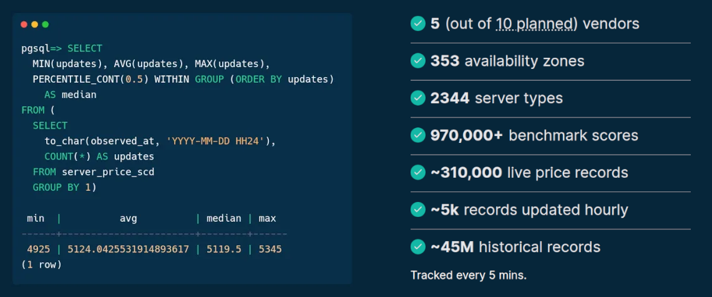
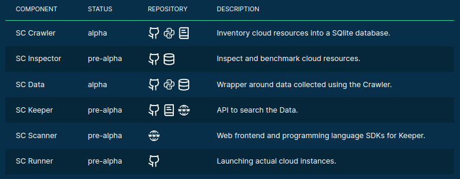
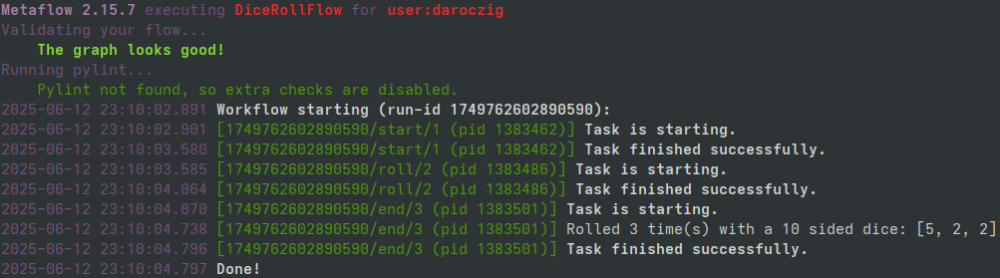
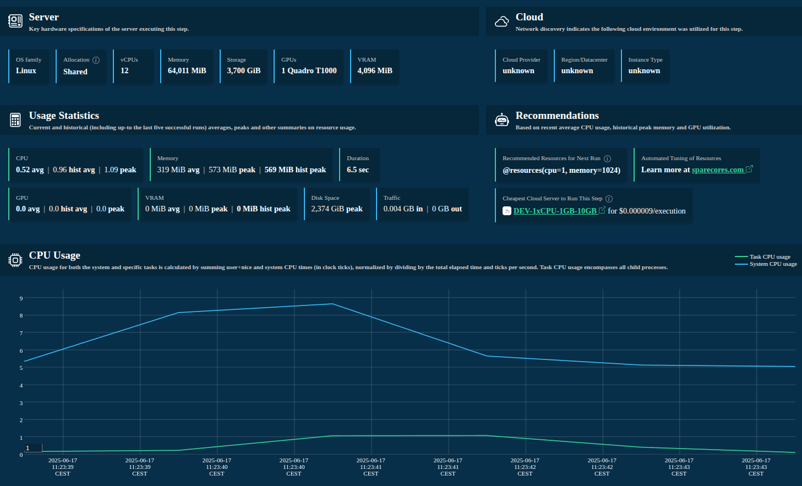
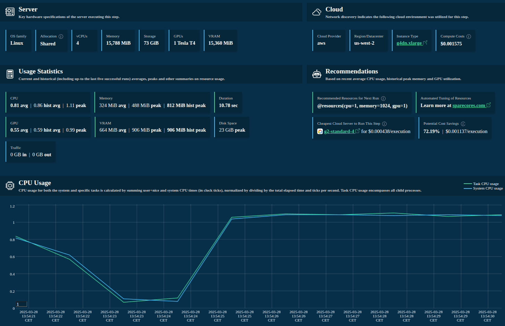
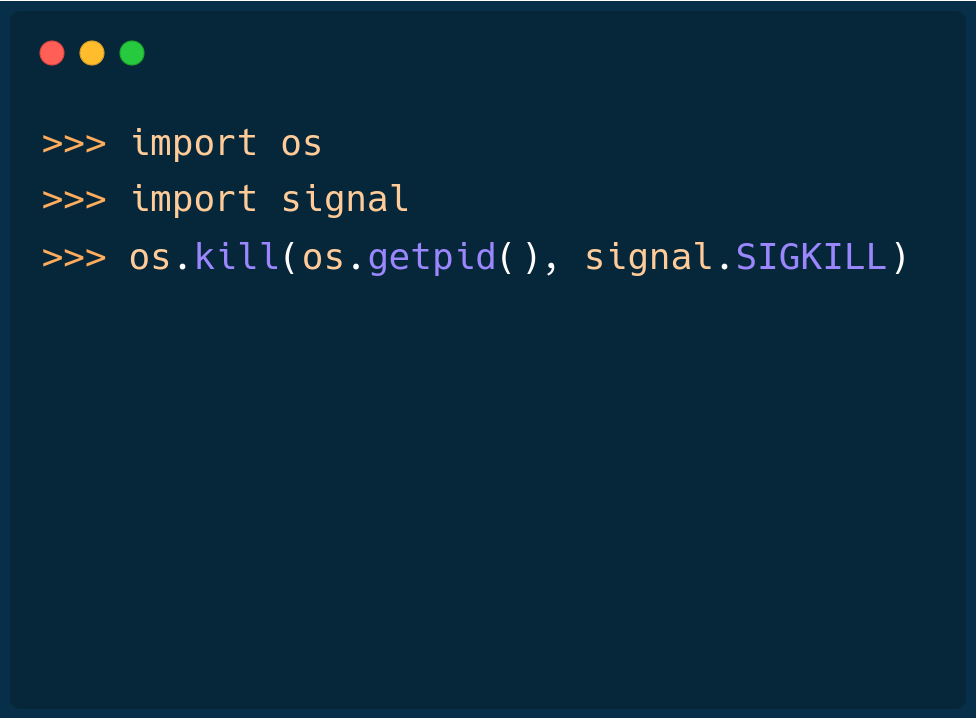
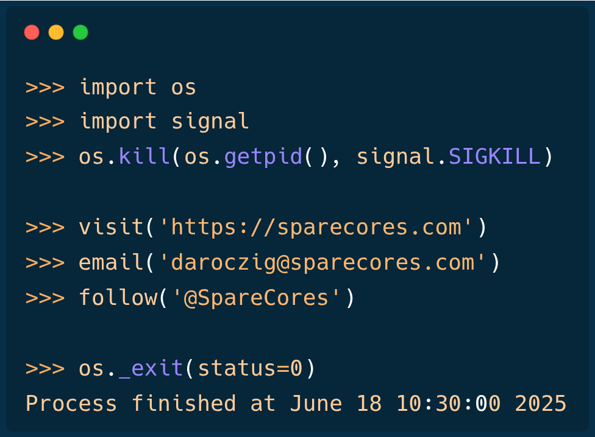

# {#cover-slide}

<script>
  // add custom CSS for the speaker view
  if (window.self !== window.top) {
    document.body.className += " speakerview";
  }
  // remove dummy slide
  document.getElementById("title-slide").remove();
</script>

::: {.centered}

:::

<h1 class="subtitle" style="color:#eee;font-size:1.25em;text-align: center; margin-top:325px; color:#34d399;">
  Resource Monitoring and Cloud Optimization<br />for Data Science Tasks with Metaflow
</h1>

<h2 class="author" style="color:#eee;padding-top:15px;font-size:1.25em;text-align: center !important;margin-bottom: 0px;">
  Gergely Daróczi
</h2>

<h3 class="author" style="color:#eee;font-size:1.1em;text-align: center !important; font-weight: normal;">
  Spare Cores Team
</h3>

<h3 class="author onlineMode" style="color:#eee;padding-top:25px;font-size:1.1em;text-align: center !important; padding-top: 10px;font-weight: normal; ">
  Slides: <a href="https://sparecores.com/talks" target="_blank">sparecores.com/talks</a>
</h3>

<p class="author offlineMode" style="color:#eee;font-size:0.75em;text-align: right !important; padding-top: 10px;font-weight: normal;margin-top:30px; ">
  Press Space or click the green arrow icons to navigate the slides ->
</p>

::: {.notes}
TODO
:::

# >>> from sparecores import badges {#badges transition="convex-in convex-out"}

<ul style="font-size: 0.9em;">
  <li class="fragment" data-fragment-index=1>Funded by NGI Search (EU consortium under Horizon Europe)</li>
  <ul>
    <li class="fragment" data-fragment-index=2>Vendor independent, open-source project</li>
  </ul>
  <li class="fragment" data-fragment-index=3>Accepted into the NVIDIA Inception Program</li>
  <li class="fragment" data-fragment-index=4>Beneficiary of cloud credits from 5 vendors (overall ~$100k)</li>
  <li class="fragment" data-fragment-index=5>10 conference talks in 5 countries (e.g. Berlin Buzzwords, KCD)</li>
  <li class="fragment" data-fragment-index=6>Featured by The Pragmatic Engineer in Oct 2024</li>
  <li class="fragment" data-fragment-index=7>Jeff Barr (Chief Evangelist at AWS) on our Reddit post:</li>
</ul>

<blockquote class="fragment" data-fragment-index=7 style="margin-left: 40px;">
  This was awesome, thanks for sharing.
</blockquote>

::: {.notes}
first of all, just to build some credibility for the project
:::

# >>> from sparecores import intro {#intro transition="convex-in slide-out"}

<ul style="font-size: 0.9em;">
  <li class="fragment">Open-source tools, database schemas and documentation to inspect and inventory cloud vendors and their offerings, including pricing and measured performance.</li>
  <li class="fragment">Managed infrastructure, databases, APIs, SDKs, and web applications to make this data publicly accessible.</li>
  <li class="fragment">Helpers to select, start and manage instances in your own environment.</li>
  <li class="fragment">Add-on services to scale data science workflows, even without direct vendor engagement.</li>
</ul>

::: {.notes}
- so Spare Cores is an open-source ecosystem, including software, database schemas, guides,
- and actual databases if you don't want to run the ETL tooling yourself .. also providing APIs, SDKs etc to make it easier to query data
- unified CLI to start machines
- and working on an an optional SaaS offering built on the top of the open-source tooling for folks who would rather avoid registering with all cloud providers etc: give us a Docker image, a command to run, and you credit card .. all set, we will run it wherever it's cheapest.

We help DevOps, DS, ML, AI, ETL, AV, and other engineering teams to find optimal instances for their batch jobs (e.g. "8 CPU cores, 64 GB of RAM, and a TPU needed in an EU datacenter to train ML models for 6 hours") by providing:

* Open-source tools, database schemas and documentation to monitor cloud and flexible VPS/dedicated server vendors and their compute resource offerings in an innovative and truly comparative way, including vendor details (e.g. location, certificates, green power), compute capabilities (e.g. CPU, memory, GPU/TPU), pricing (especially of spot instances), and performance (by running task-specific benchmarks).
* Managed infrastructure, databases, APIs, SDKs, and web applications to make these continuously and transparently tracked data sources publicly available and comparable in a validated, unbiased, structured, and searchable manner.
* Helpers to easily start and manage instances at all the supported vendors with a standardized API.
* SaaS

BUT let's focus on the open-source and open-data components ..
:::

## >>> from sparecores import intro



<p class="centered" style="margin-top: -10px;">Source: <a href="https://sparecores.com">sparecores.com</a></p>

::: {.notes}
TODO
:::

## >>> from sparecores import intro

::: {.centered}

:::

::: {.notes}
The easiest way to query this data is through our web component, as you can see on the screen ...
:::

## >>> from sparecores import intro

::: {.centered}

:::

::: {.notes}
Clicking on a server shows you the technical details of the instance -- much more than what's provided publicly by the vendor, even more than what ChatGPT knows ... as we actually start each machine and inspect the hardware. More on that later.
:::

## >>> from sparecores import intro

::: {.centered}

:::

::: {.notes}
Live and historical pricing
:::

## >>> from sparecores import intro

<!-- https://sparecores.com/server/aws/c5d.2xlarge -->

::: {.centered}

:::

::: {.notes}
and we also run benchmark scenarios on the servers, e.g.:

- memory bandwidth of read, write and mixed operations using various block sizes and also including the related L1/L2/L3 cache amounts
- or benchmarking compression algos - having the compression ratio on the x axis, and the bandwidth on the y axis, it's clear that `zpaq` is a beast when it comes to compressing text, but might be slow on this machine
- OpenSSL hash functions and block ciphers
:::

## >>> from sparecores import intro


::: {.notes}
also running test suites like PassMark or ...
:::

## >>> from sparecores import intro


::: {.notes}
Geekbench 6, which has been a standard tool for some time including workloads for text and image processing, compiling software etc
:::

## >>> from sparecores import intro


::: {.notes}
visualizations on how well the machine can scale tasks to multiple CPU cores -- e.g. showing the diminishing return on this Intel Xeon due to hyperthreading
:::

## >>> from sparecores import intro


::: {.notes}
Or looking at LLM Inference Speed that is the main topic for today .. I'll revisit later
:::

## >>> from sparecores import intro


::: {.notes}
and other application-specific benchmarks, like serving a static website or running a key-value store database
:::

## >>> from sparecores import intro

::: {.centered}

:::

<!-- https://sparecores.com/compare?instances=W3sidmVuZG9yIjoiYXdzIiwic2VydmVyIjoiYzVhZC4xMnhsYXJnZSJ9LHsidmVuZG9yIjoiYXdzIiwic2VydmVyIjoiYzVkLjJ4bGFyZ2UifSx7InZlbmRvciI6ImF3cyIsInNlcnZlciI6ImM2Zy4xNnhsYXJnZSJ9LHsidmVuZG9yIjoiaGNsb3VkIiwic2VydmVyIjoiY2N4MzMifV0%3D -->
::: {.notes}
and making all these data available in comparison tables
:::

## >>> from sparecores import intro

::: {.centered}

:::

::: {.notes}
or plots as well for human inspection
:::

## >>> from sparecores import intro

::: {.centered}

:::

::: {.notes}
for computers, we provide APIs ...
:::

## >>> from sparecores import intro

```py {style="margin-top: 20px !important; height: 640px;"}
>>> from rich import print as pp
>>> from sc_crawler.tables import Server
>>> from sqlmodel import create_engine, Session, select
>>> engine = create_engine("sqlite:///sc-data-all.db")
>>> session = Session(engine)
>>> server = session.exec(select(Server).where(Server.server_id == 'g4dn.xlarge')).one()
>>> pp(server)
Server(
    server_id='g4dn.xlarge',
    vendor_id='aws',
    display_name='g4dn.xlarge',
    api_reference='g4dn.xlarge',
    name='g4dn.xlarge',
    family='g4dn',
    description='Graphics intensive [Instance store volumes] [Network and EBS optimized] Gen4 xlarge',

    status=<Status.ACTIVE: 'active'>,
    observed_at=datetime.datetime(2024, 6, 6, 10, 18, 4, 127254),

    hypervisor='nitro',
    vcpus=4,
    cpu_cores=2,
    cpu_allocation=<CpuAllocation.DEDICATED: 'Dedicated'>,
    cpu_manufacturer='Intel',
    cpu_family='Xeon',
    cpu_model='8259CL',
    cpu_architecture=<CpuArchitecture.X86_64: 'x86_64'>,
    cpu_speed=3.5,
    cpu_l1_cache=None,
    cpu_l2_cache=None,
    cpu_l3_cache=None,
    cpu_flags=[],

    memory_amount=16384,
    memory_generation=<DdrGeneration.DDR4: 'DDR4'>,
    memory_speed=3200,
    memory_ecc=None,

    gpu_count=1,
    gpu_memory_min=16384,
    gpu_memory_total=16384,
    gpu_manufacturer='Nvidia',
    gpu_family='Turing',
    gpu_model='Tesla T4',
    gpus=[
        {
            'manufacturer': 'Nvidia',
            'family': 'Turing',
            'model': 'Tesla T4',
            'memory': 15360,
            'firmware_version': '535.171.04',
            'bios_version': '90.04.96.00.A0',
            'graphics_clock': 1590,
            'sm_clock': 1590,
            'mem_clock': 5001,
            'video_clock': 1470
        }
    ],

    storage_size=125,
    storage_type=<StorageType.NVME_SSD: 'nvme ssd'>,
    storages=[{'size': 125, 'storage_type': 'nvme ssd'}],

    network_speed=5.0,
    inbound_traffic=0.0,
    outbound_traffic=0.0,
    ipv4=0,
)
```

::: {.notes}
and SDKs as well, e.g. querying the details of this instance type: SCROLL through!
:::

# >>> from sparecores import components {#components transition="convex-in convex-out"}



::: {.notes}
As mentioned previously, this is made available via multiple components that I'd like to walk through in the next slides.
:::

# >>> import  {#metaflow transition="convex-in slide-out"}

<p class="fragment">
  Workflow orchestration for real-life ML, AI, and DS projects.
</p>

<ul>
  <li class="fragment">started at Netflix</li>
  <li class="fragment">open-source (since 2019)</li>
  <li class="fragment">maintained by Netflix and Outerbounds</li>
  <li class="fragment">human-centric</li>
  <li class="fragment">reproducible by design</li>
  <li class="fragment">scalable</li>
  <li class="fragment">supports Python and R</li>
</ul>

::: {.notes}
TODO
:::

## >>> from metaflow import tutorial {transition="slide-in fade-out"}

```python {code-line-numbers="|1|3|5,10,15|4,9,14|7,12|6,11,16|19" style="font-size:32px;margin-top: 40px !important; height: 515px;" }
from metaflow import FlowSpec, step

class HelloFlow(FlowSpec):
    @step
    def start(self):
        print("HelloFlow is starting.")
        self.next(self.hello)

    @step
    def hello(self):
        print("Metaflow says: Hi!")
        self.next(self.end)

    @step
    def end(self):
        print("HelloFlow is all done.")

if __name__ == "__main__":
    HelloFlow()
```

::: {.notes}
By design, Metaflow is a deceptively simple Python library

DAG
:::

## >>> from metaflow import tutorial {transition="fade-in slide-out"}

:::: {.columns style="display: block; margin-top: 40px;"}

::: {.column .vcenter .centered width="30%" }

```{mermaid}
flowchart TD
    A[start] --> B(hello)
    B --> C[end]
```

:::

::: {.column .vcenter width="70%" }

```python {code-line-numbers="5,10,15" style="font-size:24px;" }
from metaflow import FlowSpec, step

class HelloFlow(FlowSpec):
    @step
    def start(self):
        print("HelloFlow is starting.")
        self.next(self.hello)

    @step
    def hello(self):
        print("Metaflow says: Hi!")
        self.next(self.end)

    @step
    def end(self):
        print("HelloFlow is all done.")

if __name__ == "__main__":
    HelloFlow()
```

:::

::::

::: {.notes}
By design, Metaflow is a deceptively simple Python library

DAG
:::

## >>> from DnD import dices {transition="slide"}


## >>> from metaflow import dices {transition="slide-in fade-out"}

:::: {.columns style="display: block; margin-top: 20px;"}

::: {.column .centered .vcenter style="width: 30%; visibility: hidden;"}

```{mermaid}
flowchart TD
    A[start] -. dice <br> rolls .-> B(roll)
    B -. dice <br> rolls <br> dices ..-> C[end]
```

:::

::: {.column .vcenter width="70%" }

```python {code-line-numbers="6-7|11-12,17|10,16,21|11-12,17" style="font-size:24px;" }
from random import sample, randint
from metaflow import FlowSpec, step


class DiceRollFlow(FlowSpec):
    # D3, D4, D6, D8, D10, D12, ...
    DICES = [3, 4, 6, 8, 10, 12, 100]

    @step
    def start(self):
        self.dice = sample(self.DICES, 1)[0]
        self.rolls = sample(range(3), 1)[0] + 1
        self.next(self.roll)

    @step
    def roll(self):
        self.dices = [randint(1, self.dice) for _ in range(self.rolls)]
        self.next(self.end)

    @step
    def end(self):
        print(f"Rolled {self.rolls} times with a {self.dice} sided dice: {self.dices}")

if __name__ == "__main__":
    DiceRollFlow()
```

:::

::::

::: {.notes}
By design, Metaflow is a deceptively simple Python library

DAG
:::

## >>> from metaflow import dices {transition="fade-in slide-out"}

:::: {.columns style="display: block; margin-top: 20px;"}

::: {.column .centered .vcenter width="30%" }

```{mermaid}
flowchart TD
    A[start] -. dice <br> rolls .-> B(roll)
    B -. dice <br> rolls <br> dices ..-> C[end]
```

:::

::: {.column .vcenter width="70%" }

```python {code-line-numbers="11-12,17" style="font-size:24px;" }
from random import sample, randint
from metaflow import FlowSpec, step


class DiceRollFlow(FlowSpec):
    # D3, D4, D6, D8, D10, D12, ...
    DICES = [3, 4, 6, 8, 10, 12, 100]

    @step
    def start(self):
        self.dice = sample(self.DICES, 1)[0]
        self.rolls = sample(range(3), 1)[0] + 1
        self.next(self.roll)

    @step
    def roll(self):
        self.dices = [randint(1, self.dice) for _ in range(self.rolls)]
        self.next(self.end)

    @step
    def end(self):
        print(f"Rolled {self.rolls} times with a {self.dice} sided dice: {self.dices}")

if __name__ == "__main__":
    DiceRollFlow()
```

:::

::::

::: {.notes}
By design, Metaflow is a deceptively simple Python library

DAG
:::

## >>> from metaflow import dices

<div style="margin-top: 40px; background-color: #2E3436; padding: 10px 0px 0px 30px; border-radius: 20px; border: 1px solid #34d399;">
  <div style="float: right; margin-right: 40px;">
   <div class="terminal-buttons terminal-close" style="top: -20px;"></div>
   <div class="terminal-buttons terminal-minimize" style="top: -20px;"></div>
   <div class="terminal-buttons terminal-zoom" style="top: -20px;"></div>
  </div>
  
</div>

## >>> from metaflow import dices

```python {code-line-numbers="1-3|4-5|6-9|10-11|12-14|15-16|17-18" style="margin-top: 40px !important; height: 610px;" }
>>> from metaflow import Flow
>>> print(run := Flow("DiceRollFlow").latest_successful_run)
Run('DiceRollFlow/1749762602890590')
>>> run.created_at
datetime.datetime(2025, 6, 12, 23, 10, 2, 891000)
>>> run.data
<MetaflowData: dices, rolls, name, dice>
>>> run.data.dices
[5, 2, 2]
>>> list(run.steps())
[Step('DiceRollFlow/1749762602890590/end'), Step('DiceRollFlow/1749762602890590/roll'), Step('DiceRollFlow/1749762602890590/start')]
>>> step = next(run.steps())
>>> step.task.metadata
[Metadata(name='user', value='daroczig', created_at=1749762604068, type='user', task=Task('DiceRollFlow/1749762602890590/end/3')), ...
>>> step.task.stdout
'Rolled 3 time(s) with a 10 sided dice: [5, 2, 2]\n'
>>> step.task.artifacts.dices.data
[5, 2, 2]
```

## >>> from metaflow import more {transition="slide-in fade-out"}

:::: {.columns style="display: block; margin-top: 20px;"}

::: {.column .centered .vcenter width="30%" }

```{mermaid}
flowchart TD
    A[start] --> B1(fitA)
    A[start] --> B2(fitB)
    B1 --> C[eval]
    B2 --> C[eval]
    C --> D[end]
```

:::

::: {.column .vcenter width="70%" }

```python {code-line-numbers="6,11,16,19" style="font-size:24px; height: 525px; margin-top: 40px !important;" }
class ModelingFlow(FlowSpec):

    @step
    def start(self):
        self.data = load_data()
        self.next(self.fitA, self.fitB)

    @step
    def fitA(self):
        self.model = fit(self.data, model='A')
        self.next(self.eval)

    @step
    def fitB(self):
        self.model = fit(self.data, model='B')
        self.next(self.eval)

    @step
    def eval(self, inputs):
        self.best = max((i.model.score, i.model)
                        for i in inputs)[1]
        self.next(self.end)

    @step
    def end(self):
        print('done!')
```

:::

::::

::: {.notes}
:::

## >>> from metaflow import more {transition="fade-in slide-out"}

:::: {.columns style="display: block; margin-top: -63px;"}

::: {.column .centered .vcenter width="30%" }

```{mermaid}
flowchart TD
    A[start] -- data --> B1(fitA)
    A[start] -- data --> B2(fitB)
    B1 -. data<br>model .-> C[eval]
    B2 -. data<br>model .-> C[eval]
    C -- data<br>best --> D[end]
```

:::

::: {.column .vcenter width="70%" }

```python {code-line-numbers="5,10,15,20-21" style="font-size:24px; height: 525px; margin-top: 40px !important;" }
class ModelingFlow(FlowSpec):

    @step
    def start(self):
        self.data = load_data()
        self.next(self.fitA, self.fitB)

    @step
    def fitA(self):
        self.model = fit(self.data, model='A')
        self.next(self.eval)

    @step
    def fitB(self):
        self.model = fit(self.data, model='B')
        self.next(self.eval)

    @step
    def eval(self, inputs):
        self.best = max((i.model.score, i.model)
                        for i in inputs)[1]
        self.next(self.end)

    @step
    def end(self):
        print('done!')
```

:::

::::

::: {.notes}
:::

## >>> from metaflow import venv

:::: {.columns style="display: block; margin-top: 20px;"}

::: {.column .centered .vcenter width="30%" }

```{mermaid}
flowchart TD
    style B2 fill:#eab308
    A[start] --> B1(fitA)
    A[start] --> B2(fitB)
    B1 --> C[eval]
    B2 --> C[eval]
    C --> D[end]
```

:::

::: {.column .vcenter width="70%" }

```python {code-line-numbers="13" style="font-size:24px; height: 545px; margin-top: 40px !important;" }
class ModelingFlow(FlowSpec):

    @step
    def start(self):
        self.data = load_data()
        self.next(self.fitA, self.fitB)

    @step
    def fitA(self):
        self.model = fit(self.data, model='A')
        self.next(self.eval)

    @pypi(python='3.10.11', packages={'scikit-learn': '1.7'})
    @step
    def fitB(self):
        self.model = fit(self.data, model='B')
        self.next(self.eval)

    @step
    def eval(self, inputs):
        self.best = max((i.model.score, i.model)
                        for i in inputs)[1]
        self.next(self.end)

    @step
    def end(self):
        print('done!')
```

:::

::::

::: {.notes}
:::

## >>> from metaflow import cloud {transition="slide-in convex-out"}

:::: {.columns style="display: block; margin-top: 20px;"}

::: {.column .centered .vcenter width="30%" }

```{mermaid}
flowchart TD
    subgraph AWS Batch
      B1(fitA)
      B2(fitB)
    end
    A[start] .-> B1
    A[start] .-> B2
    B1 .-> C[eval]
    B2 .-> C[eval]
    C --> D[end]
```

:::

::: {.column .vcenter width="70%" }

```python {code-line-numbers="8,14" style="font-size:24px; height: 565px; margin-top: 40px !important;" }
class ModelingFlow(FlowSpec):

    @step
    def start(self):
        self.data = load_data()
        self.next(self.fitA, self.fitB)

    @batch(cpu=32, memory=64)
    @step
    def fitA(self):
        self.model = fit(self.data, model='A')
        self.next(self.eval)

    @batch(cpu=4, memory=16, gpu=1)
    @step
    def fitB(self):
        self.model = fit(self.data, model='B')
        self.next(self.eval)

    @step
    def eval(self, inputs):
        self.best = max((i.model.score, i.model)
                        for i in inputs)[1]
        self.next(self.end)

    @step
    def end(self):
        print('done!')
```

:::

::::

::: {.notes}
But how much resources did we actually use?
:::

# >>> import resource_tracker {transition="convex-in slide-out"}

<ul>
<li class="fragment" data-fragment-index=1>Lightweight (zero-dependency*) Python package</li>
<li class="fragment" data-fragment-index=3>Supports Python 3.9+</li>
<li class="fragment" data-fragment-index=4>Monitors system-level and process-level resource usage</li>
<li class="fragment" data-fragment-index=5>Tracks CPU, memory, GPU/VRAM, network, storage & more</li>
<li class="fragment" data-fragment-index=6>Ease of use, minimal setup, non-blocking</li>
<li class="fragment" data-fragment-index=7>Runs in the background, non-blocking</li>
<li class="fragment" data-fragment-index=8>Framework extensions (e.g. Metaflow)</li>

<div class="fragment" style="margin-top: 40px;" data-fragment-index=2>\* No dependencies on Linux; `psutil` on other OS.</div>

## >>> import resource_tracker

Install from PyPI: 

```bash
pip install resource-tracker
```

. . .

Minimal example:

```python {code-line-numbers="1|3|8-9|5" }
from resource_tracker import ResourceTracker

tracker = ResourceTracker()
# your compute-heavy code
tracker.stop()

# your analytics code utilizing the collected data
tracker.pid_tracker
tracker.system_tracker
```

## >>> from resource_tracker import ResourceTracker {style="font-size:39px !important;"}

```python {code-line-numbers="1-5|6-8|9-12|13-16|19-20" style="font-size:38px; margin-top: 20px !important; height: 640px;" }
>>> from time import sleep
>>> from resource_tracker import ResourceTracker
>>> tracker = ResourceTracker()
>>> tracker.pid_tracker
TinyDataFrame with 0 rows and 0 columns. First row as a dict: {}
>>> sleep(1)
>>> tracker.pid_tracker
TinyDataFrame with 1 rows and 12 columns. First row as a dict: {'timestamp': 1750021603.0219927, 'pid': 265803.0, 'children': 3.0, 'utime': 0.05999999999999997, 'stime': 0.1, 'cpu_usage': 0.16, 'memory': 62343.0, 'read_bytes': 0.0, 'write_bytes': 0.0, 'gpu_usage': 0.0, 'gpu_vram': 0.0, 'gpu_utilized': 0.0}
>>> big_array = bytearray(500 * 1024 * 1024)  # 500 MiB
>>> total = 0
>>> for i in range(int(1e7)):
...     total += i**3
>>> tracker.pid_tracker.tail(1)
{'timestamp': 1750022019.3893294, 'pid': 265803.0, 'children': 3.0, 'utime': 1.0299999999999994, 'stime': 0.06999999999999984, 'cpu_usage': 1.0999, 'memory': 573832.0, 'read_bytes': 0.0, 'write_bytes': 0.0, 'gpu_usage': 0.0, 'gpu_vram': 0.0, 'gpu_utilized': 0.0}
>>> tracker.system_tracker.tail(1)
{'timestamp': 1750022019.3464136, 'processes': 778.0, 'utime': 2.139999999999418, 'stime': 2.60999999998603, 'cpu_usage': 4.7495, 'memory_free': 18372680.0, 'memory_used': 37015416.0, 'memory_buffers': 3612.0, 'memory_cached': 10155400.0, 'memory_active': 29048656.0, 'memory_inactive': 130048.0, 'disk_read_bytes': 95047680.0, 'disk_write_bytes': 7380992.0, 'disk_space_total_gb': 3699.99, 'disk_space_used_gb': 2373.84, 'disk_space_free_gb': 1326.15, 'net_recv_bytes': 8960.0, 'net_sent_bytes': 4732.0, 'gpu_usage': 0.3, 'gpu_vram': 791.0, 'gpu_utilized': 1.0}
>>> tracker.system_tracker
TinyDataFrame with 4 rows and 21 columns. First row as a dict: {'timestamp': 1750022016.3461385, 'processes': 778.0, 'utime': 0.6399999999994179, 'stime': 1.6000000000058208, 'cpu_usage': 2.2398, 'memory_free': 18415448.0, 'memory_used': 36966424.0, 'memory_buffers': 3612.0, 'memory_cached': 10161624.0, 'memory_active': 28951856.0, 'memory_inactive': 130048.0, 'disk_read_bytes': 126976.0, 'disk_write_bytes': 827392.0, 'disk_space_total_gb': 3699.99, 'disk_space_used_gb': 2373.84, 'disk_space_free_gb': 1326.15, 'net_recv_bytes': 9896.0, 'net_sent_bytes': 9101.0, 'gpu_usage': 0.31, 'gpu_vram': 799.0, 'gpu_utilized': 1.0}
>>> del big_array
>>> tracker.stop()
```
## >>> from resource_tracker import ResourceTracker {style="font-size:39px !important;"}

```python {code-line-numbers="|6|7-9" style="font-size:38px; margin-top: 40px !important;" }
>>> print(tracker.pid_tracker)
TinyDataFrame with 7 rows and 12 columns:
timestamp          | pid      | children | utime | stime | cpu_usage | memory   | read_bytes | write_bytes | gpu_usage | gpu_vram | gpu_utilized
-------------------+----------+----------+-------+-------+-----------+----------+------------+-------------+-----------+----------+-------------
 1750022710.052515 | 326380.0 |      3.0 | 0.040 | 0.069 |      0.11 |  62017.0 |        0.0 |         0.0 |       0.0 |      0.0 |          0.0
1750022711.0526254 | 326380.0 |      3.0 | 0.139 | 0.099 |      0.24 | 573959.0 |        0.0 |         0.0 |       0.0 |      0.0 |          0.0
  1750022712.05273 | 326380.0 |      3.0 | 1.020 | 0.072 |    1.0899 | 573913.0 |        0.0 |         0.0 |       0.0 |      0.0 |          0.0
1750022713.0528054 | 326380.0 |      3.0 | 1.029 | 0.090 |    1.1199 | 573968.0 |        0.0 |         0.0 |       0.0 |      0.0 |          0.0
 1750022714.052872 | 326380.0 |      3.0 | 1.010 | 0.099 |    1.1099 | 573923.0 |        0.0 |         0.0 |       0.0 |      0.0 |          0.0
1750022715.0529463 | 326380.0 |      3.0 | 0.049 | 0.079 |      0.13 |  71775.0 |        0.0 |         0.0 |       0.0 |      0.0 |          0.0
1750022716.0530148 | 326380.0 |      3.0 | 0.060 | 0.099 |      0.16 |  61954.0 |        0.0 |         0.0 |       0.0 |      0.0 |          0.0
```

. . . 

```python {style="font-size:38px; margin-top: 40px !important;" }
>>> sum(tracker.pid_tracker["utime"]) / len(tracker.pid_tracker["utime"])
0.4785714285714286
>>> max(tracker.pid_tracker["memory"]) / 1024
560.515625
```

## >>> from resource_tracker import PidTracker, SystemTracker {style="font-size:39px !important;"}

- Track process and/or system-level resource usage
- Configure to monitor subprocesses
- Configure sampling interval
- Use `PidTracker` and `SystemTracker` directly (blocking)

Learn more by reading the documentation at<br />
📖 <a href="https://sparecores.github.io/resource-tracker/reference/resource_tracker/tracker/" target="_new">sparecores.github.io/resource-tracker</a>

::: {.notes}
:::


# >>> from metaflow import track_resources {.smaller-font-header transition="convex-in slide-out"}

```python {code-line-numbers="|2,9" style="font-size:30px; margin-top: 20px !important; height: 630px !important;" }
from time import sleep
from metaflow import FlowSpec, step, track_resources

class MinimalFlow(FlowSpec):
    @step
    def start(self):
        self.next(self.do_heavy_computation)

    @track_resources
    @step
    def do_heavy_computation(self):
        big_array = bytearray(500 * 1024 * 1024)  # 500 MiB
        total = 0
        for i in range(int(1e7)):
            total += i**3  # heavy calcs
        del big_array
        sleep(1)  # do nothing for bit after releasing memory
        self.next(self.end)

    @step
    def end(self):
        pass

if __name__ == "__main__":
    MinimalFlow()
```

::: {.notes}
my talk could have been this single slide
:::

## >>> from metaflow import track_resources

<a href="/assets/slides/budapest-ml-2025_files/1-minimal-card.html" target="_blank">
  
</a>

## >>> from metaflow import track_resources

<a href="/assets/slides/example-resource-tracker-report-in-metaflow.html" target="_blank">
  
</a>

## >>> from metaflow import track_resources

<ul>
  <li class="fragment">Host hardware specs and environment information</li>
  <li class="fragment">Cloud provider, region and instance type discovery</li>
  <li class="fragment">Tracks CPU, memory, disk I/O and storage, network, GPU/VRAM, and more</li>
  <li class="fragment">Summary statistics</li>
  <li class="fragment">Resource recommendations</li>
  <li class="fragment">Actual cloud server type recommendation with real-time (spot or on-demand) pricing information</li>
  <li class="fragment">Easy to use (single decorator) 😊</li>
</ul>

## >>> from metaflow import track_resources

<div class="centered" style="margin-top: 40px;">
  <video
    autoplay loop muted style="width: 80%;"
    src="/assets/slides/images/demo_time.webm"
  ></video>
  <p style="margin-top: 0px;">
    Source:
    <a href="https://thecodinglove.com/when-we-demo-our-prototype-to-the-client">
    When we demo our prototype to the client
    </a>
  </p>
</div>

::: {.notes}
:::

## >>> from metaflow import track_resources

<div class="centered">
  <a href="https://docs.outerbounds.com/sandbox/" target="_blank">
    
  </a>
  <p style="margin-top: 0px;">
    Source:
    <a href="https://docs.outerbounds.com/sandbox/" target="_blank">Outerbounds sandbox</a>
  </p>
</div>

::: {.notes}
1. start sandbox
2. edit "scaling out to the cloud": import + add track_resources
3. pip install resource-tracker
4. run the flow .. check cards
5. realize low memory usage despite asking for 10 gigs!
6. by default, `@kubernetes` would reserve 4 GiB
:::

# >>> import \_\_future\_\_ {#future transition="convex-in convex-out"}

<ul>
  <li class="fragment">Automated <code>@resources</code> tuning</li>
  <li class="fragment">More granular resource mapping</li>
  <li class="fragment">Step optimization assistant</li>
  <li class="fragment">Central dashboard for all resource usage</li>
  <li class="fragment">Proactive resource management</li>
  <ul>
    <li class="fragment">Email alerts on overprovisioning</li>
    <li class="fragment">Predict potential job failures due to insufficient resources</li>
  </ul>
  <li class="fragment">Effortless remote execution</li>
</ul>

::: {.notes}

:::

# >>> from sparecores import team {#team transition="convex-in none-out"}

::: {.colcontainer .mt-60 .centered}
:::: {.col}

<p class="bold mt-0">@bra-fsn</p>
::::
:::: {.col}

<p class="bold mt-0">@palabola</p>
::::
:::: {.col}

<p class="bold mt-0">@daroczig</p>
::::
:::

::: {.notes}
TODO
:::

## >>> from sparecores import team  {data-transition="none-in convex-out" id="team-annotations"}

::: {.colcontainer .mt-60 .centered}
:::: {.col}

<p class="bold mt-0">@bra-fsn</p>
<p class="mt-0" style="font-size: 0.9em; white-space: normal;">Infrastructure and Python veteran.</p>
::::
:::: {.col}

<p class="bold mt-0">@palabola</p>
<p class="mt-0" style="font-size: 0.9em; white-space: normal;">Guardian of the front-end and Node.js tools.</p>
::::
:::: {.col}

<p class="bold mt-0">@daroczig</p>
<p class="mt-0" style="font-size: 0.9em; white-space: normal;">Hack of all trades, master of <code>NaN</code>.</p>
::::
:::

::: {.notes}
TODO
:::

# {#bye transition="convex-in none-out"}

<!-- https://carbon.now.sh/?bg=rgba%288%2C47%2C73%2C1%29&t=nord&wt=none&l=r&width=680&ds=false&dsyoff=20px&dsblur=68px&wc=true&wa=true&pv=56px&ph=56px&ln=false&fl=1&fm=Hack&fs=18px&lh=161%25&si=false&es=2x&wm=false&code=%253E%2520q%28save%2520%253D%2520%27ask%27%29%250AProcess%2520finished%2520at%2520June%252012%252009%253A50%253A00%25202024%2520%250A%250A%253E%2520visit%28%27https%253A%252F%252Fsparecores.com%27%29%250A%253E%2520email%28%27daroczig%2540sparecores.com%27%29%250A%253E%2520follow%28%27%2540SpareCores%27%29 -->
<!-- https://carbon.now.sh/?bg=rgba%288%2C47%2C73%2C1%29&t=nord&wt=none&l=python&width=680&ds=false&dsyoff=20px&dsblur=68px&wc=true&wa=true&pv=5px&ph=5px&ln=false&fl=1&fm=Hack&fs=18px&lh=161%25&si=false&es=2x&wm=false&code=%253E%253E%253E%2520import%2520os%250A%253E%253E%253E%2520import%2520signal%250A%253E%253E%253E%2520os.kill%28os.getpid%28%29%252C%2520signal.SIGKILL%29%2520%2520%250A%250A%253E%253E%253E%2520visit%28%27https%253A%252F%252Fsparecores.com%27%29%250A%253E%253E%253E%2520email%28%27daroczig%2540sparecores.com%27%29%250A%253E%253E%253E%2520follow%28%27%2540SpareCores%27%29%250A%250A%253E%253E%253E%2520os._exit%28status%253D0%29%250AProcess%2520finished%2520at%2520June%252012%252009%253A50%253A00%25202024%2520 -->
<!-- https://carbon.now.sh/?bg=rgba%288%2C47%2C73%2C1%29&t=theme%3A0bcewbfyk9yl&wt=none&l=python&width=680&ds=false&dsyoff=20px&dsblur=68px&wc=true&wa=true&pv=5px&ph=5px&ln=false&fl=1&fm=Hack&fs=18px&lh=161%25&si=false&es=2x&wm=false&code=%253E%253E%253E%2520import%2520os%250A%253E%253E%253E%2520import%2520signal%250A%253E%253E%253E%2520os.kill%28os.getpid%28%29%252C%2520signal.SIGKILL%29%2520%2520%250A%250A%253E%253E%253E%2520visit%28%27https%253A%252F%252Fsparecores.com%27%29%250A%253E%253E%253E%2520email%28%27daroczig%2540sparecores.com%27%29%250A%253E%253E%253E%2520follow%28%27%2540SpareCores%27%29%250A%250A%253E%253E%253E%2520os._exit%28status%253D0%29%250AProcess%2520finished%2520at%2520June%252012%252009%253A50%253A00%25202024%2520 -->

::: {.centered}

:::

## {#bye-bye transition="none"}

::: {.centered}

:::

## {#bye-bye-bye transition="none"}

::: {.centered}

:::

<p class="author offlineMode" style="color:#eee;font-size:0.75em;text-align: center !important; margin-top:-30px; padding-top:0px;">
  Slides: <a href="https://sparecores.com/talks" target="_blank">sparecores.com/talks</a>
</p>

<!--toggle visibility of items in live mode-->
<script>
var url = document.location.href;
if (url.match("/?live")) {
  const elements = document.getElementsByClassName('offlineMode');
  for (let i = 0; i < elements.length; i++) {
    element = elements.item(i);
    element.style.display = 'none';
  }
} else {
  const elements = document.getElementsByClassName('onlineMode');
  for (let i = 0; i < elements.length; i++) {
    element = elements.item(i);
    element.style.display = 'none';
  }
}
</script>
