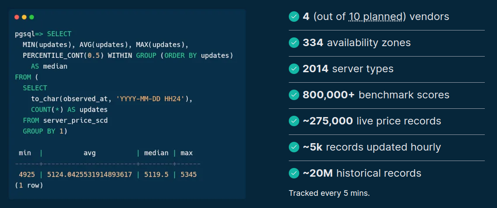
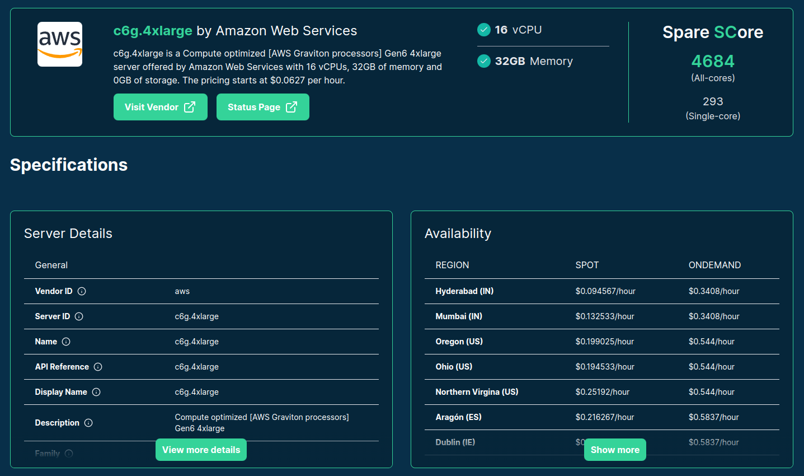
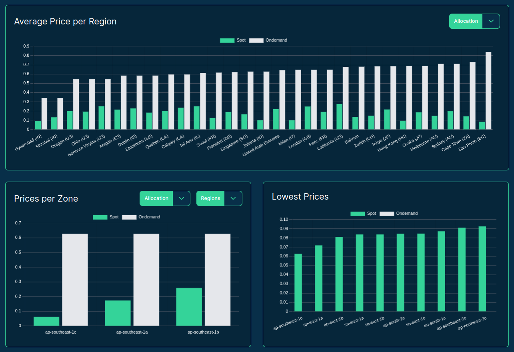

## dummy slide

<!--add custom CSS for the speaker view-->
<script>
  if (window.self !== window.top) {
    document.body.className += " speakerview";
  }
</script>

<!--javascript to remove dummy slide-->
<script>
document.getElementById("dummy-slide").remove();
</script>

<!--end dummy slide-->
</section>

<section id="coverslide">


<h1 class="subtitle" style="color:#eee;font-size:1.75em;text-align: center; margin-top:325px; color:#34d399;">
  From idea to product:<br />creating Spare Cores
</h1>

<h2 class="author" style="color:#eee;padding-top:15px;font-size:1.25em;text-align: center !important;margin-bottom: 0px;">
  Gergely Daróczi
</h2>

<h3 class="author" style="color:#eee;font-size:1.1em;text-align: center !important; font-weight: normal;">
  Jan 10, 2025
</h3>

<h3 class="author onlineMode" style="color:#eee;padding-top:25px;font-size:1.1em;text-align: center !important; padding-top: 10px;font-weight: normal; ">
  Slides: <a href="https://sparecores.com/talks" target="_blank">sparecores.com/talks</a>
</h3>

<p class="author offlineMode" style="color:#eee;font-size:0.75em;text-align: right !important; padding-top: 10px;font-weight: normal;margin-top:30px; ">
  Press Space or click the green arrow icons to navigate the slides ->
</p>

<div class="notes">
focus: how to utilize cloud compute resources in the most cost-efficient way
using our open-source tools and data
</div>

</section>

<section>
<section class="titleslide slide level1" data-transition="slide-in fade-out">
  <h2>&#62;&#62;&#62; from sparecores import why</h2>

<p class="fragment">Data Science / Machine Learning batch jobs:</p>

<ul>
  <li class="fragment">run SQL</li>
  <li class="fragment">run R or Python script</li>
  <ul>
    <li class="fragment">train a simple model, reporting, API integrations etc.</li>
    <li class="fragment">train hierarchical models/GBMs/neural nets etc.</li>
  </ul>
</ul>

<div class="notes">
I've been working as a DS/Dir of Analytics/Sr Dir of Data Ops in the past decade,
responsible for the DS infrastructure to run various algorithm, e.g.

- SQL: lightweight on the client side
- scripts: can be lightweight as well (e.g. API integrations or simple models),

BUT might require a lot of compute resource depending on the type of the model
</div>

## >>> from sparecores import why {data-transition="fade-in slide-out"}

<p class="gray">Data Science / Machine Learning batch jobs:</p>

<ul class="gray">
  <li>run SQL</li>
  <li>run R or Python script</li>
  <ul>
    <li>train a simple model, reporting, API integrations etc.</li>
    <li>train hierarchical models/GBMs/neural nets etc.</li>
  </ul>
</ul>

<p class="bold">Scaling (DS) infrastructure.</p>

<div class="notes">
in short, different tasks (DS in this example) have different compute requirements

NEXT after mentioning varying needs
</div>

## >>> from sparecores import why

::: {.centered}

:::

<div class="notes">
so we had around 4k jobs/day with varying needs

- Training hierarchical models on a large dataset using R required several hundreds GBs of RAM,
- NLP models in Python required GPUs,
- Parallelized time-series forecasting models required many CPUs,
- Many small jobs mostly waiting for SQL results running on a shared host.
- or submitting new bid amounts on ads on a social network
</div>

## >>> from sparecores import why

::: {.centered}

:::

<div class="notes">
To give you an example: here's a job that we monitored every few seconds and saw that it doesn't really scale to multiple CPUs, but taking up to ~200 gigs of memory -- probably training a hierarchical model that cannot be paralellized.

so we had around 4k/day ...
</div>

## >>> from sparecores import why

::: {.colcontainer .mt-60}
:::: {.col}

<p class="fragment mt--20 centered" data-fragment-index="1">AWS ECS</p>

<p class="fragment mt--20 centered" data-fragment-index="2">AWS Batch</p>
::::
:::: {.col}

<p class="fragment mt--20 centered" data-fragment-index="3" >Kubernetes</p>
::::
:::

<div class="notes">
to solve for that, at some point we used Amazon ECS ...
super excited when AWS Batch was announces with the promise of managing the clusters for us

... similarly how other teams got excited about Kubernetes

AWS Batch seemed like a good fit and relatively convenient solution,
but after a few months trial, we experienced unexpected costs
due to developers misconfiguring resource requirements

- overprovisioning to avoid errors
- forgot to update etc

and bin packing ...
</div>

## >>> from sparecores import why

::: {.centered}

:::

<p class="centered mt--20">Source: <a href="https://xkcd.com/2740/">xkcd</a></p>

<div class="notes">
AWS bin packing smaller jobs to already running larger nodes (started for heavy jobs), which resulted in keeping the expensive nodes running for a longer time.

so instead, we decided to roll our own solution after all .. building on the fact that the price of the cloud resources is not discounted by its size .. so running two containers on a larger node VS running on separate nodes make no difference from a pricing perspective
</div>

## >>> from sparecores import why

::: {.centered}

:::

<div class="notes">
here's an example of a job for which our monitoring system recorded that it can scale to many (100) CPUs, and needs high memory ... so filtered for the matching servers and ordered by price, and tried starting those based on availability
</div>

## >>> from sparecores import why {data-transition="slide-in none-out"}

::: {.centered}

:::

<div class="notes">
once the job finished, it updated the compute resource requirements, job status etc
and retries if more compute is needed
</div>

## >>> from sparecores import why {data-transition="none-in slide-out"}

::: {.centered}

:::

::: {.centered}

:::

## >>> from sparecores import why

<p class="bold">Other use-cases:</p>

- stats/ML/AI model training,
- ETL pipelines,
- traditional CI/CD workflows for compiling and testing software,
- building Docker images,
- rendering images and videos,
- etc.

<div class="notes">
so it's like AWS Fargate or Google Cloud Run ... but with auto-scaling and much much cheaper, especially while AWS supported spot instances with blocked duration (until a couple of months ago)

as it seemed useful for many use-cases, we decided and were supported to open-source most of the infra tooling ...
</div>

## >>> from sparecores import why

::: {.centered}

:::

::: {.centered}

:::

<div class="notes">
was released as "cloudperf" a couple years ago, and the team has been maintaining it since then

BUT, it was limited to a single vendor, we also had some new ideas, so it was time to build the next generation ... called Spare Cores, which started thanks to the generous support of the NGI Search project.
</div>

</section></section>


<section>
<section class="titleslide slide level1">
  <h2>&#62;&#62;&#62; from sparecores import support</h2>

::: {.centered}

:::

<aside class="notes">
TODO
</aside>


</section></section>

<section>
<section class="titleslide slide level1">
  <h2>&#62;&#62;&#62; from sparecores import intro</h2>

* Open-source tools, database schemas and documentation to inspect and inventory cloud vendors and their compute resource offerings.

. . .

* Managed infrastructure, databases, APIs, SDKs, and web applications to make these data sources publicly accessible.

. . .

* Helpers to start and manage instances in your own environment.

. . .

* SaaS to run containers in a managed environment without direct vendor engagement.

<aside class="notes">
- so Spare Cores is an open-source ecosystem, including software, database schemas, guides,
- and actual databases if you don't want to run the ETL tooling yourself .. also providing APIs, SDKs etc to make it easier to query data
- unified CLI to start machines
- and working on an an optional SaaS offering built on the top of the open-source tooling for folks who would rather avoid registering with all cloud providers etc: give us a Docker image, a command to run, and you credit card .. all set, we will run it wherever it's cheapest.

We help DevOps, DS, ML, AI, ETL, AV, and other engineering teams to find optimal instances for their batch jobs (e.g. “8 CPU cores, 64 GB of RAM, and a TPU needed in an EU datacenter to train ML models for 6 hours”) by providing:

* Open-source tools, database schemas and documentation to monitor cloud and flexible VPS/dedicated server vendors and their compute resource offerings in an innovative and truly comparative way, including vendor details (e.g. location, certificates, green power), compute capabilities (e.g. CPU, memory, GPU/TPU), pricing (especially of spot instances), and performance (by running task-specific benchmarks).
* Managed infrastructure, databases, APIs, SDKs, and web applications to make these continuously and transparently tracked data sources publicly available and comparable in a validated, unbiased, structured, and searchable manner.
* Helpers to easily start and manage instances at all the supported vendors with a standardized API.
* SaaS

BUT let's focus on the open-source and open-data components ..
</aside>

## >>> from sparecores import intro



<p class="centered" style="margin-top: -10px;">Source: <a href="https://sparecores.com">sparecores.com</a></p>

<aside class="notes">
<!-- TODO update img with no of benchmarks instead of AZs -->
To show you some stats on the data being tracked:
- we are limited to 3 vendors now, but in a month or two we should have a coverage of all major players,
- already tracking X servers ...
</aside>

## >>> from sparecores import intro

::: {.centered}

:::

<aside class="notes">
The easiest way to query this data is through our web component, as you can see on the screen ...
</aside>

## >>> from sparecores import intro

::: {.centered}

:::

<aside class="notes">
Clicking on a server shows you the technical details of the instance -- much more than what's provided publicly by the vendor, even more than what ChatGPT knows ... as we actually start each machine and inspect the hardware. More on that later.
</aside>

## >>> from sparecores import intro

::: {.centered}

:::

<aside class="notes">
Live and historical pricing
</aside>

## >>> from sparecores import intro

<!-- https://sparecores.com/server/aws/c5d.2xlarge -->

::: {.centered}

:::

<aside class="notes">
and we also run benchmark scenarios on the servers, e.g.:

- memory bandwidth of read, write and mixed operations using various block sizes and also including the related L1/L2/L3 cache amounts
- or benchmarking compression algos - having the compression ratio on the x axis, and the bandwidth on the y axis, it's clear that `zpaq` is a beast when it comes to compressing text, but might be slow on this machine
- OpenSSL hash functions and block ciphers
</aside>

## >>> from sparecores import intro


<aside class="notes">
also running Geekbench 6, which has been a standard tool for some time including workloads for text and image processing, compiling software etc
</aside>

## >>> from sparecores import intro

::: {.centered}

:::

<!-- https://sparecores.com/compare?instances=W3sidmVuZG9yIjoiYXdzIiwic2VydmVyIjoiYzVhZC4xMnhsYXJnZSJ9LHsidmVuZG9yIjoiYXdzIiwic2VydmVyIjoiYzVkLjJ4bGFyZ2UifSx7InZlbmRvciI6ImF3cyIsInNlcnZlciI6ImM2Zy4xNnhsYXJnZSJ9LHsidmVuZG9yIjoiaGNsb3VkIiwic2VydmVyIjoiY2N4MzMifV0%3D -->
<aside class="notes">
and making all these data available in comparison tables
</aside>

## >>> from sparecores import intro

::: {.centered}

:::

<aside class="notes">
or plots as well for human inspection
</aside>


## >>> from sparecores import intro

::: {.centered}

:::

<aside class="notes">
for computers, we provide APIs ...
</aside>

## >>> from sparecores import intro

```py
>>> from rich import print as pp
>>> from sc_crawler.tables import Server
>>> from sqlmodel import create_engine, Session, select
>>> engine = create_engine("sqlite:///sc-data-all.db")
>>> session = Session(engine)
>>> server = session.exec(select(Server).where(Server.server_id == 'g4dn.xlarge')).one()
>>> pp(server)
Server(
    server_id='g4dn.xlarge',
    vendor_id='aws',
    display_name='g4dn.xlarge',
    api_reference='g4dn.xlarge',
    name='g4dn.xlarge',
    family='g4dn',
    description='Graphics intensive [Instance store volumes] [Network and EBS optimized] Gen4 xlarge',

    status=<Status.ACTIVE: 'active'>,
    observed_at=datetime.datetime(2024, 6, 6, 10, 18, 4, 127254),

    hypervisor='nitro',
    vcpus=4,
    cpu_cores=2,
    cpu_allocation=<CpuAllocation.DEDICATED: 'Dedicated'>,
    cpu_manufacturer='Intel',
    cpu_family='Xeon',
    cpu_model='8259CL',
    cpu_architecture=<CpuArchitecture.X86_64: 'x86_64'>,
    cpu_speed=3.5,
    cpu_l1_cache=None,
    cpu_l2_cache=None,
    cpu_l3_cache=None,
    cpu_flags=[],

    memory_amount=16384,
    memory_generation=<DdrGeneration.DDR4: 'DDR4'>,
    memory_speed=3200,
    memory_ecc=None,

    gpu_count=1,
    gpu_memory_min=16384,
    gpu_memory_total=16384,
    gpu_manufacturer='Nvidia',
    gpu_family='Turing',
    gpu_model='Tesla T4',
    gpus=[
        {
            'manufacturer': 'Nvidia',
            'family': 'Turing',
            'model': 'Tesla T4',
            'memory': 15360,
            'firmware_version': '535.171.04',
            'bios_version': '90.04.96.00.A0',
            'graphics_clock': 1590,
            'sm_clock': 1590,
            'mem_clock': 5001,
            'video_clock': 1470
        }
    ],

    storage_size=125,
    storage_type=<StorageType.NVME_SSD: 'nvme ssd'>,
    storages=[{'size': 125, 'storage_type': 'nvme ssd'}],

    network_speed=5.0,
    inbound_traffic=0.0,
    outbound_traffic=0.0,
    ipv4=0,
)
```

<aside class="notes">
and SDKs as well, e.g. querying the details of this instance type: SCROLL through!
</aside>

</section></section>

<section>
<section class="titleslide slide level1">
  <h2>&#62;&#62;&#62; sparecores.\_\_dir\_\_()</h2>


<aside class="notes">
As mentioned previously, this is made available via multiple components that I'd like to walk through in the next slides.
</aside>

</section></section>

<section>
<section class="titleslide slide level1" data-transition="slide-in none-out">
  <h2>&#62;&#62;&#62; input("Biggest challenge?")</h2>

::: {.centered}

:::

## >>> input("Biggest challenge?") {data-transition="none-in slide-out"}

::: {.centered}

:::

<aside class="notes">
Never imagined we would be hitting the "quote update request quota" 🤐

Quite an achievement!
</aside>

## >>> input("Why not use ChatGPT?!") {data-transition="slide-in none-out"}

::: {.centered}

:::

## >>> input("Why not use ChatGPT?!") {data-transition="none-in slide-out"}

::: {.centered}

:::
## >>> input("Burned 150k on this?!")

::: {.centered}

:::

## >>> from sc_crawler import pricing

- No way to find SKUs by filtering in the API call. Get all, search locally.

. . .

- `f1-micro` is one out of 2 instances with simple pricing.

    - For other instances, lookup SKUs for CPU + RAM and do the math.

. . .

- Match instance family with SKU via search in description, e.g. `C2D`.

. . .

- Except for `c2`, which is  called “Compute optimized”.

. . .

- And `m2` is actually priced at a premium on the top of `m1`.

. . .

- The `n1` resource group is not CPU/RAM, but `N1Standard`, extract if it’s CPU or RAM price from description.

<aside class="notes">
Anyone from Google here today?

- Great, because I have some examples to share.
- Okay, I'll politely avoid naming which vendor might have one of the most interestingly implemented pricing schema ...

2 x 2 numbers .. don't ask ChatGPT to do that for you!!!

,,,

m2 pricing: look up m1 cpu/ram pricing + add the premium skus and do the math (2 times 2 numbers added and multiplied – involving 5 api lookups)

Don’t bother with zones reported that are not existing (us-west8 on May 22 .. edge network?)

it's a mess ...

okay, enough horror stories. beleive me ... it's good to have a standardize database schema and data
</aside>

## >>> import sc_data

::: {.centered}

:::

<p class="centered mt--30">Source: <a href="https://dbhub.io/sparecores/sc-data-priceless.db">dbhub.io/sparecores</a></p>

<aside class="notes">
so I'm super happy to introduce this cleaned up dataset to you all, which is actually another component of the SC ecocystem, as we license all our software by MPL, but the data by creative commons attribution/share-alike
</aside>

</section></section>

<section>
<section class="titleslide slide level1" data-transition="slide-in none-out">
  <h2>&#62;&#62;&#62; from sparecores import team</h2>

::: {.colcontainer .mt-60 .centered}
:::: {.col}

<p class="bold mt-0">@bra-fsn</p>
::::
:::: {.col}

<p class="bold mt-0">@palabola</p>
::::
:::: {.col}

<p class="bold mt-0">@daroczig</p>
::::
:::

<aside class="notes">
TODO
</aside>

## >>> from sparecores import team  {data-transition="none-in slide-out"}

::: {.colcontainer .mt-60 .centered}
:::: {.col}

<p class="bold mt-0">@bra-fsn</p>
<p class="mt-0">Infrastructure and Python veteran.</p>
::::
:::: {.col}

<p class="bold mt-0">@palabola</p>
<p class="mt-0">Guardian of the front-end and Node.js tools.</p>
::::
:::: {.col}

<p class="bold mt-0">@daroczig</p>
<p class="mt-0">Hack of all trades, master of <code>NaN</code>.</p>
::::
:::

<aside class="notes">
TODO
</aside>


</section></section>

<section>
<section class="titleslide slide level1" data-transition="slide-in none-out">
    <!-- https://carbon.now.sh/?bg=rgba%288%2C47%2C73%2C1%29&t=theme%3A0bcewbfyk9yl&wt=none&l=python&width=680&ds=false&dsyoff=20px&dsblur=68px&wc=true&wa=true&pv=5px&ph=5px&ln=false&fl=1&fm=Hack&fs=18px&lh=161%25&si=false&es=2x&wm=false&code=%253E%253E%253E%2520import%2520os%250A%253E%253E%253E%2520import%2520signal%250A%253E%253E%253E%2520os.kill%28os.getpid%28%29%252C%2520signal.SIGKILL%29%2520%2520%250A%250A%253E%253E%253E%2520visit_booth_in_person%28%27C20%27%29%250A%253E%253E%253E%2520browse%28%27https%253A%252F%252Fsparecores.com%27%29%250A%253E%253E%253E%2520email%28%27daroczig%2540sparecores.com%27%29%250A%253E%253E%253E%2520follow%28%27%2540SpareCores%27%29%250A%250A%253E%253E%253E%2520os._exit%28status%253D0%29%250AProcess%2520finished%2520at%252013%253A00%253A00%2520%28Dec%25204%252C%25202024%29%2520 -->

::: {.centered}

:::

<aside class="notes">
TODO
</aside>

</section>
<section data-transition="none">

::: {.centered}

:::

<aside class="notes">
TODO
</aside>

</section>
<section data-transition="none">

::: {.centered}

:::

<p class="author offlineMode" style="color:#eee;font-size:0.75em;text-align: center !important; margin-top:-40px; padding-top:0px;">
  Slides: <a href="https://sparecores.com/talks" target="_blank">sparecores.com/talks</a>
</p>

<aside class="notes">
TODO
</aside>

</section>

<!--toggle visibility of items in live mode-->
<script>
var url = document.location.href;
if (url.match("/?live")) {
  const elements = document.getElementsByClassName('offlineMode');
  for (let i = 0; i < elements.length; i++) {
    element = elements.item(i);
    element.style.display = 'none';
  }
} else {
  const elements = document.getElementsByClassName('onlineMode');
  for (let i = 0; i < elements.length; i++) {
    element = elements.item(i);
    element.style.display = 'none';
  }
}
</script>

