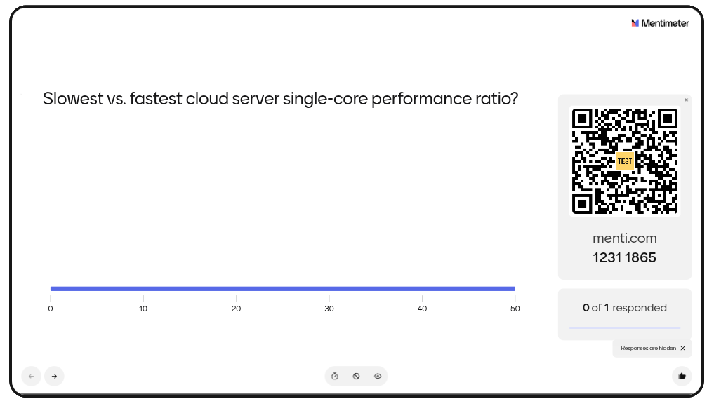
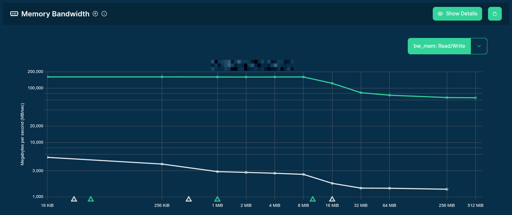
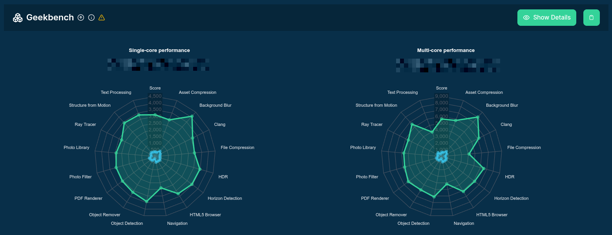
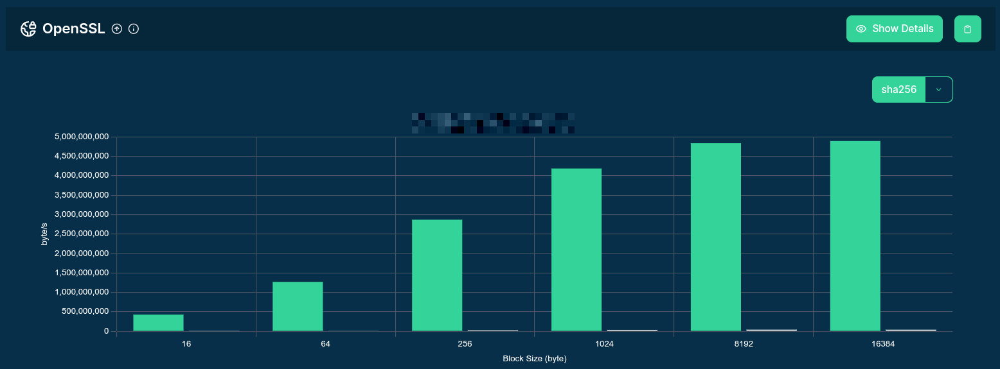
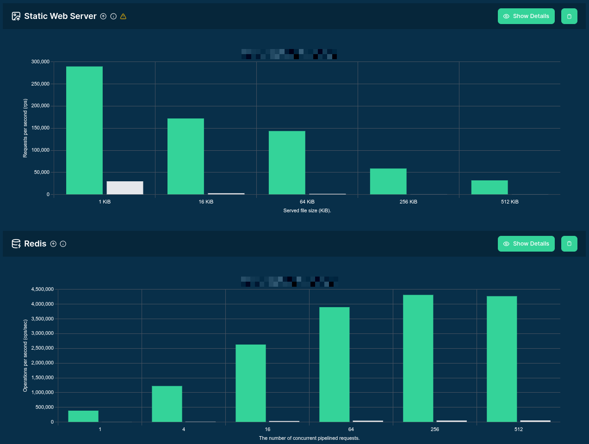
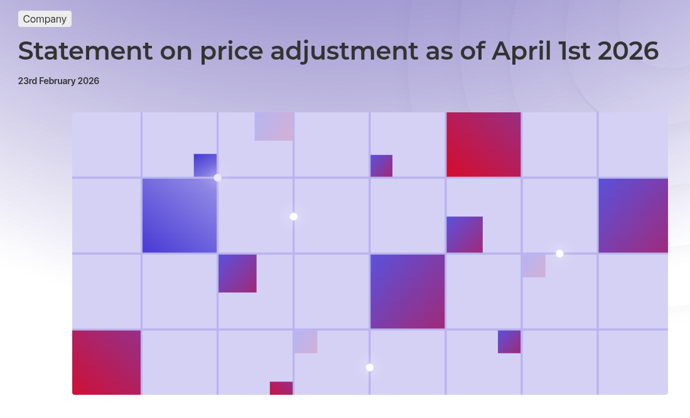
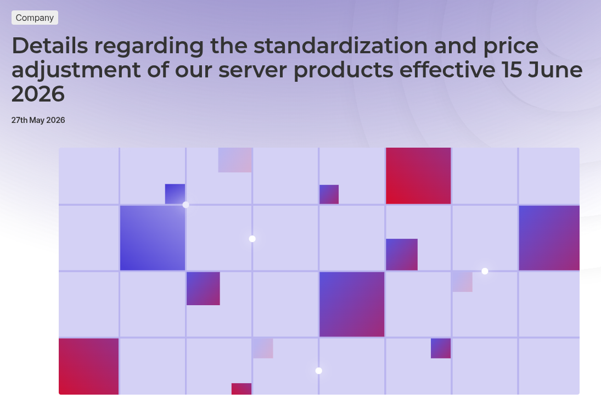

# {#cover-slide}

<script>
  // add custom CSS for the speaker view
  if (window.self !== window.top) {
    document.body.className += " speakerview";
  }
  // remove dummy slide
  document.getElementById("title-slide").remove();
</script>

::: {.centered}

:::

<h1 class="subtitle" style="color:#eee;font-size:1.25em;text-align: center; margin-top:300px; color:#34d399;">
  The Cloud Performance Map:<br />How Hetzner Ranks<br />Among 5,000 Instance Types
</h1>

<h2 class="author" style="color:#eee;padding-top:65px;font-size:0.9em;text-align: center !important;margin-bottom: 0px;">
  Gergely Daroczi, Spare Cores
</h2>

<h3 class="author" style="color:#eee;padding-top: 2px; font-size:0.9em;text-align: center !important; font-weight: normal;">
  Sep 17, 2026 @ Falkenstein, Germany
</h3>

<h3 class="author onlineMode" style="color:#eee;padding-top:65px;font-size:0.9em;text-align: center !important; padding-top: 10px;font-weight: normal; ">
  Slides: <a href="https://sparecores.com/talks" target="_blank">sparecores.com/talks</a>
</h3>

<p class="author offlineMode" style="color:#eee;font-size:0.75em;text-align: right !important; padding-top: 0px;font-weight: normal;margin-top:30px; ">
  Press Space or click the green arrow icons to navigate the slides ->
</p>

::: {.notes}
Hi, I'm Gergely from the Spare Cores team,
and we are an open-source project for cloud transparency, because
:::

# {#vcpu transition="convex-in slide-out"}  

::: {.notes}
WHAT THE HECK is a virtual CPU?!

There's a conceptual uncertainty and visibility problem here,
as a vCPU could range from an overprovisioned, poor-performing thread with saturated bandwidth to memory,
versus a dedicated CPU core of a state-of-the-art server -- with massive CPU cache and high memory bandwidth.

Which means your R or Python script runs on the same number of vCPUs e.g. 10x faster or slower.
:::

::: {.centered}
<div style="position: relative; display: inline-block; margin-top: -45px;">
  
  <video autoplay muted loop playsinline data-autoplay
         src="images/vincent-confused.webm"
         style="position: absolute; left: 45%; bottom: 1.5%;
                transform: translateX(-50%); width: 50%;
                background: transparent; pointer-events: none;">
  </video>
</div>
:::

## {#vcpu-benchmarking transition="slide-in slide-out"}

::: {.notes}
We solve this visibility problem by burning hundreds of thousands of dollars
(most recently $20k over a single weekend) to
start servers, measure performance, and calculate cost-efficiency,
then publish these results and related tooling with open licenses,
so that you can save money by optimizing your cloud spend.
:::

::: {.centered}
<video autoplay muted loop playsinline data-autoplay
       src="images/launching-benchmarks.webm"
       style="width: 90%; margin-top: 45px;">
</video>
<p style="font-size: 0.8em; text-align: center; margin-top: 10px;">
  Credit: <a href="https://thecodinglove.com/when-i-launch-a-benchmark" target="_blank">the_coding_love / When I launch a benchmark</a>
</p>
:::

## {#vcpu-guess .center}

::: {.notes}
TODO
TODO stress ng div16
:::

FIXME menti iframe doesn't work?

::: {.r-stretch}
<div style='position: relative; padding-bottom: 56.25%; padding-top: 35px; height: 0; overflow: hidden;'>
  <iframe sandbox='allow-popups allow-scripts allow-same-origin allow-presentation'
    allowfullscreen='true' allowtransparency='true' frameborder='0' height='315'
    src='https://www.mentimeter.com/app/presentation/al1uonqkhdqseq3foz4ingoib4wrxabz/embed' style='position: absolute; top: 0; left: 0; width: 100%; height: 100%;' width='420'></iframe>
</div>
:::

foo

::: {.r-stretch}
<a href="https://www.mentimeter.com/app/presentation/al1uonqkhdqseq3foz4ingoib4wrxabz/edit?question=m9sg4eideek3" target="_blank">
  
</a>
:::

## {#vcpu-diff-0 .center}

<table style="font-size: 2rem; margin-left: auto; margin-right: auto;">
  <thead>
    <tr style="background-color: #06263A;">
      <th></th>
      <th class="centered">Server A</th>
      <th class="centered">Server B</th>
    </tr>
  </thead>
  <tbody>
    <tr class="fragment">
      <td style="background-color: #06263A;">Vendor</td>
      <td class="centered">Hyperscaler</td>
      <td class="centered">Hyperscaler</td>
    </tr>
    <tr class="fragment">
      <td style="background-color: #06263A;">Server SKU</td>
      <td class="centered">👻</td>
      <td class="centered">👻</td>
    </tr>
    <tr class="fragment">
      <td style="background-color: #06263A;">vCPUs</td>
      <td class="centered">2</td>
      <td class="centered">2</td>
    </tr>
    <tr class="fragment">
      <td style="background-color: #06263A;">Physical cores</td>
      <td class="centered">1</td>
      <td class="centered">2</td>
    </tr>
    <tr class="fragment">
      <td style="background-color: #06263A;">CPU allocation</td>
      <td class="centered">Shared</td>
      <td class="centered">Dedicated</td>
    </tr>
    <tr class="fragment">
      <td style="background-color: #06263A;">CPU (turbo) frequency</td>
      <td class="centered">2.2 GHz</td>
      <td class="centered">5.0 GHz</td>
    </tr>
    <tr class="fragment">
      <td style="background-color: #06263A;">CPU L1D cache</td>
      <td class="centered">32 KiB</td>
      <td class="centered">96 KiB</td>
    </tr>
    <tr class="fragment">
      <td style="background-color: #06263A;">Memory</td>
      <td class="centered">1 GiB</td>
      <td class="centered">8 GiB</td>
    </tr>
    <tr class="fragment">
      <td style="background-color: #06263A;">Single-core SCore</td>
      <td class="centered">133</td>
      <td class="centered">4,645</td>
    </tr>
    <tr class="fragment">
      <td style="background-color: #06263A;">Performance ratio</td>
      <td class="centered" colspan="2" style="font-weight: bold;">x34.92481</td>
    </tr>
  </tbody>
</table>


## {#vcpu-diff-1 .center}

{.r-stretch fig-align="center"}

::: {.notes}
TODO
:::

## {#vcpu-diff-2 .center}

{.r-stretch fig-align="center"}

::: {.notes}
TODO
:::

## {#vcpu-diff-3 .center}

{.r-stretch fig-align="center"}

::: {.notes}
TODO
:::

## {#vcpu-diff-4 .center}

{.r-stretch fig-align="center"}

::: {.notes}
TODO
:::

## {#vcpu-difference transition="slide-in slide-out"}  

::: {.notes}
TODO
:::

::: {.centered}
<div style="position: relative; display: inline-block; margin-top: -45px;">
  
  <video autoplay muted loop playsinline data-autoplay
         src="images/vincent-confused.webm"
         style="position: absolute; left: 45%; bottom: 1.5%;
                transform: translateX(-50%); width: 50%;
                background: transparent; pointer-events: none;">
  </video>
</div>
:::

## {#vcpus-2-count .center}

::: {.notes}

There's quite a spectrum even when just looking at the 2 vCPU options ...
FTR there are 611 instance types with 2 vCPUs ... we monitor 8 vendors (logos on prior slide).

TODO

FTR there are 611 instance types with 2 vCPUs across the 8 vendors we monitor.
Click the chart to zoom out and reveal the answer.
:::

::: {.r-stretch}
<div class="vcpu-count-slide-content">
<div class="vcpu-count-wrapper">
  <object type="image/svg+xml"
          data="images/vcpu-2-count-chart.svg"
          class="r-stretch vcpu-count-chart"
          aria-label="Guess the number of 2 vCPU servers at the supported vendors. Click to reveal 611.">
  </object>
</div>

```{=html}
<div class="vendor-logos" aria-label="Supported cloud vendors (alphabetical)" style="margin-top: 60px;">
  <div class="vendor-logos-row">
    
    
    
    
  </div>
  <div class="vendor-logos-row">
    
    
    
    
  </div>
</div>
```

</div>
:::

<span class="fragment vcpu-count-zoom" data-fragment-index="1"></span>

<script>
  (function () {
    function initVcpuCountSlide() {
      var reveal = window.Reveal;
      var slide = document.getElementById('vcpus-2-count');
      if (!reveal || !slide) return false;
      if (slide.dataset.vcpuCountBound) return true;

      slide.dataset.vcpuCountBound = '1';

      function getChartSvg() {
        var obj = slide.querySelector('object.vcpu-count-chart');
        if (!obj || !obj.contentDocument) return null;
        return obj.contentDocument.getElementById('vcpu-count-chart');
      }

      function syncZoom() {
        var chart = getChartSvg();
        var fragment = slide.querySelector('.vcpu-count-zoom');
        if (!chart || !fragment) return;
        chart.classList.toggle('zoomed', fragment.classList.contains('visible'));
      }

      var obj = slide.querySelector('object.vcpu-count-chart');
      if (obj) {
        obj.addEventListener('load', syncZoom);
        if (obj.contentDocument) syncZoom();
      }

      reveal.on('fragmentshown', function (event) {
        if (event.fragment && event.fragment.classList.contains('vcpu-count-zoom')) syncZoom();
      });
      reveal.on('fragmenthidden', function (event) {
        if (event.fragment && event.fragment.classList.contains('vcpu-count-zoom')) syncZoom();
      });
      reveal.on('slidechanged', function (event) {
        if (event.currentSlide && event.currentSlide.id === 'vcpus-2-count') syncZoom();
      });

      window.addEventListener('message', function (event) {
        if (event.data && event.data.type !== 'vcpu-count-click') return;
        if (!slide.classList.contains('present')) return;
        var fragment = slide.querySelector('.vcpu-count-zoom');
        if (fragment && !fragment.classList.contains('visible')) reveal.nextFragment();
      });

      return true;
    }

    if (!initVcpuCountSlide()) {
      var tries = 0;
      var timer = setInterval(function () {
        if (initVcpuCountSlide() || ++tries > 50) clearInterval(timer);
      }, 100);
    }
  })();
</script>


# {#recover}


::: {.notes}
TODO


But to the talk title: how Hetzner ranks among 5,000 instance types?

TODO how awesome it is to have a session at a datacenter .. thank you!

So I might be a bit biased :) 

TODO was not only pumped because of this, but at the time I was
invited to present here, I was working on my slides for a
PyData conference and saw some interesting patterns that
were super relevant and got me excited to share with this group.


:::

::: {.centered}

:::

<h1 class="subtitle" style="color:#eee;font-size:1.25em;text-align: center; margin-top:300px; color:#34d399;">
  The Cloud Performance Map:<br />How Hetzner Ranks<br />Among 5,000 Instance Types
</h1>


## {#pydata-london}

```sh {code-line-numbers="6-24|7-8|11-12|14-21|23-24|26-54|26-38,40-42,44-54|26-38,40-42,44-54|26-28,39,43,54|56-74|62|76-104|109-110" data-fragment-index="0" style="font-size:24px; margin-top: 20px !important; height: 640px;"}
$ sqlite3 spare-cores-navigator.db
SQLite version 3.46.1
Enter ".help" for usage hints.

sqlite> .mode table
sqlite> WITH prices AS (
  SELECT vendor_id, server_id, ROUND(AVG(price), 2) AS price FROM server_price
  WHERE allocation = 'ONDEMAND' GROUP BY vendor_id, server_id
),
workload AS (
  SELECT DISTINCT vendor_id, server_id, score FROM benchmark_score
  WHERE benchmark_id = 'llm_speed:text_generation' AND config = '{"model": "Llama-3.3-70B-Instruct-Q4_K_M.gguf", "tokens": 128}'
)
SELECT
  vendor_id, api_reference,
  vcpus, memory_amount/1024 AS memory, gpu_count, gpu_model, gpu_memory_total/1024 AS VRAM,
  ROUND(score, 2) AS score, price, ROUND(score / price, 4) AS "$ efficiency",
  ROUND(price / (score * 60 * 60 / 1_000_000 ), 4) AS "$ per 1M token"
FROM server
LEFT JOIN prices USING (vendor_id, server_id)
LEFT JOIN workload USING (vendor_id, server_id)
WHERE score IS NOT NULL
ORDER BY 11 ASC
LIMIT 25;

+-----------+--------------------------+-------+--------+-----------+--------------+------+-------+-------+--------------+----------------+
| vendor_id |      api_reference       | vcpus | memory | gpu_count |  gpu_model   | VRAM | score | price | $ efficiency | $ per 1M token |
+-----------+--------------------------+-------+--------+-----------+--------------+------+-------+-------+--------------+----------------+
| gcp       | a2-ultragpu-1g           | 12    | 170    | 1.0       | A100         | 80   | 24.47 | 1.36  | 17.9959      | 15.4356        |
| gcp       | a2-highgpu-2g            | 24    | 170    | 2.0       | A100         | 80   | 22.39 | 1.82  | 12.3027      | 22.5786        |
| ovh       | t2-le-90                 | 30    | 90     | 2.0       | V100S        | 64   | 18.65 | 1.6   | 11.6566      | 23.8301        |
| ovh       | t2-90                    | 30    | 90     | 2.0       | V100S        | 64   | 18.63 | 1.6   | 11.6414      | 23.8612        |
| ovh       | l40s-90                  | 15    | 90     | 1.0       | L40S         | 48   | 15.72 | 1.4   | 11.2273      | 24.7414        |
| ovh       | h100-380                 | 30    | 380    | 1.0       | H100         | 80   | 29.12 | 2.8   | 10.4015      | 26.7055        |
| gcp       | a2-ultragpu-2g           | 24    | 340    | 2.0       | A100         | 160  | 24.17 | 2.71  | 8.9172       | 31.1507        |
| ovh       | a10-90                   | 60    | 85     | 2.0       | A10          | 48   | 10.67 | 1.52  | 7.018        | 39.581         |
| ovh       | rtx5000-84               | 16    | 84     | 3.0       | RTX 5000     | 48   | 7.46  | 1.08  | 6.9072       | 40.2154        |
| aws       | g7e.4xlarge              | 16    | 128    | 1.0       | RTX Pro 6000 | 96   | 31.01 | 4.73  | 6.5553       | 42.3744        |
| hcloud    | ccx53                    | 32    | 128    | 0.0       |              |      | 2.36  | 0.38  | 6.2082       | 44.744         |
| ovh       | t1-le-180                | 32    | 180    | 4.0       | V100         | 64   | 16.77 | 2.8   | 5.9908       | 46.3677        |
| ovh       | t2-le-180                | 60    | 180    | 4.0       | V100S        | 128  | 18.53 | 3.2   | 5.792        | 47.9588        |
| ovh       | l40s-180                 | 30    | 180    | 2.0       | L40S         | 96   | 15.56 | 2.8   | 5.5579       | 49.9788        |
| hcloud    | ccx63                    | 48    | 192    | 0.0       |              |      | 3.19  | 0.58  | 5.4999       | 50.5062        |
| gcp       | a2-highgpu-4g            | 48    | 340    | 4.0       | A100         | 160  | 19.59 | 3.65  | 5.3683       | 51.7444        |
| gcp       | g2-standard-24           | 24    | 96     | 2.0       | L4           | 44   | 5.73  | 1.07  | 5.3593       | 51.8306        |
| ovh       | h100-760                 | 60    | 760    | 2.0       | H100         | 160  | 29.48 | 5.6   | 5.2637       | 52.7723        |
| aws       | g7e.8xlarge              | 32    | 256    | 1.0       | RTX Pro 6000 | 96   | 31.02 | 6.24  | 4.9709       | 55.8813        |
| azure     | Standard_NC24ads_A100_v4 | 24    | 220    | 1.0       | A100         | 80   | 23.05 | 4.71  | 4.8934       | 56.7656        |
| aws       | g6e.4xlarge              | 16    | 128    | 1.0       | L40S         | 44   | 15.91 | 3.44  | 4.6237       | 60.0765        |
| ovh       | l4-180                   | 45    | 180    | 2.0       | L4           | 48   | 5.78  | 1.5   | 3.8532       | 72.0904        |
| gcp       | a2-ultragpu-4g           | 48    | 680    | 4.0       | A100         | 320  | 20.78 | 5.42  | 3.8343       | 72.4462        |
| ovh       | a10-180                  | 120   | 170    | 4.0       | A10          | 96   | 10.73 | 3.04  | 3.528        | 78.7359        |
| ovh       | a10-45                   | 30    | 42     | 1.0       | A10          | 24   | 2.39  | 0.76  | 3.1439       | 88.3539        |
+-----------+--------------------------+-------+--------+-----------+--------------+------+-------+-------+--------------+----------------+

sqlite> WITH prices AS (
  SELECT vendor_id, server_id, ROUND(AVG(price), 2) AS price FROM server_price
  WHERE allocation = 'ONDEMAND' GROUP BY vendor_id, server_id
),
workload AS (
  SELECT DISTINCT vendor_id, server_id, score FROM benchmark_score
  WHERE benchmark_id = 'llm_speed:text_generation' AND config = '{"model": "gemma-2b.Q4_K_M.gguf", "tokens": 128}'
)
SELECT
  vendor_id, api_reference,
  vcpus, memory_amount/1024 AS memory, gpu_count, gpu_model, gpu_memory_total/1024 AS VRAM,
  ROUND(score, 2) AS score, price, ROUND(score / price, 4) AS "$ efficiency",
  ROUND(price / (score * 60 * 60 / 1_000_000 ), 4) AS "$ per 1M token"
FROM server
LEFT JOIN prices USING (vendor_id, server_id)
LEFT JOIN workload USING (vendor_id, server_id)
WHERE score IS NOT NULL
ORDER BY 11 ASC
LIMIT 25;

+-----------+-----------------------+-------+--------+-----------+-----------+------+--------+-------+--------------+----------------+
| vendor_id |     api_reference     | vcpus | memory | gpu_count | gpu_model | VRAM | score  | price | $ efficiency | $ per 1M token |
+-----------+-----------------------+-------+--------+-----------+-----------+------+--------+-------+--------------+----------------+
| hcloud    | cx33                  | 4     | 8      | 0.0       |           |      | 26.83  | 0.01  | 2682.7252    | 0.1035         |
| hcloud    | cx43                  | 8     | 16     | 0.0       |           |      | 45.35  | 0.02  | 2267.7165    | 0.1225         |
| hcloud    | cx53                  | 16    | 32     | 0.0       |           |      | 60.02  | 0.04  | 1500.5479    | 0.1851         |
| hcloud    | cx32                  | 4     | 8      | 0.0       |           |      | 12.32  | 0.01  | 1231.8573    | 0.2255         |
| hcloud    | cpx42                 | 8     | 16     | 0.0       |           |      | 53.83  | 0.05  | 1076.5084    | 0.258          |
| hcloud    | cax21                 | 4     | 8      | 0.0       |           |      | 10.31  | 0.01  | 1030.5204    | 0.2696         |
| hcloud    | cpx32                 | 4     | 8      | 0.0       |           |      | 30.75  | 0.03  | 1024.8748    | 0.271          |
| hcloud    | cpx21                 | 3     | 4      | 0.0       |           |      | 19.94  | 0.02  | 996.9937     | 0.2786         |
| hcloud    | cax31                 | 8     | 16     | 0.0       |           |      | 18.74  | 0.02  | 936.8434     | 0.2965         |
| hcloud    | cpx52                 | 12    | 24     | 0.0       |           |      | 73.21  | 0.08  | 915.1476     | 0.3035         |
| hcloud    | cpx62                 | 16    | 32     | 0.0       |           |      | 87.79  | 0.1   | 877.9221     | 0.3164         |
| hcloud    | cpx31                 | 4     | 8      | 0.0       |           |      | 26.01  | 0.03  | 866.9372     | 0.3204         |
| hcloud    | cpx22                 | 2     | 4      | 0.0       |           |      | 17.19  | 0.02  | 859.4776     | 0.3232         |
| hcloud    | cpx41                 | 8     | 16     | 0.0       |           |      | 38.09  | 0.05  | 761.7758     | 0.3646         |
| gcp       | g2-standard-4         | 4     | 16     | 1.0       | L4        | 22   | 129.61 | 0.18  | 720.0422     | 0.3858         |
| hcloud    | cx23                  | 2     | 4      | 0.0       |           |      | 6.87   | 0.01  | 686.9441     | 0.4044         |
| hcloud    | cx22                  | 2     | 4      | 0.0       |           |      | 6.24   | 0.01  | 624.3952     | 0.4449         |
| upcloud   | CLOUDNATIVE-2xCPU-4GB | 2     | 4      | 0.0       |           |      | 11.71  | 0.02  | 585.7258     | 0.4742         |
| hcloud    | cax41                 | 16    | 32     | 0.0       |           |      | 22.75  | 0.04  | 568.7028     | 0.4884         |
| hcloud    | cx42                  | 8     | 16     | 0.0       |           |      | 16.74  | 0.03  | 558.1032     | 0.4977         |
| hcloud    | cax11                 | 2     | 4      | 0.0       |           |      | 5.47   | 0.01  | 547.0548     | 0.5078         |
| hcloud    | cpx11                 | 2     | 2      | 0.0       |           |      | 4.91   | 0.01  | 490.7897     | 0.566          |
| hcloud    | ccx13                 | 2     | 8      | 0.0       |           |      | 9.69   | 0.02  | 484.6809     | 0.5731         |
| ovh       | rtx5000-28            | 4     | 28     | 1.0       | RTX 5000  | 16   | 158.95 | 0.36  | 441.5258     | 0.6291         |
| hcloud    | cpx51                 | 16    | 32     | 0.0       |           |      | 45.26  | 0.11  | 411.4147     | 0.6752         |
+-----------+-----------------------+-------+--------+-----------+-----------+------+--------+-------+--------------+----------------+


sqlite> -- Thank you, enjoy the buffet! *drops mic*
sqlite> .exit
```

<script>
  // Quarto line-highlight reads data-fragment-index from <code>, not the wrapper div.
  // Starting at 0 keeps overlay/data-fragment-index in sync with code-line-numbers steps.
  (function () {
    var slide = document.getElementById('pydata-london');
    if (!slide) return;
    slide.querySelectorAll('div.sourceCode[data-code-line-numbers]').forEach(function (div) {
      var code = div.querySelector('pre code');
      if (!code) return;
      code.setAttribute('data-fragment-index', div.getAttribute('data-fragment-index') || '0');
    });
  })();
</script>

```{=html}
<!-- fragment index 4 = 6th code-line-numbers step (23-24); show on click, hide on next -->
<div class="slide-image-overlay fragment fade-in-then-out" data-fragment-index="6">
  
</div>
```

## {#pydata-london-date-1 .center}

. . .

<a href="https://www.hetzner.com/pressroom/statement-price-adjustment/">
  
</a></p>

## {#pydata-london-date-2 .center}

<a href="https://www.hetzner.com/pressroom/standardization-and-price-adjustment-of-our-server-products/">
  
</a>

## {#pydata-london-date-3 .center}


::: {.notes}
Swallow the pill .. or other means of coping with the anxiety of the situation.

:::

::: {.centered}

<p style="font-size: 0.8em; text-align: center; margin-top: 10px;">
  Credit: 
  <a href="https://devopsreactions.tumblr.com/post/71190963508/senior-vs-junior-sysadmin-during-an-outage" target="_blank">
    DevOps Reaction / Senior vs junior sysadmin during an outage
  </a>
</p>
:::

# TODO

foo

::: {.notes}

:::

