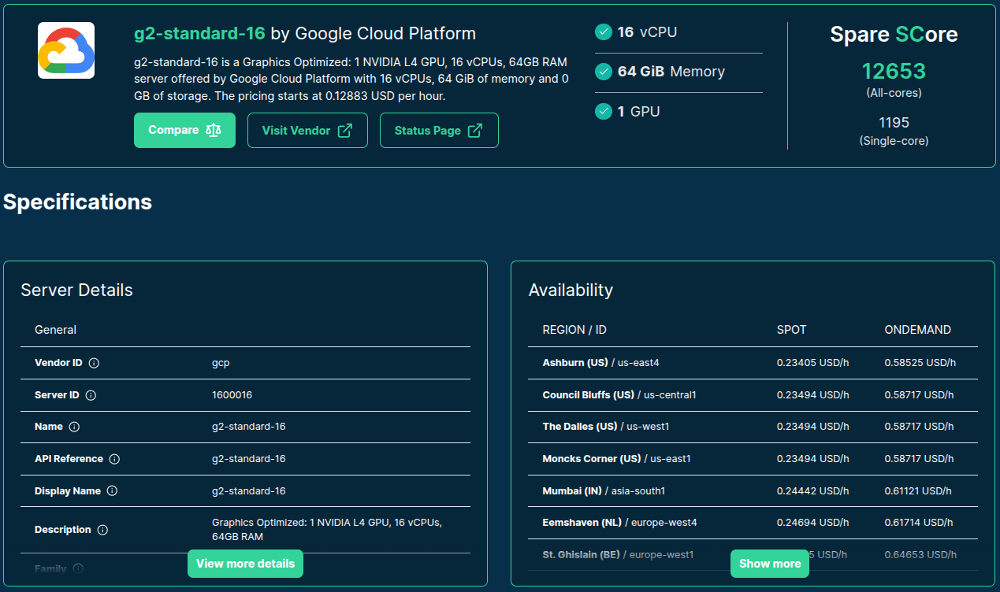
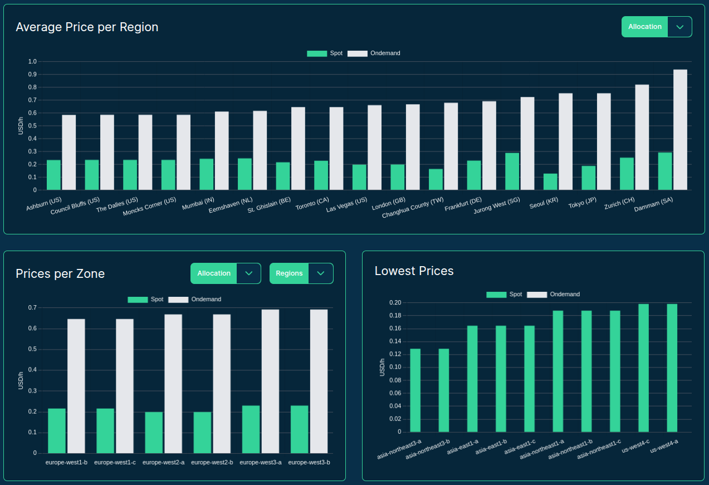
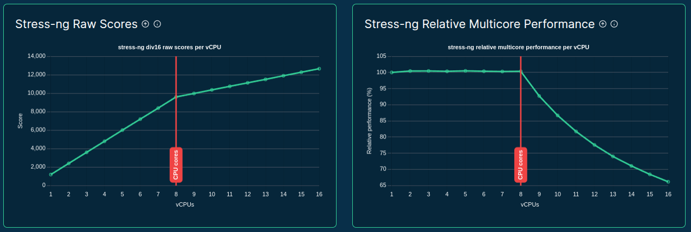

## dummy slide

<!--add custom CSS for the speaker view-->
<script>
  if (window.self !== window.top) {
    document.body.className += " speakerview";
  }
</script>

<!--javascript to remove dummy slide-->
<script>
document.getElementById("dummy-slide").remove();
</script>

<!--end dummy slide-->
</section>

<!--
TODO urls

example listing by cheapest token with min t/s requirement: http://localhost:4200/servers?benchmark_score_min=1000&order_by=selected_benchmark_score_per_price&order_dir=desc&limit=100&columns=1203848&benchmark=eyJpZCI6ImxsbV9zcGVlZDpwcm9tcHRfcHJvY2Vzc2luZyIsImNvbmZpZyI6IntcImZyYW1ld29ya192ZXJzaW9uXCI6IG51bGwsIFwibW9kZWxcIjogXCJTbW9sTE0tMTM1TS5RNF9LX00uZ2d1ZlwiLCBcInRva2Vuc1wiOiAxNn0ifQ%3D%3D
example comparison for that: http://localhost:4200/compare?instances=W3siZGlzcGxheV9uYW1lIjoiRjRhc192NiIsInZlbmRvciI6ImF6dXJlIiwic2VydmVyIjoiU3RhbmRhcmRfRjRhc192NiIsInpvbmVzUmVnaW9ucyI6W119LHsiZGlzcGxheV9uYW1lIjoicjZhLjR4bGFyZ2UiLCJ2ZW5kb3IiOiJhd3MiLCJzZXJ2ZXIiOiJyNmEuNHhsYXJnZSIsInpvbmVzUmVnaW9ucyI6W119XQ%3D%3D

TODO topics
- cloud is complex ... quiz: t4g.2xlarge vs g5.2xlarge

TODO Q&A section
- how much did we spent on this benchmark?
- do you have hex stickers?
-->


<section id="coverslide">


<h1 class="subtitle" style="color:#eee;font-size:1.75em;text-align: center; margin-top:325px; color:#34d399;">
  Starting 2000 Cloud Servers for<br />Benchmarking LLM Inference Speed
</h1>

<h2 class="author" style="color:#eee;padding-top:15px;font-size:1.25em;text-align: center !important;margin-bottom: 0px;">
  Gergely Daróczi
</h2>

<h3 class="author" style="color:#eee;font-size:1.1em;text-align: center !important; font-weight: normal;">
  Apr 24, 2025
</h3>

<h3 class="author onlineMode" style="color:#eee;padding-top:25px;font-size:1.1em;text-align: center !important; padding-top: 10px;font-weight: normal; ">
  Slides: <a href="https://sparecores.com/talks" target="_blank">sparecores.com/talks</a>
</h3>

<p class="author offlineMode" style="color:#eee;font-size:0.75em;text-align: right !important; padding-top: 10px;font-weight: normal;margin-top:30px; ">
  Press Space or click the green arrow icons to navigate the slides ->
</p>

<div class="notes">
focus: how to utilize cloud compute resources in the most cost-efficient way
using our open-source tools and data
</div>

</section>

<section>
<section class="titleslide slide level1" data-transition="slide-in fade-out">
  <h2>SYN [SEQ=0] Hi, we are Spare Cores.</h2>
  <h2 class="fragment">SYN-ACK [SEQ=1] OK .. So what?</h2>
  <h2 class="fragment">
  ACK [SEQ=2] We bring clarity to cloud server options!
  I'll tell you more!</h2>

  <h2 style="margin-top: 50px; text-align: center; font-size: 150px;">
    <span class="fragment">🤝</span>
    <span class="fragment">🍻</span>
  </h2>

<div class="notes">

We do that by collecting, generating,  standardizing and publishing pricing and performance data for cloud servers.
</div>

</section></section>

<section>
<section class="titleslide slide level1">
  <h2>&#62;&#62;&#62; from sparecores import intro</h2>

* Open-source tools, database schemas and documentation to inspect and inventory cloud vendors and their compute resource offerings.

. . .

* Managed infrastructure, databases, APIs, SDKs, and web applications to make these data sources publicly accessible.

. . .

* Helpers to start and manage instances in your own environment.

. . .

* Helpers to monitor resource usage at the system and batch task level, recommend cloud server options for future runs.

. . .

* SaaS to run containers in a managed environment without direct vendor engagement.

<aside class="notes">
- so Spare Cores is an open-source ecosystem, including software, database schemas, and guides on how to list regions, AZs, server types, pricing etc from the cloud providers;
- run hardware inspection tools and standardized benchmarks on those;
- we also provide actual databases if you don't want to run the ETL tooling yourself .. and we also maintain APIs, SDKs etc to make it easier to query data
- unified CLI to start machines
- and working on an an optional SaaS offering built on the top of the open-source tooling for folks who would rather avoid registering with all cloud providers etc: give us a Docker image, a command to run, and you credit card .. all set, we will run it wherever it's cheapest.

We help DevOps, DS, ML, AI, ETL, AV, and other engineering teams to find optimal instances for their batch jobs (e.g. "8 CPU cores, 64 GB of RAM, and a TPU needed in an EU datacenter to train ML models for 6 hours") by providing:

* Open-source tools, database schemas and documentation to monitor cloud and flexible VPS/dedicated server vendors and their compute resource offerings in an innovative and truly comparative way, including vendor details (e.g. location, certificates, green power), compute capabilities (e.g. CPU, memory, GPU/TPU), pricing (especially of spot instances), and performance (by running task-specific benchmarks).
* Managed infrastructure, databases, APIs, SDKs, and web applications to make these continuously and transparently tracked data sources publicly available and comparable in a validated, unbiased, structured, and searchable manner.
* Helpers to easily start and manage instances at all the supported vendors with a standardized API.
* SaaS

BUT let's focus on the open-source and open-data components ..
</aside>

## >>> from sparecores import intro

::: {.centered}


:::

<aside class="notes">
FTR this dataset was generated, collected, standardized, and published in public GHA if ou are interested in the details
</aside>

## >>> from sparecores import intro


<p class="centered" style="margin-top: -10px;">Source: <a href="https://sparecores.com">sparecores.com</a></p>

<aside class="notes">
To show you some stats on the data being tracked:
- we are limited to 3 vendors now, but in a month or two we should have a coverage of all major players,
- already tracking X servers ...
</aside>

## >>> from sparecores import intro

::: {.centered}

:::

<aside class="notes">
The easiest way to query this data is through our web component, as you can see on the screen ...
</aside>

## >>> from sparecores import intro

::: {.centered}

:::

<aside class="notes">
Clicking on a server shows you the technical details of the instance -- much more than what's provided publicly by the vendor, even more than what ChatGPT knows ... as we actually start each machine and inspect the hardware. More on that later.
</aside>

## >>> from sparecores import intro

::: {.centered}

:::

<aside class="notes">
Live and historical pricing
</aside>

## >>> from sparecores import intro

<!-- https://sparecores.com/server/aws/c5d.2xlarge -->

::: {.centered}

:::

<aside class="notes">
and we also run benchmark scenarios on the servers, e.g.:

- memory bandwidth of read, write and mixed operations using various block sizes and also including the related L1/L2/L3 cache amounts
- or benchmarking compression algos - having the compression ratio on the x axis, and the bandwidth on the y axis, it's clear that `zpaq` is a beast when it comes to compressing text, but might be slow on this machine
- OpenSSL hash functions and block ciphers
</aside>

## >>> from sparecores import intro


<aside class="notes">
also running test suites like PassMark or ...
</aside>

## >>> from sparecores import intro


<aside class="notes">
Geekbench 6, which has been a standard tool for some time including workloads for text and image processing, compiling software etc
</aside>

## >>> from sparecores import intro



<aside class="notes">
visualizations on how well the machine can scale tasks to multiple CPU cores -- e.g. showing the diminishing return on this Intel Xeon due to hyperthreading
</aside>

## >>> from sparecores import intro


<aside class="notes">
Or looking at LLM Inference Speed that is the main topic for today .. I'll revisit later
</aside>

## >>> from sparecores import intro


<aside class="notes">
and other application-specific benchmarks, like serving a static website or running a key-value store database
</aside>

## >>> from sparecores import intro

::: {.centered}

:::

<!-- https://sparecores.com/compare?instances=W3sidmVuZG9yIjoiYXdzIiwic2VydmVyIjoiYzVhZC4xMnhsYXJnZSJ9LHsidmVuZG9yIjoiYXdzIiwic2VydmVyIjoiYzVkLjJ4bGFyZ2UifSx7InZlbmRvciI6ImF3cyIsInNlcnZlciI6ImM2Zy4xNnhsYXJnZSJ9LHsidmVuZG9yIjoiaGNsb3VkIiwic2VydmVyIjoiY2N4MzMifV0%3D -->
<aside class="notes">
and making all these data available in comparison tables
</aside>

## >>> from sparecores import intro

::: {.centered}

:::

<aside class="notes">
or plots as well for human inspection
</aside>


## >>> from sparecores import intro

::: {.centered}

:::

<aside class="notes">
for computers, we provide APIs ...
</aside>

## >>> from sparecores import intro

```py
>>> from rich import print as pp
>>> from sc_crawler.tables import Server
>>> from sqlmodel import create_engine, Session, select
>>> engine = create_engine("sqlite:///sc-data-all.db")
>>> session = Session(engine)
>>> server = session.exec(select(Server).where(Server.server_id == 'g4dn.xlarge')).one()
>>> pp(server)
Server(
    server_id='g4dn.xlarge',
    vendor_id='aws',
    display_name='g4dn.xlarge',
    api_reference='g4dn.xlarge',
    name='g4dn.xlarge',
    family='g4dn',
    description='Graphics intensive [Instance store volumes] [Network and EBS optimized] Gen4 xlarge',

    status=<Status.ACTIVE: 'active'>,
    observed_at=datetime.datetime(2024, 6, 6, 10, 18, 4, 127254),

    hypervisor='nitro',
    vcpus=4,
    cpu_cores=2,
    cpu_allocation=<CpuAllocation.DEDICATED: 'Dedicated'>,
    cpu_manufacturer='Intel',
    cpu_family='Xeon',
    cpu_model='8259CL',
    cpu_architecture=<CpuArchitecture.X86_64: 'x86_64'>,
    cpu_speed=3.5,
    cpu_l1_cache=None,
    cpu_l2_cache=None,
    cpu_l3_cache=None,
    cpu_flags=[],

    memory_amount=16384,
    memory_generation=<DdrGeneration.DDR4: 'DDR4'>,
    memory_speed=3200,
    memory_ecc=None,

    gpu_count=1,
    gpu_memory_min=16384,
    gpu_memory_total=16384,
    gpu_manufacturer='Nvidia',
    gpu_family='Turing',
    gpu_model='Tesla T4',
    gpus=[
        {
            'manufacturer': 'Nvidia',
            'family': 'Turing',
            'model': 'Tesla T4',
            'memory': 15360,
            'firmware_version': '535.171.04',
            'bios_version': '90.04.96.00.A0',
            'graphics_clock': 1590,
            'sm_clock': 1590,
            'mem_clock': 5001,
            'video_clock': 1470
        }
    ],

    storage_size=125,
    storage_type=<StorageType.NVME_SSD: 'nvme ssd'>,
    storages=[{'size': 125, 'storage_type': 'nvme ssd'}],

    network_speed=5.0,
    inbound_traffic=0.0,
    outbound_traffic=0.0,
    ipv4=0,
)
```

<aside class="notes">
and SDKs as well, e.g. querying the details of this instance type: SCROLL through!
</aside>

## >>> from sparecores import intro

::: {.centered}

:::

<p class="centered mt--30">Source: <a href="https://dbhub.io/sparecores/sc-data-priceless.db">dbhub.io/sparecores</a></p>

<aside class="notes">
database files are also available
</aside>


</section></section>

<section>
<section class="titleslide slide level1">
  <h2>&#62;&#62;&#62; sparecores.\_\_dir\_\_()</h2>


<aside class="notes">
As mentioned previously, this is made available via multiple components that I'd like to walk through in the next slides.
</aside>

</section></section>

<section>
<section class="titleslide slide level1" data-transition="slide-in none-out">
  <h2>&#62;&#62;&#62; from sc_inspector import llm</h2>

::: {.centered}

:::

<aside class="notes">
We have created a Docker image that includes llama.ccp build for various CPU architectures and CUDA as well -- so with a single command we can run this on x86, ARM, and most of the GPU-accelerated machines as well.
</aside>

## >>> from sc_inspector import llm {data-transition="none-in slide-out"}

::: {.centered}

:::

<aside class="notes">
The compulsary AI-generated image .. with transparent background .. CUDA approved!
</aside>


## >>> from sc_inspector import llm

- Text generation: 16, 128, 512, 1k, 4k, 16k tokens
- Prompt processing: 16, 128, 512, 1k, 4k tokens

<style>
td.file-size span.num {
  display: inline-block;
  min-width: 3em; /* Adjust width as needed */
  text-align: right;
  padding-right: 0.5em; /* Space before unit */
}
td.file-size span.unit {
  display: inline-block;
  min-width: 2em; /* Adjust width as needed */
  text-align: left;
}
</style>

<style>
td.file-size span.num,
td.param-size span.num {
  display: inline-block;
  min-width: 3em;
  text-align: right;
  padding-right: 5px;
}
td.file-size span.num {
  padding-right: 10px;
}
td.file-size span.unit,
td.param-size span.unit {
  display: inline-block;
  min-width: 2em;
  text-align: left;
}
</style>

<table style="margin-top: 50px; margin-bottom: -20px;">
  <thead>
    <tr>
      <th>Model</th>
      <th>Parameters</th>
      <th style="text-align: center;">File Size</th>
    </tr>
  </thead>
  <tbody>
    <tr>
      <td>SmolLM-135M.Q4_K_M.gguf</td>
      <td class="param-size"><span class="num">135</span><span class="unit">M</span></td>
      <td class="file-size"><span class="num">100</span><span class="unit">MB</span></td>
    </tr>
    <tr>
      <td>qwen1_5-0_5b-chat-q4_k_m.gguf</td>
      <td class="param-size"><span class="num">500</span><span class="unit">M</span></td>
      <td class="file-size"><span class="num">400</span><span class="unit">MB</span></td>
    </tr>
    <tr>
      <td>gemma-2b.Q4_K_M.gguf</td>
      <td class="param-size"><span class="num">2</span><span class="unit">B</span></td>
      <td class="file-size"><span class="num">1.5</span><span class="unit">GB</span></td>
    </tr>
    <tr>
      <td>llama-7b.Q4_K_M.gguf</td>
      <td class="param-size"><span class="num">7</span><span class="unit">B</span></td>
      <td class="file-size"><span class="num">4</span><span class="unit">GB</span></td>
    </tr>
    <tr>
      <td>phi-4-q4.gguf</td>
      <td class="param-size"><span class="num">14</span><span class="unit">B</span></td>
      <td class="file-size"><span class="num">9</span><span class="unit">GB</span></td>
    </tr>
    <tr>
      <td>Llama-3.3-70B-Instruct-Q4_K_M.gguf</td>
      <td class="param-size"><span class="num">70</span><span class="unit">B</span></td>
      <td class="file-size"><span class="num">42</span><span class="unit">GB</span></td>
    </tr>
  </tbody>
</table>

<p style="text-align: center; margin-top: 50px;">
Expected tokens/second: 1/2/5/10/25/50/250/1k/4k
</p>

## >>> from sc_inspector import llm

```sh
$ benchmark_config=$(jq -nc \
  --arg version "51f311e0" \
  --arg model "SmolLM-135M.Q4_K_M.gguf" \
  --argjson tokens 128 \
  '{framework_version: $version, model: $model, tokens: $tokens}')

$ curl -s -D - "https://keeper.sparecores.net/servers" \
  -G \
  --data-urlencode "benchmark_score_min=1" \
  --data-urlencode "add_total_count_header=true" \
  --data-urlencode "limit=25" \
  --data-urlencode "benchmark_config=$benchmark_config" \
  --data-urlencode "benchmark_id=llm_speed:prompt_processing" \
  -o /dev/null | grep -i x-total-count

```

```sh {.fragment}
x-total-count: 2007
```

## >>> from sc_inspector import llm

<iframe
 src="https://sparecores.com/embed/server/gcp/g2-standard-16/llm_prompt"
 style="height: 600px; width: 90%; border: 1px solid #34d399; border-radius: 8px; min-height: 400px;">
</iframe>

<aside class="notes">
TODO
</aside>

## >>> from sc_inspector import llm

::: {.centered}

:::

<aside class="notes">
TODO
</aside>

## >>> from sc_inspector import llm {data-transition="slide-in none-out"}

::: {.centered}

:::

<aside class="notes">
TODO
</aside>

## >>> from sc_inspector import llm  {data-transition="none-in slide-out"}

::: {.centered}

:::

<aside class="notes">
TODO
</aside>

## >>> from sc_inspector import llm

::: {.centered}

:::

<aside class="notes">
TODO
</aside>

## >>> from sc_inspector import llm

<iframe
 src="https://sparecores.com/embed/compare/llm_inference?instances=W3siZGlzcGxheV9uYW1lIjoiZzItc3RhbmRhcmQtNCIsInZlbmRvciI6ImdjcCIsInNlcnZlciI6ImcyLXN0YW5kYXJkLTQiLCJ6b25lc1JlZ2lvbnMiOltdfSx7ImRpc3BsYXlfbmFtZSI6Imc1LnhsYXJnZSIsInZlbmRvciI6ImF3cyIsInNlcnZlciI6Imc1LnhsYXJnZSIsInpvbmVzUmVnaW9ucyI6W119LHsiZGlzcGxheV9uYW1lIjoiZzYueGxhcmdlIiwidmVuZG9yIjoiYXdzIiwic2VydmVyIjoiZzYueGxhcmdlIiwiem9uZXNSZWdpb25zIjpbXX1d"
 style="height: 600px; width: 100%; border: 1px solid #34d399; border-radius: 8px; min-height: 600px">
</iframe>

<aside class="notes">
TODO
</aside>

</section></section>

<section>
<section class="titleslide slide level1" data-transition="slide-in none-out">


::: {.centered}

:::

<style>
td.cost-value span.num {
  display: inline-block;
  min-width: 5em;
  text-align: right;
  padding-right: 0.5em;
}
</style>

## >>> input("How much did it cost?!")

::: {.colcontainer .mt-60 .centered .fragment}
:::: {.col}

::::
:::: {.col}
<table style="margin-top: 100px;" class="fragment">
<thead>
  <tr>
  <th>
    <b>Vendor</b>
  </th>
  <th style="text-align: right; padding-right: 10px;">
    <b>Cost</b>
  </th>
  </tr>
</thead>
<tr><td>AWS</td><td class="cost-value"><span class="num">2153.68</span> <span class="unit">USD</span></td></tr>
<tr><td>GCP</td><td class="cost-value"><span class="num">696.9</span> <span class="unit">USD</span></td></tr>
<tr><td>Azure</td><td class="cost-value"><span class="num">8036.71</span> <span class="unit">USD</span></td></tr>
<tr><td>Hetzner</td><td class="cost-value"><span class="num">8.65</span> <span class="unit">EUR</span></td></tr>
<tr><td>Upcloud</td><td class="cost-value"><span class="num">170.21</span> <span class="unit">EUR</span></td></tr>
</table>

<div class="fragment">
  <p style="color: #34d399;">
    <b>Overall: </b>-
  </p>
  <p style="margin-top: 0px;">
    Thanks for the cloud credits! 🙇
  </p>
</div>

::::
:::


## >>> input("Known limitations?")

- Cannot scale to multiple GPUs with small models
- Needs CUDA for GPU-accelerated inference
    - Only CPU is utilized in the AMD, Habana etc. servers
    - Even some NVIDIA GPUs (e.g. T4G) are incompatible

More details: <a href="https://sparecores.com/servers?vendor=aws&gpu_min=1&limit=100&columns=1187496&benchmark=eyJpZCI6ImxsbV9zcGVlZDpwcm9tcHRfcHJvY2Vzc2luZyIsImNvbmZpZyI6IntcImZyYW1ld29ya192ZXJzaW9uXCI6IFwiNTFmMzExZTBcIiwgXCJtb2RlbFwiOiBcImdlbW1hLTJiLlE0X0tfTS5nZ3VmXCIsIFwidG9rZW5zXCI6IDEwMjR9In0=&order_by=selected_benchmark_score&order_dir=desc" target="_blank">Spare Cores listing for GPU-accelerated instances</a>

## >>> input("Best server for LLMs?")

::: {.centered}
<p class="fragment">It depends ...</p>
:::

## >>> input("Best server for LLMs?") {data-transition="slide-in none-out"}

::: {.centered}


<p>Source: <a href="https://sparecores.com/compare?instances=W3siZGlzcGxheV9uYW1lIjoiRjRhc192NiIsInZlbmRvciI6ImF6dXJlIiwic2VydmVyIjoiU3RhbmRhcmRfRjRhc192NiIsInpvbmVzUmVnaW9ucyI6W119LHsiZGlzcGxheV9uYW1lIjoicjZhLjR4bGFyZ2UiLCJ2ZW5kb3IiOiJhd3MiLCJzZXJ2ZXIiOiJyNmEuNHhsYXJnZSIsInpvbmVzUmVnaW9ucyI6W119XQ%3D%3D" target="_blank">F4AS_V6 vs r6a.4xlarge</a></p>
:::

<aside class="notes">
E.g. looking at 4 vs 8 vCPU AMD EPYC (9V74 vs 7R13) and 16 VS 128 gigs of memory for a super small model, there's a slight advantage for the Azure server
</aside>

## >>> input("Best server for LLMs?") {data-transition="none-in slide-out"}

::: {.centered}


<p>Source: <a href="https://sparecores.com/compare?instances=W3siZGlzcGxheV9uYW1lIjoiRjRhc192NiIsInZlbmRvciI6ImF6dXJlIiwic2VydmVyIjoiU3RhbmRhcmRfRjRhc192NiIsInpvbmVzUmVnaW9ucyI6W119LHsiZGlzcGxheV9uYW1lIjoicjZhLjR4bGFyZ2UiLCJ2ZW5kb3IiOiJhd3MiLCJzZXJ2ZXIiOiJyNmEuNHhsYXJnZSIsInpvbmVzUmVnaW9ucyI6W119XQ%3D%3D" target="_blank">F4AS_V6 vs r6a.4xlarge</a></p>
:::

<aside class="notes">
but when looking at a larger model, although the Azure server is still a bit faster for text generataion than the AWS machine and can even do 512 tokens request (despite older CPU and much less memory), AWS is the clear winner for prompt processing
</aside>

</section></section>

<section>
<section class="titleslide slide level1" data-transition="slide-in none-out">
  <h2>&#62;&#62;&#62; from sparecores import team</h2>

::: {.colcontainer .mt-60 .centered}
:::: {.col}

<p class="bold mt-0">@bra-fsn</p>
::::
:::: {.col}

<p class="bold mt-0">@palabola</p>
::::
:::: {.col}

<p class="bold mt-0">@daroczig</p>
::::
:::

<aside class="notes">
TODO
</aside>

## >>> from sparecores import team  {data-transition="none-in slide-out"}

::: {.colcontainer .mt-60 .centered}
:::: {.col}

<p class="bold mt-0">@bra-fsn</p>
<p class="mt-0">Infrastructure and Python veteran.</p>
::::
:::: {.col}

<p class="bold mt-0">@palabola</p>
<p class="mt-0">Guardian of the front-end and Node.js tools.</p>
::::
:::: {.col}

<p class="bold mt-0">@daroczig</p>
<p class="mt-0">Hack of all trades, master of <code>NaN</code>.</p>
::::
:::

<aside class="notes">
TODO
</aside>


</section></section>

<section>
<section class="titleslide slide level1" data-transition="slide-in none-out">
    <!-- https://carbon.now.sh/?bg=rgba%288%2C47%2C73%2C1%29&t=theme%3A0bcewbfyk9yl&wt=none&l=python&width=680&ds=false&dsyoff=20px&dsblur=68px&wc=true&wa=true&pv=5px&ph=5px&ln=false&fl=1&fm=Hack&fs=18px&lh=161%25&si=false&es=2x&wm=false&code=%253E%253E%253E%2520import%2520os%250A%253E%253E%253E%2520import%2520signal%250A%253E%253E%253E%2520os.kill%28os.getpid%28%29%252C%2520signal.SIGKILL%29%2520%2520%250A%250A%253E%253E%253E%2520visit_booth_in_person%28%27C20%27%29%250A%253E%253E%253E%2520browse%28%27https%253A%252F%252Fsparecores.com%27%29%250A%253E%253E%253E%2520email%28%27daroczig%2540sparecores.com%27%29%250A%253E%253E%253E%2520follow%28%27%2540SpareCores%27%29%250A%250A%253E%253E%253E%2520os._exit%28status%253D0%29%250AProcess%2520finished%2520at%252013%253A00%253A00%2520%28Dec%25204%252C%25202024%29%2520 -->

::: {.centered}

:::

<aside class="notes">
TODO
</aside>

</section>
<section data-transition="none">

::: {.centered}

:::

<aside class="notes">
TODO
</aside>

</section>
<section data-transition="none">

::: {.centered}

:::

<p class="author offlineMode" style="color:#eee;font-size:0.75em;text-align: center !important; margin-top:-40px; padding-top:0px;">
  Slides: <a href="https://sparecores.com/talks" target="_blank">sparecores.com/talks</a>
</p>

<aside class="notes">
TODO
</aside>

</section>

<!--toggle visibility of items in live mode-->
<script>
var url = document.location.href;
if (url.match("/?live")) {
  const elements = document.getElementsByClassName('offlineMode');
  for (let i = 0; i < elements.length; i++) {
    element = elements.item(i);
    element.style.display = 'none';
  }
} else {
  const elements = document.getElementsByClassName('onlineMode');
  for (let i = 0; i < elements.length; i++) {
    element = elements.item(i);
    element.style.display = 'none';
  }
}
</script>

