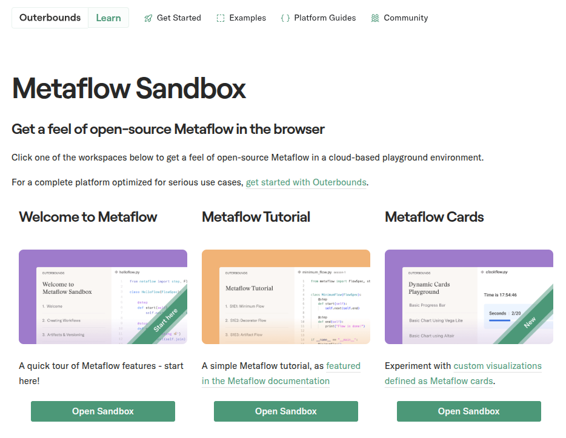

# {#cover-slide}

<script>
  // add custom CSS for the speaker view
  if (window.self !== window.top) {
    document.body.className += " speakerview";
  }
  // remove dummy slide
  document.getElementById("title-slide").remove();
</script>

::: {.centered}

:::

<h1 class="subtitle" style="color:#eee;font-size:1.25em;text-align: center; margin-top:325px; color:#34d399;">
  Outerbounds Office Hours<br />with Spare Cores
</h1>

<h2 class="author" style="color:#eee;padding-top:65px;font-size:1.25em;text-align: center !important;margin-bottom: 0px;">
  Gergely Daroczi
</h2>

<h3 class="author" style="color:#eee;font-size:1.1em;text-align: center !important; font-weight: normal;">
  Sep 2, 2025
</h3>

<h3 class="author onlineMode" style="color:#eee;padding-top:65px;font-size:1.1em;text-align: center !important; padding-top: 10px;font-weight: normal; ">
  Slides: <a href="https://sparecores.com/talks" target="_blank">sparecores.com/talks</a>
</h3>

<p class="author offlineMode" style="color:#eee;font-size:0.75em;text-align: right !important; padding-top: 0px;font-weight: normal;margin-top:30px; ">
  Press Space or click the green arrow icons to navigate the slides ->
</p>

# >>> from sparecores import badges {#badges transition="convex-in convex-out"}

<ul style="font-size: 0.9em;">
  <li class="fragment" data-fragment-index=1>Vendor independent, open-source project</li>
  <ul>
    <li class="fragment" data-fragment-index=2>Funded by NGI Search (EU consortium under Horizon Europe)</li>
    <li class="fragment" data-fragment-index=3>Accepted into the NVIDIA Inception Program</li>
    <li class="fragment" data-fragment-index=4>Beneficiary of cloud credits from 5 vendors (overall ~$100k)</li>
  </ul>
  <li class="fragment" data-fragment-index=5>10+ conference talks in 6 countries (e.g. Berlin Buzzwords, KCD)</li>
  <li class="fragment" data-fragment-index=6>Featured by The Pragmatic Engineer in Oct 2024</li>
  <li class="fragment" data-fragment-index=7>Jeff Barr (Chief Evangelist at AWS) on our Reddit post:</li>
</ul>

<blockquote class="fragment" data-fragment-index=7 style="margin-left: 40px;">
  This was awesome, thanks for sharing.
</blockquote>

::: {.notes}
first of all, just to build some credibility for the project
:::

# >>> from sparecores import intro {#intro transition="convex-in none-out"}

<ul style="font-size: 0.9em;">
  <li class="fragment">Open-source tools, database schemas and documentation to inspect and inventory cloud vendors and their offerings, including pricing and measured performance via benchmark workloads.</li>
  
</ul>

::: {.notes}
- so Spare Cores is an open-source ecosystem, including software, database schemas, guides,
- and actual databases if you don't want to run the ETL tooling yourself .. also providing APIs, SDKs etc to make it easier to query data
- unified CLI to start machines
- and working on an an optional SaaS offering built on the top of the open-source tooling for folks who would rather avoid registering with all cloud providers etc: give us a Docker image, a command to run, and you credit card .. all set, we will run it wherever it's cheapest.
:::

## >>> from sparecores import intro {#intro-list transition="none-in convex-out"}

<ul style="font-size: 0.9em;">
  <li>Open-source tools, database schemas and documentation to inspect and inventory cloud vendors and their offerings, including pricing and measured performance via benchmark workloads.</li>
  <li>Managed infrastructure, databases, APIs, SDKs, and web applications to make this data publicly accessible.</li>
  <li class="fragment">Open-source helpers to select, start and manage instances in your own environment.</li>
  <li class="fragment" style="font-weight: bold;">Open-source Python/R packages and workflow orchestration extensions (e.g. <span class="greeen">Metaflow</span>) to track resource usage and cost of DS/ML/AI jobs. Open-source tooling to right-size instances.</li>
  <li class="fragment">Add-on services to scale data science workflows, even without direct vendor engagement.</li>
</ul>

::: {.notes}
- so Spare Cores started as an open-source ecosystem, including software, database schemas, guides,
- and actual databases if you don't want to run the ETL tooling yourself .. also providing APIs, SDKs etc to make it easier to query data
- unified CLI to start machines
- and working on an an optional SaaS offering built on the top of the open-source tooling for folks who would rather avoid registering with all cloud providers etc: give us a Docker image, a command to run, and you credit card .. all set, we will run it wherever it's cheapest.
:::

# >>> import  {#metaflow transition="convex-in slide-out"}

<p class="fragment">
  Workflow orchestration for real-life ML, AI, and DS projects.
</p>

<ul>
  <li class="fragment">started at Netflix</li>
  <li class="fragment">open-source (since 2019)</li>
  <li class="fragment">supports Python and R</li>
  <li class="fragment">maintained by Netflix and Outerbounds</li>
  <li class="fragment">human-centric</li>
  <li class="fragment">reproducible by design</li>
  <li class="fragment">scalable</li>
</ul>

::: {.notes}
:::

## >>> from metaflow import tutorial {transition="slide-in fade-out"}

:::: {.columns style="display: block; margin-top: 40px;"}

::: {.column .vcenter .centered width="30%"}
:::

::: {.column .vcenter width="70%" }

```python {code-line-numbers="|1|3|5,10,15|4,9,14|7,12|6,11,16|19" style="font-size:24px;" }
from metaflow import FlowSpec, step

class HelloFlow(FlowSpec):
    @step
    def start(self):
        print("HelloFlow is starting.")
        self.next(self.hello)

    @step
    def hello(self):
        print("Metaflow says: Hi!")
        self.next(self.end)

    @step
    def end(self):
        print("HelloFlow is all done.")

if __name__ == "__main__":
    HelloFlow()
```

:::
::::

::: {.notes}
By design, Metaflow is a deceptively simple Python library.

1. import a class and a function from the `metaflow` package
2. use that class to inherit from to define our Workflow
3. we have a seriees of instance methods
4. with the `step` decorator -- marking the steps of our flow
5. each step defining which steps follows
6. and the rest is the core program: printing to stdout in this case
7. and running an instance of the flow class
:::

## >>> from metaflow import tutorial {transition="fade-in slide-out"}

:::: {.columns style="display: block; margin-top: 40px;"}

::: {.column .vcenter .centered width="30%"}

```{mermaid}
flowchart TD
    A[start] --> B(hello)
    B --> C[end]
```

:::

::: {.column .vcenter width="70%" }

```python {code-line-numbers="5,10,15" style="font-size:24px;" }
from metaflow import FlowSpec, step

class HelloFlow(FlowSpec):
    @step
    def start(self):
        print("HelloFlow is starting.")
        self.next(self.hello)

    @step
    def hello(self):
        print("Metaflow says: Hi!")
        self.next(self.end)

    @step
    def end(self):
        print("HelloFlow is all done.")

if __name__ == "__main__":
    HelloFlow()
```

:::

::::

::: {.notes}
So in this case we have a linear flow of steps that represents this simple DAG.
:::

## >>> from DnD import dices {transition="slide"}


::: {.notes}
But I wanted to bring a bit more realistic project for demonstration purposes,
something that includes at least a bit of probability and randomness.

And I thought everyone knows what a dice is .. and maybe some of you
even played role-playing games, such as Dungeons & Dragons, or AD&D ..
so you know multiple types of dice, and how important it is to have a full set
of dices available at all times.

So let's create a Metaflow step that rolls dices!
:::

## >>> from metaflow import dices {transition="slide-in fade-out"}

:::: {.columns style="display: block; margin-top: 20px;"}

::: {.column .centered .vcenter style="width: 30%; visibility: hidden;"}

```{mermaid}
flowchart TD
    A[start] -. dice <br> rolls .-> B(roll)
    B -. dice <br> rolls <br> dices ..-> C[end]
```

:::

::: {.column .vcenter width="70%" }

```python {code-line-numbers="6-7|11-12|17|10,16,21|11-12,17" style="font-size:24px;" }
from random import sample, randint
from metaflow import FlowSpec, step


class DiceRollFlow(FlowSpec):
    # D3, D4, D6, D8, D10, D12, ...
    DICES = [3, 4, 6, 8, 10, 12, 100]

    @step
    def start(self):
        self.dice = sample(self.DICES, 1)[0]
        self.rolls = sample(range(3), 1)[0] + 1
        self.next(self.roll)

    @step
    def roll(self):
        self.dices = [randint(1, self.dice) for _ in range(self.rolls)]
        self.next(self.end)

    @step
    def end(self):
        print(f"Rolled {self.rolls} times with a {self.dice} sided dice: {self.dices}")

if __name__ == "__main__":
    DiceRollFlow()
```

:::

::::

::: {.notes}
1. First, let's define the types of dices we want to support as a constant,
a class attribute in this case. Dices might have as low as 3 sides ... up to 100.
2. Then we decide in each workflow run, what type of dice we want to roll, and how many times. Then actually roll the dice or dices.
:::

## >>> from metaflow import dices {transition="fade-in slide-out"}

:::: {.columns style="display: block; margin-top: 20px;"}

::: {.column .centered .vcenter width="30%" }

```{mermaid}
flowchart TD
    A[start] -. dice <br> rolls .-> B(roll)
    B -. dice <br> rolls <br> dices ..-> C[end]
```

:::

::: {.column .vcenter width="70%" }

```python {code-line-numbers="11-12,17" style="font-size:24px;" }
from random import sample, randint
from metaflow import FlowSpec, step


class DiceRollFlow(FlowSpec):
    # D3, D4, D6, D8, D10, D12, ...
    DICES = [3, 4, 6, 8, 10, 12, 100]

    @step
    def start(self):
        self.dice = sample(self.DICES, 1)[0]
        self.rolls = sample(range(3), 1)[0] + 1
        self.next(self.roll)

    @step
    def roll(self):
        self.dices = [randint(1, self.dice) for _ in range(self.rolls)]
        self.next(self.end)

    @step
    def end(self):
        print(f"Rolled {self.rolls} times with a {self.dice} sided dice: {self.dices}")

if __name__ == "__main__":
    DiceRollFlow()
```

:::

::::

::: {.notes}
3. So we have the same number of instance methods, or steps here ... but besides a linear flow, we also pass data between the steps as instance attributes.

And this latter is super important and very convenient: whatever you pass as instance attributes between steps, those items are automatically serialized (pickled) and stored as versioned artifacts. In this case, artifacts are stored on disk, but could use AWS S3 or other object storage backends as well for distributed workflows.
:::

## >>> from metaflow import dices

<div style="margin-top: 40px; background-color: #2E3436; padding: 10px 0px 0px 30px; border-radius: 20px; border: 1px solid #34d399;">
  <div style="float: right; margin-right: 40px;">
   <div class="terminal-buttons terminal-close" style="top: -20px;"></div>
   <div class="terminal-buttons terminal-minimize" style="top: -20px;"></div>
   <div class="terminal-buttons terminal-zoom" style="top: -20px;"></div>
  </div>
  
</div>

::: {.notes}
Example output of an actual run of this workflow.
Note that a new process was spawned for each step, and that the data was passed between those through using artifacts.
:::

## >>> from metaflow import dices

```python {code-line-numbers="1-3|4-5|6-9|10-11|12-14|15-16|17-18" style="margin-top: 40px !important; height: 610px;" }
>>> from metaflow import Flow
>>> print(run := Flow("DiceRollFlow").latest_successful_run)
Run('DiceRollFlow/1749762602890590')
>>> run.created_at
datetime.datetime(2025, 6, 12, 23, 10, 2, 891000)
>>> run.data
<MetaflowData: dices, rolls, name, dice>
>>> run.data.dices
[5, 2, 2]
>>> list(run.steps())
[Step('DiceRollFlow/1749762602890590/end'), Step('DiceRollFlow/1749762602890590/roll'), Step('DiceRollFlow/1749762602890590/start')]
>>> step = next(run.steps())
>>> step.task.metadata
[Metadata(name='user', value='daroczig', created_at=1749762604068, type='user', task=Task('DiceRollFlow/1749762602890590/end/3')), ...
>>> step.task.stdout
'Rolled 3 time(s) with a 10 sided dice: [5, 2, 2]\n'
>>> step.task.artifacts.dices.data
[5, 2, 2]
```

::: {.notes}
Now let's dig into the details of Metaflow to get a better understanding of how it works.

First, let's see how we can access the last run.

We can look up some metadata about the run, such as the creation time, the data that was passed between the steps, and the artifacts that were stored.

Then we can also get the details of the individual workflow steps, along with metadata
such as UNIX user, start time, PID etc.

Standard out and standard error of the step.

And the versioned artifacts that were stored.
:::

## >>> from metaflow import more {transition="slide-in fade-out"}

:::: {.columns style="display: block; margin-top: 20px;"}

::: {.column .centered .vcenter width="30%" }

```{mermaid}
flowchart TD
    A[start] --> B1(fitA)
    A[start] --> B2(fitB)
    B1 --> C[eval]
    B2 --> C[eval]
    C --> D[end]
```

:::

::: {.column .vcenter width="70%" }

```python {code-line-numbers="6,11,16,19" style="font-size:24px; height: 525px; margin-top: 40px !important;" }
class ModelingFlow(FlowSpec):

    @step
    def start(self):
        self.data = load_data()
        self.next(self.fitA, self.fitB)

    @step
    def fitA(self):
        self.model = fit(self.data, model='A')
        self.next(self.eval)

    @step
    def fitB(self):
        self.model = fit(self.data, model='B')
        self.next(self.eval)

    @step
    def eval(self, inputs):
        self.best = max((i.model.score, i.model)
                        for i in inputs)[1]
        self.next(self.end)

    @step
    def end(self):
        print('done!')
```

:::

::::

::: {.notes}
Now let's look at a more complex example, that includes a branching flow,
and running two steps in parallel.

To do so, the first step passes to two independent steps instead of one,
both having access to the `data` instance attribute created in the `start` step.

Both parallel steps create a `model` instance attribute, and pass it to the `eval` step.

The `eval` step then selects the best model based on the score, and passes it to the `end` step.
:::

## >>> from metaflow import more {transition="fade-in slide-out"}

:::: {.columns style="display: block; margin-top: -63px;"}

::: {.column .centered .vcenter width="30%" }

```{mermaid}
flowchart TD
    A[start] -- data --> B1(fitA)
    A[start] -- data --> B2(fitB)
    B1 -. data<br>model .-> C[eval]
    B2 -. data<br>model .-> C[eval]
    C -- data<br>best --> D[end]
```

:::

::: {.column .vcenter width="70%" }

```python {code-line-numbers="5,10,15,20-21" style="font-size:24px; height: 525px; margin-top: 40px !important;" }
class ModelingFlow(FlowSpec):

    @step
    def start(self):
        self.data = load_data()
        self.next(self.fitA, self.fitB)

    @step
    def fitA(self):
        self.model = fit(self.data, model='A')
        self.next(self.eval)

    @step
    def fitB(self):
        self.model = fit(self.data, model='B')
        self.next(self.eval)

    @step
    def eval(self, inputs):
        self.best = max((i.model.score, i.model)
                        for i in inputs)[1]
        self.next(self.end)

    @step
    def end(self):
        print('done!')
```

:::

::::


::: {.centered .fragment style="margin-top: -80px;"}
And conditional and recursive steps since Metaflow 2.18!
:::

::: {.notes}
I hope this example makes it clear how useful it is to have access to the metadata and actual data of all steps of a workflow for later debugging.
:::

## >>> from metaflow import venv

:::: {.columns style="display: block; margin-top: 20px;"}

::: {.column .centered .vcenter width="30%" }

```{mermaid}
flowchart TD
    style B2 fill:#eab308
    A[start] --> B1(fitA)
    A[start] --> B2(fitB)
    B1 --> C[eval]
    B2 --> C[eval]
    C --> D[end]
```

:::

::: {.column .vcenter width="70%" }

```python {code-line-numbers="13" style="font-size:24px; height: 545px; margin-top: 40px !important;" }
class ModelingFlow(FlowSpec):

    @step
    def start(self):
        self.data = load_data()
        self.next(self.fitA, self.fitB)

    @step
    def fitA(self):
        self.model = fit(self.data, model='A')
        self.next(self.eval)

    @pypi(python='3.10.11', packages={'scikit-learn': '1.7'})
    @step
    def fitB(self):
        self.model = fit(self.data, model='B')
        self.next(self.eval)

    @step
    def eval(self, inputs):
        self.best = max((i.model.score, i.model)
                        for i in inputs)[1]
        self.next(self.end)

    @step
    def end(self):
        print('done!')
```

:::

::::

::: {.notes}
Now let's talk a bit about dependency management .. which is often pretty crazy in the Python world.

Let's say you need a specific version of a library, which you don't have installed globally,
so you could create a virtual environment or Docker image for that .. and use it for a single step.

Soon, it becomes a mess, and you have to manage multiple environments etc.

Metaflow helps with that by optionally managing the virtual environments for you.
Just use the `pypi` or `conda` decorators to specify the version of the library you need,
and Metaflow will create and cache the virtual environments for you.

This works locally, and with cloud services as well!
:::

## >>> from metaflow import cloud {transition="slide-in convex-out"}

:::: {.columns style="display: block; margin-top: 20px;"}

::: {.column .centered .vcenter width="30%" }

```{mermaid}
flowchart TD
    subgraph AWS Batch
      B1(fitA)
      B2(fitB)
    end
    A[start] .-> B1
    A[start] .-> B2
    B1 .-> C[eval]
    B2 .-> C[eval]
    C --> D[end]
```

:::

::: {.column .vcenter width="70%" }

```python {code-line-numbers="8,14" style="font-size:24px; height: 565px; margin-top: 40px !important;" }
class ModelingFlow(FlowSpec):

    @step
    def start(self):
        self.data = load_data()
        self.next(self.fitA, self.fitB)

    @batch(cpu=32, memory=64)
    @step
    def fitA(self):
        self.model = fit(self.data, model='A')
        self.next(self.eval)

    @batch(cpu=4, memory=16, gpu=1)
    @step
    def fitB(self):
        self.model = fit(self.data, model='B')
        self.next(self.eval)

    @step
    def eval(self, inputs):
        self.best = max((i.model.score, i.model)
                        for i in inputs)[1]
        self.next(self.end)

    @step
    def end(self):
        print('done!')
```

:::

::::

::: {.notes}

Speaking about cloud services .. you can imagine that sometimes the local resources are just not enough,
and we need to run the workflow or a step on a larger machine.

It's super easy for the data scientist to do so: use the AWS Batch or Kubernetes decorator, specify the resources you need, and Metaflow will take care of the rest.

But how much resources did we actually use?
:::

# >>> import resource_tracker {transition="convex-in slide-out"}

<ul>
<li class="fragment" data-fragment-index=1>Lightweight (zero-dependency*) Python package</li>
<li class="fragment" data-fragment-index=3>Supports Python 3.9+</li>
<li class="fragment" data-fragment-index=4>Monitors system-level and process-level resource usage</li>
<li class="fragment" data-fragment-index=5>Tracks CPU, memory, GPU/VRAM, network, storage & more</li>
<li class="fragment" data-fragment-index=6>Ease of use, minimal setup</li>
<li class="fragment" data-fragment-index=7>Runs in the background, non-blocking</li>
<li class="fragment" data-fragment-index=8>Framework extensions (e.g. Metaflow)</li>

<div class="fragment" style="margin-top: 40px;" data-fragment-index=2>\* No dependencies on Linux; `psutil` on other OS.</div>

::: {.notes}
And here comes the resource tracker to the rescue!

If you are running Linux, and most production servers are Linux ... it can use the proc filesystem without any further dependencies -- other than a modern Linux kernel. On other operating systems, it uses `psutil` to get the same information.

It supports recent Python versions, going back to the latest officially supported Python version,
so that you can run it anywhere.

It can monitor the resource usage of the whole system, like logging the overall CPU and memory usage etc
But can also track a single process and optionally its children as well -- independent from the whole system.

It can track the CPU usage, memory usage, disk I/O, network usage, GPU usage, and more.

It's easy to use, and it's non-blocking, so you can run it in the background while your code is running.

By default, it's framework agnostic .. but comes with a few extensions, e.g. for Metaflow.
:::

## >>> import resource_tracker

Installation: 

```bash {code-line-numbers="1-1" style="margin-top: 20px !important;" }
pip install resource-tracker
```

. . .

Minimal usage:

```python {code-line-numbers="1|3|4|6-7" style="margin-top: 20px !important;" }
from resource_tracker import ResourceTracker

tracker = ResourceTracker()
# your compute-heavy code

tracker.stop()
tracker.report().browse()
```

::: {.notes}
It's on PyPI, so easy to install and upgrade.

Here's a minimal example of how to use the resource tracker:
1. Import the ResourceTracker class
2. Create an instance, which will be run tasks in background threads and processes
3. You have real-time access to the collected data at any time by using the `pid_tracker` or `system_tracker` instance attributes
4. You can stop the tracking or it will be auto cleanup with your script
:::

## >>> resource_tracker.report().browse()

::: {.centered}
<a href="https://sparecores.com/assets/slides/example-resource-tracker-report-in-metaflow.html" target="_blank">
  
</a>
:::

## >>> ResourceTracker.system_metrics

```python {code-line-numbers="1-1|2-2|3-3" style="margin-top: 60px !important;" }
>>> print(tracker.system_metrics)
TinyDataFrame with 221 rows and 21 columns:
timestamp    | processes | utime | stime | cpu_usage | memory_free | memory_used | memory_buffers | memory_cached | memory_active | memory_inactive | disk_read_bytes | disk_write_bytes | disk_space_total_gb | disk_space_used_gb | disk_space_free_gb | net_recv_bytes | net_sent_bytes | gpu_usage | gpu_vram | gpu_utilized
-------------+-----------+-------+-------+-----------+-------------+-------------+----------------+---------------+---------------+-----------------+-----------------+------------------+---------------------+--------------------+--------------------+----------------+----------------+-----------+----------+-------------
1756711946.0 |     720.0 |  0.62 |  0.41 |    1.0303 |  18888932.0 |  38098620.0 |         3612.0 |     8555708.0 |    25858216.0 |        110860.0 |        872448.0 |         274432.0 |             3699.99 |            2600.86 |            1099.13 |         4627.0 |         3251.0 |      0.19 |   1610.0 |          1.0
1756711947.0 |     718.0 |  0.56 |  0.51 |    1.0699 |  18878644.0 |  38108908.0 |         3612.0 |     8555708.0 |    25858092.0 |        110860.0 |         53248.0 |        5705728.0 |             3699.99 |            2600.85 |            1099.14 |         4666.0 |          952.0 |      0.18 |   1610.0 |          1.0
1756711948.0 |     718.0 |  0.65 |  0.41 |      1.06 |  18887904.0 |  38099648.0 |         3612.0 |     8555708.0 |    25873876.0 |        110860.0 |        499712.0 |              0.0 |             3699.99 |            2600.85 |            1099.14 |         4141.0 |          749.0 |      0.17 |   1610.0 |          1.0
1756711949.0 |     718.0 |  0.56 |  0.31 |      0.87 |  18893768.0 |  38093784.0 |         3612.0 |     8555708.0 |    25873732.0 |        110860.0 |          8192.0 |              0.0 |             3699.99 |            2600.85 |            1099.14 |         5230.0 |         3534.0 |      0.13 |   1610.0 |          1.0
1756711950.0 |     717.0 |   0.6 |  0.43 |    1.0301 |  18872532.0 |  38112844.0 |         3612.0 |     8557884.0 |    25876444.0 |        110860.0 |          8192.0 |              0.0 |             3699.99 |            2600.85 |            1099.14 |        11204.0 |        10237.0 |      0.14 |   1611.0 |          1.0
1756711951.0 |     717.0 |  0.67 |  0.45 |    1.1199 |  18877492.0 |  38110060.0 |         3612.0 |     8555708.0 |    25874972.0 |        110860.0 |             0.0 |              0.0 |             3699.99 |            2600.85 |            1099.14 |         4605.0 |         2372.0 |      0.12 |   1611.0 |          1.0
1756711952.0 |     722.0 |  0.61 |  0.41 |    1.0201 |  18866980.0 |  38120572.0 |         3612.0 |     8555708.0 |    25876556.0 |        110860.0 |         20480.0 |        3383296.0 |             3699.99 |            2600.85 |            1099.14 |         4569.0 |         3845.0 |      0.17 |   1611.0 |          1.0
1756711953.0 |     718.0 |  1.07 |  0.49 |      1.56 |  18883100.0 |  38101332.0 |         3612.0 |     8558828.0 |    25880244.0 |        110860.0 |        385024.0 |         606208.0 |             3699.99 |            2600.85 |            1099.14 |        27694.0 |        14736.0 |      0.32 |   1625.0 |          1.0
1756711954.0 |     718.0 |  1.06 |  0.44 |    1.5001 |  18872284.0 |  38110084.0 |         3612.0 |     8560892.0 |    25891068.0 |        110860.0 |         90112.0 |              0.0 |             3699.99 |            2600.85 |            1099.14 |        17429.0 |        16417.0 |      0.17 |   1638.0 |          1.0
1756711955.0 |     717.0 |  1.93 |  0.46 |    2.3897 |  18870824.0 |  38111536.0 |         3612.0 |     8560900.0 |    25878008.0 |        110860.0 |        692224.0 |         262144.0 |             3699.99 |            2600.85 |            1099.14 |        97172.0 |       114005.0 |      0.23 |   1656.0 |          1.0
...
```

## >>> ResourceTracker.process_metrics

```python {code-line-numbers="1-1|3-3" style="margin-top: 60px !important;"}
>>> print(tracker.process_metrics)
TinyDataFrame with 221 rows and 12 columns:
timestamp    | pid       | children | utime | stime | cpu_usage | memory  | read_bytes | write_bytes | gpu_usage | gpu_vram | gpu_utilized
-------------+-----------+----------+-------+-------+-----------+---------+------------+-------------+-----------+----------+-------------
1756711946.0 | 1542538.0 |      4.0 |  0.07 |  0.08 |      0.15 | 84612.0 |        0.0 |         0.0 |       0.0 |      0.0 |          0.0
1756711947.0 | 1542538.0 |      3.0 |  0.09 |  0.17 |      0.26 | 74270.0 |        0.0 |         0.0 |       0.0 |      0.0 |          0.0
1756711948.0 | 1542538.0 |      4.0 |  0.19 |  0.06 |      0.25 | 99062.0 |   945664.0 |         0.0 |       0.0 |      0.0 |          0.0
1756711949.0 | 1542538.0 |      3.0 |  0.07 |   0.1 |      0.17 | 87491.0 |        0.0 |         0.0 |       0.0 |      0.0 |          0.0
1756711950.0 | 1542538.0 |      4.0 |  0.09 |  0.13 |      0.22 | 87462.0 |        0.0 |         0.0 |       0.0 |      0.0 |          0.0
1756711951.0 | 1542538.0 |      4.0 |  0.02 |  0.06 |      0.08 | 99156.0 |        0.0 |         0.0 |       0.0 |      0.0 |          0.0
1756711952.0 | 1542538.0 |      4.0 |  0.06 |  0.13 |      0.19 | 99163.0 |        0.0 |         0.0 |       0.0 |      0.0 |          0.0
1756711953.0 | 1542538.0 |      4.0 |  0.04 |   0.1 |      0.14 | 99198.0 |        0.0 |         0.0 |       0.0 |      0.0 |          0.0
1756711954.0 | 1542538.0 |      4.0 |  0.04 |  0.09 |      0.13 | 98916.0 |        0.0 |         0.0 |       0.0 |      0.0 |          0.0
1756711955.0 | 1542538.0 |      4.0 |  0.04 |  0.12 |      0.16 | 99333.0 |        0.0 |         0.0 |       0.0 |      0.0 |          0.0
...
```

::: {.notes}
A bit less number of metrics, e.g. network traffic and storage is not measurable.
BUT we do have GPU usage tracker at the process level! Up-to 4 GPUs...
:::

## >>> ResourceTracker.get_combined_metrics

```python {code-line-numbers="1-2|4-4|5-24|24-35" style="margin-top: 30px !important; font-size: 28px; height: 590px;"}
>>> from rich import print as pp
>>> pp(tracker.get_combined_metrics(human_names=True)[0])
{
    'Timestamp': 1756711946.0,
    'System processes': 720.0,
    'System CPU time (user)': 0.62,
    'System CPU time (system)': 0.41,
    'System CPU usage': 1.0303,
    'System free memory': 18888932.0,
    'System used memory': 38098620.0,
    'System memory buffers': 3612.0,
    'System memory page/file cached': 8555708.0,
    'System active memory': 25858216.0,
    'System inactive memory': 110860.0,
    'System disk read': 872448.0,
    'System disk write': 274432.0,
    'System disk space total': 3699.99,
    'System disk space used': 2600.86,
    'System disk space free': 1099.13,
    'System inbound network traffic': 4627.0,
    'System outbound network traffic': 3251.0,
    'System GPU usage': 0.19,
    'System VRAM used': 1610.0,
    'System GPUs in use': 1.0,
    'Process PID': 1542538.0,
    'Process children': 4.0,
    'Process CPU time (user)': 0.07,
    'Process CPU time (system)': 0.08,
    'Process CPU usage': 0.15,
    'Process memory usage': 84612.0,
    'Process disk read': 0.0,
    'Process disk write': 0.0,
    'Process GPU usage': 0.0,
    'Process VRAM used': 0.0,
    'Process GPUs in use': 0.0
}
```

## >>> ResourceTracker.stats

:::: {.columns style="display: block; margin-top: 40px;"}

::: {.column .vcenter .centered width="35%"}


```python {code-line-numbers="1-1|3-24" style="margin-top: 30px !important; font-size: 28px; height: 595px; margin-top: -10px !important;"}
>>> pp(tracker.stats())
defaultdict(<class 'dict'>, {
    'process_cpu_usage':
      {'mean': 0.14,
       'max': 0.26},
    'process_memory':
      {'mean': 94373.43,
       'max': 109308.0},
    'process_gpu_usage':
      {'mean': 0.0,
       'max': 0.0},
    'process_gpu_vram':
      {'mean': 0.0,
       'max': 0.0},
    'process_gpu_utilized':
      {'mean': 0.0,
       'max': 0.0},
    'system_disk_space_used_gb':
      {'max': 2600.87},
    'system_net_recv_bytes':
      {'sum': 111299615.0},
    'system_net_sent_bytes':
      {'sum': 103073415.0},
    'timestamp': {'duration': 221.0}
})
```

:::

::: {.column .vcenter .centered .fragment width="65%"}


:::
::::

## >>> ResourceTracker.recommendations

```python {code-line-numbers="1-1|2-2" style="margin-top: 30px !important; margin-bottom: 30px !important; font-size: 32px"}
>>> tracker.recommend_resources()
{'cpu': 1, 'memory': 256, 'gpu': 0, 'vram': 0}
```

. . .

Super simple algorithm:

- `cpu`: average CPU usage of the process(es)
- `memory`: maximum memory usage of the process(es) with a 20% buffer
- `gpu`: maximum number of GPUs used by the process(es)
- `vram`: maximum VRAM usage of the process(es) with a 20% buffer

## >>> ResourceTracker.recommendations

```python {code-line-numbers="1-1|12-13" style="margin-top: 30px !important; margin-bottom: 30px !important; font-size: 32px"}
>>> print(ResourceTracker.recommend_resources.__doc__)
Recommend optimal resource allocation based on the measured resource tracker data.

The recommended resources are based on the following rules:

- target average CPU usage of the process(es)
- target maximum memory usage of the process(es) with a 20% buffer
- target maximum number of GPUs used by the process(es)
- target maximum VRAM usage of the process(es) with a 20% buffer

Args:
    historical_stats: Optional list of historical statistics (as returned by [resource_tracker.ResourceTracker.stats][])
                      to consider when making recommendations. These will be combined with the current stats.

Returns:
    A dictionary containing the recommended resources (cpu, memory, gpu, vram).
```

## >>> ResourceTracker.recommendations

```python {code-line-numbers="1-1|10,24,28,30"  style="margin-top: 10px !important; margin-bottom: -30px !important; font-size: 32px; height: 550px;"}
>>> pp(tracker.recommend_server())
{
    'vendor_id': 'aws',
    'server_id': 't4g.nano',
    'name': 't4g.nano',
    'api_reference': 't4g.nano',
    'display_name': 't4g.nano',
    'description': 'Burstable performance [AWS Graviton processors] Gen4 nano',
    'family': 't4g',
    'vcpus': 2,
    'hypervisor': 'nitro',
    'cpu_allocation': 'Burstable',
    'cpu_cores': 2,
    'cpu_speed': 2.5,
    'cpu_architecture': 'arm64',
    'cpu_manufacturer': 'AWS',
    'cpu_family': 'ARMv8',
    'cpu_model': 'Neoverse-N1',
    'cpu_l1_cache': 262144,
    'cpu_l2_cache': 2097152,
    'cpu_l3_cache': 33554432,
    'cpu_flags': ['fp', 'asimd', 'evtstrm', 'aes', 'pmull', 'sha1', 'sha2', 'crc32', 'atomics', 'fphp', 'asimdhp', 'cpuid', 'asimdrdm', 'lrcpc', 'dcpop', 'asimddp', 'ssbs'],
    'cpus': [],
    'memory_amount': 512,
    'memory_generation': None,
    'memory_speed': None,
    'memory_ecc': None,
    'gpu_count': 0,
    'gpu_memory_min': None,
    'gpu_memory_total': None,
    'gpu_manufacturer': None,
    'gpu_family': None,
    'gpu_model': None,
    'gpus': [],
    'storage_size': 0,
    'storage_type': None,
    'storages': [],
    'network_speed': 0.032,
    'inbound_traffic': 0.0,
    'outbound_traffic': 0.0,
    'ipv4': 0,
    'status': 'active',
    'observed_at': '2025-09-01T18:34:34.309153',
    'score': 3000.57,
    'price': 0.0003,
    'min_price': 0.0003,
    'min_price_spot': 0.0003,
    'min_price_ondemand': 0.0028,
    'score_per_price': 10001900.0,
    'selected_benchmark_score': None,
    'selected_benchmark_score_per_price': None,
    'vendor': {
        'vendor_id': 'aws',
        'status': 'active',
        'country_id': 'US',
        'state': 'Washington',
        'observed_at': '2025-09-01T18:59:50.235097',
        'name': 'Amazon Web Services',
        'city': 'Seattle',
        'address_line': '410 Terry Ave N',
        'logo': 'https://sparecores.com/assets/images/vendors/aws.svg',
        'zip_code': '98109',
        'homepage': 'https://aws.amazon.com',
        'founding_year': 2002,
        'status_page': 'https://health.aws.amazon.com/health/status'
    }
}
```

. . .

Super simple algorithm: cheapest server w/ rec resources.

## >>> print(ResourceTracker.__doc__)

<a href="https://sparecores.github.io/resource-tracker/reference/resource_tracker/tracker/#resource_tracker.tracker.ResourceTracker" target="_blank">
   
</a>

## $ todo.sh listall +resource-tracker { data-transition="slide-in convex-out" }

<ul>
    <li class="fragment">Stream resource usage data to a central location</li>
    <li class="fragment">Tweak resource recommender algorithm?</li>
    <li class="fragment">Configure the server recommender algorithm!</li>
    <ul>
        <li class="fragment">Limit to vendor, region, compliance framework etc.</li>
        <li class="fragment">Prioritize for cost efficiency instead of cheapest</li>
        <li class="fragment">Find related benchmarks</li>
    </ul>
    <li class="fragment">Change-detection for resource usage</li>
    <li class="fragment">...</li>
    <li class="fragment">Framework integrations!</li>
</ul>

# >>> from metaflow import track_resources { data-transition="convex-in slide-out" }

```python {code-line-numbers="1,9" style="margin-top: 30px !important; margin-bottom: 30px !important; font-size: 32px; height: 595px;"}
from metaflow import Flow, FlowSpec, step, track_resources

class ResourceTrackingFlow(FlowSpec):
    @step
    def start(self):
        print("Starting step")
        self.next(self.my_sleeping_data)

    @track_resources
    @step
    def my_sleeping_data(self):
        data = bytearray(500 * 1024 * 1024)  # 500MB
        sleep(3)
        self.next(self.end)

    @step
    def end(self):
        print("Step finished")
        pass

if __name__ == "__main__":
    ResourceTrackingFlow()
```

## >>> from metaflow import track_resources

`@track_resources` decorator starts `ResourceTracker` to:

<ul>
  <li class="fragment">Look up hardware specs and environment information</li>
  <li class="fragment">Discover the cloud provider, region and instance type</li>
  <li class="fragment">Track CPU, memory, disk I/O and storage, network, GPU/VRAM, and more</li>
  <li class="fragment">Generate summary statistics</li>
  <li class="fragment">Recommend optimal resource allocations for the step</li>
  <li class="fragment">Recommend the cheapest cloud server type for future runs</li>
  <li class="fragment">Present all this in an auto-generated card attached 😊</li>
</ul>

## >>> from metaflow import track_resources

<div class="centered" style="margin-top: 40px;">
  <video
    autoplay loop muted style="width: 80%;"
    src="images/demo_time.webm"
  ></video>
  <p style="margin-top: 0px;">
    Source:
    <a href="https://thecodinglove.com/when-we-demo-our-prototype-to-the-client">
    When we demo our prototype to the client
    </a>
  </p>
</div>

::: {.notes}
And now it's time for a quick demo!
I'll use a Kubernetes sandbox to run a flow after live coding for a bit .. so please keep your fingers crossed!
:::

## >>> from metaflow import track_resources

<div class="centered">
  <a href="https://docs.outerbounds.com/sandbox/" target="_blank">
    
  </a>
  <p style="margin-top: 0px;">
    Source:
    <a href="https://docs.outerbounds.com/sandbox/" target="_blank">Outerbounds sandbox</a>
  </p>
</div>

::: {.notes}
1. start sandbox
2. go to "scaling out to the cloud"
3. pip install resource-tracker
4. import + add track_resources
5. split len("X" * 1e9) to bytes = x*1e9 and then self.bytes_used so that we can see the memory usage
5. add 2 x time.sleep(2) before/after to the memory hog step so that we have time to collect data
6. run the flow .. check cards
7. realize low memory usage despite asking for 10 gigs!
8. by default, `@kubernetes` would reserve 4 GiB

@track_resources
@kubernetes(memory=10000)
@catch
@step
def memory_hog(self):
    time.sleep(2)
    print("Requesting a lot of memory")
    bytes = "x" * 1_000_000_000
    self.bytes_used = len(bytes)
    print("Success!")
    time.sleep(2)
    self.next(self.join)
:::

## >>> inspect.getsource(track_resources)

- Historical data: fetch `resource_usage` artifacts from up-to 5 recent successful runs.

. . .

- Generate card by default by injecting a decorator:

```python {style="margin-left: 45px !important; font-size: 32px;"}
def step_init(self):
    decorators.append(CardDecorator(attributes={"type": "tracked_resources", ...}))
```

. . .

- Probably nicer ways to do this nowadays?

. . .

- Generate card even if step failed:

```python {style="margin-left: 45px !important; font-size: 32px;"}
def task_finished(self):
    decorator.card_creator.create(...)
```

. . .

- Limitations: only runs at the end of a step, not real-time.

# >>> import \_\_future\_\_ {#future transition="convex-in convex-out"}

<ul>
  <li class="fragment">Automated <code>@resources</code> tuning (POC is ready)</li>
  <li class="fragment">Central usage data storage and dashboard (design ready)</li>
  <li class="fragment">More granular resource mapping (e.g. VRAM) -- Metaflow?</li>
  <li class="fragment">Step optimization assistant (e.g. split step)</li>
  <li class="fragment">Proactive resource management via SaaS add-on:</li>
  <ul>
    <li class="fragment">Email alerts on overprovisioning</li>
    <li class="fragment">Predict potential job failures due to insufficient resources</li>
  </ul>
  <li class="fragment">Effortless remote execution (CaaS)</li>
</ul>

# {#thanks}

::: {.centered}
Thanks!

<a href="mailto:daroczig@sparecores.com">daroczig@sparecores.com</a>
:::

<p class="author offlineMode" style="color:#eee;font-size:1em; text-align: center !important; position: absolute; bottom: -20px; left: 50%; transform: translate(-50%, 0);">
  Slides: <a href="https://sparecores.com/talks" target="_blank">sparecores.com/talks</a>
</p>

<!--toggle visibility of items in live mode-->
<script>
var url = document.location.href;
if (url.match("/?live")) {
  const elements = document.getElementsByClassName('offlineMode');
  for (let i = 0; i < elements.length; i++) {
    element = elements.item(i);
    element.style.display = 'none';
  }
} else {
  const elements = document.getElementsByClassName('onlineMode');
  for (let i = 0; i < elements.length; i++) {
    element = elements.item(i);
    element.style.display = 'none';
  }
}
</script>
