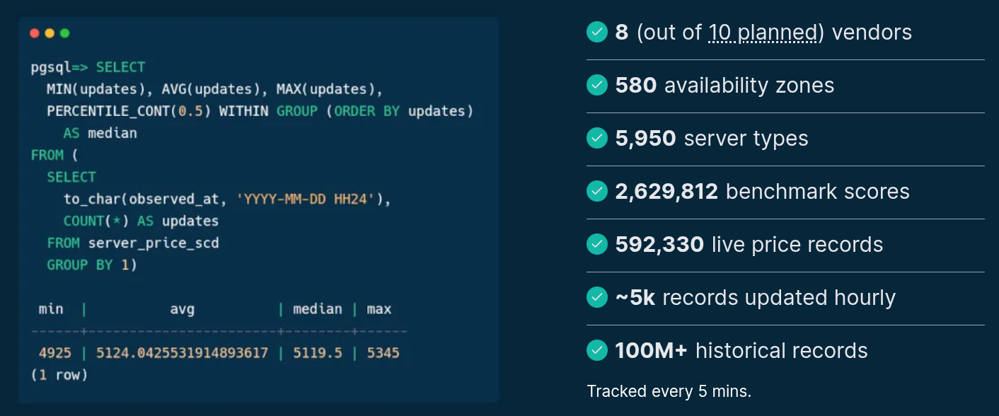
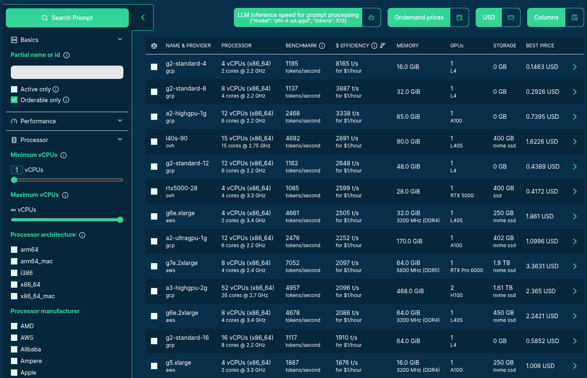
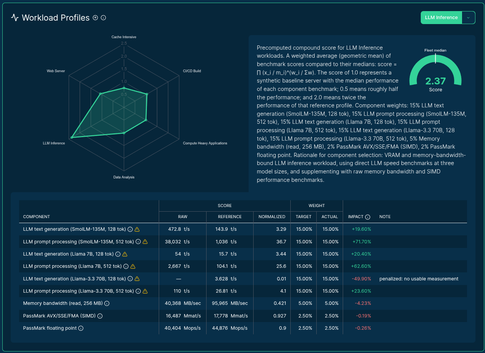
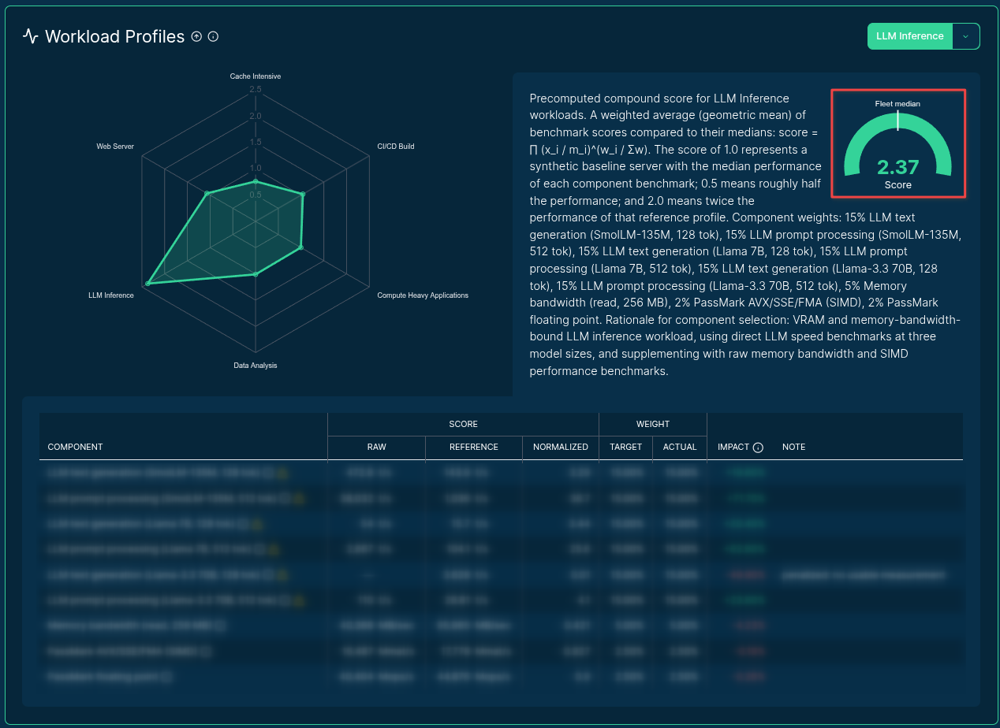
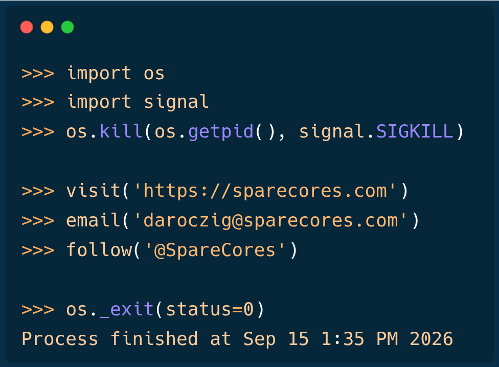

# {#cover-slide}

<script>
  // add custom CSS for the speaker view
  if (window.self !== window.top) {
    document.body.className += " speakerview";
  }
  // remove dummy slide
  document.getElementById("title-slide").remove();
</script>

::: {.centered}

:::

<h1 class="subtitle" style="font-family: 'Roboto Mono', monospace !important; color:#eee;font-size:1.25em;text-align: center; margin-top:300px; color:#34d399;">
  SELECT instance FROM cloud<br />WHERE workload = ?<br />ORDER BY cost_efficiency
</h1>

<h2 class="author" style="color:#eee;padding-top:65px;font-size:0.9em;text-align: center !important;margin-bottom: 0px;">
  Gergely Daroczi, Spare Cores
</h2>

<h3 class="author" style="color:#eee;padding-top: 2px; font-size:0.9em;text-align: center !important; font-weight: normal;">
  Sep 15, 2026 @ Houston, Texas, USA
</h3>

<h3 class="author onlineMode" style="color:#eee;padding-top:65px;font-size:0.9em;text-align: center !important; padding-top: 10px;font-weight: normal; ">
  Slides: <a href="https://sparecores.com/talks" target="_blank">sparecores.com/talks</a>
</h3>

<p class="author offlineMode" style="color:#eee;font-size:0.75em;text-align: right !important; padding-top: 0px;font-weight: normal;margin-top:30px; ">
  Press Space or click the green arrow icons to navigate the slides ->
</p>

::: {.notes}
Hi, I'm Gergely from the Spare Cores team,
and we are an open-source project for cloud transparency, because
:::

## {#vcpu transition="slide-in zoom-out"}  

::: {.notes}
WHAT THE HECK is a virtual CPU?!

There's a conceptual uncertainty and visibility problem here,
as a vCPU could range from an overprovisioned, poor-performing thread with saturated bandwidth to memory,
versus a dedicated CPU core of a state-of-the-art server -- with massive CPU cache and high memory bandwidth.

Which means your R or Python script runs on the same number of vCPUs e.g. 10x faster or slower.
:::

::: {.centered}
<div style="position: relative; display: inline-block; margin-top: -45px;">
  
  <video autoplay muted loop playsinline data-autoplay
         src="images/vincent-confused.webm"
         style="position: absolute; left: 45%; bottom: 1.5%;
                transform: translateX(-50%); width: 50%;
                background: transparent; pointer-events: none;">
  </video>
</div>
:::

## {#vcpu-burn transition="zoom-in slide-out"}

::: {.notes}
We solve this visibility problem by burning hundreds of thousands of dollars
(most recently $20k over a single weekend) to
start servers, measure performance, and calculate cost-efficiency,
then publish these results and related tooling with open licenses,
so that you can save money by optimizing your cloud spend.
:::

::: {.centered}
<div style="position: relative; display: inline-block; width: 100%;
            aspect-ratio: 1536 / 1024; overflow: hidden;
            margin-top: calc(-90px + 0.4em);">
  
</div>
:::

## {#title transition="slide-in fade-out"}

::: {.centered}

:::


<h1 class="subtitle" style="font-family: 'Roboto Mono', monospace !important; color:#eee;font-size:1.25em;text-align: center; color:#34d399; margin-top: 318px;margin-bottom:15px;">
  SELECT instance FROM cloud<br />WHERE workload = ?<br />ORDER BY cost_efficiency
</h1>

<h2 class="author" style="color:#eee;padding-top:120px;font-size:0.9em;text-align: center !important;margin-bottom: 0px;">
  Gergely Daroczi, Spare Cores
</h2>

<h3 class="author" style="color:#eee;padding-top: 2px; font-size:0.9em;text-align: center !important; font-weight: normal;">
  Sep 15, 2026 @ Houston, Texas, USA
</h3>

<h3 class="author onlineMode" style="color:#eee;padding-top:65px;font-size:0.9em;text-align: center !important; padding-top: 10px;font-weight: normal; ">
  Slides: <a href="https://sparecores.com/talks" target="_blank">sparecores.com/talks</a>
</h3>

::: {.notes}
Some of you might wonder, though, what's going on with my talk title,
and you must have also noticed my accent ... well, English is not my first language,
and not even the second .. that would be either R or Python.

But to avoid a language war, I picked a neutral one for this talk: SQL.

👈 [point to SQL title]
:::

## {#title-focused transition="fade-in convex-out"}

::: {.centered}

:::

```sql {code-line-numbers="1-3|3|1|2" style="font-size:1.75em; margin-top: 320px !important;"}
SELECT instance FROM cloud
WHERE workload = ?
ORDER BY cost_efficiency
```

<style>
div#cb1 {
    width: 670px;
    margin-left: auto;
    margin-right: auto;
}
div#cb1 pre code span a {
  margin-left: -60px;
}
div#cb1 span.kw, div#cb1 span.op {
  color: #34d399;
}
</style>

<h2 class="author" style="color:#eee;padding-top:120px;font-size:0.9em;text-align: center !important;margin-bottom: 0px;">
  Gergely Daroczi, Spare Cores
</h2>

<h3 class="author" style="color:#eee;padding-top: 2px; font-size:0.9em;text-align: center !important; font-weight: normal;">
  Sep 15, 2026 @ Houston, Texas, USA
</h3>

<h3 class="author onlineMode" style="color:#eee;padding-top:65px;font-size:0.9em;text-align: center !important; padding-top: 10px;font-weight: normal; ">
  Slides: <a href="https://sparecores.com/talks" target="_blank">sparecores.com/talks</a>
</h3>

::: {.notes}
The standard way to speak to databases.
Something like

- we are looking for the most cost-efficient
- cloud servers
- to perform a task, such as training GBMs or running LLM inference

Now, before I run this actual query ...
:::

# {#import-sqlite3}

::: {.notes}

TODO simplify SQL or gray out the not important parts

Let's load the database,
and ease in with a few descriptive stats on the tracked cloud resources: over 5,000 cloud server types
ranging from a potato to actual beasts with 2,000 vCPUs and over 30TB of memory!

The number of locations? Almost 300 regions across the globe!

Pricing of a single instance type? Depends on spot VS on-demand and reserved pricing, also affected by location: 10x diff easily for the same silicon!

We have actually started all these machines and run over 500 benchmark workloads on each to measure the actual performance.
:::

```sql {code-line-numbers="1|6-20|22-36|38-71|73-93" style="font-size:36px; margin-top: 50px !important; height: 600px;"}
$ sqlite3 spare-cores-navigator.db
SQLite version 3.46.1
Enter ".help" for usage hints.

sqlite> .mode table
sqlite> SELECT vendor_id, COUNT(*) AS servers, MIN(vcpus), MAX(vcpus),
               MAX(memory_amount/1024) AS "MAX(RAM)" FROM server GROUP BY 1;

+-----------+---------+------------+------------+----------+
| vendor_id | servers | MIN(vcpus) | MAX(vcpus) | MAX(RAM) |
+-----------+---------+------------+------------+----------+
| alicloud  | 1967    | 1          | 960        | 16384    |
| aws       | 1414    | 1          | 896        | 32768    |
| azure     | 1560    | 1          | 896        | 30400    |
| gcp       | 573     | 1          | @@box+@@1920       | 32768@@box+@@    |
| hcloud    | 34      | 1          | 48         | 187      |
| ovh       | 104     | 1          | 224        | 1920     |
| upcloud   | 145     | 1          | 192        | 1920     |
| vultr     | 202     | 1          | 256        | 3072     |
+-----------+---------+------------+------------+----------+

sqlite> SELECT vendor_id, COUNT(DISTINCT(region_id)) AS regions, COUNT(*) AS zones
        FROM zone GROUP BY 1;

+-----------+---------+-------+
| vendor_id | regions | zones |
+-----------+---------+-------+
| alicloud  | 34      | 110   |
| aws       | 34      | 107   |
| azure     | 64      | 149   |
| gcp       | 43      | 132   |
| hcloud    | 6       | 6     |
| ovh       | 29      | 33    |
| upcloud   | 15      | 15    |
| vultr     | 36      | 36    |
+-----------+---------+-------+

sqlite> SELECT country_id, MIN(price), ROUND(AVG(price), 4) AS "AVG(price)", MAX(price)
        FROM server_price AS sp LEFT JOIN region USING (region_id) LEFT JOIN country USING (country_id)
        WHERE sp.vendor_id = 'aws' AND sp.server_id = 'm8g.2xlarge' GROUP BY 1;

+------------+------------+------------+------------+
| country_id | MIN(price) | AVG(price) | MAX(price) |
+------------+------------+------------+------------+
| AE         | 0.0539     | 0.2891     | 0.4402     |
| AU         | 0.0803     | 0.2895     | 0.4488     |
| BH         | 0.1179     | 0.3145     | 0.4937     |
| BR         | 0.1015     | 0.3463     | 0.5722     |
| CA         | 0.089      | 0.2742     | 0.4002     |
| CH         | 0.1386     | 0.3074     | 0.4731     |
| DE         | 0.186      | 0.3116     | 0.4302     |
| ES         | 0.04       | 0.222      | 0.3999     |
| FR         | 0.0949     | 0.2873     | 0.4189     |
| GB         | 0.0949     | 0.2912     | 0.4152     |
| HK         | 0.0799     | 0.2938     | 0.4937     |
| ID         | 0.0991     | 0.2876     | 0.4488     |
| IE         | 0.2132     | 0.308      | 0.4002     |
| IN         | 0.0873     | 0.1841     | 0.2566     |
| IT         | 0.1315     | 0.2782     | 0.4189     |
| JP         | 0.1527     | 0.3255     | 0.4638     |
| KR         | 0.093      | 0.2815     | 0.4414     |
| MX         | 0.12       | 0.2649     | 0.377      |
| MY         | 0.0991     | 0.2876     | 0.4488     |
| SA         | 0.0539     | 0.2891     | 0.4402     |
| SE         | 0.097      | 0.2504     | 0.3815     |
| SG         | 0.1858     | 0.3248     | 0.4488     |
| TH         | 0.112      | 0.2536     | 0.3815     |
| TW         | 0.12       | 0.2752     | 0.4174     |
| US         | 0.0894     | 0.2608     | 0.4189     |
| ZA         | 0.1313     | 0.3062     | 0.475      |
+------------+------------+------------+------------+

sqlite> SELECT category, COUNT(*) FROM benchmark_score
        JOIN benchmark USING (benchmark_id) GROUP BY 1;

+---------------------+----------+
|      category       | COUNT(*) |
+---------------------+----------+
|                     | 2346     |
| Compression algos   | 1112565  |
| Database            | 4307     |
| Geekbench           | 199886   |
| LLM inference speed | 118898   |
| Memory bandwidth    | 190412   |
| Memory latency      | 23757    |
| OpenSSL             | 239118   |
| Other               | 3629     |
| Passmark            | 57680    |
| Redis               | 64980    |
| Static web server   | 544505   |
| Workload profile    | 25185    |
| stress-ng           | 74703    |
+---------------------+----------+
```

# {#llama-3_3}

::: {.notes}
So which server to pick? Let's combine the above with a few CTEs finding the most cost-efficient server when it comes to text generation using the llama 3.3 model with 70B parameters.
So a query now sorted by dollars spent per million generated tokens.

- It's not a surprise: this list is heavily biased towards GPU instances across multiple vendors
- But if you are happy with a smaller model, like the gemma with 2B parameters, you can easily find cheap CPU nodes with reasonable performance at 10 US cents per 1M output token!

Same query -- with a different parameter, very different recommendations for which cloud server to use.
:::


```sh {code-line-numbers="7-7|21-49" style="font-size:25px; margin-top: 50px !important; height: 600px;"}
sqlite> WITH prices AS (
  SELECT vendor_id, server_id, ROUND(AVG(price), 2) AS price FROM server_price
  WHERE allocation = 'ONDEMAND' GROUP BY vendor_id, server_id
),
workload AS (
  SELECT DISTINCT vendor_id, server_id, score FROM benchmark_score
  WHERE benchmark_id = 'llm_speed:text_generation' AND config = '{"model": "Llama-3.3-70B-Instruct-Q4_K_M.gguf", "tokens": 128}'
)
SELECT
  vendor_id, api_reference,
  vcpus, memory_amount/1024 AS memory, gpu_count, gpu_model, gpu_memory_total/1024 AS VRAM,
  ROUND(score, 2) AS score, price, ROUND(score / price, 4) AS "$ efficiency",
  ROUND(price / (score * 60 * 60 / 1_000_000 ), 4) AS "$ per 1M token"
FROM server
LEFT JOIN prices USING (vendor_id, server_id)
LEFT JOIN workload USING (vendor_id, server_id)
WHERE score IS NOT NULL
ORDER BY 11 ASC
LIMIT 25;

+-----------+----------------------+-------+--------+-----------+@@box+@@--------------+------+-------+-------+--------------+----------------+
| vendor_id |    api_reference     | vcpus | memory | gpu_count |  gpu_model   | VRAM | score | price | $ efficiency | $ per 1M token |
+-----------+----------------------+-------+--------+-----------+--------------+------+-------+-------+--------------+----------------+
| gcp       | a2-ultragpu-1g       | 12    | 170    | 1.0       | A100         | 80   | 24.47 | 1.36  | 17.9959      | 15.4356        |
| gcp       | a2-highgpu-2g        | 24    | 170    | 2.0       | A100         | 80   | 22.39 | 1.82  | 12.3027      | 22.5786        |
| ovh       | t2-le-90             | 30    | 90     | 2.0       | V100S        | 64   | 18.65 | 1.6   | 11.6566      | 23.8301        |
| ovh       | t2-90                | 30    | 90     | 2.0       | V100S        | 64   | 18.63 | 1.6   | 11.6414      | 23.8612        |
| ovh       | l40s-90              | 15    | 90     | 1.0       | L40S         | 48   | 15.72 | 1.4   | 11.2273      | 24.7414        |
| ovh       | h100-380             | 30    | 380    | 1.0       | H100         | 80   | 29.12 | 2.8   | 10.4015      | 26.7055        |
| gcp       | a2-ultragpu-2g       | 24    | 340    | 2.0       | A100         | 160  | 24.17 | 2.71  | 8.9172       | 31.1507        |
| ovh       | a10-90               | 60    | 85     | 2.0       | A10          | 48   | 10.67 | 1.52  | 7.018        | 39.581         |
| ovh       | rtx5000-84           | 16    | 84     | 3.0       | RTX 5000     | 48   | 7.46  | 1.08  | 6.9072       | 40.2154        |
| aws       | g7e.4xlarge          | 16    | 128    | 1.0       | RTX Pro 6000 | 96   | 31.01 | 4.73  | 6.5553       | 42.3744        |
| hcloud    | ccx53                | 32    | 128    | 0.0       |              |      | 2.36  | 0.38  | 6.2082       | 44.744         |
| ovh       | t1-le-180            | 32    | 180    | 4.0       | V100         | 64   | 16.77 | 2.8   | 5.9908       | 46.3677        |
| ovh       | t2-le-180            | 60    | 180    | 4.0       | V100S        | 128  | 18.53 | 3.2   | 5.792        | 47.9588        |
| ovh       | l40s-180             | 30    | 180    | 2.0       | L40S         | 96   | 15.56 | 2.8   | 5.5579       | 49.9788        |
| hcloud    | ccx63                | 48    | 192    | 0.0       |              |      | 3.19  | 0.58  | 5.4999       | 50.5062        |
| gcp       | a2-highgpu-4g        | 48    | 340    | 4.0       | A100         | 160  | 19.59 | 3.65  | 5.3683       | 51.7444        |
| gcp       | g2-standard-24       | 24    | 96     | 2.0       | L4           | 44   | 5.73  | 1.07  | 5.3593       | 51.8306        |
| ovh       | h100-760             | 60    | 760    | 2.0       | H100         | 160  | 29.48 | 5.6   | 5.2637       | 52.7723        |
| aws       | g7e.8xlarge          | 32    | 256    | 1.0       | RTX Pro 6000 | 96   | 31.02 | 6.24  | 4.9709       | 55.8813        |
| azure     | NC24ads_A100_v4      | 24    | 220    | 1.0       | A100         | 80   | 23.05 | 4.71  | 4.8934       | 56.7656        |
| aws       | g6e.4xlarge          | 16    | 128    | 1.0       | L40S         | 44   | 15.91 | 3.44  | 4.6237       | 60.0765        |
| ovh       | l4-180               | 45    | 180    | 2.0       | L4           | 48   | 5.78  | 1.5   | 3.8532       | 72.0904        |
| gcp       | a2-ultragpu-4g       | 48    | 680    | 4.0       | A100         | 320  | 20.78 | 5.42  | 3.8343       | 72.4462        |
| ovh       | a10-180              | 120   | 170    | 4.0       | A10          | 96   | 10.73 | 3.04  | 3.528        | 78.7359        |
| ovh       | a10-45               | 30    | 42     | 1.0       | A10          | 24   | 2.39  | 0.76  | 3.1439       | 88.3539        |
+-----------+----------------------+-------+--------+-----------+--------------@@box+@@+------+-------+-------+--------------+----------------+
```

## {#gemma}

```sh {code-line-numbers="7-7|21-49" style="font-size:25px; margin-top: 50px !important; height: 600px;"}
sqlite> WITH prices AS (
  SELECT vendor_id, server_id, ROUND(AVG(price), 2) AS price FROM server_price
  WHERE allocation = 'ONDEMAND' GROUP BY vendor_id, server_id
),
workload AS (
  SELECT DISTINCT vendor_id, server_id, score FROM benchmark_score
  WHERE benchmark_id = 'llm_speed:text_generation' AND config = '{"model": "gemma-2b.Q4_K_M.gguf", "tokens": 128}'
)
SELECT
  vendor_id, api_reference,
  vcpus, memory_amount/1024 AS memory, gpu_count, gpu_model, gpu_memory_total/1024 AS VRAM,
  ROUND(score, 2) AS score, price, ROUND(score / price, 4) AS "$ efficiency",
  ROUND(price / (score * 60 * 60 / 1_000_000 ), 4) AS "$ per 1M token"
FROM server
LEFT JOIN prices USING (vendor_id, server_id)
LEFT JOIN workload USING (vendor_id, server_id)
WHERE score IS NOT NULL
ORDER BY 11 ASC
LIMIT 25;

+-----------+-----------------------+-------+--------+-----------+-----------+------+--------+-------+--------------+@@box+@@----------------+
| vendor_id |     api_reference     | vcpus | memory | gpu_count | gpu_model | VRAM | score  | price | $ efficiency | $ per 1M token |
+-----------+-----------------------+-------+--------+-----------+-----------+------+--------+-------+--------------+----------------+
| hcloud    | cx33                  | 4     | 8      | 0.0       |           |      | 26.83  | 0.01  | 2682.7252    | 0.1035         |
| hcloud    | cx43                  | 8     | 16     | 0.0       |           |      | 45.35  | 0.02  | 2267.7165    | 0.1225         |
| hcloud    | cx53                  | 16    | 32     | 0.0       |           |      | 60.02  | 0.04  | 1500.5479    | 0.1851         |
| hcloud    | cx32                  | 4     | 8      | 0.0       |           |      | 12.32  | 0.01  | 1231.8573    | 0.2255         |
| hcloud    | cpx42                 | 8     | 16     | 0.0       |           |      | 53.83  | 0.05  | 1076.5084    | 0.258          |
| hcloud    | cax21                 | 4     | 8      | 0.0       |           |      | 10.31  | 0.01  | 1030.5204    | 0.2696         |
| hcloud    | cpx32                 | 4     | 8      | 0.0       |           |      | 30.75  | 0.03  | 1024.8748    | 0.271          |
| hcloud    | cpx21                 | 3     | 4      | 0.0       |           |      | 19.94  | 0.02  | 996.9937     | 0.2786         |
| hcloud    | cax31                 | 8     | 16     | 0.0       |           |      | 18.74  | 0.02  | 936.8434     | 0.2965         |
| hcloud    | cpx52                 | 12    | 24     | 0.0       |           |      | 73.21  | 0.08  | 915.1476     | 0.3035         |
| hcloud    | cpx62                 | 16    | 32     | 0.0       |           |      | 87.79  | 0.1   | 877.9221     | 0.3164         |
| hcloud    | cpx31                 | 4     | 8      | 0.0       |           |      | 26.01  | 0.03  | 866.9372     | 0.3204         |
| hcloud    | cpx22                 | 2     | 4      | 0.0       |           |      | 17.19  | 0.02  | 859.4776     | 0.3232         |
| hcloud    | cpx41                 | 8     | 16     | 0.0       |           |      | 38.09  | 0.05  | 761.7758     | 0.3646         |
| gcp       | g2-standard-4         | 4     | 16     | 1.0       | L4        | 22   | 129.61 | 0.18  | 720.0422     | 0.3858         |
| hcloud    | cx23                  | 2     | 4      | 0.0       |           |      | 6.87   | 0.01  | 686.9441     | 0.4044         |
| hcloud    | cx22                  | 2     | 4      | 0.0       |           |      | 6.24   | 0.01  | 624.3952     | 0.4449         |
| upcloud   | CLOUDNATIVE-2xCPU-4GB | 2     | 4      | 0.0       |           |      | 11.71  | 0.02  | 585.7258     | 0.4742         |
| hcloud    | cax41                 | 16    | 32     | 0.0       |           |      | 22.75  | 0.04  | 568.7028     | 0.4884         |
| hcloud    | cx42                  | 8     | 16     | 0.0       |           |      | 16.74  | 0.03  | 558.1032     | 0.4977         |
| hcloud    | cax11                 | 2     | 4      | 0.0       |           |      | 5.47   | 0.01  | 547.0548     | 0.5078         |
| hcloud    | cpx11                 | 2     | 2      | 0.0       |           |      | 4.91   | 0.01  | 490.7897     | 0.566          |
| hcloud    | ccx13                 | 2     | 8      | 0.0       |           |      | 9.69   | 0.02  | 484.6809     | 0.5731         |
| ovh       | rtx5000-28            | 4     | 28     | 1.0       | RTX 5000  | 16   | 158.95 | 0.36  | 441.5258     | 0.6291         |
| hcloud    | cpx51                 | 16    | 32     | 0.0       |           |      | 45.26  | 0.11  | 411.4147     | 0.6752         |
+-----------+-----------------------+-------+--------+-----------+-----------+------+--------+-------+--------------+----------------@@box+@@+

```

# {#from-sparecores-import-navigator}



<p class="centered" style="margin-top: 10px;">Source: <a href="https://sparecores.com">sparecores.com</a></p>

::: {.notes}
As a reminder, you can get all this data from sparecores.com ...
:::

## {#from-navigator-www-import-search}

::: {.notes}
... and while you are there, you can also browse this dataset using human-friendly web app, or API.
:::

::: {.centered}
<a href="https://sparecores.com/servers" target="_blank">
  
</a>
:::

## {#from-navigator-www-import-workloads transition="slide-in none-out"}

::: {.notes}
Including augmented workloads so that you don't have to trace hundreds of raw metrics,
and make it easy to compare which server is the best for e.g. LLM inference speed at low concurrency.
:::

::: {.centered}
<a href="https://sparecores.com/server/aws/gr6.4xlarge" target="_blank">
  
</a>
:::

## {#from-navigator-www-import-workloads-highlighted transition="none-in convex-out"}

::: {.notes}
Including augmented workloads so that you don't have to trace hundreds of raw metrics,
and make it easy to compare which server is the best for e.g. LLM inference speed at low concurrency.
:::

::: {.centered}
<a href="https://sparecores.com/server/aws/gr6.4xlarge" target="_blank">
  
</a>
:::


# Q & A {style="margin-bottom: 80px;"}

:::{.notes}
Now, I know it's not very typical to have a Q&A session at a 5-mins lightning talk,
but I wanted to answer a few questions that ..


TODO
:::

<style>
.reveal blockquote {
  margin-top: 50px;
}
</style>

. . .

> Did you indeed burn $20k in a weekend on a benchmarking project?

. . .

Yes, we did!

. . .

> Was that intentional?

. . .

Well, not really.

## Q & A

> Then what happened?

. . .

I'm happy to share more at the social event tonight.

## Q & A

> And you publish the data for free?

. . .

Yes, with open-source licenses.

. . .

> What's the catch, then?

. . .

We love open-source ... especially when it's sustainable.


:::{.notes}
Again, happy to share more at the coffee break or the social event tonight, or say hi on LinkedIn!
:::

# {#bye transition="convex-in none-out"}

:::{.notes}
Thank you!
:::

::: {.centered}

:::

<p class="author offlineMode" style="color:#eee;font-size:0.75em;text-align: center !important; margin-top:-30px; padding-top:0px;">
  Slides: <a href="https://sparecores.com/talks" target="_blank">sparecores.com/talks</a>
</p>

<!--toggle visibility of items in live mode-->
<script>
var url = document.location.href;
if (url.match("/?live")) {
  const elements = document.getElementsByClassName('offlineMode');
  for (let i = 0; i < elements.length; i++) {
    element = elements.item(i);
    element.style.display = 'none';
  }
} else {
  const elements = document.getElementsByClassName('onlineMode');
  for (let i = 0; i < elements.length; i++) {
    element = elements.item(i);
    element.style.display = 'none';
  }
}
</script>
