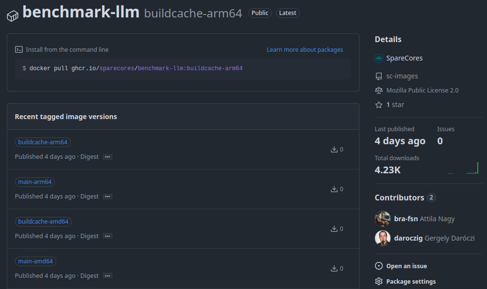
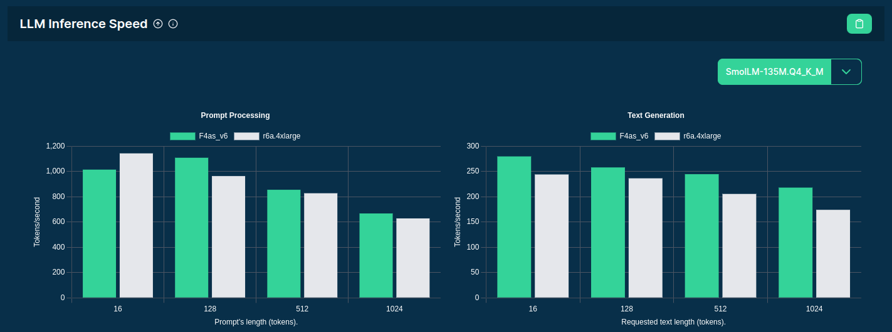
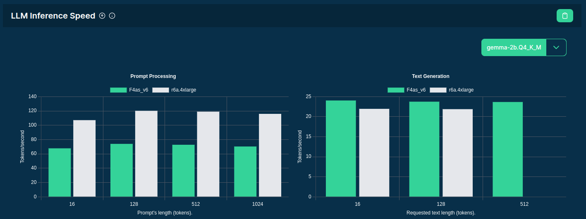
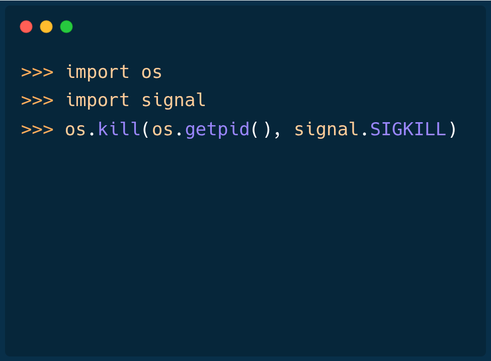
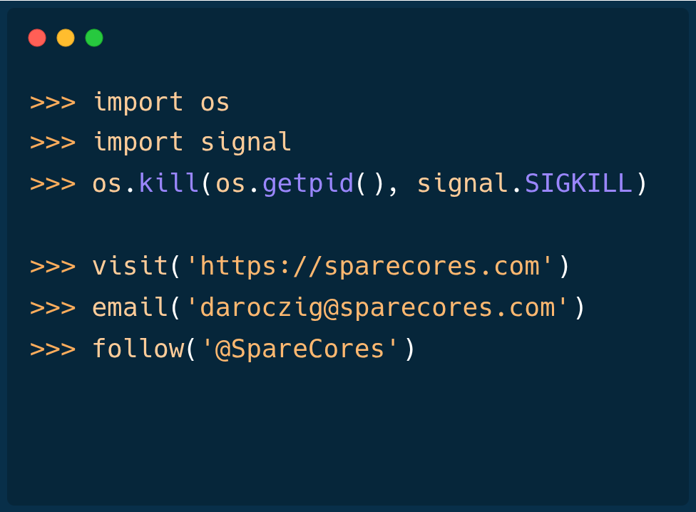
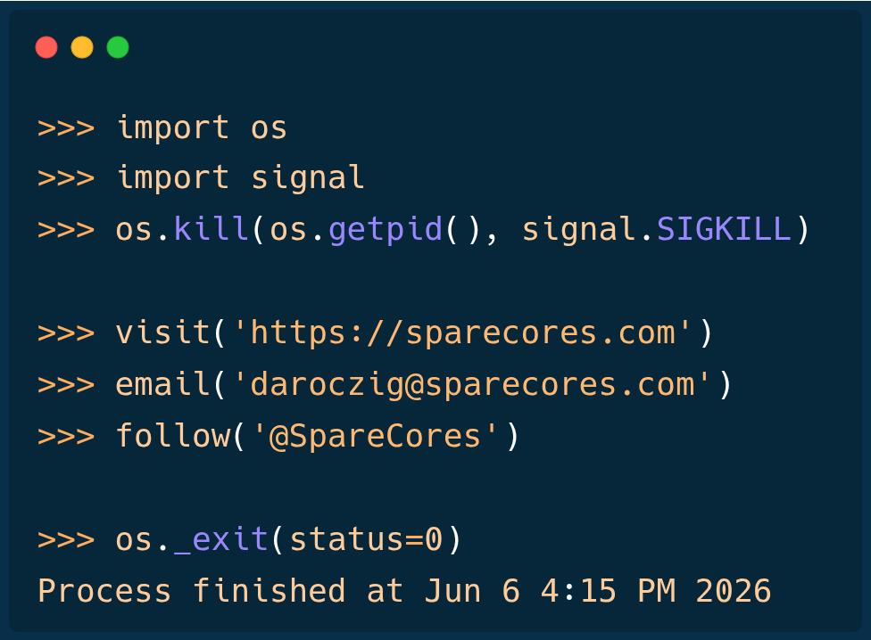

# {#cover-slide}

<script>
  // add custom CSS for the speaker view
  if (window.self !== window.top) {
    document.body.className += " speakerview";
  }
  // remove dummy slide
  document.getElementById("title-slide").remove();
</script>

::: {.centered}

:::

<h1 class="subtitle" style="font-family: 'Roboto Mono', monospace !important; color:#eee;font-size:1.25em;text-align: center; margin-top:300px; color:#34d399;">
  SELECT instance FROM cloud<br />WHERE workload = ?<br />ORDER BY cost_efficiency
</h1>

<h2 class="author" style="color:#eee;padding-top:65px;font-size:1.1em;text-align: center !important;margin-bottom: 0px;">
  Gergely Daroczi, Spare Cores
</h2>

<h3 class="author" style="color:#eee;font-size:1em;text-align: center !important; font-weight: normal;">
  Jun 6, 2026 @ PyData London 2026
</h3>

<h3 class="author onlineMode" style="color:#eee;padding-top:65px;font-size:1em;text-align: center !important; padding-top: 10px;font-weight: normal; ">
  Slides: <a href="https://sparecores.com/talks" target="_blank">sparecores.com/talks</a>
</h3>

<p class="author offlineMode" style="color:#eee;font-size:0.75em;text-align: right !important; padding-top: 0px;font-weight: normal;margin-top:30px; ">
  Press Space or click the green arrow icons to navigate the slides ->
</p>

::: {.notes}
hello everyone,
thanks for joining this session, it's good to see such a good crowd here!

... apologies, English is not my first language.
And actually, not even the second one .. I used to call R and recently more and more Python as second language, and just then comes English.

So when I was trying to figure out how to write a title that everyone in this room would perfectly understand...
especially given my heavy accent in English, despite the fact that I lived in London and Los Angeles as well for some time,
I decided to use a language we all have in common, which is probably still SQL.

I hope that works for all the Python, R, Rust and other folks in the room!

I also wanted to keep this talk up-to-the point, transparent and direct as much as possible,
so why don't we run this query and see what we get?

well, to do so, we need a database .. and fortunately, we have one:
Spare Cores curates a standardized dataset including cloud server types from multiple vendors,
pricing information, and performance metrics across over 500 workloads -- with open-licenses.

to answer the question: which is the most cost-efficient instance for a given workload,
such as running LLM inference using a 70B model, we need supporting data.
:::

# >>> import sqlite3

```sh {code-line-numbers="1|6-24|7-8|11-12|14-21|23-24|26-54|29,31,38,39,48|26-38,40-42,44-54|26-28,39,43,54|56-74|62|76-104|109-110" style="font-size:24px; margin-top: 20px !important; height: 640px;"}
$ sqlite3 spare-cores-navigator.db
SQLite version 3.46.1
Enter ".help" for usage hints.

sqlite> .mode table
sqlite> WITH prices AS (
  SELECT vendor_id, server_id, ROUND(AVG(price), 2) AS price FROM server_price
  WHERE allocation = 'ONDEMAND' GROUP BY vendor_id, server_id
),
workload AS (
  SELECT DISTINCT vendor_id, server_id, score FROM benchmark_score
  WHERE benchmark_id = 'llm_speed:text_generation' AND config = '{"model": "Llama-3.3-70B-Instruct-Q4_K_M.gguf", "tokens": 128}'
)
SELECT
  vendor_id, api_reference,
  vcpus, memory_amount/1024 AS memory, gpu_count, gpu_model, gpu_memory_total/1024 AS VRAM,
  ROUND(score, 2) AS score, price, ROUND(score / price, 4) AS "$ efficiency",
  ROUND(price / (score * 60 * 60 / 1_000_000 ), 4) AS "$ per 1M token"
FROM server
LEFT JOIN prices USING (vendor_id, server_id)
LEFT JOIN workload USING (vendor_id, server_id)
WHERE score IS NOT NULL
ORDER BY 11 ASC
LIMIT 25;

+-----------+--------------------------+-------+--------+-----------+--------------+------+-------+-------+--------------+----------------+
| vendor_id |      api_reference       | vcpus | memory | gpu_count |  gpu_model   | VRAM | score | price | $ efficiency | $ per 1M token |
+-----------+--------------------------+-------+--------+-----------+--------------+------+-------+-------+--------------+----------------+
| gcp       | a2-ultragpu-1g           | 12    | 170    | 1.0       | A100         | 80   | 24.47 | 1.36  | 17.9959      | 15.4356        |
| gcp       | a2-highgpu-2g            | 24    | 170    | 2.0       | A100         | 80   | 22.39 | 1.82  | 12.3027      | 22.5786        |
| ovh       | t2-le-90                 | 30    | 90     | 2.0       | V100S        | 64   | 18.65 | 1.6   | 11.6566      | 23.8301        |
| ovh       | t2-90                    | 30    | 90     | 2.0       | V100S        | 64   | 18.63 | 1.6   | 11.6414      | 23.8612        |
| ovh       | l40s-90                  | 15    | 90     | 1.0       | L40S         | 48   | 15.72 | 1.4   | 11.2273      | 24.7414        |
| ovh       | h100-380                 | 30    | 380    | 1.0       | H100         | 80   | 29.12 | 2.8   | 10.4015      | 26.7055        |
| gcp       | a2-ultragpu-2g           | 24    | 340    | 2.0       | A100         | 160  | 24.17 | 2.71  | 8.9172       | 31.1507        |
| ovh       | a10-90                   | 60    | 85     | 2.0       | A10          | 48   | 10.67 | 1.52  | 7.018        | 39.581         |
| ovh       | rtx5000-84               | 16    | 84     | 3.0       | RTX 5000     | 48   | 7.46  | 1.08  | 6.9072       | 40.2154        |
| aws       | g7e.4xlarge              | 16    | 128    | 1.0       | RTX Pro 6000 | 96   | 31.01 | 4.73  | 6.5553       | 42.3744        |
| hcloud    | ccx53                    | 32    | 128    | 0.0       |              |      | 2.36  | 0.38  | 6.2082       | 44.744         |
| ovh       | t1-le-180                | 32    | 180    | 4.0       | V100         | 64   | 16.77 | 2.8   | 5.9908       | 46.3677        |
| ovh       | t2-le-180                | 60    | 180    | 4.0       | V100S        | 128  | 18.53 | 3.2   | 5.792        | 47.9588        |
| ovh       | l40s-180                 | 30    | 180    | 2.0       | L40S         | 96   | 15.56 | 2.8   | 5.5579       | 49.9788        |
| hcloud    | ccx63                    | 48    | 192    | 0.0       |              |      | 3.19  | 0.58  | 5.4999       | 50.5062        |
| gcp       | a2-highgpu-4g            | 48    | 340    | 4.0       | A100         | 160  | 19.59 | 3.65  | 5.3683       | 51.7444        |
| gcp       | g2-standard-24           | 24    | 96     | 2.0       | L4           | 44   | 5.73  | 1.07  | 5.3593       | 51.8306        |
| ovh       | h100-760                 | 60    | 760    | 2.0       | H100         | 160  | 29.48 | 5.6   | 5.2637       | 52.7723        |
| aws       | g7e.8xlarge              | 32    | 256    | 1.0       | RTX Pro 6000 | 96   | 31.02 | 6.24  | 4.9709       | 55.8813        |
| azure     | Standard_NC24ads_A100_v4 | 24    | 220    | 1.0       | A100         | 80   | 23.05 | 4.71  | 4.8934       | 56.7656        |
| aws       | g6e.4xlarge              | 16    | 128    | 1.0       | L40S         | 44   | 15.91 | 3.44  | 4.6237       | 60.0765        |
| ovh       | l4-180                   | 45    | 180    | 2.0       | L4           | 48   | 5.78  | 1.5   | 3.8532       | 72.0904        |
| gcp       | a2-ultragpu-4g           | 48    | 680    | 4.0       | A100         | 320  | 20.78 | 5.42  | 3.8343       | 72.4462        |
| ovh       | a10-180                  | 120   | 170    | 4.0       | A10          | 96   | 10.73 | 3.04  | 3.528        | 78.7359        |
| ovh       | a10-45                   | 30    | 42     | 1.0       | A10          | 24   | 2.39  | 0.76  | 3.1439       | 88.3539        |
+-----------+--------------------------+-------+--------+-----------+--------------+------+-------+-------+--------------+----------------+

sqlite> WITH prices AS (
  SELECT vendor_id, server_id, ROUND(AVG(price), 2) AS price FROM server_price
  WHERE allocation = 'ONDEMAND' GROUP BY vendor_id, server_id
),
workload AS (
  SELECT DISTINCT vendor_id, server_id, score FROM benchmark_score
  WHERE benchmark_id = 'llm_speed:text_generation' AND config = '{"model": "gemma-2b.Q4_K_M.gguf", "tokens": 128}'
)
SELECT
  vendor_id, api_reference,
  vcpus, memory_amount/1024 AS memory, gpu_count, gpu_model, gpu_memory_total/1024 AS VRAM,
  ROUND(score, 2) AS score, price, ROUND(score / price, 4) AS "$ efficiency",
  ROUND(price / (score * 60 * 60 / 1_000_000 ), 4) AS "$ per 1M token"
FROM server
LEFT JOIN prices USING (vendor_id, server_id)
LEFT JOIN workload USING (vendor_id, server_id)
WHERE score IS NOT NULL
ORDER BY 11 ASC
LIMIT 25;

+-----------+-----------------------+-------+--------+-----------+-----------+------+--------+-------+--------------+----------------+
| vendor_id |     api_reference     | vcpus | memory | gpu_count | gpu_model | VRAM | score  | price | $ efficiency | $ per 1M token |
+-----------+-----------------------+-------+--------+-----------+-----------+------+--------+-------+--------------+----------------+
| hcloud    | cx33                  | 4     | 8      | 0.0       |           |      | 26.83  | 0.01  | 2682.7252    | 0.1035         |
| hcloud    | cx43                  | 8     | 16     | 0.0       |           |      | 45.35  | 0.02  | 2267.7165    | 0.1225         |
| hcloud    | cx53                  | 16    | 32     | 0.0       |           |      | 60.02  | 0.04  | 1500.5479    | 0.1851         |
| hcloud    | cx32                  | 4     | 8      | 0.0       |           |      | 12.32  | 0.01  | 1231.8573    | 0.2255         |
| hcloud    | cpx42                 | 8     | 16     | 0.0       |           |      | 53.83  | 0.05  | 1076.5084    | 0.258          |
| hcloud    | cax21                 | 4     | 8      | 0.0       |           |      | 10.31  | 0.01  | 1030.5204    | 0.2696         |
| hcloud    | cpx32                 | 4     | 8      | 0.0       |           |      | 30.75  | 0.03  | 1024.8748    | 0.271          |
| hcloud    | cpx21                 | 3     | 4      | 0.0       |           |      | 19.94  | 0.02  | 996.9937     | 0.2786         |
| hcloud    | cax31                 | 8     | 16     | 0.0       |           |      | 18.74  | 0.02  | 936.8434     | 0.2965         |
| hcloud    | cpx52                 | 12    | 24     | 0.0       |           |      | 73.21  | 0.08  | 915.1476     | 0.3035         |
| hcloud    | cpx62                 | 16    | 32     | 0.0       |           |      | 87.79  | 0.1   | 877.9221     | 0.3164         |
| hcloud    | cpx31                 | 4     | 8      | 0.0       |           |      | 26.01  | 0.03  | 866.9372     | 0.3204         |
| hcloud    | cpx22                 | 2     | 4      | 0.0       |           |      | 17.19  | 0.02  | 859.4776     | 0.3232         |
| hcloud    | cpx41                 | 8     | 16     | 0.0       |           |      | 38.09  | 0.05  | 761.7758     | 0.3646         |
| gcp       | g2-standard-4         | 4     | 16     | 1.0       | L4        | 22   | 129.61 | 0.18  | 720.0422     | 0.3858         |
| hcloud    | cx23                  | 2     | 4      | 0.0       |           |      | 6.87   | 0.01  | 686.9441     | 0.4044         |
| hcloud    | cx22                  | 2     | 4      | 0.0       |           |      | 6.24   | 0.01  | 624.3952     | 0.4449         |
| upcloud   | CLOUDNATIVE-2xCPU-4GB | 2     | 4      | 0.0       |           |      | 11.71  | 0.02  | 585.7258     | 0.4742         |
| hcloud    | cax41                 | 16    | 32     | 0.0       |           |      | 22.75  | 0.04  | 568.7028     | 0.4884         |
| hcloud    | cx42                  | 8     | 16     | 0.0       |           |      | 16.74  | 0.03  | 558.1032     | 0.4977         |
| hcloud    | cax11                 | 2     | 4      | 0.0       |           |      | 5.47   | 0.01  | 547.0548     | 0.5078         |
| hcloud    | cpx11                 | 2     | 2      | 0.0       |           |      | 4.91   | 0.01  | 490.7897     | 0.566          |
| hcloud    | ccx13                 | 2     | 8      | 0.0       |           |      | 9.69   | 0.02  | 484.6809     | 0.5731         |
| ovh       | rtx5000-28            | 4     | 28     | 1.0       | RTX 5000  | 16   | 158.95 | 0.36  | 441.5258     | 0.6291         |
| hcloud    | cpx51                 | 16    | 32     | 0.0       |           |      | 45.26  | 0.11  | 411.4147     | 0.6752         |
+-----------+-----------------------+-------+--------+-----------+-----------+------+--------+-------+--------------+----------------+


sqlite> -- Thank you, enjoy the buffet! *drops mic*
sqlite> .exit
```

## >>> assert dragons.location != "here"

Pricing details:

<ul>
  <li>spot prices (filtered for on-demand)</li>
  <li class="fragment">regional differences (calculated average of all regions)</li>
  <li class="fragment">monthly price caps (discounts) and reserved capacity</li>
  <li class="fragment">currency conversion (e.g. EUR pricing of Hetzner)</li>
  <li class="fragment">not taking into account storage cost (e.g. 70+ GB for `Llama-3.3-70B-Instruct-Q4_K_M.gguf`)</li>
  <li class="fragment">not taking into account egress cost (e.g. 1,000 tokens/sec easily bypasses 10 GB/month egress cost)</li>
</ul>

## >>> assert dragons.location != "here"

Missing data, e.g. due to:

<ul>
  <li>benchmarking failed (e.g. segfaulted)</li>
  <li class="fragment">we don't have money to start an instance</li>
  <li class="fragment">we don't have quota to start an instance</li>
  <li class="fragment">the vendor doesn't have capacity to start an instance</li>
  <li class="fragment">`pulumi` reported that the instance creation failed, but it silently ran for 3 days doing nothing and consumed 1000s of dollars</li>
</ul>

## >>> assert dragons.location != "here"

Benchmark methodology:

<ul>
  <li class="fragment">LLM inference speed via `llama.cpp` vs `vLLM`</li>
  <li class="fragment">single-user with batch size=1 vs parallel users</li>
  <li class="fragment">memory bandwidth effects vs GPU compute power</li>
</ul>

. . .

> We don't have answers to all questions,<br/>
> but we transparently report what we measure<br />
> and how we measure it,<br />
> so that you can trust, build on, or reproduce and extend our work.

# >>> getpass.getuser()

```{=html}
<div class="browser-frame">
  <div class="browser-toolbar">
    <span class="browser-nav">&#8249; &#8250; &#8635;</span>
    <div class="browser-url">https://daroczig.github.io/</div>
    <div class="browser-controls">
      <span class="browser-dot close"></span>
      <span class="browser-dot minimize"></span>
      <span class="browser-dot maximize"></span>
    </div>
  </div>
  <div class="browser-content">
    <iframe src="https://daroczig.github.io/"></iframe>
  </div>
</div>
<script>
(function () {
  const SLIDE_ID = 'getpass.getuser';

  function reloadHomepageIframe(slide) {
    const iframe = slide.querySelector('.browser-content iframe');
    if (!iframe) return;
    const baseUrl = iframe.src.split('?')[0];
    // Cache-bust to restart the animation; keep current content visible if reload fails.
    iframe.src = baseUrl + '?_=' + Date.now();
  }

  function onSlideShown(slide) {
    if (slide && slide.id === SLIDE_ID) {
      reloadHomepageIframe(slide);
    }
  }

  function registerRevealHooks() {
    if (typeof Reveal === 'undefined') {
      window.setTimeout(registerRevealHooks, 50);
      return;
    }
    Reveal.on('ready', function (event) {
      onSlideShown(event.currentSlide);
    });
    Reveal.on('slidechanged', function (event) {
      onSlideShown(event.currentSlide);
    });
  }

  registerRevealHooks();
})();
</script>
```

::: {.notes}
I'm personally very interested in optimizing cloud cost and resource utilization,
  which is important for business success and a greener future as well.
:::

## >>> while current != destination:

::: {.centered}

<p style="font-size: 1rem; margin-top: 10px;">Source: <a href="https://xkcd.com/1205/">xkcd [1025] Is It Worth the Time?</a></p>
:::

# >>> from sparecores import badges {#badges transition="convex-in convex-out"}

<ul style="font-size: 0.9em;">
  <li class="fragment" data-fragment-index=1>Funded by NGI Search (EU consortium) in 2024</li>
  <ul>
    <li class="fragment" data-fragment-index=1>Vendor independent, open-source project</li>
  </ul>
  <li class="fragment" data-fragment-index=2>Seal of Excellence from the European Commission in 2026</li>
  <li class="fragment" data-fragment-index=3>Accepted into the NVIDIA Inception Program since 2024</li>
  <li class="fragment" data-fragment-index=4>Beneficiary of cloud credits from 8 vendors (overall ~$100k)</li>
  <li class="fragment" data-fragment-index=5>20+ conference talks in 9 countries (e.g. Berlin Buzzwords, KCD)</li>
  <li class="fragment" data-fragment-index=6>Featured by The Pragmatic Engineer in Oct 2024</li>
  <li class="fragment" data-fragment-index=7>Jeff Barr (Chief Evangelist at AWS) on our Reddit post:</li>
</ul>

<blockquote class="fragment" data-fragment-index=7 style="margin-left: 40px;">
  This was awesome, thanks for sharing.
</blockquote>

::: {.notes}
first of all, just to build some credibility for the project:
we are committed to be vendor-agnostic, open-source, and transparent about our data
:::

# >>> from sparecores import intro {#intro transition="convex-in convex-out"}

<ul style="font-size: 0.9em;">
  <li class="fragment">Open-source tools, database schemas and documentation to inspect and inventory cloud vendors and their offerings, including pricing and measured performance.</li>
  <li class="fragment">Managed infrastructure, databases, APIs, SDKs, and web applications to make this data publicly accessible.</li>
  <li class="fragment">Open-source helpers to select, start and manage instances in your own environment.</li>
  <li class="fragment">Open-source Python/R packages and workflow orchestration extensions (e.g. Metaflow) to track resource usage and cost of DS/ML/AI jobs. Open-source tooling to right-size instances.</li>
  <li class="fragment">Add-on services to scale data science workflows, even without direct vendor engagement.</li>
</ul>

::: {.notes}
- so Spare Cores is an open-source ecosystem, including software, database schemas, guides,
- and actual databases if you don't want to run the ETL tooling yourself .. also providing APIs, SDKs etc to make it easier to query data
- unified CLI to start machines
- and working on an an optional SaaS offering built on the top of the open-source tooling for folks who would rather avoid registering with all cloud providers etc: give us a Docker image, a command to run, and you credit card .. all set, we will run it wherever it's cheapest.
:::

## >>> f"Hello, {name}!"

::: {.centered}

<p style="font-size: 1rem; margin-top: 10px;">Source: PyData Berlin 2025</p>
:::

# >>> from sparecores import navigator {transition="convex-in slide-out"}


<p class="centered" style="margin-top: -10px;">Source: <a href="https://sparecores.com">sparecores.com</a></p>

::: {.notes}
high level numbers about the data we collect and make available
:::

## >>> from sparecores import navigator

::: {.centered}

:::

<aside class="notes">
FTR this dataset was generated, collected, standardized, and published in public GHA if ou are interested in the details.
running around 100k jobs over 10k hours...
</aside>

## >>> from navigator.www import search

::: {.centered}
<a href="https://sparecores.com/servers" target="_blank">
  
</a>
:::

::: {.notes}
The easiest way to query this data is through our web component, as you can see on the screen ...

This is not only a list of servers, but you can filter, order, and search for specific instances.
We already show some performance metrics by default, along with the cost efficiency based on the spot or on-demand pricing.

Repro: https://sparecores.com/servers?architecture=x86_64&benchmark_score_min=10&memory_min=32&compliance_framework=hipaa&countries=GB&order_by=selected_benchmark_score_per_price&order_dir=desc&columns=75744272&benchmark=eyJpZCI6ImxsbV9zcGVlZDp0ZXh0X2dlbmVyYXRpb24iLCJjb25maWciOiJ7XCJtb2RlbFwiOiBcImdlbW1hLTJiLlE0X0tfTS5nZ3VmXCIsIFwidG9rZW5zXCI6IDUxMn0ifQ%3D%3D

https://sparecores.com/servers?architecture=x86_64&benchmark_score_min=10&memory_min=32&columns=75744272&benchmark=eyJpZCI6ImxsbV9zcGVlZDp0ZXh0X2dlbmVyYXRpb24iLCJjb25maWciOiJ7XCJtb2RlbFwiOiBcImdlbW1hLTJiLlE0X0tfTS5nZ3VmXCIsIFwidG9rZW5zXCI6IDUxMn0ifQ%3D%3D&best_price_allocation=MONTHLY

- architecture=x86_64
- memory_min=32
- benchmark: llm / text generation / gemma / 512 tokens
- benchmark_score_min: 10
- price_allocation: MONTHLY
- compliance_framework: hipaa
- countries: GB
:::

## >>> from navigator.www import server

::: {.centered}
<a href="https://sparecores.com/server/gcp/g2-standard-16" target="_blank">
  
</a>
:::

::: {.notes}
Clicking on a server shows you the technical details of the instance -- much more than what's provided publicly by the vendor, even more than what ChatGPT knows ... as we actually start each machine and inspect the hardware.
:::

## >>> from navigator.www import server

::: {.centered}
<a href="https://sparecores.com/server/gcp/g2-standard-16" target="_blank">
  
  
</a>
:::

## >>> from navigator.www import server

::: {.centered}
<a href="https://sparecores.com/server/gcp/g2-standard-16" target="_blank">
  
</a>
:::

::: {.notes}
Live and historical pricing
:::

## >>> from navigator.www import server

<!--
<iframe
 src="https://sparecores.com/embed/server/gcp/g2-standard-16/bw_mem"
 style="height: 510px; width: 100%; border: 1px solid #34d399; border-radius: 8px; min-height: 400px">
</iframe>
-->

::: {.centered}
<a href="https://sparecores.com/server/gcp/g2-standard-16" target="_blank">
  
</a>
:::

::: {.notes}
and we also run benchmark scenarios on the servers, e.g.:

- memory bandwidth of read, write and mixed operations using various block sizes and also including the related L1/L2/L3 cache amounts
- or benchmarking compression algos - having the compression ratio on the x axis, and the bandwidth on the y axis, it's clear that `zpaq` is a beast when it comes to compressing text, but might be slow on this machine
- OpenSSL hash functions and block ciphers
:::

## >>> from navigator.www import server

<a href="https://sparecores.com/server/gcp/g2-standard-16" target="_blank">
  
</a>

::: {.notes}
also running test suites like PassMark or ...
:::

## >>> from navigator.www import server

<a href="https://sparecores.com/server/gcp/g2-standard-16" target="_blank">
  
</a>

::: {.notes}
Geekbench 6, which has been a standard tool for some time including workloads for text and image processing, compiling software etc
:::

## >>> from navigator.www import server

<a href="https://sparecores.com/server/gcp/g2-standard-16" target="_blank">
  
</a>

::: {.notes}
visualizations on how well the machine can scale tasks to multiple CPU cores -- e.g. showing the diminishing return on this Intel Xeon due to hyperthreading
:::

## >>> from navigator.www import server

<a href="https://sparecores.com/server/gcp/g2-standard-16" target="_blank">
  
</a>

::: {.notes}
Or looking at LLM Inference Speed both for prompt processing and text generation,
using smaller models with 135M parameters up to 70B larger models.
:::

## >>> from navigator.www import server

<a href="https://sparecores.com/server/gcp/g2-standard-16" target="_blank">
  
</a>

::: {.notes}
and other application-specific benchmarks, like serving a static website or running a key-value store database
:::

## >>> from navigator.www import servers

::: {.centered}
<a href="https://sparecores.com/compare?instances=W3sidmVuZG9yIjoiYXdzIiwic2VydmVyIjoiYzVhZC4xMnhsYXJnZSJ9LHsidmVuZG9yIjoiYXdzIiwic2VydmVyIjoiYzVkLjJ4bGFyZ2UifSx7InZlbmRvciI6ImF3cyIsInNlcnZlciI6ImM2Zy4xNnhsYXJnZSJ9LHsidmVuZG9yIjoiaGNsb3VkIiwic2VydmVyIjoiY2N4MzMifV0%3D" target="_blank">
  
</a>
:::

::: {.notes}
and making all these data available in comparison tables,
e.g. you can see "Best performance servers for Redis below ¢50/hour" here
:::

## >>> from navigator.www import servers

::: {.centered}
<a href="https://sparecores.com/compare?instances=W3sidmVuZG9yIjoiYXdzIiwic2VydmVyIjoiYzVhZC4xMnhsYXJnZSJ9LHsidmVuZG9yIjoiYXdzIiwic2VydmVyIjoiYzVkLjJ4bGFyZ2UifSx7InZlbmRvciI6ImF3cyIsInNlcnZlciI6ImM2Zy4xNnhsYXJnZSJ9LHsidmVuZG9yIjoiaGNsb3VkIiwic2VydmVyIjoiY2N4MzMifV0%3D" target="_blank">
  
</a>
:::

::: {.notes}
or plots as well for human inspection
:::

## >>> from navigator import api

::: {.centered}

:::

::: {.notes}
for computers, we provide APIs ...
:::

## >>> from navigator import data

```py {code-line-numbers="2|3|4-6|7|10-11|16|21-29|30-34|36-39|41-60|53-54|62-69" style="margin-top: 20px !important; height: 640px;"}
>>> from rich import print as pp
>>> from sc_crawler.tables import Server
>>> from sc_data import db
>>> from sqlmodel import create_engine, Session, select
>>> engine = create_engine(f"sqlite:///{db.path}")
>>> session = Session(engine)
>>> server = session.exec(select(Server).where(Server.server_id == 'g4dn.xlarge')).one()
>>> pp(server)
Server(
    server_id='g4dn.xlarge',
    vendor_id='aws',
    display_name='g4dn.xlarge',
    api_reference='g4dn.xlarge',
    name='g4dn.xlarge',
    family='g4dn',
    description='Graphics intensive [Instance store volumes] [Network and EBS optimized] Gen4 xlarge',

    status=<Status.ACTIVE: 'active'>,
    observed_at=datetime.datetime(2024, 6, 6, 10, 18, 4, 127254),

    hypervisor='nitro',
    vcpus=4,
    cpu_cores=2,
    cpu_allocation=<CpuAllocation.DEDICATED: 'Dedicated'>,
    cpu_manufacturer='Intel',
    cpu_family='Xeon',
    cpu_model='8259CL',
    cpu_architecture=<CpuArchitecture.X86_64: 'x86_64'>,
    cpu_speed=3.5,
    cpu_l1i_cache=64,
    cpu_l1d_cache=32,
    cpu_l2_cache=2048,
    cpu_l3_cache=36608,
    cpu_flags=["fpu", "vme", "avx512", ...],

    memory_amount=16384,
    memory_generation=<DdrGeneration.DDR4: 'DDR4'>,
    memory_speed=3200,
    memory_ecc=None,

    gpu_count=1,
    gpu_memory_min=16384,
    gpu_memory_total=16384,
    gpu_manufacturer='Nvidia',
    gpu_family='Turing',
    gpu_model='Tesla T4',
    gpus=[
        {
            'manufacturer': 'Nvidia',
            'family': 'Turing',
            'model': 'Tesla T4',
            'memory': 15360,
            'firmware_version': '535.171.04',
            'bios_version': '90.04.96.00.A0',
            'graphics_clock': 1590,
            'sm_clock': 1590,
            'mem_clock': 5001,
            'video_clock': 1470
        }
    ],

    storage_size=125,
    storage_type=<StorageType.NVME_SSD: 'nvme ssd'>,
    storages=[{'size': 125, 'storage_type': 'nvme ssd'}],

    network_speed=5.0,
    inbound_traffic=0.0,
    outbound_traffic=0.0,
    ipv4=0,
)
```

::: {.notes}
and SDKs as well, e.g. querying the details of this instance type: SCROLL through!
:::

# >>> sparecores.navigator.\_\_dir\_\_() {#components transition="convex-in convex-out"}


::: {.notes}
As mentioned previously, this is made available via multiple components that
you can find on GitHub. We don't have time to go through all of them, but
I'd be happy to answer any related questions on Slack, or ping me on LinkedIn :)

WE will focus on the inspector now!
:::

# >>> from sc_inspector import llm {transition="convex-in slide-out"}

::: {.centered}

:::

<aside class="notes">
We have created a Docker image that includes llama.ccp build for various CPU architectures and CUDA as well -- so with a single command we can run this on x86, ARM, and most of the GPU-accelerated machines as well.
</aside>

## $ docker build -t llm-benchmark .

<ul>
  <li class="fragment">Multi-arch Docker build with x86 and ARM support.</li>
  <li class="fragment">Bundles `llama.cpp` binaries built for various CPU architectures and CUDA as well.</li>
  <ul style="font-size: 0.9em;">
    <li class="fragment">Recursive lookup of linked libraries from multiple parent images and mixing them in a single image under different paths 🫣</li>
  </ul>
  <li class="fragment">Python script to run the benchmark:</li>
  <ul style="font-size: 0.9em;">
    <li class="fragment">Hardware discovery to pick the correct binary, `$PATH` overrides.</li>
    <li class="fragment">Download models in a background thread, sequentially from Hugging Face with sane timeouts.</li>
  </ul>
</ul>

## >>> from benchmark-llm import models

<style>
td.file-size span.num {
  display: inline-block;
  min-width: 3em; /* Adjust width as needed */
  text-align: right;
  padding-right: 0.5em; /* Space before unit */
}
td.file-size span.unit {
  display: inline-block;
  min-width: 2em; /* Adjust width as needed */
  text-align: left;
}
</style>

<style>
td.file-size span.num,
td.param-size span.num {
  display: inline-block;
  min-width: 3em;
  text-align: right;
  padding-right: 5px;
}
td.file-size span.num {
  padding-right: 10px;
}
td.file-size span.unit,
td.param-size span.unit {
  display: inline-block;
  min-width: 2em;
  text-align: left;
}
</style>

<table style="margin-top: 50px; margin-bottom: -20px; font-size: 2rem; margin-left: 0px;">
  <thead>
    <tr>
      <th>Model</th>
      <th>Parameters</th>
      <th style="text-align: center;">File Size</th>
    </tr>
  </thead>
  <tbody>
    <tr>
      <td>SmolLM-135M.Q4_K_M.gguf</td>
      <td class="param-size"><span class="num">135</span><span class="unit">M</span></td>
      <td class="file-size"><span class="num">100</span><span class="unit">MB</span></td>
    </tr>
    <tr>
      <td>qwen1_5-0_5b-chat-q4_k_m.gguf</td>
      <td class="param-size"><span class="num">500</span><span class="unit">M</span></td>
      <td class="file-size"><span class="num">400</span><span class="unit">MB</span></td>
    </tr>
    <tr>
      <td>gemma-2b.Q4_K_M.gguf</td>
      <td class="param-size"><span class="num">2</span><span class="unit">B</span></td>
      <td class="file-size"><span class="num">1.5</span><span class="unit">GB</span></td>
    </tr>
    <tr>
      <td>llama-7b.Q4_K_M.gguf</td>
      <td class="param-size"><span class="num">7</span><span class="unit">B</span></td>
      <td class="file-size"><span class="num">4</span><span class="unit">GB</span></td>
    </tr>
    <tr>
      <td>phi-4-q4.gguf</td>
      <td class="param-size"><span class="num">14</span><span class="unit">B</span></td>
      <td class="file-size"><span class="num">9</span><span class="unit">GB</span></td>
    </tr>
    <tr>
      <td>Llama-3.3-70B-Instruct-Q4_K_M.gguf</td>
      <td class="param-size"><span class="num">70</span><span class="unit">B</span></td>
      <td class="file-size"><span class="num">42</span><span class="unit">GB</span></td>
    </tr>
  </tbody>
</table>

## $ docker build -t llm-benchmark .

<ul>
  <li>Multi-arch Docker build with x86 and ARM support.</li>
  <li>Bundles `llama.cpp` binaries built for various CPU architectures and CUDA as well.</li>
  <ul style="font-size: 0.9em;">
    <li>Recursive lookup of linked libraries from multiple parent images and mixing them in a single image under different paths 🫣</li>
  </ul>
  <li>Python script to run the benchmark:</li>
  <ul style="font-size: 0.9em;">
    <li>Hardware discovery to pick the correct binary, `$PATH` overrides.</li>
    <li>Download models in a background thread, sequentially from Hugging Face with sane timeouts.</li>
    <li class="fragment">Find optimal `ngl` setting for each model when GPU is available.</li>
    <li class="fragment">Run the benchmarks in sequence with sane timeouts.</li>
  </ul>
</ul>

<aside class="notes">
Describe how `ngl` was found!
</aside>


## >>> from benchmark-llm import workloads

<style>
.reveal table td.right {
  text-align: right;
}
</style>

:::: {.columns style="display: block; margin-top: 40px;"}

::: {.column width="50%" }

- Prompt processing

<table style="font-size: 2rem; margin-left: 0px;">
  <thead>
    <tr>
      <th>Token length</th>
      <th>Expected TPS</th>
    </tr>
  </thead>
  <tbody>
    <tr>
      <td class="right">16</td>
      <td class="right">2</td>
    </tr>
    <tr class="fragment">
      <td class="right">128</td>
      <td class="right">10</td>
    </tr>
    <tr class="fragment">
      <td class="right">512</td>
      <td class="right">25</td>
    </tr>
    <tr class="fragment">
      <td class="right">1,024</td>
      <td class="right">50</td>
    </tr>
    <tr class="fragment">
      <td class="right">4,096</td>
      <td class="right">250</td>
    </tr>
    <tr class="fragment">
      <td class="right">16,384</td>
      <td class="right">1,000</td>
    </tr>
  </tbody>
</table>

:::

::: {.column .fragment width="50%" }

- Text generation

<table style="font-size: 2rem; margin-left: 0px;">
  <thead>
    <tr>
      <th>Token length</th>
      <th>Expected TPS</th>
    </tr>
  </thead>
  <tbody>
    <tr>
      <td class="right">16</td>
      <td class="right">1</td>
    </tr>
    <tr>
      <td class="right">128</td>
      <td class="right">5</td>
    </tr>
    <tr>
      <td class="right">512</td>
      <td class="right">25</td>
    </tr>
    <tr>
      <td class="right">1,024</td>
      <td class="right">50</td>
    </tr>
    <tr>
      <td class="right">4,096</td>
      <td class="right">250</td>
    </tr>
  </tbody>
</table>

:::

::::

<div class="fragment">
<p style="margin-top: 20px;">Timeout: model load into memory (250 MB/s) + 5 iterations with expected TPS + 1s overhead</p>
</div>

## >>> from benchmark-llm import example

```shell {code-line-numbers="1-2|3-5,7|6|8-9|10|11|12|13-14|16-17|15,18-19|20-24|25|70-79|80-81" style="font-size:24px; margin-top: 50px; height: 620px;" }
2025-04-16 13:41:53,991 - INFO - Using CPU-build of llama.cpp
load_backend: loaded CPU backend from ./libggml-cpu-haswell.so
2025-04-16 13:41:54,017 - INFO - Benchmarking model SmolLM-135M.Q4_K_M.gguf ...
2025-04-16 13:41:54,019 - DEBUG - Downloading model SmolLM-135M.Q4_K_M.gguf from https://huggingface.co/QuantFactory/SmolLM-135M-GGUF/resolve/main/SmolLM-135M.Q4_K_M.gguf
2025-04-16 13:41:54,401 - DEBUG - Downloaded model SmolLM-135M.Q4_K_M.gguf (100.57 MB) in 0.38 sec (264.17 MB/s)
2025-04-16 13:41:54,403 - DEBUG - Downloading model qwen1_5-0_5b-chat-q4_k_m.gguf from https://huggingface.co/Qwen/Qwen1.5-0.5B-Chat-GGUF/resolve/main/qwen1_5-0_5b-chat-q4_k_m.gguf
2025-04-16 13:41:54,404 - DEBUG - Model SmolLM-135M.Q4_K_M.gguf found at /models/SmolLM-135M.Q4_K_M.gguf (0.10 GB)
2025-04-16 13:41:54,404 - DEBUG - Using ngl 0 for model SmolLM-135M.Q4_K_M.gguf
2025-04-16 13:41:54,404 - DEBUG - Benchmarking prompt processing with 16 tokens for max 41 sec
2025-04-16 13:41:54,773 - DEBUG - Benchmarking prompt processing with 128 tokens for max 65 sec
2025-04-16 13:41:56,499 - DEBUG - Benchmarking prompt processing with 512 tokens for max 104 sec
2025-04-16 13:42:03,289 - DEBUG - Benchmarking prompt processing with 1024 tokens for max 104 sec
2025-04-16 13:42:03,637 - DEBUG - Downloaded model qwen1_5-0_5b-chat-q4_k_m.gguf (388.29 MB) in 9.23 sec (42.05 MB/s)
2025-04-16 13:42:03,684 - DEBUG - Downloading model gemma-2b.Q4_K_M.gguf from https://huggingface.co/mlabonne/gemma-2b-GGUF/resolve/main/gemma-2b.Q4_K_M.gguf
2025-04-16 13:42:20,270 - DEBUG - Benchmarking prompt processing with 4096 tokens for max 83 sec
2025-04-16 13:42:54,763 - DEBUG - Downloaded model gemma-2b.Q4_K_M.gguf (1425.83 MB) in 51.08 sec (27.91 MB/s)
2025-04-16 13:42:54,860 - DEBUG - Downloading model llama-7b.Q4_K_M.gguf from https://huggingface.co/TheBloke/LLaMA-7b-GGUF/resolve/main/llama-7b.Q4_K_M.gguf
2025-04-16 13:43:43,279 - ERROR - Error: Command '['./llama-bench', '-t', '4', '-sm', 'layer', '-fa', '1', '-ub', '512', '-b', '2048', '-o', 'jsonl', '-m', '/models/SmolLM-135M.Q4_K_M.gguf', '-ngl', '0', '-p', '4096', '-n', '0']' timed out after 82.99997042499999 seconds
2025-04-16 13:43:43,279 - INFO - Skipping prompt processing benchmarks with 4096+ tokens due to time constraints.
2025-04-16 13:43:43,279 - DEBUG - Benchmarking text generation with 16 tokens for max 81 sec
2025-04-16 13:43:43,997 - DEBUG - Benchmarking text generation with 128 tokens for max 129 sec
2025-04-16 13:43:47,728 - DEBUG - Benchmarking text generation with 512 tokens for max 104 sec
2025-04-16 13:44:04,864 - DEBUG - Benchmarking text generation with 1024 tokens for max 104 sec
2025-04-16 13:44:45,497 - ERROR - Skipping text generation benchmarks with 1024+ tokens as it's unlikely to hit the expected 250 tokens/sec.
2025-04-16 13:44:45,497 - INFO - Benchmarking model qwen1_5-0_5b-chat-q4_k_m.gguf ...
2025-04-16 13:44:45,501 - DEBUG - Model qwen1_5-0_5b-chat-q4_k_m.gguf found at /models/qwen1_5-0_5b-chat-q4_k_m.gguf (0.38 GB)
2025-04-16 13:44:45,501 - DEBUG - Using ngl 0 for model qwen1_5-0_5b-chat-q4_k_m.gguf
2025-04-16 13:44:45,501 - DEBUG - Benchmarking prompt processing with 16 tokens for max 43 sec
2025-04-16 13:44:47,523 - DEBUG - Benchmarking prompt processing with 128 tokens for max 67 sec
2025-04-16 13:44:48,115 - DEBUG - Downloaded model llama-7b.Q4_K_M.gguf (3891.95 MB) in 113.23 sec (34.37 MB/s)
2025-04-16 13:44:48,167 - DEBUG - Downloading model phi-4-q4.gguf from https://huggingface.co/microsoft/phi-4-gguf/resolve/main/phi-4-q4.gguf
2025-04-16 13:44:51,206 - DEBUG - Benchmarking prompt processing with 512 tokens for max 105 sec
2025-04-16 13:45:05,527 - DEBUG - Benchmarking prompt processing with 1024 tokens for max 105 sec
2025-04-16 13:45:38,910 - ERROR - Skipping prompt processing benchmarks with 1024+ tokens as it's unlikely to hit the expected 250 tokens/sec.
2025-04-16 13:45:38,911 - DEBUG - Benchmarking text generation with 16 tokens for max 83 sec
2025-04-16 13:45:40,231 - DEBUG - Benchmarking text generation with 128 tokens for max 131 sec
2025-04-16 13:45:48,681 - DEBUG - Benchmarking text generation with 512 tokens for max 105 sec
2025-04-16 13:46:25,599 - DEBUG - Benchmarking text generation with 1024 tokens for max 105 sec
2025-04-16 13:47:58,761 - ERROR - Skipping text generation benchmarks with 1024+ tokens as it's unlikely to hit the expected 250 tokens/sec.
2025-04-16 13:47:58,761 - INFO - Benchmarking model gemma-2b.Q4_K_M.gguf ...
2025-04-16 13:47:58,765 - DEBUG - Model gemma-2b.Q4_K_M.gguf found at /models/gemma-2b.Q4_K_M.gguf (1.39 GB)
2025-04-16 13:47:58,765 - DEBUG - Using ngl 0 for model gemma-2b.Q4_K_M.gguf
2025-04-16 13:47:58,765 - DEBUG - Benchmarking prompt processing with 16 tokens for max 47 sec
2025-04-16 13:48:02,795 - DEBUG - Benchmarking prompt processing with 128 tokens for max 71 sec
2025-04-16 13:48:18,069 - DEBUG - Benchmarking prompt processing with 512 tokens for max 109 sec
2025-04-16 13:49:18,691 - DEBUG - Benchmarking prompt processing with 1024 tokens for max 109 sec
2025-04-16 13:51:07,724 - ERROR - Error: Command '['./llama-bench', '-t', '4', '-sm', 'layer', '-fa', '1', '-ub', '512', '-b', '2048', '-o', 'jsonl', '-m', '/models/gemma-2b.Q4_K_M.gguf', '-ngl', '0', '-p', '1024', '-n', '0']' timed out after 108.99997727900006 seconds
2025-04-16 13:51:07,724 - INFO - Skipping prompt processing benchmarks with 1024+ tokens due to time constraints.
2025-04-16 13:51:07,724 - DEBUG - Benchmarking text generation with 16 tokens for max 87 sec
2025-04-16 13:51:11,557 - DEBUG - Benchmarking text generation with 128 tokens for max 135 sec
2025-04-16 13:51:36,713 - DEBUG - Benchmarking text generation with 512 tokens for max 109 sec
2025-04-16 13:52:31,657 - DEBUG - Downloaded model phi-4-q4.gguf (8633.72 MB) in 463.27 sec (18.64 MB/s)
2025-04-16 13:52:31,783 - DEBUG - Downloading model Llama-3.3-70B-Instruct-Q4_K_M.gguf from https://huggingface.co/unsloth/Llama-3.3-70B-Instruct-GGUF/resolve/main/Llama-3.3-70B-Instruct-Q4_K_M.gguf
2025-04-16 13:53:17,342 - DEBUG - Benchmarking text generation with 1024 tokens for max 109 sec
2025-04-16 13:55:06,375 - ERROR - Error: Command '['./llama-bench', '-t', '4', '-sm', 'layer', '-fa', '1', '-ub', '512', '-b', '2048', '-o', 'jsonl', '-m', '/models/gemma-2b.Q4_K_M.gguf', '-ngl', '0', '-n', '1024', '-p', '0']' timed out after 108.99998397000002 seconds
2025-04-16 13:55:06,375 - INFO - Skipping text generation benchmarks with 1024+ tokens due to time constraints.
2025-04-16 13:55:06,375 - INFO - Benchmarking model llama-7b.Q4_K_M.gguf ...
2025-04-16 13:55:06,378 - DEBUG - Model llama-7b.Q4_K_M.gguf found at /models/llama-7b.Q4_K_M.gguf (3.80 GB)
2025-04-16 13:55:06,378 - DEBUG - Using ngl 0 for model llama-7b.Q4_K_M.gguf
2025-04-16 13:55:06,378 - DEBUG - Benchmarking prompt processing with 16 tokens for max 56 sec
2025-04-16 13:55:17,076 - DEBUG - Benchmarking prompt processing with 128 tokens for max 80 sec
2025-04-16 13:56:05,012 - DEBUG - Benchmarking prompt processing with 512 tokens for max 119 sec
2025-04-16 13:58:04,139 - ERROR - Error: Command '['./llama-bench', '-t', '4', '-sm', 'layer', '-fa', '1', '-ub', '512', '-b', '2048', '-o', 'jsonl', '-m', '/models/llama-7b.Q4_K_M.gguf', '-ngl', '0', '-p', '512', '-n', '0']' timed out after 118.99998227699996 seconds
2025-04-16 13:58:04,140 - INFO - Skipping prompt processing benchmarks with 512+ tokens due to time constraints.
2025-04-16 13:58:04,140 - DEBUG - Benchmarking text generation with 16 tokens for max 96 sec
2025-04-16 13:58:13,091 - DEBUG - Benchmarking text generation with 128 tokens for max 144 sec
2025-04-16 13:59:20,008 - DEBUG - Benchmarking text generation with 512 tokens for max 119 sec
2025-04-16 14:01:19,103 - ERROR - Error: Command '['./llama-bench', '-t', '4', '-sm', 'layer', '-fa', '1', '-ub', '512', '-b', '2048', '-o', 'jsonl', '-m', '/models/llama-7b.Q4_K_M.gguf', '-ngl', '0', '-n', '512', '-p', '0']' timed out after 118.99996960299995 seconds
2025-04-16 14:01:19,103 - INFO - Skipping text generation benchmarks with 512+ tokens due to time constraints.
2025-04-16 14:01:19,103 - INFO - Benchmarking model phi-4-q4.gguf ...
2025-04-16 14:01:19,108 - DEBUG - Model phi-4-q4.gguf found at /models/phi-4-q4.gguf (8.43 GB)
2025-04-16 14:01:19,108 - DEBUG - Using ngl 0 for model phi-4-q4.gguf
2025-04-16 14:01:19,108 - DEBUG - Benchmarking prompt processing with 16 tokens for max 75 sec
2025-04-16 14:02:22,300 - DEBUG - Benchmarking prompt processing with 128 tokens for max 99 sec
2025-04-16 14:04:01,479 - ERROR - Error: Command '['./llama-bench', '-t', '4', '-sm', 'layer', '-fa', '1', '-ub', '512', '-b', '2048', '-o', 'jsonl', '-m', '/models/phi-4-q4.gguf', '-ngl', '0', '-p', '128', '-n', '0']' timed out after 98.99997493299998 seconds
2025-04-16 14:04:01,490 - INFO - Skipping prompt processing benchmarks with 128+ tokens due to time constraints.
2025-04-16 14:04:01,491 - DEBUG - Benchmarking text generation with 16 tokens for max 115 sec
2025-04-16 14:05:56,724 - ERROR - Error: Command '['./llama-bench', '-t', '4', '-sm', 'layer', '-fa', '1', '-ub', '512', '-b', '2048', '-o', 'jsonl', '-m', '/models/phi-4-q4.gguf', '-ngl', '0', '-n', '16', '-p', '0']' timed out after 114.99991323800009 seconds
2025-04-16 14:05:56,729 - INFO - Benchmarking failed with simplest task, so skipping larger models.
2025-04-16 14:05:56,732 - INFO - Received interrupt signal, cleaning up...
2025-04-16 14:05:56,734 - DEBUG - Deleted partially downloaded model file: Llama-3.3-70B-Instruct-Q4_K_M.gguf.part
```

<p style="font-size: 1rem; margin-top: 10px;">Source: <a href="https://github.com/SpareCores/sc-inspector-data/blob/main/data/hcloud/cpx31/llm/stderr">https://github.com/SpareCores/sc-inspector-data/blob/main/data/hcloud/cpx31/llm/stderr</a></p>

## >>> from benchmark-llm import example


```shell {code-line-numbers="1-1" style="font-size:24px; margin-top: 50px; height: 620px;" }
{"build_commit": "51f311e0", "build_number": 4753, "cpu_info": "AMD EPYC-Rome Processor", "gpu_info": "", "backends": "CPU", "model_filename": "/models/SmolLM-135M.Q4_K_M.gguf", "model_type": "llama ?B Q4_K - Medium", "model_size": 103668480, "model_n_params": 134515008, "n_batch": 2048, "n_ubatch": 512, "n_threads": 4, "cpu_mask": "0x0", "cpu_strict": false, "poll": 50, "type_k": "f16", "type_v": "f16", "n_gpu_layers": 0, "split_mode": "layer", "main_gpu": 0, "no_kv_offload": false, "flash_attn": true, "tensor_split": "0.00", "use_mmap": true, "embeddings": false, "n_prompt": 16, "n_gen": 0, "test_time": "2025-04-16T13:41:54Z", "avg_ns": 29425803, "stddev_ns": 2633928, "avg_ts": 547.524574, "stddev_ts": 52.956226, "samples_ns": [ 31321572, 31803362, 29934339, 25189353, 28880389 ],"samples_ts": [ 510.83, 503.091, 534.503, 635.189, 554.009 ]}
{"build_commit": "51f311e0", "build_number": 4753, "cpu_info": "AMD EPYC-Rome Processor", "gpu_info": "", "backends": "CPU", "model_filename": "/models/SmolLM-135M.Q4_K_M.gguf", "model_type": "llama ?B Q4_K - Medium", "model_size": 103668480, "model_n_params": 134515008, "n_batch": 2048, "n_ubatch": 512, "n_threads": 4, "cpu_mask": "0x0", "cpu_strict": false, "poll": 50, "type_k": "f16", "type_v": "f16", "n_gpu_layers": 0, "split_mode": "layer", "main_gpu": 0, "no_kv_offload": false, "flash_attn": true, "tensor_split": "0.00", "use_mmap": true, "embeddings": false, "n_prompt": 128, "n_gen": 0, "test_time": "2025-04-16T13:41:54Z", "avg_ns": 233632645, "stddev_ns": 9120854, "avg_ts": 548.527531, "stddev_ts": 21.101188, "samples_ns": [ 240395549, 227846673, 224613694, 246016255, 229291056 ],"samples_ts": [ 532.456, 561.781, 569.867, 520.291, 558.242 ]}
{"build_commit": "51f311e0", "build_number": 4753, "cpu_info": "AMD EPYC-Rome Processor", "gpu_info": "", "backends": "CPU", "model_filename": "/models/SmolLM-135M.Q4_K_M.gguf", "model_type": "llama ?B Q4_K - Medium", "model_size": 103668480, "model_n_params": 134515008, "n_batch": 2048, "n_ubatch": 512, "n_threads": 4, "cpu_mask": "0x0", "cpu_strict": false, "poll": 50, "type_k": "f16", "type_v": "f16", "n_gpu_layers": 0, "split_mode": "layer", "main_gpu": 0, "no_kv_offload": false, "flash_attn": true, "tensor_split": "0.00", "use_mmap": true, "embeddings": false, "n_prompt": 512, "n_gen": 0, "test_time": "2025-04-16T13:41:56Z", "avg_ns": 1107877439, "stddev_ns": 34935205, "avg_ts": 462.513620, "stddev_ts": 14.616548, "samples_ns": [ 1127364831, 1064661879, 1081647591, 1114166670, 1151546228 ],"samples_ts": [ 454.156, 480.904, 473.352, 459.536, 444.62 ]}
{"build_commit": "51f311e0", "build_number": 4753, "cpu_info": "AMD EPYC-Rome Processor", "gpu_info": "", "backends": "CPU", "model_filename": "/models/SmolLM-135M.Q4_K_M.gguf", "model_type": "llama ?B Q4_K - Medium", "model_size": 103668480, "model_n_params": 134515008, "n_batch": 2048, "n_ubatch": 512, "n_threads": 4, "cpu_mask": "0x0", "cpu_strict": false, "poll": 50, "type_k": "f16", "type_v": "f16", "n_gpu_layers": 0, "split_mode": "layer", "main_gpu": 0, "no_kv_offload": false, "flash_attn": true, "tensor_split": "0.00", "use_mmap": true, "embeddings": false, "n_prompt": 1024, "n_gen": 0, "test_time": "2025-04-16T13:42:03Z", "avg_ns": 2735385583, "stddev_ns": 125973030, "avg_ts": 374.988808, "stddev_ts": 17.260522, "samples_ns": [ 2832889408, 2740268018, 2604040465, 2615189266, 2884540762 ],"samples_ts": [ 361.468, 373.686, 393.235, 391.559, 354.996 ]}
{"build_commit": "51f311e0", "build_number": 4753, "cpu_info": "AMD EPYC-Rome Processor", "gpu_info": "", "backends": "CPU", "model_filename": "/models/SmolLM-135M.Q4_K_M.gguf", "model_type": "llama ?B Q4_K - Medium", "model_size": 103668480, "model_n_params": 134515008, "n_batch": 2048, "n_ubatch": 512, "n_threads": 4, "cpu_mask": "0x0", "cpu_strict": false, "poll": 50, "type_k": "f16", "type_v": "f16", "n_gpu_layers": 0, "split_mode": "layer", "main_gpu": 0, "no_kv_offload": false, "flash_attn": true, "tensor_split": "0.00", "use_mmap": true, "embeddings": false, "n_prompt": 0, "n_gen": 16, "test_time": "2025-04-16T13:43:43Z", "avg_ns": 87002061, "stddev_ns": 6566828, "avg_ts": 184.729581, "stddev_ts": 13.687935, "samples_ns": [ 92503974, 95323826, 80012676, 84203122, 82966710 ],"samples_ts": [ 172.966, 167.849, 199.968, 190.017, 192.848 ]}
{"build_commit": "51f311e0", "build_number": 4753, "cpu_info": "AMD EPYC-Rome Processor", "gpu_info": "", "backends": "CPU", "model_filename": "/models/SmolLM-135M.Q4_K_M.gguf", "model_type": "llama ?B Q4_K - Medium", "model_size": 103668480, "model_n_params": 134515008, "n_batch": 2048, "n_ubatch": 512, "n_threads": 4, "cpu_mask": "0x0", "cpu_strict": false, "poll": 50, "type_k": "f16", "type_v": "f16", "n_gpu_layers": 0, "split_mode": "layer", "main_gpu": 0, "no_kv_offload": false, "flash_attn": true, "tensor_split": "0.00", "use_mmap": true, "embeddings": false, "n_prompt": 0, "n_gen": 128, "test_time": "2025-04-16T13:43:44Z", "avg_ns": 690783893, "stddev_ns": 8557061, "avg_ts": 185.319590, "stddev_ts": 2.306403, "samples_ns": [ 698437313, 689595912, 678290911, 688381890, 699213443 ],"samples_ts": [ 183.266, 185.616, 188.71, 185.943, 183.063 ]}
{"build_commit": "51f311e0", "build_number": 4753, "cpu_info": "AMD EPYC-Rome Processor", "gpu_info": "", "backends": "CPU", "model_filename": "/models/SmolLM-135M.Q4_K_M.gguf", "model_type": "llama ?B Q4_K - Medium", "model_size": 103668480, "model_n_params": 134515008, "n_batch": 2048, "n_ubatch": 512, "n_threads": 4, "cpu_mask": "0x0", "cpu_strict": false, "poll": 50, "type_k": "f16", "type_v": "f16", "n_gpu_layers": 0, "split_mode": "layer", "main_gpu": 0, "no_kv_offload": false, "flash_attn": true, "tensor_split": "0.00", "use_mmap": true, "embeddings": false, "n_prompt": 0, "n_gen": 512, "test_time": "2025-04-16T13:43:47Z", "avg_ns": 3370098262, "stddev_ns": 97732646, "avg_ts": 152.023246, "stddev_ts": 4.263015, "samples_ns": [ 3326730840, 3297454249, 3357141922, 3328364047, 3540800254 ],"samples_ts": [ 153.905, 155.271, 152.511, 153.829, 144.6 ]}
{"build_commit": "51f311e0", "build_number": 4753, "cpu_info": "AMD EPYC-Rome Processor", "gpu_info": "", "backends": "CPU", "model_filename": "/models/SmolLM-135M.Q4_K_M.gguf", "model_type": "llama ?B Q4_K - Medium", "model_size": 103668480, "model_n_params": 134515008, "n_batch": 2048, "n_ubatch": 512, "n_threads": 4, "cpu_mask": "0x0", "cpu_strict": false, "poll": 50, "type_k": "f16", "type_v": "f16", "n_gpu_layers": 0, "split_mode": "layer", "main_gpu": 0, "no_kv_offload": false, "flash_attn": true, "tensor_split": "0.00", "use_mmap": true, "embeddings": false, "n_prompt": 0, "n_gen": 1024, "test_time": "2025-04-16T13:44:04Z", "avg_ns": 8001929540, "stddev_ns": 262150259, "avg_ts": 128.079991, "stddev_ts": 4.231092, "samples_ns": [ 8287642141, 8221401731, 7906358169, 7635775657, 7958470003 ],"samples_ts": [ 123.557, 124.553, 129.516, 134.106, 128.668 ]}
{"build_commit": "51f311e0", "build_number": 4753, "cpu_info": "AMD EPYC-Rome Processor", "gpu_info": "", "backends": "CPU", "model_filename": "/models/qwen1_5-0_5b-chat-q4_k_m.gguf", "model_type": "qwen2 0.5B Q4_K - Medium", "model_size": 401210368, "model_n_params": 619570176, "n_batch": 2048, "n_ubatch": 512, "n_threads": 4, "cpu_mask": "0x0", "cpu_strict": false, "poll": 50, "type_k": "f16", "type_v": "f16", "n_gpu_layers": 0, "split_mode": "layer", "main_gpu": 0, "no_kv_offload": false, "flash_attn": true, "tensor_split": "0.00", "use_mmap": true, "embeddings": false, "n_prompt": 16, "n_gen": 0, "test_time": "2025-04-16T13:44:46Z", "avg_ns": 67276867, "stddev_ns": 1251593, "avg_ts": 237.888581, "stddev_ts": 4.393434, "samples_ns": [ 66863667, 66620213, 67924660, 69093364, 65882433 ],"samples_ts": [ 239.293, 240.167, 235.555, 231.571, 242.857 ]}
{"build_commit": "51f311e0", "build_number": 4753, "cpu_info": "AMD EPYC-Rome Processor", "gpu_info": "", "backends": "CPU", "model_filename": "/models/qwen1_5-0_5b-chat-q4_k_m.gguf", "model_type": "qwen2 0.5B Q4_K - Medium", "model_size": 401210368, "model_n_params": 619570176, "n_batch": 2048, "n_ubatch": 512, "n_threads": 4, "cpu_mask": "0x0", "cpu_strict": false, "poll": 50, "type_k": "f16", "type_v": "f16", "n_gpu_layers": 0, "split_mode": "layer", "main_gpu": 0, "no_kv_offload": false, "flash_attn": true, "tensor_split": "0.00", "use_mmap": true, "embeddings": false, "n_prompt": 128, "n_gen": 0, "test_time": "2025-04-16T13:44:47Z", "avg_ns": 511944655, "stddev_ns": 5021439, "avg_ts": 250.046093, "stddev_ts": 2.429916, "samples_ns": [ 520395778, 511979406, 509989116, 507215609, 510143370 ],"samples_ts": [ 245.967, 250.01, 250.986, 252.358, 250.91 ]}
{"build_commit": "51f311e0", "build_number": 4753, "cpu_info": "AMD EPYC-Rome Processor", "gpu_info": "", "backends": "CPU", "model_filename": "/models/qwen1_5-0_5b-chat-q4_k_m.gguf", "model_type": "qwen2 0.5B Q4_K - Medium", "model_size": 401210368, "model_n_params": 619570176, "n_batch": 2048, "n_ubatch": 512, "n_threads": 4, "cpu_mask": "0x0", "cpu_strict": false, "poll": 50, "type_k": "f16", "type_v": "f16", "n_gpu_layers": 0, "split_mode": "layer", "main_gpu": 0, "no_kv_offload": false, "flash_attn": true, "tensor_split": "0.00", "use_mmap": true, "embeddings": false, "n_prompt": 512, "n_gen": 0, "test_time": "2025-04-16T13:44:51Z", "avg_ns": 2303963981, "stddev_ns": 45209596, "avg_ts": 222.294383, "stddev_ts": 4.376013, "samples_ns": [ 2359587656, 2328058309, 2312741678, 2275658058, 2243774208 ],"samples_ts": [ 216.987, 219.926, 221.382, 224.99, 228.187 ]}
{"build_commit": "51f311e0", "build_number": 4753, "cpu_info": "AMD EPYC-Rome Processor", "gpu_info": "", "backends": "CPU", "model_filename": "/models/qwen1_5-0_5b-chat-q4_k_m.gguf", "model_type": "qwen2 0.5B Q4_K - Medium", "model_size": 401210368, "model_n_params": 619570176, "n_batch": 2048, "n_ubatch": 512, "n_threads": 4, "cpu_mask": "0x0", "cpu_strict": false, "poll": 50, "type_k": "f16", "type_v": "f16", "n_gpu_layers": 0, "split_mode": "layer", "main_gpu": 0, "no_kv_offload": false, "flash_attn": true, "tensor_split": "0.00", "use_mmap": true, "embeddings": false, "n_prompt": 1024, "n_gen": 0, "test_time": "2025-04-16T13:45:05Z", "avg_ns": 5487183417, "stddev_ns": 37689507, "avg_ts": 186.623698, "stddev_ts": 1.275571, "samples_ns": [ 5449746916, 5474790612, 5547228579, 5497393560, 5466757421 ],"samples_ts": [ 187.899, 187.039, 184.597, 186.27, 187.314 ]}
{"build_commit": "51f311e0", "build_number": 4753, "cpu_info": "AMD EPYC-Rome Processor", "gpu_info": "", "backends": "CPU", "model_filename": "/models/qwen1_5-0_5b-chat-q4_k_m.gguf", "model_type": "qwen2 0.5B Q4_K - Medium", "model_size": 401210368, "model_n_params": 619570176, "n_batch": 2048, "n_ubatch": 512, "n_threads": 4, "cpu_mask": "0x0", "cpu_strict": false, "poll": 50, "type_k": "f16", "type_v": "f16", "n_gpu_layers": 0, "split_mode": "layer", "main_gpu": 0, "no_kv_offload": false, "flash_attn": true, "tensor_split": "0.00", "use_mmap": true, "embeddings": false, "n_prompt": 0, "n_gen": 16, "test_time": "2025-04-16T13:45:39Z", "avg_ns": 175408498, "stddev_ns": 3296649, "avg_ts": 91.241421, "stddev_ts": 1.714235, "samples_ns": [ 177546108, 179614622, 175199022, 171256868, 173425870 ],"samples_ts": [ 90.1174, 89.0796, 91.3247, 93.4269, 92.2584 ]}
{"build_commit": "51f311e0", "build_number": 4753, "cpu_info": "AMD EPYC-Rome Processor", "gpu_info": "", "backends": "CPU", "model_filename": "/models/qwen1_5-0_5b-chat-q4_k_m.gguf", "model_type": "qwen2 0.5B Q4_K - Medium", "model_size": 401210368, "model_n_params": 619570176, "n_batch": 2048, "n_ubatch": 512, "n_threads": 4, "cpu_mask": "0x0", "cpu_strict": false, "poll": 50, "type_k": "f16", "type_v": "f16", "n_gpu_layers": 0, "split_mode": "layer", "main_gpu": 0, "no_kv_offload": false, "flash_attn": true, "tensor_split": "0.00", "use_mmap": true, "embeddings": false, "n_prompt": 0, "n_gen": 128, "test_time": "2025-04-16T13:45:40Z", "avg_ns": 1549490379, "stddev_ns": 30772494, "avg_ts": 82.633558, "stddev_ts": 1.621123, "samples_ns": [ 1540490469, 1555864331, 1515722193, 1598212797, 1537162108 ],"samples_ts": [ 83.0904, 82.2694, 84.4482, 80.0895, 83.2703 ]}
{"build_commit": "51f311e0", "build_number": 4753, "cpu_info": "AMD EPYC-Rome Processor", "gpu_info": "", "backends": "CPU", "model_filename": "/models/qwen1_5-0_5b-chat-q4_k_m.gguf", "model_type": "qwen2 0.5B Q4_K - Medium", "model_size": 401210368, "model_n_params": 619570176, "n_batch": 2048, "n_ubatch": 512, "n_threads": 4, "cpu_mask": "0x0", "cpu_strict": false, "poll": 50, "type_k": "f16", "type_v": "f16", "n_gpu_layers": 0, "split_mode": "layer", "main_gpu": 0, "no_kv_offload": false, "flash_attn": true, "tensor_split": "0.00", "use_mmap": true, "embeddings": false, "n_prompt": 0, "n_gen": 512, "test_time": "2025-04-16T13:45:48Z", "avg_ns": 7304242594, "stddev_ns": 60524587, "avg_ts": 70.100115, "stddev_ts": 0.583384, "samples_ns": [ 7209987783, 7310762724, 7376312174, 7326387204, 7297763087 ],"samples_ts": [ 71.0126, 70.0337, 69.4114, 69.8844, 70.1585 ]}
{"build_commit": "51f311e0", "build_number": 4753, "cpu_info": "AMD EPYC-Rome Processor", "gpu_info": "", "backends": "CPU", "model_filename": "/models/qwen1_5-0_5b-chat-q4_k_m.gguf", "model_type": "qwen2 0.5B Q4_K - Medium", "model_size": 401210368, "model_n_params": 619570176, "n_batch": 2048, "n_ubatch": 512, "n_threads": 4, "cpu_mask": "0x0", "cpu_strict": false, "poll": 50, "type_k": "f16", "type_v": "f16", "n_gpu_layers": 0, "split_mode": "layer", "main_gpu": 0, "no_kv_offload": false, "flash_attn": true, "tensor_split": "0.00", "use_mmap": true, "embeddings": false, "n_prompt": 0, "n_gen": 1024, "test_time": "2025-04-16T13:46:25Z", "avg_ns": 18507470660, "stddev_ns": 622845912, "avg_ts": 55.380380, "stddev_ts": 1.908991, "samples_ns": [ 17506323616, 18690681024, 19216102218, 18499857045, 18624389398 ],"samples_ts": [ 58.4931, 54.7867, 53.2886, 55.3518, 54.9817 ]}
{"build_commit": "51f311e0", "build_number": 4753, "cpu_info": "AMD EPYC-Rome Processor", "gpu_info": "", "backends": "CPU", "model_filename": "/models/gemma-2b.Q4_K_M.gguf", "model_type": "gemma 2B Q4_K - Medium", "model_size": 1489055744, "model_n_params": 2506172416, "n_batch": 2048, "n_ubatch": 512, "n_threads": 4, "cpu_mask": "0x0", "cpu_strict": false, "poll": 50, "type_k": "f16", "type_v": "f16", "n_gpu_layers": 0, "split_mode": "layer", "main_gpu": 0, "no_kv_offload": false, "flash_attn": true, "tensor_split": "0.00", "use_mmap": true, "embeddings": false, "n_prompt": 16, "n_gen": 0, "test_time": "2025-04-16T13:48:00Z", "avg_ns": 320691221, "stddev_ns": 6013047, "avg_ts": 49.906014, "stddev_ts": 0.919069, "samples_ns": [ 319556305, 330864550, 317777341, 320138415, 315119497 ],"samples_ts": [ 50.0694, 48.3582, 50.3497, 49.9784, 50.7744 ]}
{"build_commit": "51f311e0", "build_number": 4753, "cpu_info": "AMD EPYC-Rome Processor", "gpu_info": "", "backends": "CPU", "model_filename": "/models/gemma-2b.Q4_K_M.gguf", "model_type": "gemma 2B Q4_K - Medium", "model_size": 1489055744, "model_n_params": 2506172416, "n_batch": 2048, "n_ubatch": 512, "n_threads": 4, "cpu_mask": "0x0", "cpu_strict": false, "poll": 50, "type_k": "f16", "type_v": "f16", "n_gpu_layers": 0, "split_mode": "layer", "main_gpu": 0, "no_kv_offload": false, "flash_attn": true, "tensor_split": "0.00", "use_mmap": true, "embeddings": false, "n_prompt": 128, "n_gen": 0, "test_time": "2025-04-16T13:48:03Z", "avg_ns": 2461361005, "stddev_ns": 59088511, "avg_ts": 52.027430, "stddev_ts": 1.233112, "samples_ns": [ 2545829132, 2501576257, 2415216417, 2422378521, 2421804702 ],"samples_ts": [ 50.2783, 51.1677, 52.9973, 52.8406, 52.8531 ]}
{"build_commit": "51f311e0", "build_number": 4753, "cpu_info": "AMD EPYC-Rome Processor", "gpu_info": "", "backends": "CPU", "model_filename": "/models/gemma-2b.Q4_K_M.gguf", "model_type": "gemma 2B Q4_K - Medium", "model_size": 1489055744, "model_n_params": 2506172416, "n_batch": 2048, "n_ubatch": 512, "n_threads": 4, "cpu_mask": "0x0", "cpu_strict": false, "poll": 50, "type_k": "f16", "type_v": "f16", "n_gpu_layers": 0, "split_mode": "layer", "main_gpu": 0, "no_kv_offload": false, "flash_attn": true, "tensor_split": "0.00", "use_mmap": true, "embeddings": false, "n_prompt": 512, "n_gen": 0, "test_time": "2025-04-16T13:48:18Z", "avg_ns": 10036688731, "stddev_ns": 118930086, "avg_ts": 51.018583, "stddev_ts": 0.605756, "samples_ns": [ 9885559022, 9944975140, 10086923750, 10179108474, 10086877272 ],"samples_ts": [ 51.7927, 51.4833, 50.7588, 50.2991, 50.759 ]}
{"build_commit": "51f311e0", "build_number": 4753, "cpu_info": "AMD EPYC-Rome Processor", "gpu_info": "", "backends": "CPU", "model_filename": "/models/gemma-2b.Q4_K_M.gguf", "model_type": "gemma 2B Q4_K - Medium", "model_size": 1489055744, "model_n_params": 2506172416, "n_batch": 2048, "n_ubatch": 512, "n_threads": 4, "cpu_mask": "0x0", "cpu_strict": false, "poll": 50, "type_k": "f16", "type_v": "f16", "n_gpu_layers": 0, "split_mode": "layer", "main_gpu": 0, "no_kv_offload": false, "flash_attn": true, "tensor_split": "0.00", "use_mmap": true, "embeddings": false, "n_prompt": 0, "n_gen": 16, "test_time": "2025-04-16T13:51:08Z", "avg_ns": 625071993, "stddev_ns": 24333484, "avg_ts": 25.627274, "stddev_ts": 0.970688, "samples_ns": [ 663217000, 635181545, 609708673, 612766256, 604486494 ],"samples_ts": [ 24.1248, 25.1896, 26.242, 26.1111, 26.4687 ]}
{"build_commit": "51f311e0", "build_number": 4753, "cpu_info": "AMD EPYC-Rome Processor", "gpu_info": "", "backends": "CPU", "model_filename": "/models/gemma-2b.Q4_K_M.gguf", "model_type": "gemma 2B Q4_K - Medium", "model_size": 1489055744, "model_n_params": 2506172416, "n_batch": 2048, "n_ubatch": 512, "n_threads": 4, "cpu_mask": "0x0", "cpu_strict": false, "poll": 50, "type_k": "f16", "type_v": "f16", "n_gpu_layers": 0, "split_mode": "layer", "main_gpu": 0, "no_kv_offload": false, "flash_attn": true, "tensor_split": "0.00", "use_mmap": true, "embeddings": false, "n_prompt": 0, "n_gen": 128, "test_time": "2025-04-16T13:51:11Z", "avg_ns": 4923532121, "stddev_ns": 111396914, "avg_ts": 26.008117, "stddev_ts": 0.581379, "samples_ns": [ 4940674596, 5097103357, 4800498462, 4919597333, 4859786860 ],"samples_ts": [ 25.9074, 25.1123, 26.6639, 26.0184, 26.3386 ]}
{"build_commit": "51f311e0", "build_number": 4753, "cpu_info": "AMD EPYC-Rome Processor", "gpu_info": "", "backends": "CPU", "model_filename": "/models/gemma-2b.Q4_K_M.gguf", "model_type": "gemma 2B Q4_K - Medium", "model_size": 1489055744, "model_n_params": 2506172416, "n_batch": 2048, "n_ubatch": 512, "n_threads": 4, "cpu_mask": "0x0", "cpu_strict": false, "poll": 50, "type_k": "f16", "type_v": "f16", "n_gpu_layers": 0, "split_mode": "layer", "main_gpu": 0, "no_kv_offload": false, "flash_attn": true, "tensor_split": "0.00", "use_mmap": true, "embeddings": false, "n_prompt": 0, "n_gen": 512, "test_time": "2025-04-16T13:51:37Z", "avg_ns": 19952116080, "stddev_ns": 430963946, "avg_ts": 25.671116, "stddev_ts": 0.560122, "samples_ns": [ 20445111740, 19800455920, 19305439257, 20182460909, 20027112575 ],"samples_ts": [ 25.0427, 25.858, 26.521, 25.3686, 25.5653 ]}
{"build_commit": "51f311e0", "build_number": 4753, "cpu_info": "AMD EPYC-Rome Processor", "gpu_info": "", "backends": "CPU", "model_filename": "/models/llama-7b.Q4_K_M.gguf", "model_type": "llama 7B Q4_K - Medium", "model_size": 4080263168, "model_n_params": 6738415616, "n_batch": 2048, "n_ubatch": 512, "n_threads": 4, "cpu_mask": "0x0", "cpu_strict": false, "poll": 50, "type_k": "f16", "type_v": "f16", "n_gpu_layers": 0, "split_mode": "layer", "main_gpu": 0, "no_kv_offload": false, "flash_attn": true, "tensor_split": "0.00", "use_mmap": true, "embeddings": false, "n_prompt": 16, "n_gen": 0, "test_time": "2025-04-16T13:55:10Z", "avg_ns": 994448946, "stddev_ns": 13778245, "avg_ts": 16.091779, "stddev_ts": 0.222546, "samples_ns": [ 990369161, 977862789, 987192172, 1011953542, 1004867069 ],"samples_ts": [ 16.1556, 16.3622, 16.2076, 15.811, 15.9225 ]}
{"build_commit": "51f311e0", "build_number": 4753, "cpu_info": "AMD EPYC-Rome Processor", "gpu_info": "", "backends": "CPU", "model_filename": "/models/llama-7b.Q4_K_M.gguf", "model_type": "llama 7B Q4_K - Medium", "model_size": 4080263168, "model_n_params": 6738415616, "n_batch": 2048, "n_ubatch": 512, "n_threads": 4, "cpu_mask": "0x0", "cpu_strict": false, "poll": 50, "type_k": "f16", "type_v": "f16", "n_gpu_layers": 0, "split_mode": "layer", "main_gpu": 0, "no_kv_offload": false, "flash_attn": true, "tensor_split": "0.00", "use_mmap": true, "embeddings": false, "n_prompt": 128, "n_gen": 0, "test_time": "2025-04-16T13:55:17Z", "avg_ns": 7939737769, "stddev_ns": 19317778, "avg_ts": 16.121515, "stddev_ts": 0.039163, "samples_ns": [ 7925913791, 7924160621, 7968858935, 7929611024, 7950144478 ],"samples_ts": [ 16.1496, 16.1531, 16.0625, 16.142, 16.1003 ]}
{"build_commit": "51f311e0", "build_number": 4753, "cpu_info": "AMD EPYC-Rome Processor", "gpu_info": "", "backends": "CPU", "model_filename": "/models/llama-7b.Q4_K_M.gguf", "model_type": "llama 7B Q4_K - Medium", "model_size": 4080263168, "model_n_params": 6738415616, "n_batch": 2048, "n_ubatch": 512, "n_threads": 4, "cpu_mask": "0x0", "cpu_strict": false, "poll": 50, "type_k": "f16", "type_v": "f16", "n_gpu_layers": 0, "split_mode": "layer", "main_gpu": 0, "no_kv_offload": false, "flash_attn": true, "tensor_split": "0.00", "use_mmap": true, "embeddings": false, "n_prompt": 0, "n_gen": 16, "test_time": "2025-04-16T13:58:04Z", "avg_ns": 1672142392, "stddev_ns": 33119213, "avg_ts": 9.571578, "stddev_ts": 0.190255, "samples_ns": [ 1680191447, 1699128019, 1640933001, 1634083066, 1706376430 ],"samples_ts": [ 9.52272, 9.41659, 9.75055, 9.79142, 9.37659 ]}
{"build_commit": "51f311e0", "build_number": 4753, "cpu_info": "AMD EPYC-Rome Processor", "gpu_info": "", "backends": "CPU", "model_filename": "/models/llama-7b.Q4_K_M.gguf", "model_type": "llama 7B Q4_K - Medium", "model_size": 4080263168, "model_n_params": 6738415616, "n_batch": 2048, "n_ubatch": 512, "n_threads": 4, "cpu_mask": "0x0", "cpu_strict": false, "poll": 50, "type_k": "f16", "type_v": "f16", "n_gpu_layers": 0, "split_mode": "layer", "main_gpu": 0, "no_kv_offload": false, "flash_attn": true, "tensor_split": "0.00", "use_mmap": true, "embeddings": false, "n_prompt": 0, "n_gen": 128, "test_time": "2025-04-16T13:58:13Z", "avg_ns": 13262760196, "stddev_ns": 301316448, "avg_ts": 9.655080, "stddev_ts": 0.219917, "samples_ns": [ 12869155074, 13097432097, 13595745046, 13524903313, 13226565452 ],"samples_ts": [ 9.94626, 9.77291, 9.41471, 9.46402, 9.67749 ]}
{"build_commit": "51f311e0", "build_number": 4753, "cpu_info": "AMD EPYC-Rome Processor", "gpu_info": "", "backends": "CPU", "model_filename": "/models/phi-4-q4.gguf", "model_type": "phi3 14B Q4_K - Medium", "model_size": 9049559040, "model_n_params": 14659507200, "n_batch": 2048, "n_ubatch": 512, "n_threads": 4, "cpu_mask": "0x0", "cpu_strict": false, "poll": 50, "type_k": "f16", "type_v": "f16", "n_gpu_layers": 0, "split_mode": "layer", "main_gpu": 0, "no_kv_offload": false, "flash_attn": true, "tensor_split": "0.00", "use_mmap": true, "embeddings": false, "n_prompt": 16, "n_gen": 0, "test_time": "2025-04-16T14:01:28Z", "avg_ns": 8871663562, "stddev_ns": 517599918, "avg_ts": 1.808353, "stddev_ts": 0.104175, "samples_ns": [ 9091521129, 9598508214, 8334751597, 8914518010, 8419018861 ],"samples_ts": [ 1.75988, 1.66693, 1.91967, 1.79483, 1.90046 ]}
```

<p style="font-size: 1rem; margin-top: 10px;">Source: <a href="https://github.com/SpareCores/sc-inspector-data/blob/main/data/hcloud/cpx31/llm/stdout">https://github.com/SpareCores/sc-inspector-data/blob/main/data/hcloud/cpx31/llm/stdout</a></p>

## >>> from benchmark-llm import example

::: {.columns style="display: block; margin-top:50px;"}

::: {.column}

<iframe
 src="https://sparecores.com/embed/server/hcloud/cpx31/llm_prompt"
 style="height: 510px; width: 100%; border: 1px solid #34d399; border-radius: 8px; min-height: 400px">
</iframe>

:::

::: {.column .fragment}

<iframe
 src="https://sparecores.com/embed/server/hcloud/cpx31/llm_generation"
 style="height: 510px; width: 100%; border: 1px solid #34d399; border-radius: 8px; min-height: 400px">
</iframe>

:::

::::

## sqlite> SELECT * FROM scores ORDER BY price;

<blockquote style="margin-top: 50px; margin-left: 40px;">
  So .. which is the best server type to serve LLMs?
</blockquote>

<blockquote class="fragment yellow" style="margin-top: 50px; margin-left: 40px;">
  Well .. it depends!
</blockquote>

## sqlite> SELECT * FROM scores ORDER BY price;

::: {.centered}


<p>Source: <a href="https://sparecores.com/compare?instances=W3siZGlzcGxheV9uYW1lIjoiRjRhc192NiIsInZlbmRvciI6ImF6dXJlIiwic2VydmVyIjoiU3RhbmRhcmRfRjRhc192NiIsInpvbmVzUmVnaW9ucyI6W119LHsiZGlzcGxheV9uYW1lIjoicjZhLjR4bGFyZ2UiLCJ2ZW5kb3IiOiJhd3MiLCJzZXJ2ZXIiOiJyNmEuNHhsYXJnZSIsInpvbmVzUmVnaW9ucyI6W119XQ%3D%3D" target="_blank">F4AS_V6 vs r6a.4xlarge</a></p>
:::

<aside class="notes">
E.g. looking at 4 vs 8 vCPU AMD EPYC (9V74 vs 7R13) and 16 VS 128 gigs of memory for a super small model, there's a slight advantage for the Azure server
</aside>

## sqlite> SELECT * FROM scores ORDER BY price;

::: {.centered}


<p>Source: <a href="https://sparecores.com/compare?instances=W3siZGlzcGxheV9uYW1lIjoiRjRhc192NiIsInZlbmRvciI6ImF6dXJlIiwic2VydmVyIjoiU3RhbmRhcmRfRjRhc192NiIsInpvbmVzUmVnaW9ucyI6W119LHsiZGlzcGxheV9uYW1lIjoicjZhLjR4bGFyZ2UiLCJ2ZW5kb3IiOiJhd3MiLCJzZXJ2ZXIiOiJyNmEuNHhsYXJnZSIsInpvbmVzUmVnaW9ucyI6W119XQ%3D%3D" target="_blank">F4AS_V6 vs r6a.4xlarge</a></p>
:::

<aside class="notes">
but when looking at a larger model, although the Azure server is still a bit faster for text generataion than the AWS machine and can even do 512 tokens request (despite older CPU and much less memory), AWS is the clear winner for prompt processing
</aside>

# >>> print(llm-benchmarks.disclaimer) { data-transition="convex" }

- Using (single-user/low-concurrency, but highly portable, hardware agnostic and zero-tuning) `llama.cpp` VS `vLLM`

. . .

<hr />

- Cannot scale small models to multiple GPUs

. . .

- Needs CUDA for GPU-accelerated inference
    - Only CPU is utilized in the AMD, Habana etc. servers
    - Even some NVIDIA GPUs (e.g. T4G) are incompatible

. . .

- More details:<br /><a href="https://sparecores.com/servers?vendor=aws&gpu_min=1&limit=100&columns=1187496&benchmark=eyJpZCI6ImxsbV9zcGVlZDpwcm9tcHRfcHJvY2Vzc2luZyIsImNvbmZpZyI6IntcImZyYW1ld29ya192ZXJzaW9uXCI6IFwiNTFmMzExZTBcIiwgXCJtb2RlbFwiOiBcImdlbW1hLTJiLlE0X0tfTS5nZ3VmXCIsIFwidG9rZW5zXCI6IDEwMjR9In0=&order_by=selected_benchmark_score&order_dir=desc" target="_blank">Spare Cores listing for GPU-accelerated instances</a>

<aside class="notes">
extreme portability and efficiency on a wide range of devices, especially consumer-grade hardware. Its advantages lie in its minimal dependencies, fast startup time, and its ability to run almost anywhere
</aside>

# $ pip show navigator | grep -i license { data-transition="convex-in none-out" }

<span class="fragment">🤓 100% open-source! <span class="fragment"> 🤐 BUT ...</span></span>

. . .

::: {.centered}

:::


## $ pip show navigator | grep -i license { data-transition="none-in slide-out" }

🤓 100% open-source! 🤐 BUT ...

::: {.centered}

:::

::: {.notes}
In this case, we are happy to be your friend .. and help out!
:::

## $ pip show navigator | grep -i budget { data-transition="slide-in convex-out" }

<style>
td.cost-value span.num {
  display: inline-block;
  min-width: 5em;
  text-align: right;
  padding-right: 0.5em;
}
</style>

::: {.colcontainer .mt-60 .centered .fragment}
:::: {.col}

::::
:::: {.col}
<table style="margin-top: 20px;font-size: 1em;" class="fragment">
<thead>
  <tr>
  <th>
    <b>Vendor</b>
  </th>
  <th style="text-align: right; padding-right: 10px;">
    <b>Cost</b>
  </th>
  </tr>
</thead>
<tr><td>AWS</td><td class="cost-value"><span class="num">2153.68</span> <span class="unit">USD</span></td></tr>
<tr><td>GCP</td><td class="cost-value"><span class="num">696.9</span> <span class="unit">USD</span></td></tr>
<tr><td>Azure</td><td class="cost-value"><span class="num">8036.71</span> <span class="unit">USD</span></td></tr>
<tr><td>Hetzner</td><td class="cost-value"><span class="num">8.65</span> <span class="unit">EUR</span></td></tr>
<tr><td>Upcloud</td><td class="cost-value"><span class="num">170.21</span> <span class="unit">EUR</span></td></tr>
</table>

<div class="fragment">
  <p style="color: #34d399;">
    <b>Overall: </b>€0.00
  </p>
  <p style="margin-top: 0px; font-size: 0.8em;">
    Thanks for the cloud credits! 🙇
  </p>
</div>

::::
:::


# $ xdg-open meet.sparecores.com/intro { data-transition="convex-in convex-out"}

::: {.centered}

:::

# {#bye transition="convex-in none-out"}

<!-- https://carbon.now.sh/?bg=rgba%288%2C47%2C73%2C1%29&t=theme%3A0bcewbfyk9yl&wt=none&l=python&width=680&ds=false&dsyoff=20px&dsblur=68px&wc=true&wa=true&pv=5px&ph=5px&ln=false&fl=1&fm=Hack&fs=18px&lh=161%25&si=false&es=2x&wm=false&code=%253E%253E%253E%2520import%2520os%250A%253E%253E%253E%2520import%2520signal%250A%253E%253E%253E%2520os.kill%28os.getpid%28%29%252C%2520signal.SIGKILL%29%2520%2520%250A%250A%253E%253E%253E%2520visit%28%27https%253A%252F%252Fsparecores.com%27%29%250A%253E%253E%253E%2520email%28%27daroczig%2540sparecores.com%27%29%250A%253E%253E%253E%2520follow%28%27%2540SpareCores%27%29%250A%250A%253E%253E%253E%2520os._exit%28status%253D0%29%250AProcess%2520finished%2520at%2520Jan%252029%25207%253A30%2520PM%25202026%2520%2520%2520 -->

::: {.centered}

:::

## {#bye-bye transition="none"}

::: {.centered}

:::

## {#bye-bye-bye transition="none"}

::: {.centered}

:::

<p class="author offlineMode" style="color:#eee;font-size:0.75em;text-align: center !important; margin-top:-30px; padding-top:0px;">
  Slides: <a href="https://sparecores.com/talks" target="_blank">sparecores.com/talks</a>
</p>

<!--toggle visibility of items in live mode-->
<script>
var url = document.location.href;
if (url.match("/?live")) {
  const elements = document.getElementsByClassName('offlineMode');
  for (let i = 0; i < elements.length; i++) {
    element = elements.item(i);
    element.style.display = 'none';
  }
} else {
  const elements = document.getElementsByClassName('onlineMode');
  for (let i = 0; i < elements.length; i++) {
    element = elements.item(i);
    element.style.display = 'none';
  }
}
</script>
