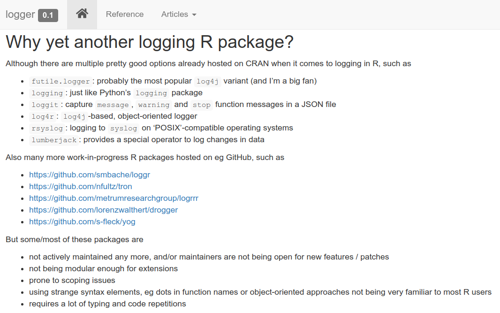
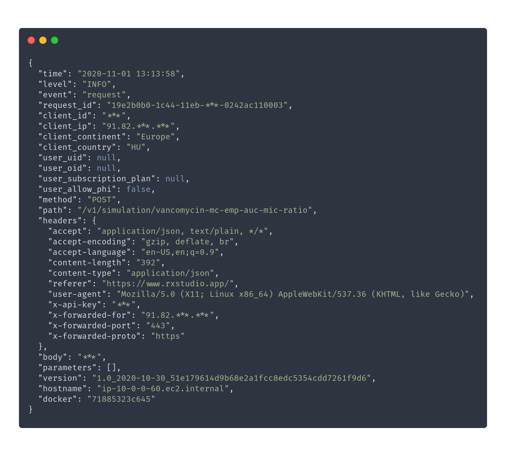
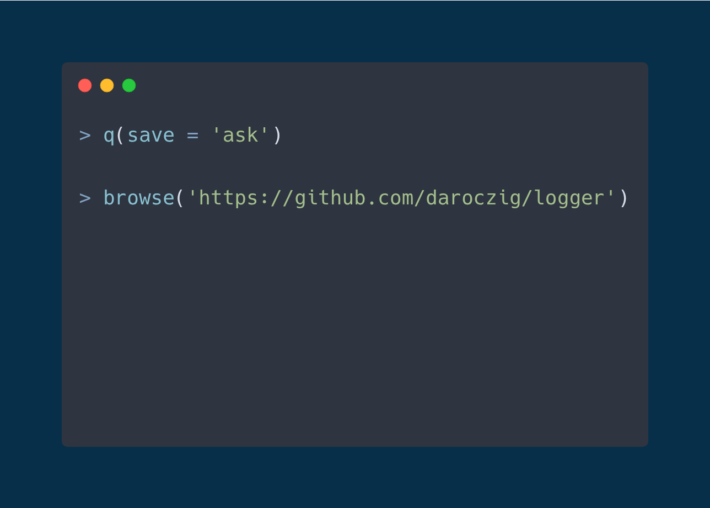
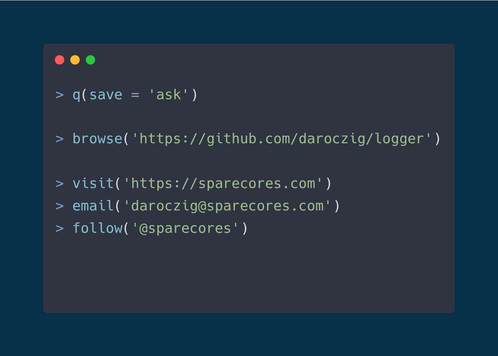
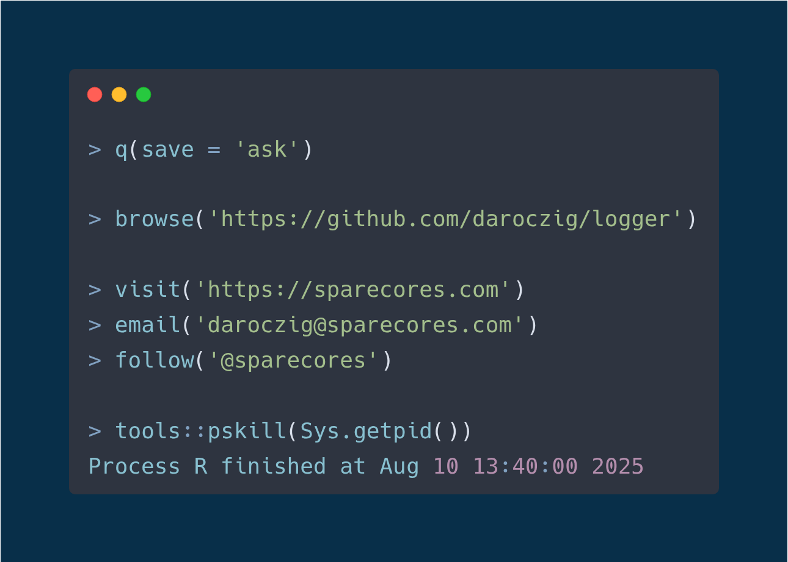

# {#cover-slide transition="convex"}

<script>
  // add custom CSS for the speaker view
  if (window.self !== window.top) {
    document.body.className += " speakerview";
  }
  // remove dummy slide
  document.getElementById("title-slide").remove();
</script>

::: {.centered}

:::

<h1 class="subtitle" style="color:#eee; font-size:1.5em; font-weight: bold !important; text-align: center; margin-top:390px; color:#34d399;">
  Getting Things Logged
</h1>

<h2 class="author" style="color:#eee;padding-top:60px;font-size:1.25em;text-align: center !important;margin-bottom: 0px;">
  Gergely Daróczi
</h2>

<h3 class="author" style="color:#eee;font-size:1.1em;text-align: center !important; font-weight: normal;">
  Spare Cores
</h3>

<h3 class="author onlineMode" style="color:#eee;padding-top:65px;font-size:1.1em;text-align: center !important; padding-top: 10px;font-weight: normal; ">
  Slides: <a href="https://sparecores.com/talks" target="_blank">sparecores.com/talks</a>
</h3>

<p class="author offlineMode" style="color:#eee;font-size:0.75em;text-align: right !important; padding-top: 0px;font-weight: normal;margin-top:30px; ">
  Press Space or click the green arrow icons to navigate the slides ->
</p>

::: {.notes}
TODO
:::

# > hello("prod") {#what-is-prod transition="convex-in slide-out"}


## > ??production

<ul>
  <li class="fragment">2006: <b>Calling R scripts from PHP</b> (both reading from MySQL) to generate embeddable plots for the web</li>
  <li class="fragment">2008: <b>Automated/batch R scripts</b> to generate thousands of pages of stats and plots from SPSS with `pdflatex`</li>
  <li class="fragment">2011: Ruby on Rails <b>web application</b> with `RApache` and `pandoc` to report in plain English (NoSQL databases, scaling, <b>security</b>, central error tracking etc)</li>
  <li class="fragment">2015: Data infrastructure for a fintech startup to use R for reporting, dashboards, batch jobs, and <b>stream processing</b></li>
  <li class="fragment">2017: Scalable DS infrastructure for an adtech startup for <b>batch training</b> and <b>live scoring</b> ($$$)</li>
</ul>

## > production <<- list(...) {transition="slide-in convex-out"}

<div class="fragment" data-fragment-index="5" style="text-align:left;margin-bottom:20px;margin-top:20px;font-weight:bold;">Using in R in a non-interactive way:</div>

<ul>
  <li class="fragment" data-fragment-index="1"> Running R <b>without manual intervention</b> (e.g. scheduled via CRON, triggered via upstream job trigger or API request)</li>
  <li class="fragment" data-fragment-index="2"> Standard, e.g. <b>containerized environment</b> (pinned R and package versions, OS packages, `.Rprofile` etc)</li>
  <li class="fragment" data-fragment-index="3"> <b>Security</b>! (e.g. safeguarded prod env, encrypted credentials, aware of Little Bobby Tables, AppArmor etc)</li>
  <li class="fragment" data-fragment-index="4"> Job output is informative (logging), recorded (logging) and <b>monitored</b> (e.g. CloudWatch logs and `error` handler for Sentry), alerts and notifications, PagerDuty etc</li>
</ul>

# > debug() {#debug transition="convex-in slide-out"}

<video width="60%" controls muted style="margin-top: 20px; border-radius: 10px; border: 1px solid #34d399;">
  <source src="https://video.twimg.com/tweet_video/CXSk_PVUEAAQQg9.mp4" type="video/mp4">
</video>


## > traceback()

<div style="font-size: 1.25em; margin-top: 30px;">
```bash
$ Rscript super_important_business_stuff.R
```
</div>

<div class="fragment" style="font-size: 1.25em; margin-top: 30px;">
```r
Error in l[[x]] : subscript out of bounds
Calls: g -> f
Execution halted
```
</div>

<div class="fragment" style="font-size: 1.25em; margin-top: 30px;">
```r
Error in .subset2(x, i, exact = exact) : subscript out of bounds
Execution halted
```
</div>

## > for (var in seq) print

<div style="font-size: 1.25em; margin-top: 30px;">

```r
for (i in 1:100) {
    ## do something slow
    print(i)
}
```

</div>
<div class="fragment" style="font-size: 1.25em; margin-top: 30px;">

```r
N <- 42
for (i in 1:N) {
    ## do something slow
    print(paste(
        Sys.time(), '|',
        i, 'out of', N,
        '=', round(i / N * 100), '%'))
    flush.console()
}
```
</div>

## > for (var in seq) print

<div style="font-size: 1.25em; margin-top: 30px;">

``` {#sh1 .sh .maxheight300}
[1] "2025-08-09 10:00:00 | 1 out of 42 = 2 %"
[1] "2025-08-09 10:00:01 | 2 out of 42 = 5 %"
[1] "2025-08-09 10:00:02 | 3 out of 42 = 7 %"
[1] "2025-08-09 10:00:03 | 4 out of 42 = 10 %"
[1] "2025-08-09 10:00:04 | 5 out of 42 = 12 %"
[1] "2025-08-09 10:00:05 | 6 out of 42 = 14 %"
[1] "2025-08-09 10:00:06 | 7 out of 42 = 17 %"
[1] "2025-08-09 10:00:07 | 8 out of 42 = 19 %"
[1] "2025-08-09 10:00:08 | 9 out of 42 = 21 %"
[1] "2025-08-09 10:00:09 | 10 out of 42 = 24 %"
[1] "2025-08-09 10:00:10 | 11 out of 42 = 26 %"
[1] "2025-08-09 10:00:11 | 12 out of 42 = 29 %"
[1] "2025-08-09 10:00:12 | 13 out of 42 = 31 %"
[1] "2025-08-09 10:00:13 | 14 out of 42 = 33 %"
[1] "2025-08-09 10:00:14 | 15 out of 42 = 36 %"
[1] "2025-08-09 10:00:15 | 16 out of 42 = 38 %"
[1] "2025-08-09 10:00:16 | 17 out of 42 = 40 %"
Error in .subset2(x, i, exact = exact) : subscript out of bounds
Execution halted
```

</div>

## > for (var in seq) cat

<div style="font-size: 1em; margin-top: 30px;">

```r
sink('/var/log/foobar.log', append = TRUE, split = TRUE)
N <- 42
for (i in 1:N) {
    ## do something slow
    print(paste(Sys.time(), '|', i, 'out of', N, '=', round(i / N * 100), '%'))
}
```

</div>
<div class="fragment" style="font-size: 1em; margin-top: 20px;">

```r
logfile <- '/var/log/foobar.log'
for (i in 1:N) {
    ## do something slow
    cat(
       paste(Sys.time(), '|', i, 'out of', N, '=', round(i / N * 100), '%'),
       file = logfile, append = TRUE)
}
```

</div>
<div class="fragment" style="font-size: 1em; margin-top: 20px;">

```r
log <- function(message, logfile = '/var/log/foobar.log') {
    cat(paste(Sys.time(), '|', message),
        file = logfile, append = TRUE)
}
```
</div>

## > mclapply(seq, cat) {transition="slide-in convex-out"}

<div style="font-size: 1.25em; margin-top: 30px;">
``` {#r1 .r .maxheight300}
mclapply(1:N, function(n) {
    ## do something slow
    log(paste(i, 'out of', N, '=', round(i / N * 100), '%'))
}
[1] "2025-08-09 00:05:34 | 1 out of 42 = 2 %"
[1] "2025-08-09 00:05:35 | 2 out of 42 = 5 %"
[1] "2025-08-09 00:05:39 | 10 out of 42 = 24 %"
[1] "2025-08-09 00:05:35 | 3 out of 42 = 7 %"
[1] "2025-08-09 00:05:39 | 11 out of 42 = 26 %"
[1] "2025-08-09 00:05:36 | 4 out of 42 = 10 %"
[1] "2025-08-09 00:05:37 | 7 out of 42 = 17 %"
[1] "2025-08-09 00:05:38 | 8 out of 42 = 19 %"
[1] "2025-08-09 00:05:40 | 12 out of 42 = 29 %"[1] "2025-08-09 00:05:36 | 5 out of 42 = 12 %"
[1] "2025-08-09 00:05:37 | 16 out of 42 = 19 %"
[1] "2025-08-09 00:05:38 | 13 out of 42 = 31 %"
[1] "2025-08-09 00:05:37 | 19 out of 42 = 45 %"
[1] "2025-08-09 00:05:38 | 22 out of 42 = 52 %"
[1] "2025-08-09 00:05:37 | 28 out of 42 = 67 %"
[1] "2025-08-09 00:05:38 | 21 out of 42 = 50 %"
[1] "2025-08-09 00:05:37 | 26 out of 42 = 62 %"
[1] "2025-08-09 00:05:38 | 24 out of 42 = 57 %"
Error in .subset2(x, i, exact = exact) : subscript out of bounds
Execution halted
```
</div>

# > ??log {transition="convex-in slide-out"}

\scriptsize

. . .

```r {style="margin-top: 20px !important; height: 640px; font-size: 0.85em;"}
> library(data.table)
> packages <- data.table(available.packages())
## avoid analog, logit, (archeo|bio|genea|hydro|topo|...)logy
> packages[grepl('(?<!ana)log(?![it|y])', Package, perl = TRUE), Package]

 [1] "adjustedcranlogs"     "bayesloglin"          "blogdown"
 [4] "CommunityCorrelogram" "cranlogs"             "efflog"
 [7] "eMLEloglin"           "futile.logger"        "gemlog"
[10] "gglogo"               "ggseqlogo"            "homologene"
[13] "lifelogr"             "log4r"                "logbin"
[16] "logconcens"           "logcondens"           "logcondens.mode"
[19] "logcondiscr"          "logger"               "logging"
[22] "loggit"               "loggle"               "logKDE"
[25] "loglognorm"           "logmult"              "lognorm"
[28] "logNormReg"           "logOfGamma"           "logspline"
[31] "lolog"                "luzlogr"              "md.log"
[34] "mdir.logrank"         "mpmcorrelogram"       "PhylogeneticEM"
[37] "phylogram"            "plogr"                "poilog"
[40] "rChoiceDialogs"       "reactlog"             "rmetalog"
[43] "robustloggamma"       "rsyslog"              "shinylogs"
[46] "ssrm.logmer"          "svDialogs"            "svDialogstcltk"
[49] "tabulog"              "tidylog"              "wavScalogram"
```

## > !!log



## > !!log {transition="slide-in convex-out"}


# > demo(logger) {#demo transition="convex-in slide-out"}

```r {style="margin-top: 20px !important; font-size: 0.85em;"}
library(logger)
log_threshold(DEBUG)
log_info('Script starting up...')
#> INFO [2018-20-11 22:49:36] Script starting up...
```

. . .

```r {style="margin-top: 20px !important; font-size: 0.85em;"}
pkgs <- available.packages()
log_info('There are {nrow(pkgs)} R packages hosted on CRAN!')
#> INFO [2018-20-11 22:49:37] There are 13433 R packages hosted on CRAN!
```

. . .

```r {style="margin-top: 20px !important; font-size: 0.85em;"}
for (letter in letters) {
    lpkgs <- sum(grepl(letter, pkgs[, 'Package'], ignore.case = TRUE))
    log_level(if (lpkgs < 5000) TRACE else DEBUG,
              '{lpkgs} R packages including the {shQuote(letter)} letter')
}
#> DEBUG [2018-20-11 22:49:38] 6300 R packages including the 'a' letter
#> DEBUG [2018-20-11 22:49:38] 6772 R packages including the 'e' letter
#> DEBUG [2018-20-11 22:49:38] 5412 R packages including the 'i' letter
#> DEBUG [2018-20-11 22:49:38] 7014 R packages including the 'r' letter
#> DEBUG [2018-20-11 22:49:38] 6402 R packages including the 's' letter
#> DEBUG [2018-20-11 22:49:38] 5864 R packages including the 't' letter
```

## > demo(helpers)


```r {style="margin-top: 20px !important; font-size: 0.85em;"}
log_threshold(TRACE)
log_eval(nrow(mtcars), level = TRACE)
#> TRACE [2019-04-04 04:25:17] 'nrow(mtcars)' => '32L'
```

. . .

```r {style="margin-top: 20px !important; font-size: 0.85em;"}
log_warnings()
chisq.test(table(mtcars$gear, mtcars$am))
#> WARN [2020-01-27 12:32:04] Chi-squared approximation may be incorrect
#>
#>  Pearson's Chi-squared test
#>
#> data:  table(mtcars$gear, mtcars$am)
#> X-squared = 20.945, df = 2, p-value = 2.831e-05
#>
#> Warning message:
#> In chisq.test(table(mtcars$gear, mtcars$am)) :
#>   Chi-squared approximation may be incorrect
```

## > demo(rainbow)

```r {style="margin-top: 20px !important; font-size: 0.85em;"}
library(logger)
log_layout(layout_glue_colors)
log_threshold(TRACE)
log_info('Starting the script...')
log_debug('This is the second log line')
log_trace('Note that the 2nd line is being placed right after the 1st one.')
log_success('Doing pretty well so far!')
log_warn('But beware, as some errors might come :/')
log_error('This is a problem')
log_debug('Note that getting an error is usually bad')
log_error('This is another problem')
log_fatal('The last problem')
```

. . .


## > demo(production)


## > demo(production) {data-transition="slide-in none-out"}

<div class="cols">
  <div class="col"></div>
  <div class="col"></div>
</div>

## > demo(production) {data-transition="none-in slide-out"}

<div class="cols">
  <div class="col"></div>
  <div class="col"></div>
</div>

# > str(logger) {#str transition="convex-in slide-out"}


## > .onLoad

```r {style="margin-top: 20px !important; font-size: 1em;"}
library(logger)
```

. . .

```r {style="margin-top: 20px !important; font-size: 1em;"}
.onLoad <- function(libname, pkgname) {
  log_threshold(DEBUG)
  log_formatter(formatter_glue)
  log_layout(layout_simple)
  log_appender(appender_console)
}
```

. . .

```r {style="margin-top: 20px !important; font-size: 1em;"}
name <- 'world'
log_info('Hello, {name}!')
```

. . .

```r {style="margin-top: 20px !important; font-size: 1em;"}
#> INFO [2025-08-09 10:00:00] Hello, world!
```

## > ?log_level

```r {style="margin-top: 20px !important; font-size: 0.85em;"}
INFO
#> [1] 400
#> attr(,"level")
#> [1] "INFO"
#> attr(,"class")
#> [1] "loglevel" "integer"

TRACE
#> [1] 600
#> attr(,"level")
#> [1] "TRACE"
#> attr(,"class")
#> [1] "loglevel" "integer"
```
. . .


```r {style="margin-top: 20px !important; font-size: 0.85em;"}
INFO <= TRACE
#> [1] TRUE
```
. . .


```r {style="margin-top: 20px !important; font-size: 0.85em;"}
log_threshold(INFO)

log_trace('Hello, {name}!')
log_info('Hello, {name}!')
#> INFO [2019-09-18 00:05:32] Hello, world!
```

## > ??formatter

```r {style="margin-top: 20px !important; font-size: 0.85em;"}
formatter_glue('Hello, {name}!')
#> [1] "Hello, world!"
```

. . .

```r {style="margin-top: 20px !important; font-size: 0.85em;"}
formatter_sprintf('Hello, %s!', name)
#> [1] "Hello, world!"
```

. . .

<ul style="font-size: 0.85em; margin-top: 20px;">
<li>`formatter_paste`</li>
<li>`formatter_sprintf`</li>
<li>`formatter_glue`</li>
<li>`formatter_glue_or_sprintf`</li>
<li>`formatter_logging`</li>
<li>`formatter_json`</li>
<li>`formatter_pander`</li>
</ul>

## > ??layout

```r {style="margin-top: 20px !important;"}
layout_simple(level = INFO, msg = 'Hello, world!')
#> [1] "INFO [2025-08-09 10:00:00] Hello, world"
```

. . .

```r {style="margin-top: 20px !important;"}
example_layout <- layout_glue_generator(
    format = '{node}/{pid}/{ns}/{ans}/{topenv}/{fn} {time} {level}: {msg}')
example_layout(INFO, 'Hello, world!')
#> nevermind/3601/NA/global/R_GlobalEnv/NULL 2025-08-09 10:00:00 INFO: Hello, world!
```

. . .

```r {style="margin-top: 20px !important;"}
logger.tester::logger_info_tester_function('Hello, world!')
#> nevermind/3601/logger.tester/global/logger.tester/logger.tester::logger_info_tester_function 2025-08-09 10:00:00 INFO: Hello, world! 42
```

. . .

```r {style="margin-top: 20px !important;"}
layout_json()(level = INFO, msg = 'Hello, world!')
#> {"time":"2025-08-09 10:00:00","level":"INFO","ns":null,"ans":"global",
#>  "topenv":"R_GlobalEnv","fn":"cat","node":"nevermind","arch":"x86_64",
#>  "os_name":"Linux","os_release":"4.15.0-20-generic",
#>  "os_version":"#21-Ubuntu SMP Tue Apr 24 06:16:15 UTC 2018",
#>  "pid":3601,"user":"daroczig","msg":"Hello, world!"}
```

## > ??appender

<ul style="font-size: 0.7em; margin-top: 20px;">
  <li>`appender_console` / `appender_stderr`</li>
  <li>`appender_stdout`</li>
  <li>`appender_file` (with log rotation)</li>
  <li>`appender_tee`</li>
</ul>

. . .

<ul style="font-size: 0.7em; margin-top: 10px;">
  <li>`appender_slack`</li>
  <li>`appender_telegram`</li>
  <li>`appender_pushbullet`</li>
</ul>

. . .

<ul style="font-size: 0.7em; margin-top: 10px;">
  <li>`appender_syslog`</li>
  <li>`appender_kinesis` (streaming)</li>
  <li>`appender_insert` (database connection)</li>
</ul>

. . .

<ul style="font-size: 0.7em; margin-top: 10px;">
  <li>`appender_async`</li>
</ul>

## > system.time(appender)

```r {code-line-numbers="4|8-9" style="margin-top: 20px !important; font-size: 1em;"}
appender_file_slow <- function(file) {
    force(file)
    function(lines) {
        Sys.sleep(1)
        cat(lines, sep = '\n', file = file, append = TRUE)
    }
}
log_appender(appender_file_slow(tempfile()))
system.time(for (i in 1:25) log_info(i))
```
. . . 

```r {style="margin-top: 20px !important; font-size: 1em;"}
#>    user  system elapsed
#>   0.057   0.002  25.083
```

## > ?appender_async {transition="slide-in none-out"}

<ul style="font-size: 0.7em; margin-top: 20px;">
  <li>create a local, disk-based storage for the message queue via `txtq`</li>
  <li>start a background process for the async execution of the message queue with `callr`</li>
  <li>loads minimum required packages in the background process</li>
  <li>connects to the message queue from the background process</li>
  <li>pass actual `appender` function to the background process (serialized to disk)</li>
  <li>pass parameters of the async appender to the background process (eg batch size)</li>
  <li>start infinite loop processing log records</li>
  <li>check if background process still works ...</li>
</ul>

## > ?appender_async {transition="none-in slide-out"}

<ul style="font-size: 0.7em; margin-top: 20px;text-decoration: line-through;">
  <li>create a local, disk-based storage for the message queue via `txtq`</li>
  <li>start a background process for the async execution of the message queue with `callr`</li>
  <li>loads minimum required packages in the background process</li>
  <li>connects to the message queue from the background process</li>
  <li>pass actual `appender` function to the background process (serialized to disk)</li>
  <li>pass parameters of the async appender to the background process (eg batch size)</li>
  <li>start infinite loop processing log records</li>
  <li>check if background process still works ...</li>
</ul>

## > ?appender_async

::: {.columns style="display: block; margin-top: 0px;"}

:::: {.column .vcenter .centered width="50%"}


::::

:::: {.column .vcenter width="50%" .fragment}

Huge thanks to:

- <b>Hadley Wickham</b><br/>(initiative and main PR)
- <b>Charlie Gao</b><br/>(follow-up fixes and support)

::::

:::

## > example(appender_async) {transition="slide-in convex-out"}

```r {code-line-numbers="2" style="margin-top: 20px !important; font-size: 1em;"}
t <- tempfile()
log_appender(appender_async(appender_file_slow(t)))
log_info('Was this slow?')
system.time(for (i in 1:25) log_info(i))
```

. . .

```r {code-line-numbers="2" style="margin-top: 20px !important; font-size: 1em;"}
#>   user  system elapsed
#>   0.02    0.00    0.02
```

. . .

```r {code-line-numbers="1-1" style="margin-top: 20px !important; font-size: 1em;"}
Sys.sleep(1); readLines(t)
#> [1] "INFO [2025-08-09 10:00:00] Was this slow?"
```

. . .

```r {code-line-numbers="1-1" style="margin-top: 20px !important; font-size: 1em;"}
Sys.sleep(5); readLines(t)
#> [1] "INFO [2025-08-09 10:00:00] Was this slow?"
#> [2] "INFO [2025-08-09 10:00:01] 1"
#> [3] "INFO [2025-08-09 10:00:02] 2"
#> [4] "INFO [2025-08-09 10:00:03] 3"
#> [5] "INFO [2025-08-09 10:00:04] 4"
#> [6] "INFO [2025-08-09 10:00:05] 5"
```

# > do.call(..., logger) {#do-call transition="convex-in none-out"}

* log threshold
* log message formatter
* log record layout
* log record destination(s)

## > do.call(..., logger) {transition="none-in slide-out"}

* log threshold(s)
* log message formatter(s)
* log record layout(s)
* log record destination(s)

## > ?namespace

```r {code-line-numbers="1-2|4-6" style="margin-top: 20px !important; font-size: 1em;"}
log_appender(appender_stderr)
log_threshold(INFO)

my_appender <- appender_async(appender_slack(channel = '#foobar', token = '...'))
log_appender(my_appender, namespace = 'slack')
log_threshold(WARN, namespace = 'slack')
```

. . .

```r {code-line-numbers="1|4" style="margin-top: 30px !important; font-size: 1em;"}
log_info('foo')
#> INFO [2025-08-09 10:00:00] foo

log_error('bar', namespace = 'slack')
```

. . .


## > ?assignInMyNamespace

R packages using `logger` automatically gets their own namespace, so eg `dbr` using `logger` can be silenced by

```r {style="margin-top: 30px !important; font-size: 1em;"}
log_threshold(FATAL, namespace = 'dbr')
```

## > namespace^2 {transition="slide-in convex-out"}

```r {code-line-numbers="1-2|4-5|7-9" style="margin-top: 30px !important; font-size: 0.85em;"}
log_appender(appender_stderr)
log_threshold(INFO)

log_appender(appender_file(file = '/var/log/myapp.log'), index = 2)
log_threshold(TRACE, index = 2)

my_appender <- appender_async(appender_slack(channel = '#foobar', token = '...'))
log_appender(my_appender, index = 3)
log_threshold(ERROR, index = 3)
```

. . .

```r {code-line-numbers="1-2|3" style="margin-top: 30px !important; font-size: 0.85em;"}
log_info('foo')
#> INFO [2025-08-09 06:15:22] foo
log_debug('bar')
```

. . .

```r {code-line-numbers="1-1" style="margin-top: 30px !important; font-size: 0.85em;"}
readLines('/var/log/yapp.log')
#> [1] "INFO [2025-08-09 06:15:22] foo"  "DEBUG [2025-08-09 06:15:22] bar"
```

. . .

Slack: 🙊

# > help(package = logger) {transition="convex-in slide-out"}

<video width="75%" controls autoplay muted loop style="margin-top: 20px; border-radius: 10px; border: 1px solid #34d399;">
  <source src="images/when-we-ship-in-a-hurry.webm" type="video/webm">
</video>

Source: <a href="https://thecodinglove.com/when-we-ship-a-quickfix-in-a-hurry" target="_new">When we ship a quickfix in a hurry</a>

## > logger::log_eval()

```r {code-line-numbers="4" style="margin-top: 30px !important; font-size: 1em;"}
f <- sqrt
g <- mean
x <- 1:31
log_eval(f(g(x)), level = INFO)
#> INFO [2025-08-09 04:38:17] 'f(g(x))' => '4'
#> [1] 4
```

. . .

```r {code-line-numbers="1|4" style="margin-top: 30px !important; font-size: 1em;"}
log_failure('foobar')
#> [1] "foobar"

log_failure(foobar)
#> ERROR [2025-08-09 04:39:27] object 'foobar' not found
#> Error in doTryCatch(return(expr), name, parentenv, handler) :
#>   object 'foobar' not found
```

## > logger::log_tictoc()

```r {code-line-numbers="1-1" style="margin-top: 30px !important; font-size: 1em;"}
log_tictoc('warming up')
#> INFO [2025-08-09 04:38:56] global timer tic 0 secs -- warming up
```

. . .

```r {code-line-numbers="1-2" style="margin-top: 30px !important; font-size: 1em;"}
Sys.sleep(1.2)
log_tictoc('running')
#> INFO [2025-08-09 04:38:57] global timer toc 1.21 secs -- running
```

. . .

```r {code-line-numbers="1-2" style="margin-top: 30px !important; font-size: 1em;"}
Sys.sleep(0.1)
log_tictoc('running')
#> INFO [2025-08-09 04:38:59] global timer toc 1.31 secs -- running
```

. . .

```r {code-line-numbers="1-2" style="margin-top: 30px !important; font-size: 1em;"}
Sys.sleep(runif(1))
log_tictoc('and running')
#> INFO [2025-08-09 04:39:00] global timer toc 1.43 secs -- and running
```

## > logger::log_messages()

```r {code-line-numbers="1-2" style="margin-top: 30px !important; font-size: 0.85em;"}
log_messages()
message('hi there')
#> hi there
#> INFO [2025-08-09 05:41:29] hi there
```

. . .

```r {code-line-numbers="1,4" style="margin-top: 30px !important; font-size: 0.85em;"}
log_warnings()
for (i in 1:5) {
    Sys.sleep(runif(1))
    suppressWarnings(warning(i))
}
#> WARN [2025-08-09 05:41:32] 1
#> WARN [2025-08-09 05:41:33] 2
#> WARN [2025-08-09 05:41:33] 3
#> WARN [2025-08-09 05:41:34] 4
#> WARN [2025-08-09 05:41:34] 5
```

. . .

```r {code-line-numbers="1-2" style="margin-top: 30px !important; font-size: 0.85em;"}
log_errors()
stop('foobar')
#> ERROR [2025-08-09 05:41:37] foobar
#> Error: foobar
```

## > logger::log_shiny_input_changes()

```r {code-line-numbers="|3-5|6|10-12|9" style="margin-top: 30px !important; font-size: 1.2em; height: 575px;"}
library(shiny)
ui <- bootstrapPage(
    numericInput('mean', 'mean', 0),
    numericInput('sd', 'sd', 1),
    textInput('title', 'title', 'title'),
    plotOutput('plot')
)
server <- function(input, output) {
    logger::log_shiny_input_changes(input)
    output$plot <- renderPlot({
        hist(rnorm(1e3, input$mean, input$sd), main = input$title)
    })
}
shinyApp(ui = ui, server = server)
```

## > logger::log_shiny_input_changes() {data-transition="slide-in convex-out"}

```bash {style="margin-top: 30px !important; font-size: 0.9em; height: 490px;"}
Listening on http://127.0.0.1:8080
INFO [2025-08-09 16:59:17] Default Shiny inputs initialized: {"mean":0,"title":"title","sd":1}
INFO [2025-08-09 16:59:26] Shiny input change detected on mean: 0 -> 1
INFO [2025-08-09 16:59:27] Shiny input change detected on mean: 1 -> 2
INFO [2025-08-09 16:59:27] Shiny input change detected on mean: 2 -> 3
INFO [2025-08-09 16:59:27] Shiny input change detected on mean: 3 -> 4
INFO [2025-08-09 16:59:27] Shiny input change detected on mean: 4 -> 5
INFO [2025-08-09 16:59:27] Shiny input change detected on mean: 5 -> 6
INFO [2025-08-09 16:59:27] Shiny input change detected on mean: 6 -> 7
INFO [2025-08-09 16:59:29] Shiny input change detected on sd: 1 -> 2
INFO [2025-08-09 16:59:29] Shiny input change detected on sd: 2 -> 3
INFO [2025-08-09 16:59:29] Shiny input change detected on sd: 3 -> 4
INFO [2025-08-09 16:59:29] Shiny input change detected on sd: 4 -> 5
INFO [2025-08-09 16:59:29] Shiny input change detected on sd: 5 -> 6
INFO [2025-08-09 16:59:29] Shiny input change detected on sd: 6 -> 7
INFO [2025-08-09 16:59:34] Shiny input change detected on title: title -> sfdsadsads
```

# > importFrom(logger, ...) {transition="convex-in slide-out"}


<p style="margin-top: 20px; font-size: 0.8em;">
  Source: <a href="https://dbareactions.com/post/125020194064/when-a-client-calls-and-says-they-have-a" target="_new">DBA Reactions</a>
</p>

## > logger(..., namespace = 'botor')

```r {code-line-numbers="1-2" style="margin-top: 30px !important; font-size: 1em;"}
library(botor)
my_mtcars <- s3_read('s3://botor/example-data/mtcars.csv', read.csv)
#> DEBUG [2025-08-09 04:46:57] Downloaded 1303 bytes from s3://botor/example-data/mtcars.csv
#> and saved at '/tmp/RtmpLW4bY4/file63ff42ed2fe1'
```

. . .

```r {code-line-numbers="1-3" style="margin-top: 30px !important; font-size: 1em;"}
log_threshold(TRACE, namespace = 'botor')
my_mtcars <- s3_read('s3://botor/example-data/mtcars.csv.gz',
                     read.csv, extract = 'gzip')
#> TRACE [2025-08-09 04:48:02] Downloading s3://botor/example-data/mtcars.csv.gz to
#> '/tmp/RtmpLW4bY4/file63ff17e137e9' ...
#> DEBUG [2025-08-09 04:48:03] Downloaded 567 bytes from s3://botor/example-data/mtcars.csv.gz
#> and saved at '/tmp/RtmpLW4bY4/file63ff17e137e9'
#> TRACE [2025-08-09 04:48:03] Decompressed /tmp/RtmpLW4bY4/file63ff17e137e9 via gzip
#> from 567 to 1303 bytes
#> TRACE [2025-08-09 04:48:03] Deleted /tmp/RtmpLW4bY4/file63ff17e137e9
```

## > !logger(..., namespace = 'botor')

```r {style="margin-top: 30px !important; font-size: 1em;"}
log_threshold(ERROR, namespace = 'botor')
my_mtcars <- s3_read('s3://botor/example-data/mtcars.csv.gz',
                     read.csv, extract = 'gzip')
```

. . .

```r {style="margin-top: 30px !important; font-size: 1em;"}
my_mtcars <- with_log_threshold(
    expressions = s3_read('s3://botor/example-data/mtcars.csv.gz',
                          read.csv, extract = 'gzip'),
    threshold = ERROR,
    namespace = 'botor')
```

## > demo(dbr)

```r {code-line-numbers="|6-7" style="margin-top: 30px !important; font-size: 1em;"}
library(DBI)
con <- dbConnect(
    RMySQL::MySQL(),
    dbname = "shinydemo",
    host = "shiny-demo.csa7qlmguqrf.us-east-1.rds.amazonaws.com",
    username = "guest",
    password = "guest")

query <- dbSendQuery(
    con,
    "SELECT Continent, COUNT(DISTINCT(Region)) FROM Country GROUP BY Continent")
res <- dbFetch(query)
dbClearResult(query)

dbDisconnect(con)
```

<p style="margin-top: 30px; font-size: 0.8em;">
  Spot the issues in the above code block!
</p>

## > demo(dbr) {transition="convex-in slide-out"}

<blockquote cite="Andrew Hoffman">
  "When I woke up the next morning, I had four emails and a missed phone call from Amazon AWS -- something about 140 servers running on my AWS account, mining Bitcoin." -- Andrew Hoffman
</blockquote>

. . .

```sql {style="margin-top: 50px !important; font-size: 0.85em;"}
SELECT
  TO_HEX(CODE_POINTS_TO_BYTES([0xac, num2, num3, num4])) AS nonce
FROM
  UNNEST(GENERATE_ARRAY(0, 255)) num2,
  UNNEST(GENERATE_ARRAY(0, 255)) num3,
  UNNEST(GENERATE_ARRAY(0, 255)) num4
WHERE
TO_HEX(REVERSE(SHA256(SHA256(CONCAT(FROM_HEX(
  '000000204a4ef98461ee26898076e6a2cfc7c764d02b5f8d670832000000000000000000f99f5c4d5025979fcb33d245536a55b628d4564c075c0210cbbc941ad79fdbc5e491b55a494a5117'), CODE_POINTS_TO_BYTES([0xac, num2, num3, num4]) ))))) LIKE '000000000000000000%'
```

<p style="margin-top: 30px; font-size: 0.8em;">
  Source: [How to mine Bitcoin on Google’s BigQuery](https://medium.com/@urish/thank-you-google-how-to-mine-bitcoin-on-googles-bigquery-1c8e17b04e62)
</p>

## > logger(..., namespace = 'dbr')

```yaml {style="margin-top: 30px !important; font-size: 0.85em;"}
sqlite:
  drv: !expr RSQLite::SQLite()
  dbname: !expr tempfile()
```

. . .

```r {code-line-numbers="1-2" style="margin-top: 30px !important; font-size: 0.85em;"}
library(dbr)
str(db_query('SELECT 42', 'sqlite'))

#> INFO [2018-07-11 17:07:12] Connecting to sqlite
#> INFO [2018-07-11 17:07:12] Executing:**********
#> INFO [2018-07-11 17:07:12] SELECT 42
#> INFO [2018-07-11 17:07:12] ********************
#> INFO [2018-07-11 17:07:12] Finished in 0.0007429 secs returning 1 rows
#> INFO [2018-07-11 17:07:12] Closing connection to sqlite

#> 'data.frame':  1 obs. of  1 variable:
#>  $ 42: int 42
#>  - attr(*, "when")= POSIXct, format: "2018-07-11 17:07:12"
#>  - attr(*, "db")= chr "sqlite"
#>  - attr(*, "time_to_exec")=Class 'difftime'  atomic [1:1] 0.000743
#>   .. ..- attr(*, "units")= chr "secs"
#>  - attr(*, "statement")= chr "SELECT 42"
```

## > logger(..., namespace = 'dbr') {transition="convex-in slide-out"}

```yaml {style="margin-top: 30px !important; font-size: 0.85em;"}
default:
  shinydemo:
    drv: !expr RMySQL::MySQL()
    host: shiny-demo.csa7qlmguqrf.us-east-1.rds.amazonaws.com
    username: guest
    password: guest
    dbname: shinydemo
```

. . .

```yaml {style="margin-top: 30px !important; font-size: 0.85em;"}
shinydemo:
  drv: !expr RMySQL::MySQL()
  host: !kms |
    AQICAHiMkU2ZNbL+kRcQoM3wGpuLb8HbIKjM9VcEGt72rZV2SAEXX7aTXvtsf91BzgoiiIDh
    AAAAlDCBkQYJKoZIhvcNAQcGoIGDMIGAAgEAMHsGCSqGSIb3DQEHATAeBglghkgBZQMEAS4w
    EQQMgVoMPjgAi+S7i7cvAgEQgE5X4dnyt/Tl0+PiX/yjzdC2wYl+tWzvHnApAhIahQroK+VJ
    8OQEQse/s/VE6n2gHPuXe4c/9lK9Od6e1aR8+YZCflyOA5F2sWFz6+hU5XI=
  username: !aws_parameter |-
    /prod/db/shinydemo/username
  password: !aws_secret |-
    prod/db/shinydemo/password
  dbname: shinydemo
```

## > logger(..., namespace = 'dbr') {transition="convex-in slide-out"}

```r {code-line-numbers="1-3" style="margin-top: 30px !important; font-size: 0.75em; height: 605px;"}
db_query(
    sql = "SELECT Continent, COUNT(DISTINCT(Region)) FROM Country GROUP BY Continent",
    db = 'shinydemo')

#> INFO [2025-08-09 05:02:30] Looking up config for shinydemo

#> INFO [2025-08-09 05:02:30] Decrypting string via KMS ...
#> INFO [2025-08-09 05:02:30] Decrypting string via KMS ...
#> INFO [2025-08-09 05:02:31] Decrypting string via KMS ...

#> INFO [2025-08-09 05:02:31] Connecting to shinydemo
#> INFO [2025-08-09 05:02:32] Executing:**********
#> INFO [2025-08-09 05:02:32] SELECT Continent, COUNT(DISTINCT(Region)) FROM Country GROUP BY Continent
#> INFO [2025-08-09 05:02:32] ********************
#> INFO [2025-08-09 05:02:32] Finished in 0.2213 secs returning 7 rows
#> INFO [2025-08-09 05:02:32] Closing connection to shinydemo
#>        Continent COUNT(DISTINCT(Region))
#> 1:          Asia                       4
#> 2:        Europe                       6
#> 3: North America                       3
#> 4:        Africa                       5
#> 5:       Oceania                       5
#> 6:    Antarctica                       1
#> 7: South America                       1
```

## > mclapply(..., db_config)

```r {code-line-numbers="1-1" style="margin-top: 30px !important; font-size: 0.85em;"}
> system.time(db_config('shinydemo'))
   user  system elapsed
  3.359   0.092   5.236
```

. . .

```r {code-line-numbers="1-1" style="margin-top: 30px !important; font-size: 0.85em;"}
> system.time(db_config('shinydemo'))
   user  system elapsed
  0.001   0.000   0.001
```

. . .

It's not caching the connection this time, only the credentials.

. . .

```r {code-line-numbers="1-1" style="margin-top: 30px !important; font-size: 0.85em;"}
> db_config_invalidate_cache()
INFO [2025-08-09 03:03:38] Invalidating cache on already loaded DB config(s)
```

## > mclapply(..., db_query) {transition="slide-in convex-out"}

```r {code-line-numbers="1-1" style="margin-top: 30px !important; font-size: 0.85em; height: 605px;"}
> parallel::mclapply(1:16, function(i) db_query("SELECT 42", "sqlite"), mc.cores = 8)
INFO [2025-08-09 03:05:04] Connecting to sqlite
INFO [2025-08-09 03:05:04] Executing:**********
INFO [2025-08-09 03:05:04] SELECT 42
INFO [2025-08-09 03:05:04] Connecting to sqlite
INFO [2025-08-09 03:05:04] ********************
INFO [2025-08-09 03:05:04] Executing:**********
INFO [2025-08-09 03:05:04] Finished in 0.001053 secs returning 1 rows
INFO [2025-08-09 03:05:04] SELECT 42
INFO [2025-08-09 03:05:04] Closing connection to sqlite
INFO [2025-08-09 03:05:04] ********************
INFO [2025-08-09 03:05:04] Connecting to sqlite
INFO [2025-08-09 03:05:04] Connecting to sqlite
INFO [2025-08-09 03:05:04] Executing:**********
INFO [2025-08-09 03:05:04] Finished in 0.005117 secs returning 1 rows
INFO [2025-08-09 03:05:04] SELECT 42
INFO [2025-08-09 03:05:04] Closing connection to sqlite
INFO [2025-08-09 03:05:04] ********************
INFO [2025-08-09 03:05:04] Connecting to sqlite
INFO [2025-08-09 03:05:04] Executing:**********
INFO [2025-08-09 03:05:04] Connecting to sqlite
INFO [2025-08-09 03:05:04] Finished in 0.003497 secs returning 1 rows
INFO [2025-08-09 03:05:04] SELECT 42
INFO [2025-08-09 03:05:04] ********************
INFO [2025-08-09 03:05:04] Executing:**********
INFO [2025-08-09 03:05:04] Connecting to sqlite
INFO [2025-08-09 03:05:04] Closing connection to sqlite
INFO [2025-08-09 03:05:04] SELECT 42
INFO [2025-08-09 03:05:04] Executing:**********
INFO [2025-08-09 03:05:04] ********************
INFO [2025-08-09 03:05:04] Executing:**********
INFO [2025-08-09 03:05:04] SELECT 42
INFO [2025-08-09 03:05:04] Finished in 0.0008972 secs returning 1 rows
INFO [2025-08-09 03:05:04] SELECT 42
INFO [2025-08-09 03:05:04] Finished in 0.00947 secs returning 1 rows
INFO [2025-08-09 03:05:04] ********************
INFO [2025-08-09 03:05:04] ********************
INFO [2025-08-09 03:05:04] Finished in 0.001237 secs returning 1 rows
INFO [2025-08-09 03:05:04] Connecting to sqlite
INFO [2025-08-09 03:05:04] Closing connection to sqlite
INFO [2025-08-09 03:05:04] Finished in 0.001038 secs returning 1 rows
INFO [2025-08-09 03:05:04] Connecting to sqlite
INFO [2025-08-09 03:05:04] Closing connection to sqlite
INFO [2025-08-09 03:05:04] Closing connection to sqlite
INFO [2025-08-09 03:05:04] Connecting to sqlite
INFO [2025-08-09 03:05:04] Connecting to sqlite
INFO [2025-08-09 03:05:04] Connecting to sqlite
INFO [2025-08-09 03:05:04] Executing:**********
INFO [2025-08-09 03:05:05] SELECT 42
INFO [2025-08-09 03:05:05] Executing:**********
INFO [2025-08-09 03:05:05] Executing:**********
INFO [2025-08-09 03:05:05] ********************
INFO [2025-08-09 03:05:05] Closing connection to sqlite
INFO [2025-08-09 03:05:05] Executing:**********
INFO [2025-08-09 03:05:05] Connecting to sqlite
INFO [2025-08-09 03:05:05] SELECT 42
INFO [2025-08-09 03:05:05] SELECT 42
INFO [2025-08-09 03:05:05] Finished in 0.0009949 secs returning 1 rows
INFO [2025-08-09 03:05:05] ********************
INFO [2025-08-09 03:05:05] Executing:**********
INFO [2025-08-09 03:05:05] SELECT 42
INFO [2025-08-09 03:05:05] SELECT 42
INFO [2025-08-09 03:05:05] Closing connection to sqlite
INFO [2025-08-09 03:05:05] Executing:**********
INFO [2025-08-09 03:05:05] ********************
INFO [2025-08-09 03:05:05] ********************
INFO [2025-08-09 03:05:05] Finished in 0.001511 secs returning 1 rows
INFO [2025-08-09 03:05:05] Closing connection to sqlite
INFO [2025-08-09 03:05:05] ********************
INFO [2025-08-09 03:05:05] SELECT 42
INFO [2025-08-09 03:05:05] Connecting to sqlite
INFO [2025-08-09 03:05:05] ********************
INFO [2025-08-09 03:05:05] Finished in 0.001259 secs returning 1 rows
INFO [2025-08-09 03:05:05] Executing:**********
INFO [2025-08-09 03:05:05] Closing connection to sqlite
INFO [2025-08-09 03:05:05] SELECT 42
INFO [2025-08-09 03:05:05] Finished in 0.001187 secs returning 1 rows
INFO [2025-08-09 03:05:05] ********************
INFO [2025-08-09 03:05:05] Finished in 0.03187 secs returning 1 rows
INFO [2025-08-09 03:05:05] Finished in 0.009078 secs returning 1 rows
INFO [2025-08-09 03:05:05] Finished in 0.0009627 secs returning 1 rows
INFO [2025-08-09 03:05:05] Closing connection to sqlite
INFO [2025-08-09 03:05:05] Closing connection to sqlite
INFO [2025-08-09 03:05:05] Closing connection to sqlite
INFO [2025-08-09 03:05:05] Connecting to sqlite
INFO [2025-08-09 03:05:05] Closing connection to sqlite
INFO [2025-08-09 03:05:05] Connecting to sqlite
INFO [2025-08-09 03:05:05] Executing:**********
INFO [2025-08-09 03:05:05] Executing:**********
INFO [2025-08-09 03:05:05] SELECT 42
INFO [2025-08-09 03:05:05] SELECT 42
INFO [2025-08-09 03:05:05] ********************
INFO [2025-08-09 03:05:05] ********************
INFO [2025-08-09 03:05:05] Finished in 0.0007973 secs returning 1 rows
INFO [2025-08-09 03:05:05] Finished in 0.0007989 secs returning 1 rows
INFO [2025-08-09 03:05:05] Closing connection to sqlite
INFO [2025-08-09 03:05:05] Closing connection to sqlite
```

# > library(resource.tracker) {transition="convex-in slide-out"}

```r {code-line-numbers="1-1|2-6" style="margin-top: 30px !important; font-size: 1em;"}
tracker <- ResourceTracker$new()
numbers <- 1:1e6
window <- 3
rollavg <- sapply(
  seq_len(length(numbers) - window + 1),
  function(i) mean(numbers[i:(i + window - 1)]))
```

. . .

```r {code-line-numbers="1-1" style="margin-top: 30px !important; font-size: 1em; height: 370px;"}
tracker$stats()
# List of 9
#  $ process_cpu_usage        :List of 2
#   ..$ mean: num 1.12
#   ..$ max : num 1.14
#  $ process_memory           :List of 2
#   ..$ mean: num 728783
#   ..$ max : num 798130
#  $ process_gpu_usage        :List of 2
#   ..$ mean: num 0
#   ..$ max : num 0
#  $ process_gpu_vram         :List of 2
#   ..$ mean: num 0
#   ..$ max : num 0
#  $ process_gpu_utilized     :List of 2
#   ..$ mean: num 0
#   ..$ max : num 0
#  $ system_disk_space_used_gb:List of 1
#   ..$ max: num 2560
#  $ system_net_recv_bytes    :List of 1
#   ..$ sum: num 1840217
#  $ system_net_sent_bytes    :List of 1
#   ..$ sum: num 1843725
#  $ timestamp                :List of 1
#   ..$ duration: num 7
```

## > resource.tracker::recommend_resources()

```r {code-line-numbers="1-1" style="margin-top: 30px !important; font-size: 1em;"}
tracker$recommend_resources()
# List of 4
#  $ cpu   : int 1
#  $ memory: int 1024
#  $ gpu   : int 0
#  $ vram  : int 0
```

. . .

```r {code-line-numbers="1-1" style="margin-top: 30px !important; font-size: 1em; height: 370px;"}
tracker$recommend_server()
# List of 50
#  $ vendor_id            : chr "upcloud"
#  $ server_id            : chr "DEV-1xCPU-1GB-10GB"
#  $ description          : chr "Developer 1 vCPUs, 1 GB RAM"
#  $ family               : chr "Developer"
#  $ vcpus                : int 1
#  $ hypervisor           : chr "KVM"
#  $ cpu_allocation       : chr "Shared"
#  $ cpu_cores            : int 1
#  $ cpu_architecture     : chr "x86_64"
#  $ cpu_manufacturer     : chr "AMD"
#  $ cpu_family           : chr "EPYC"
#  $ cpu_model            : chr "7542"
#  $ cpu_l1_cache         : int 131072
#  $ cpu_l2_cache         : int 524288
#  $ cpu_l3_cache         : int 16777216
#  $ cpu_flags            : chr [1:88] "fpu" "vme" "de" "pse" ...
#  $ memory_amount        : int 1024
#  $ storage_size         : int 10
#  $ inbound_traffic      : num 0
#  $ outbound_traffic     : num 1024
#  $ ipv4                 : int 1
#  $ price                : num 0.0052
#  ...
```

## > resource.tracker::process_metrics

```r {code-line-numbers="1-1|10-10|19-19" style="margin-top: 30px !important; font-size: 1em; height: 600px;"}
tracker$system_metrics
# 'data.frame':   7 obs. of  21 variables:
#  $ timestamp          : POSIXct, format: "2025-08-08 00:02:28" "2025-08-08 00:02:29" ...
#  $ processes          : num  697 696 694 693 694 694 693
#  $ utime              : num  3.01 2.25 2.3 2.15 2.9 1.44 1.36
#  $ stime              : num  0.51 0.57 0.55 0.24 0.89 0.83 0.36
#  $ cpu_usage          : num  3.52 2.82 2.85 2.39 3.79 ...
# ...

tracker$process_metrics
# 'data.frame':   7 obs. of  12 variables:
#  $ timestamp   : POSIXct, format: "2025-08-08 00:02:28" "2025-08-08 00:02:29" ...
#  $ pid         : num  941247 941247 941247 941247 941247 ...
#  $ children    : num  4 4 4 4 4 4 4
#  $ utime       : num  1.01 1.02 1.01 1 0.99 1.04 1.01
#  $ stime       : num  0.1 0.12 0.07 0.13 0.14 0.09 0.09
#  $ cpu_usage   : num  1.11 1.14 1.08 1.13 1.13 1.13 1.1
# ...

tracker$get_combined_metrics()
# 'data.frame':   7 obs. of  32 variables:
#  $ timestamp                 : POSIXct, format: "2025-08-08 00:02:28" "2025-08-08 00:02:29" ...
#  $ system_processes          : num  697 696 694 693 694 694 693
#  $ system_utime              : num  3.01 2.25 2.3 2.15 2.9 1.44 1.36
#  $ system_stime              : num  0.51 0.57 0.55 0.24 0.89 0.83 0.36
#  $ system_cpu_usage          : num  3.52 2.82 2.85 2.39 3.79 ...
```

## > resource.tracker::report() {transition="slide-in convex-out"}

```r {code-line-numbers="1-2" style="margin-top: 30px !important; font-size: 1em;"}
tracker$report()$browse()
```

. . .

<div class="vcenter centered">
  <a href="https://sparecores.com/assets/slides/example-resource-tracker-report-in-metaflow.html" target="_new">
    
  </a>
</div>

# > citation(package = "logger") {transition="convex-in convex-out"}

. . .

<div class="vcenter centered" style="margin-top: 100px;">
  
</div>

# {#bye transition="convex-in none-out"}

<div class="vcenter centered" style="margin-top: -60px;">
  <!-- https://carbon.now.sh/?bg=rgba%288%2C47%2C73%2C1%29&t=nord&wt=none&l=r&width=680&ds=false&dsyoff=20px&dsblur=68px&wc=true&wa=true&pv=56px&ph=56px&ln=false&fl=1&fm=Hack&fs=18px&lh=161%25&si=false&es=2x&wm=false&code=%253E%2520q%28save%2520%253D%2520%27ask%27%29%2520%2520%2520%2520%2520%2520%2520%2520%2520%2520%2520%2520%2520%2520%2520%2520%2520%2520%2520%2520%2520%2520%2520%2520%2520%2520%2520%2520%2520%2520%250A%250A%250A%250A%250A%250A%250A%250A%250A -->
  
</div>

## {#bye-bye transition="none"}

<div class="vcenter centered" style="margin-top: -60px;">
  
</div>

## {#bye-bye-bye transition="none"}

<div class="vcenter centered" style="margin-top: -60px;">
  
</div>

## {#bye-bye-bye-bye transition="none-in convex-out"}

<div class="vcenter centered" style="margin-top: -60px;">
  
</div>

# {#stickers data-background-image="images/logger-stickers.jpg" transition="convex"}

<!--toggle visibility of items in live mode-->
<script>
var url = document.location.href;
if (url.match("/?live")) {
  const elements = document.getElementsByClassName('offlineMode');
  for (let i = 0; i < elements.length; i++) {
    element = elements.item(i);
    element.style.display = 'none';
  }
} else {
  const elements = document.getElementsByClassName('onlineMode');
  for (let i = 0; i < elements.length; i++) {
    element = elements.item(i);
    element.style.display = 'none';
  }
}
</script>
