# {#cover-slide}

<script>
  // add custom CSS for the speaker view
  if (window.self !== window.top) {
    document.body.className += " speakerview";
  }
  // remove dummy slide
  document.getElementById("title-slide").remove();
</script>

::: {.centered}

:::

```R {code-line-numbers="1-3|1|2|3" style="font-size:1.75em; margin-top: 320px !important;"}
> cloud::servers[workload == R][
+   order(cost_efficiency)][
+   1, eval(task)]    # v7a12b45
```

<style>
div#cb1 {
    width: 800px;
    margin-left: auto;
    margin-right: auto;
}
div#cb1 pre code span a {
  margin-left: -60px;
}
</style>

<h2 class="author" style="color:#eee;padding-top:35px;font-size:1.1em;text-align: center !important;margin-bottom: 0px;">
  Gergely Daroczi, Spare Cores
</h2>

<h3 class="author" style="color:#eee;font-size:1em;text-align: center !important; font-weight: normal;">
  July 8, 2026 @ useR! 2026 (Warsaw, Poland)
</h3>

<h3 class="author onlineMode" style="color:#eee;padding-top:65px;font-size:1em;text-align: center !important; padding-top: 10px;font-weight: normal; ">
  Slides: <a href="https://sparecores.com/talks" target="_blank">sparecores.com/talks</a>
</h3>

<p class="author offlineMode" style="color:#eee;font-size:0.75em;text-align: right !important; padding-top: 0px;font-weight: normal;margin-top:30px; ">
  Press Space or click the green arrow icons to navigate the slides ->
</p>

::: {.notes}
hello everyone,
thanks for joining this session, it's good to see such a good crowd here!

...

well, to do so, we need a database .. and fortunately, we have one:
Spare Cores curates a standardized dataset including cloud server types from multiple vendors,
pricing information, and performance metrics across over 500 workloads -- with open-licenses.

to answer the question: which is the most cost-efficient instance for a given workload,
such as running LLM inference using a 70B model, we need supporting data.
:::

# > RSQLite::SQLite()

::: {.notes}
first of all, the data structure is not that simple that we could place in a data.table object.
instead, there are more than a dozen of tables with interconnecting relationships,
so using some SQL here.
:::

```sh {code-line-numbers="1|6-24|7-8|11-12|14-21|23-24|26-54|29,31,38,39,48|26-38,40-42,44-54|26-28,39,43,54|56-74|62|76-104|109-110" style="font-size:22px; margin-top: 20px !important; height: 640px;"}
$ sqlite3 spare-cores-navigator.db
SQLite version 3.46.1
Enter ".help" for usage hints.

sqlite> .mode table
sqlite> WITH prices AS (
  SELECT vendor_id, server_id, ROUND(AVG(price), 2) AS price FROM server_price
  WHERE allocation = 'ONDEMAND' GROUP BY vendor_id, server_id
),
workload AS (
  SELECT DISTINCT vendor_id, server_id, score FROM benchmark_score
  WHERE benchmark_id = 'llm_speed:text_generation' AND config = '{"model": "Llama-3.3-70B-Instruct-Q4_K_M.gguf", "tokens": 128}'
)
SELECT
  vendor_id, api_reference,
  vcpus, memory_amount/1024 AS memory, gpu_count, gpu_model, gpu_memory_total/1024 AS VRAM,
  ROUND(score, 2) AS score, price, ROUND(score / price, 4) AS "$ efficiency",
  ROUND(price / (score * 60 * 60 / 1_000_000 ), 4) AS "$ per 1M token"
FROM server
LEFT JOIN prices USING (vendor_id, server_id)
LEFT JOIN workload USING (vendor_id, server_id)
WHERE score IS NOT NULL
ORDER BY 11 ASC
LIMIT 25;

+-----------+--------------------------+-------+--------+-----------+--------------+------+-------+-------+--------------+----------------+
| vendor_id |      api_reference       | vcpus | memory | gpu_count |  gpu_model   | VRAM | score | price | $ efficiency | $ per 1M token |
+-----------+--------------------------+-------+--------+-----------+--------------+------+-------+-------+--------------+----------------+
| gcp       | a2-ultragpu-1g           | 12    | 170    | 1.0       | A100         | 80   | 24.47 | 1.36  | 17.9959      | 15.4356        |
| gcp       | a2-highgpu-2g            | 24    | 170    | 2.0       | A100         | 80   | 22.39 | 1.82  | 12.3027      | 22.5786        |
| ovh       | t2-le-90                 | 30    | 90     | 2.0       | V100S        | 64   | 18.65 | 1.6   | 11.6566      | 23.8301        |
| ovh       | t2-90                    | 30    | 90     | 2.0       | V100S        | 64   | 18.63 | 1.6   | 11.6414      | 23.8612        |
| ovh       | l40s-90                  | 15    | 90     | 1.0       | L40S         | 48   | 15.72 | 1.4   | 11.2273      | 24.7414        |
| ovh       | h100-380                 | 30    | 380    | 1.0       | H100         | 80   | 29.12 | 2.8   | 10.4015      | 26.7055        |
| gcp       | a2-ultragpu-2g           | 24    | 340    | 2.0       | A100         | 160  | 24.17 | 2.71  | 8.9172       | 31.1507        |
| ovh       | a10-90                   | 60    | 85     | 2.0       | A10          | 48   | 10.67 | 1.52  | 7.018        | 39.581         |
| ovh       | rtx5000-84               | 16    | 84     | 3.0       | RTX 5000     | 48   | 7.46  | 1.08  | 6.9072       | 40.2154        |
| aws       | g7e.4xlarge              | 16    | 128    | 1.0       | RTX Pro 6000 | 96   | 31.01 | 4.73  | 6.5553       | 42.3744        |
| hcloud    | ccx53                    | 32    | 128    | 0.0       |              |      | 2.36  | 0.38  | 6.2082       | 44.744         |
| ovh       | t1-le-180                | 32    | 180    | 4.0       | V100         | 64   | 16.77 | 2.8   | 5.9908       | 46.3677        |
| ovh       | t2-le-180                | 60    | 180    | 4.0       | V100S        | 128  | 18.53 | 3.2   | 5.792        | 47.9588        |
| ovh       | l40s-180                 | 30    | 180    | 2.0       | L40S         | 96   | 15.56 | 2.8   | 5.5579       | 49.9788        |
| hcloud    | ccx63                    | 48    | 192    | 0.0       |              |      | 3.19  | 0.58  | 5.4999       | 50.5062        |
| gcp       | a2-highgpu-4g            | 48    | 340    | 4.0       | A100         | 160  | 19.59 | 3.65  | 5.3683       | 51.7444        |
| gcp       | g2-standard-24           | 24    | 96     | 2.0       | L4           | 44   | 5.73  | 1.07  | 5.3593       | 51.8306        |
| ovh       | h100-760                 | 60    | 760    | 2.0       | H100         | 160  | 29.48 | 5.6   | 5.2637       | 52.7723        |
| aws       | g7e.8xlarge              | 32    | 256    | 1.0       | RTX Pro 6000 | 96   | 31.02 | 6.24  | 4.9709       | 55.8813        |
| azure     | Standard_NC24ads_A100_v4 | 24    | 220    | 1.0       | A100         | 80   | 23.05 | 4.71  | 4.8934       | 56.7656        |
| aws       | g6e.4xlarge              | 16    | 128    | 1.0       | L40S         | 44   | 15.91 | 3.44  | 4.6237       | 60.0765        |
| ovh       | l4-180                   | 45    | 180    | 2.0       | L4           | 48   | 5.78  | 1.5   | 3.8532       | 72.0904        |
| gcp       | a2-ultragpu-4g           | 48    | 680    | 4.0       | A100         | 320  | 20.78 | 5.42  | 3.8343       | 72.4462        |
| ovh       | a10-180                  | 120   | 170    | 4.0       | A10          | 96   | 10.73 | 3.04  | 3.528        | 78.7359        |
| ovh       | a10-45                   | 30    | 42     | 1.0       | A10          | 24   | 2.39  | 0.76  | 3.1439       | 88.3539        |
+-----------+--------------------------+-------+--------+-----------+--------------+------+-------+-------+--------------+----------------+

sqlite> WITH prices AS (
  SELECT vendor_id, server_id, ROUND(AVG(price), 2) AS price FROM server_price
  WHERE allocation = 'ONDEMAND' GROUP BY vendor_id, server_id
),
workload AS (
  SELECT DISTINCT vendor_id, server_id, score FROM benchmark_score
  WHERE benchmark_id = 'llm_speed:text_generation' AND config = '{"model": "gemma-2b.Q4_K_M.gguf", "tokens": 128}'
)
SELECT
  vendor_id, api_reference,
  vcpus, memory_amount/1024 AS memory, gpu_count, gpu_model, gpu_memory_total/1024 AS VRAM,
  ROUND(score, 2) AS score, price, ROUND(score / price, 4) AS "$ efficiency",
  ROUND(price / (score * 60 * 60 / 1_000_000 ), 4) AS "$ per 1M token"
FROM server
LEFT JOIN prices USING (vendor_id, server_id)
LEFT JOIN workload USING (vendor_id, server_id)
WHERE score IS NOT NULL
ORDER BY 11 ASC
LIMIT 25;

+-----------+-----------------------+-------+--------+-----------+-----------+------+--------+-------+--------------+----------------+
| vendor_id |     api_reference     | vcpus | memory | gpu_count | gpu_model | VRAM | score  | price | $ efficiency | $ per 1M token |
+-----------+-----------------------+-------+--------+-----------+-----------+------+--------+-------+--------------+----------------+
| hcloud    | cx33                  | 4     | 8      | 0.0       |           |      | 26.83  | 0.01  | 2682.7252    | 0.1035         |
| hcloud    | cx43                  | 8     | 16     | 0.0       |           |      | 45.35  | 0.02  | 2267.7165    | 0.1225         |
| hcloud    | cx53                  | 16    | 32     | 0.0       |           |      | 60.02  | 0.04  | 1500.5479    | 0.1851         |
| hcloud    | cx32                  | 4     | 8      | 0.0       |           |      | 12.32  | 0.01  | 1231.8573    | 0.2255         |
| hcloud    | cpx42                 | 8     | 16     | 0.0       |           |      | 53.83  | 0.05  | 1076.5084    | 0.258          |
| hcloud    | cax21                 | 4     | 8      | 0.0       |           |      | 10.31  | 0.01  | 1030.5204    | 0.2696         |
| hcloud    | cpx32                 | 4     | 8      | 0.0       |           |      | 30.75  | 0.03  | 1024.8748    | 0.271          |
| hcloud    | cpx21                 | 3     | 4      | 0.0       |           |      | 19.94  | 0.02  | 996.9937     | 0.2786         |
| hcloud    | cax31                 | 8     | 16     | 0.0       |           |      | 18.74  | 0.02  | 936.8434     | 0.2965         |
| hcloud    | cpx52                 | 12    | 24     | 0.0       |           |      | 73.21  | 0.08  | 915.1476     | 0.3035         |
| hcloud    | cpx62                 | 16    | 32     | 0.0       |           |      | 87.79  | 0.1   | 877.9221     | 0.3164         |
| hcloud    | cpx31                 | 4     | 8      | 0.0       |           |      | 26.01  | 0.03  | 866.9372     | 0.3204         |
| hcloud    | cpx22                 | 2     | 4      | 0.0       |           |      | 17.19  | 0.02  | 859.4776     | 0.3232         |
| hcloud    | cpx41                 | 8     | 16     | 0.0       |           |      | 38.09  | 0.05  | 761.7758     | 0.3646         |
| gcp       | g2-standard-4         | 4     | 16     | 1.0       | L4        | 22   | 129.61 | 0.18  | 720.0422     | 0.3858         |
| hcloud    | cx23                  | 2     | 4      | 0.0       |           |      | 6.87   | 0.01  | 686.9441     | 0.4044         |
| hcloud    | cx22                  | 2     | 4      | 0.0       |           |      | 6.24   | 0.01  | 624.3952     | 0.4449         |
| upcloud   | CLOUDNATIVE-2xCPU-4GB | 2     | 4      | 0.0       |           |      | 11.71  | 0.02  | 585.7258     | 0.4742         |
| hcloud    | cax41                 | 16    | 32     | 0.0       |           |      | 22.75  | 0.04  | 568.7028     | 0.4884         |
| hcloud    | cx42                  | 8     | 16     | 0.0       |           |      | 16.74  | 0.03  | 558.1032     | 0.4977         |
| hcloud    | cax11                 | 2     | 4      | 0.0       |           |      | 5.47   | 0.01  | 547.0548     | 0.5078         |
| hcloud    | cpx11                 | 2     | 2      | 0.0       |           |      | 4.91   | 0.01  | 490.7897     | 0.566          |
| hcloud    | ccx13                 | 2     | 8      | 0.0       |           |      | 9.69   | 0.02  | 484.6809     | 0.5731         |
| ovh       | rtx5000-28            | 4     | 28     | 1.0       | RTX 5000  | 16   | 158.95 | 0.36  | 441.5258     | 0.6291         |
| hcloud    | cpx51                 | 16    | 32     | 0.0       |           |      | 45.26  | 0.11  | 411.4147     | 0.6752         |
+-----------+-----------------------+-------+--------+-----------+-----------+------+--------+-------+--------------+----------------+


sqlite> -- Thank you, enjoy the buffet! *drops mic*
sqlite> .exit
```

## > exists(dragons, where = "here")

Pricing details:

<ul>
  <li>spot prices (filtered for on-demand)</li>
  <li class="fragment">regional differences (calculated avg of all regions)</li>
  <li class="fragment">monthly price caps (discounts) and reserved capacity</li>
  <li class="fragment">currency conversion (e.g. EUR pricing of Hetzner)</li>
  <li class="fragment">not taking into account storage cost (e.g. 70+ GB for `Llama-3.3-70B-Instruct-Q4_K_M.gguf`)</li>
  <li class="fragment">not taking into account egress cost (e.g. 1,000 tokens/sec easily bypasses 10 GB/month egress cost)</li>
</ul>

## > exists(dragons, where = "here")

Missing data, e.g. due to:

<ul>
  <li>benchmarking failed (e.g. segfaulted)</li>
  <li class="fragment">we don't have money to start an instance</li>
  <li class="fragment">we don't have quota to start an instance</li>
  <li class="fragment">the vendor doesn't have capacity to start an instance</li>
  <li class="fragment">`pulumi` reported that the instance creation failed, but it silently ran for 3 days doing nothing and consumed 1000s of dollars</li>
</ul>

## > exists(dragons, where = "here")

Benchmark methodology:

<ul>
  <li class="fragment">LLM inference speed via `llama.cpp` vs `vLLM`</li>
  <li class="fragment">single-user with batch size=1 vs parallel users</li>
  <li class="fragment">memory bandwidth effects vs GPU compute power</li>
</ul>

. . .

> We don't have answers to all questions,<br/>
> but we transparently report what and how we measure<br />
> so that you can trust, build on, or reproduce and extend our work.

## > exists(dragons, where = "here")

Resource requirements?

<ul>
  <li class="fragment">Training a hiearchical model on a single core, requiring 400 GiB of RAM.</li>
  <li class="fragment">Forecasting independent time series on hundreds of CPU cores.</li>
  <li class="fragment">Training a GBM utilizing GPUs.</li>
  <li class="fragment">...</li>
  <li class="fragment">Really? <span class="fragment">Do you actually know?</span></li>
</ul>

# > citation("Spare Cores") {#badges transition="convex-in convex-out"}

<ul style="font-size: 0.9em;">
  <li class="fragment" data-fragment-index=1>Funded by NGI Search (EU consortium) in 2024</li>
  <ul>
    <li class="fragment" data-fragment-index=1>Vendor independent, open-source project</li>
  </ul>
  <li class="fragment" data-fragment-index=2>Seal of Excellence from the European Commission in 2026</li>
  <li class="fragment" data-fragment-index=3>Accepted into the NVIDIA Inception Program since 2024</li>
  <li class="fragment" data-fragment-index=4>Beneficiary of cloud credits from 8 vendors (overall ~$100k)</li>
  <li class="fragment" data-fragment-index=5>20+ conference talks in 9 countries (e.g. useR! and PyData)</li>
  <li class="fragment" data-fragment-index=6>Featured by The Pragmatic Engineer in Oct 2024</li>
  <li class="fragment" data-fragment-index=7>Jeff Barr (Chief Evangelist at AWS) on our Reddit post:</li>
</ul>

<blockquote class="fragment" data-fragment-index=7 style="margin-left: 40px;">
  This was awesome, thanks for sharing.
</blockquote>

::: {.notes}
first of all, just to build some credibility for the project:
we are committed to be vendor-agnostic, open-source, and transparent about our data
:::

# > ??`Spare Cores` {#intro transition="convex-in none-out"}

<ul style="font-size: 0.9em;">
  <li class="fragment">Open-source tools, database schemas and documentation to inspect and inventory cloud vendors and their offerings, including pricing and measured performance.</li>
</ul>

::: {.centered .fragment}

:::

## > ??`Spare Cores` {#intro transition="none-in none-out"}

<ul style="font-size: 0.9em;">
  <li>Open-source tools, database schemas and documentation to inspect and inventory cloud vendors and their offerings, including pricing and measured performance.</li>
</ul>

::: {.centered}

:::

## > ??`Spare Cores` {#intro transition="none-in convex-out"}

<ul style="font-size: 0.9em;">
  <li>Open-source tools, database schemas and documentation to inspect and inventory cloud vendors and their offerings, including pricing and measured performance.</li>
  <li>Managed infrastructure, databases, APIs, SDKs, and web applications to make this data publicly accessible.</li>
  <li class="fragment">Open-source helpers to select, start and manage instances in your own environment.</li>
  <li class="fragment">Open-source Python/R packages and workflow orchestration extensions (e.g. Metaflow) to track resource usage and cost of DS/ML/AI jobs. Open-source tooling to right-size instances.</li>
  <li class="fragment">Add-on services to scale data science workflows.</li>
</ul>

::: {.notes}
- so Spare Cores is an open-source ecosystem, including software, database schemas, guides,
- and actual databases if you don't want to run the ETL tooling yourself .. also providing APIs, SDKs etc to make it easier to query data
- unified CLI to start machines
- and working on an an optional SaaS offering built on the top of the open-source tooling for folks who would rather avoid registering with all cloud providers etc: give us a Docker image, a command to run, and you credit card .. all set, we will run it wherever it's cheapest.
:::


# > sparecores::navigator {transition="convex-in slide-out"}

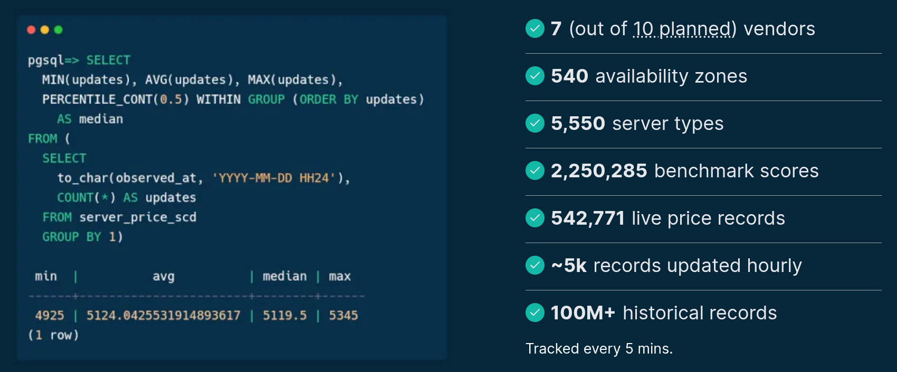

<p class="centered" style="margin-top: -10px;">Source: <a href="https://sparecores.com">sparecores.com</a></p>

::: {.notes}
high level numbers about the data we collect and make available
:::

## > sparecores::navigator

::: {.centered}
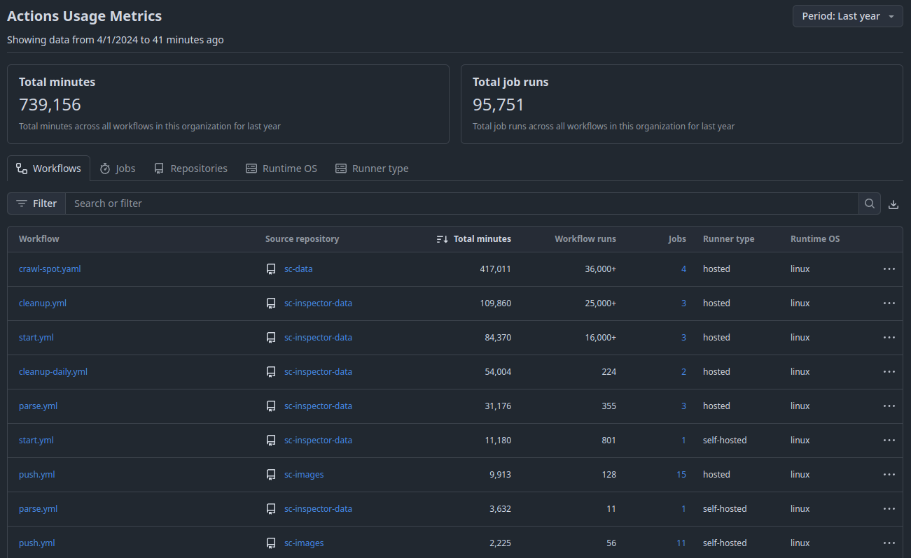
:::

<aside class="notes">
FTR this dataset was generated, collected, standardized, and published in public GHA if ou are interested in the details.
running around 100k jobs over 10k hours...
</aside>

## > sparecores::navigator[grep("!@#$%^&*()")]

::: {.centered}
<a href="https://sparecores.com/servers" target="_blank">
  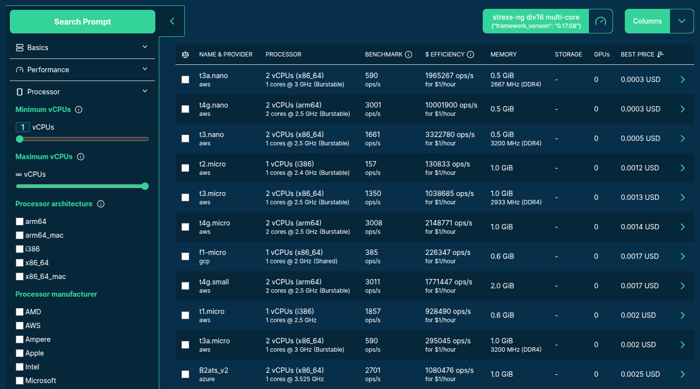
</a>
:::

::: {.notes}
The easiest way to query this data is through our web component, as you can see on the screen ...

This is not only a list of servers, but you can filter, order, and search for specific instances.
We already show some performance metrics by default, along with the cost efficiency based on the spot or on-demand pricing.

Repro: https://sparecores.com/servers?architecture=x86_64&benchmark_score_min=10&memory_min=32&compliance_framework=hipaa&countries=GB&order_by=selected_benchmark_score_per_price&order_dir=desc&columns=75744272&benchmark=eyJpZCI6ImxsbV9zcGVlZDp0ZXh0X2dlbmVyYXRpb24iLCJjb25maWciOiJ7XCJtb2RlbFwiOiBcImdlbW1hLTJiLlE0X0tfTS5nZ3VmXCIsIFwidG9rZW5zXCI6IDUxMn0ifQ%3D%3D

https://sparecores.com/servers?architecture=x86_64&benchmark_score_min=10&memory_min=32&columns=75744272&benchmark=eyJpZCI6ImxsbV9zcGVlZDp0ZXh0X2dlbmVyYXRpb24iLCJjb25maWciOiJ7XCJtb2RlbFwiOiBcImdlbW1hLTJiLlE0X0tfTS5nZ3VmXCIsIFwidG9rZW5zXCI6IDUxMn0ifQ%3D%3D&best_price_allocation=MONTHLY

- architecture=x86_64
- memory_min=32
- benchmark: llm / text generation / gemma / 512 tokens
- benchmark_score_min: 10
- price_allocation: MONTHLY
- compliance_framework: hipaa
- countries: GB
:::

## > sample(sparecores::navigator, 1)

::: {.centered}
<a href="https://sparecores.com/server/gcp/g2-standard-16" target="_blank">
  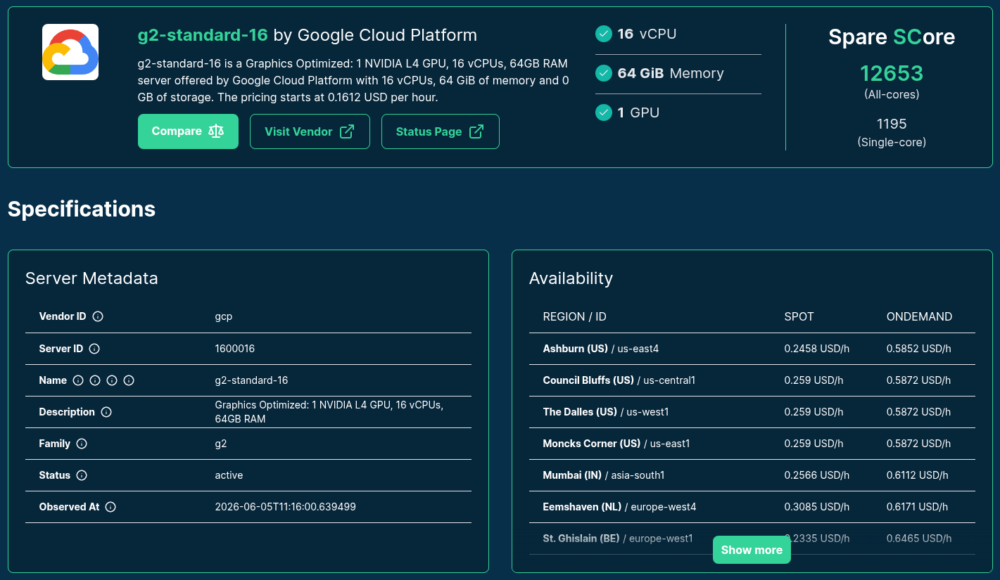
</a>
:::

::: {.notes}
Clicking on a server shows you the technical details of the instance -- much more than what's provided publicly by the vendor, even more than what ChatGPT knows ... as we actually start each machine and inspect the hardware.
:::

## > sample(sparecores::navigator, 1)

::: {.centered}
<a href="https://sparecores.com/server/gcp/g2-standard-16" target="_blank">
  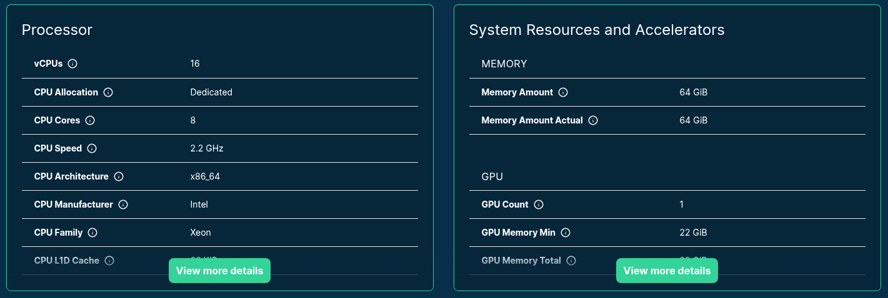
  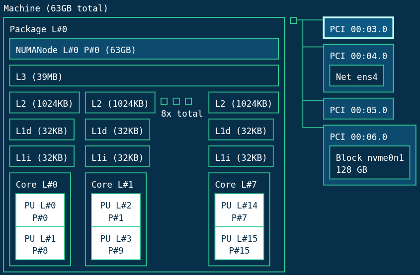
</a>
:::

## > sample(sparecores::navigator, 1)

::: {.centered}
<a href="https://sparecores.com/server/gcp/g2-standard-16" target="_blank">
  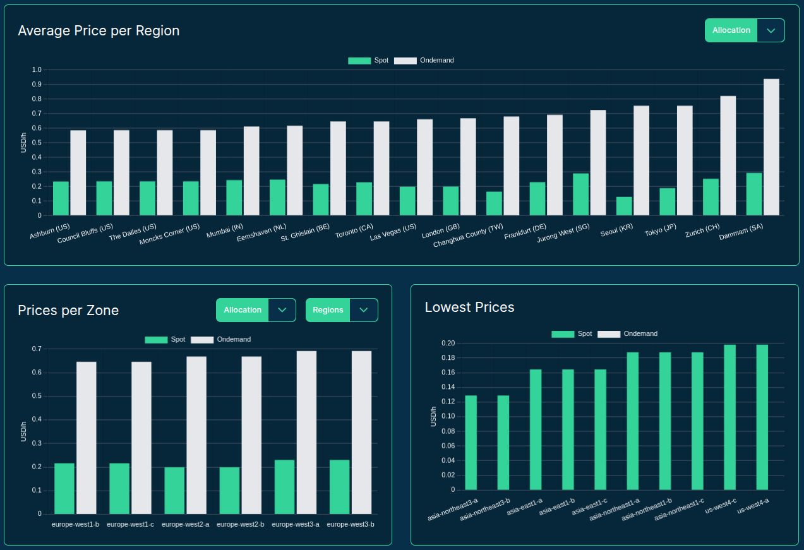
</a>
:::

::: {.notes}
Live and historical pricing
:::

## > sample(sparecores::navigator, 1)

<!--
<iframe
 src="https://sparecores.com/embed/server/gcp/g2-standard-16/bw_mem"
 style="height: 510px; width: 100%; border: 1px solid #34d399; border-radius: 8px; min-height: 400px">
</iframe>
-->

::: {.centered}
<a href="https://sparecores.com/server/gcp/g2-standard-16" target="_blank">
  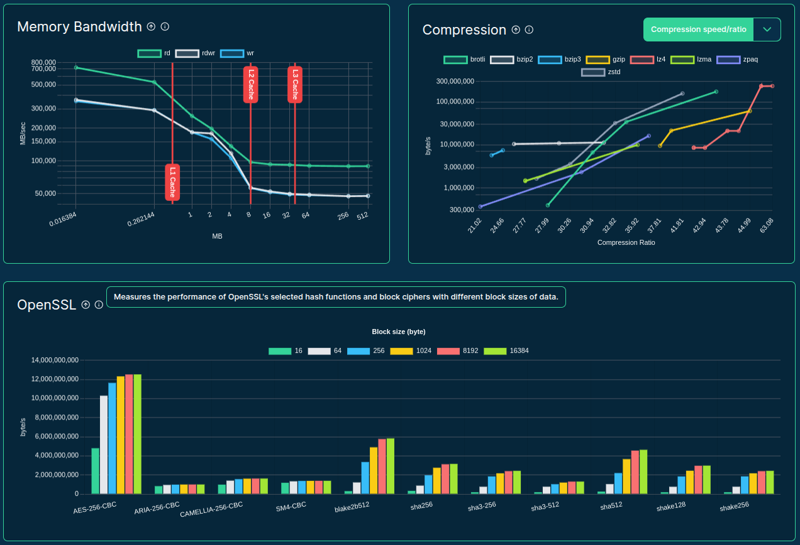
</a>
:::

::: {.notes}
and we also run benchmark scenarios on the servers, e.g.:

- memory bandwidth of read, write and mixed operations using various block sizes and also including the related L1/L2/L3 cache amounts
- or benchmarking compression algos - having the compression ratio on the x axis, and the bandwidth on the y axis, it's clear that `zpaq` is a beast when it comes to compressing text, but might be slow on this machine
- OpenSSL hash functions and block ciphers
:::

## > sample(sparecores::navigator, 1)

<a href="https://sparecores.com/server/gcp/g2-standard-16" target="_blank">
  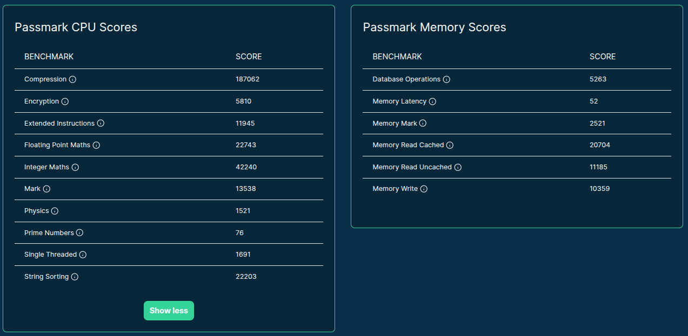
</a>

::: {.notes}
also running test suites like PassMark or ...
:::

## sample(sparecores::navigator, 1)

<a href="https://sparecores.com/server/gcp/g2-standard-16" target="_blank">
  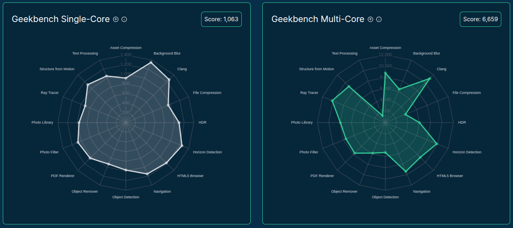
</a>

::: {.notes}
Geekbench 6, which has been a standard tool for some time including workloads for text and image processing, compiling software etc
:::

## > sample(sparecores::navigator, 1)

<a href="https://sparecores.com/server/gcp/g2-standard-16" target="_blank">
  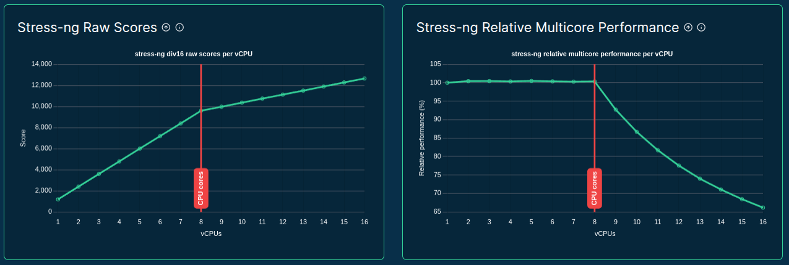
</a>

::: {.notes}
visualizations on how well the machine can scale tasks to multiple CPU cores -- e.g. showing the diminishing return on this Intel Xeon due to hyperthreading
:::

## > sample(sparecores::navigator, 1)

<a href="https://sparecores.com/server/gcp/g2-standard-16" target="_blank">
  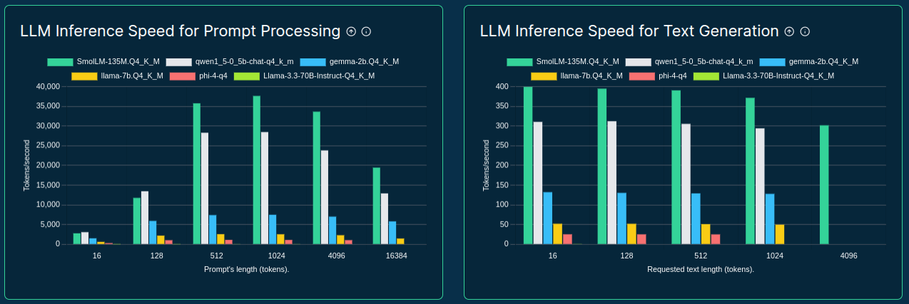
</a>

::: {.notes}
Or looking at LLM Inference Speed both for prompt processing and text generation,
using smaller models with 135M parameters up to 70B larger models.
:::

## > sample(sparecores::navigator, 1)

<a href="https://sparecores.com/server/gcp/g2-standard-16" target="_blank">
  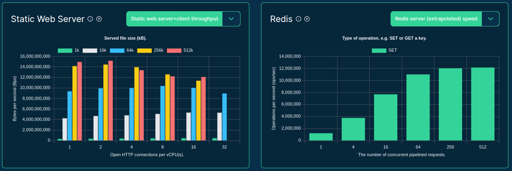
</a>

::: {.notes}
and other application-specific benchmarks, like serving a static website or running a key-value store database
:::

## > sample(sparecores::navigator, 7)

::: {.centered}
<a href="https://sparecores.com/compare?instances=W3sidmVuZG9yIjoiYXdzIiwic2VydmVyIjoiYzVhZC4xMnhsYXJnZSJ9LHsidmVuZG9yIjoiYXdzIiwic2VydmVyIjoiYzVkLjJ4bGFyZ2UifSx7InZlbmRvciI6ImF3cyIsInNlcnZlciI6ImM2Zy4xNnhsYXJnZSJ9LHsidmVuZG9yIjoiaGNsb3VkIiwic2VydmVyIjoiY2N4MzMifV0%3D" target="_blank">
  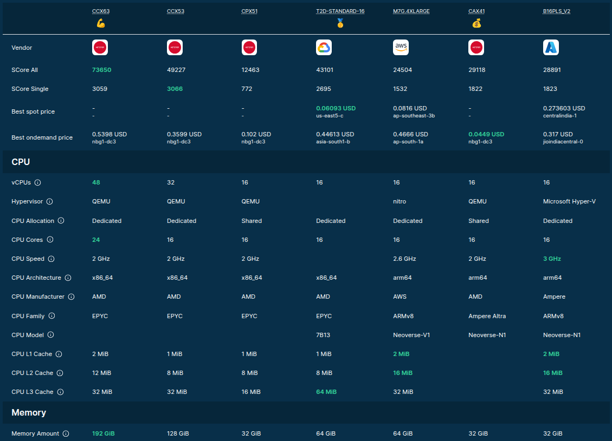
</a>
:::

::: {.notes}
and making all these data available in comparison tables,
e.g. you can see "Best performance servers for Redis below ¢50/hour" here
:::

## > sample(sparecores::navigator, 7)

::: {.centered}
<a href="https://sparecores.com/compare?instances=W3sidmVuZG9yIjoiYXdzIiwic2VydmVyIjoiYzVhZC4xMnhsYXJnZSJ9LHsidmVuZG9yIjoiYXdzIiwic2VydmVyIjoiYzVkLjJ4bGFyZ2UifSx7InZlbmRvciI6ImF3cyIsInNlcnZlciI6ImM2Zy4xNnhsYXJnZSJ9LHsidmVuZG9yIjoiaGNsb3VkIiwic2VydmVyIjoiY2N4MzMifV0%3D" target="_blank">
  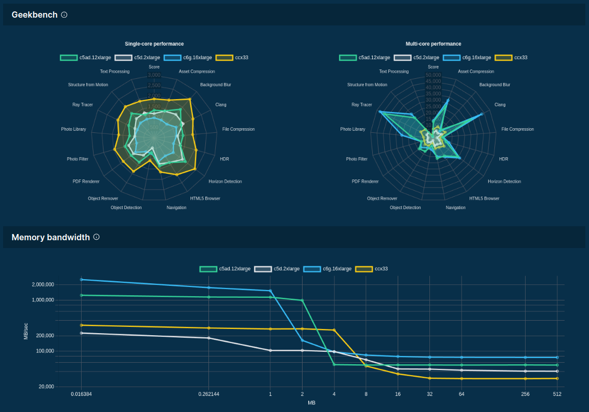
</a>
:::

::: {.notes}
or plots as well for human inspection
:::

## > plumber(sparecores::navigator)

::: {.centered}
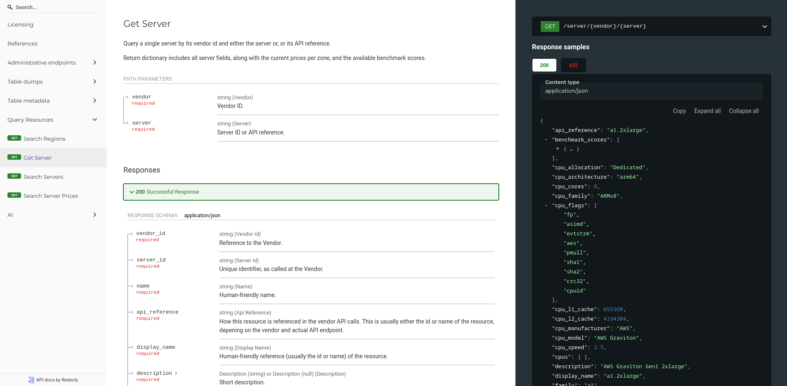
:::

::: {.notes}
for computers, we provide APIs ...
:::

## > sparecores::navigator[i, j, by = ...]

```r {code-line-numbers="1-4|6-10|12|13-72|43-60" style="margin-top: 20px !important; height: 640px;"}
> library(reticulate)

> sc_data <- reticulate::import("sc_data")
> db <- dbConnect(RSQLite::SQLite(), sc_data$data$Data()$actual_db_path)

> pms <- sapply(c('sc_crawler', 'sc_data', 'sc_keeper', 'sqlmodel'), import)
> db <- pms$sc_keeper$database$session
> Server <- pms$sc_crawler$tables$Server
> server_select <- pms$sqlmodel$select(Server)
> sc_query_one <- function(query) db$sessionmaker$exec(query)$one()$model_dump()

> sc_query_one(server_select$where(Server$vendor_id == "aws")$where(Server$server_id == "g4dn.xlarge"))
List of 41
 $ server_id        : chr "g4dn.xlarge"
 $ vendor_id        : chr "aws"
 $ display_name     : chr "g4dn.xlarge"
 $ api_reference    : chr "g4dn.xlarge"
 $ name             : chr "g4dn.xlarge"
 $ family           : chr "g4dn"
 $ description      : chr "Graphics intensive [Instance store volumes] [Network and EBS optimized] Gen4 xlarge"

 $ status           : chr "active"
 $ observed_at      : POSIXct[1:1], format: "2024-07-05 19:17:01"

 $ hypervisor       : chr "nitro"
 $ vcpus            : int 4
 $ cpu_cores        : int 2
 $ cpu_allocation   : chr "Dedicated"
 $ cpu_manufacturer : chr "Intel"
 $ cpu_family       : chr "Xeon"
 $ cpu_model        : chr "8259CL"
 $ cpu_architecture : chr "x86_64"
 $ cpu_speed        : num 3.5
 $ cpu_l1_cache     : int 131072
 $ cpu_l2_cache     : int 2097152
 $ cpu_l3_cache     : int 37486592
 $ cpu_flags        : chr [1:87] "fpu" "vme" "de" "pse" ...

 $ memory_amount    : int 16384
 $ memory_generation: chr "DDR4"
 $ memory_speed     : int 2933

 $ gpu_count        : int 1
 $ gpu_memory_min   : int 16384
 $ gpu_memory_total : int 16384
 $ gpu_manufacturer : chr "Nvidia"
 $ gpu_family       : chr "Turing"
 $ gpu_model        : chr "Tesla T4"
 $ gpus             :List of 1
  ..$ :List of 10
  .. ..$ manufacturer    : chr "Nvidia"
  .. ..$ family          : chr "Turing"
  .. ..$ model           : chr "Tesla T4"
  .. ..$ memory          : int 15360
  .. ..$ firmware_version: chr "535.171.04"
  .. ..$ bios_version    : chr "90.04.96.00.A0"
  .. ..$ graphics_clock  : int 1590
  .. ..$ sm_clock        : int 1590
  .. ..$ mem_clock       : int 5001
  .. ..$ video_clock     : int 1470

 $ storage_size     : int 125
 $ storage_type     : chr "nvme ssd"
 $ storages         :List of 1
  ..$ :List of 2
  .. ..$ size        : int 125
  .. ..$ storage_type: chr "nvme ssd"

 $ network_speed    : num 5
 $ inbound_traffic  : num 0
 $ outbound_traffic : num 0
 $ ipv4             : int 0
```

::: {.notes}
and SDKs as well, e.g. querying the details of this instance type: SCROLL through!
:::

# > bug.report(package="navigator") {#components transition="convex-in convex-out"}

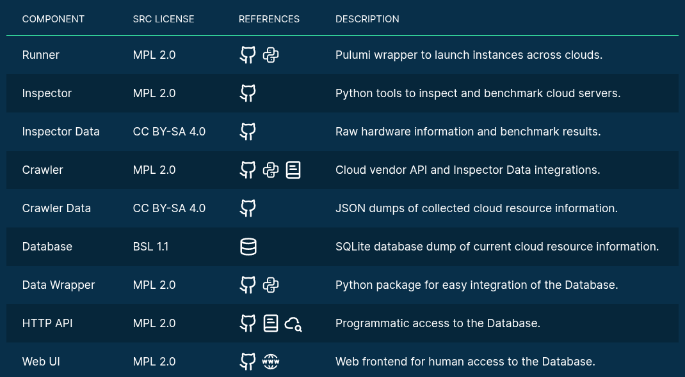

::: {.notes}
:::

# > library(resource.tracker) {transition="convex-in slide-out"}

<ul>
<li class="fragment" data-fragment-index=1>Lightweight (zero-dependency*) Python package</li>
<li class="fragment" data-fragment-index=3>Alternative Linux-only implementation in Rust</li>
<li class="fragment" data-fragment-index=4>Monitors host and process-level resource usage</li>
<li class="fragment" data-fragment-index=5>Tracks CPU, memory, GPU, network, storage & more</li>
<li class="fragment" data-fragment-index=6>Ease of use, minimal setup</li>
<li class="fragment" data-fragment-index=7>Runs in the background, non-blocking</li>
<li class="fragment" data-fragment-index=8>Framework extensions (e.g. Metaflow)</li>

<div class="fragment" style="margin-top: 40px;" data-fragment-index=2>\* No dependencies on Linux; `psutil` on other OS.</div>

::: {.notes}
And here comes the resource tracker to the rescue!

If you are running Linux, and most production servers are Linux ... it can use the proc filesystem without any further dependencies -- other than a modern Linux kernel. On other operating systems, it uses `psutil` to get the same information.

It supports recent Python versions, going back to the latest officially supported Python version,
so that you can run it anywhere.

It can monitor the resource usage of the whole system, like logging the overall CPU and memory usage etc
But can also track a single process and optionally its children as well -- independent from the whole system.

It can track the CPU usage, memory usage, disk I/O, network usage, GPU usage, and more.

It's easy to use, and it's non-blocking, so you can run it in the background while your code is running.

By default, it's framework agnostic .. but comes with a few extensions, e.g. for Metaflow.
:::

## > install.packages("resource.tracker")

Requires Python 3.9+ and :

```r {style="margin-top: 20px !important;" }
reticulate::py_install('resource-tracker')
```

Then install the R package bindings from GitHub:

```r {style="margin-top: 20px !important;" }
remotes::install_github('SpareCores/resource-tracker', subdir = 'R')
```

## > demo(package=resource.tracker)


```r {code-line-numbers="1-2|4-8|10-34|36-41|43-67" style="margin-top: 20px !important; height: 640px;" }
> library(resource.tracker)
> tracker <- ResourceTracker$new()

> numbers <- 1:1e6
> window <- 3
> rollavg <- sapply(
+   seq_len(length(numbers) - window + 1),
+   function(i) mean(numbers[i:(i + window - 1)]))

> tracker$stats()
List of 9
 $ process_cpu_usage        :List of 2
  ..$ mean: num 1.12
  ..$ max : num 1.14
 $ process_memory           :List of 2
  ..$ mean: num 728783
  ..$ max : num 798130
 $ process_gpu_usage        :List of 2
  ..$ mean: num 0
  ..$ max : num 0
 $ process_gpu_vram         :List of 2
  ..$ mean: num 0
  ..$ max : num 0
 $ process_gpu_utilized     :List of 2
  ..$ mean: num 0
  ..$ max : num 0
 $ system_disk_space_used_gb:List of 1
  ..$ max: num 2560
 $ system_net_recv_bytes    :List of 1
  ..$ sum: num 1840217
 $ system_net_sent_bytes    :List of 1
  ..$ sum: num 1843725
 $ timestamp                :List of 1
  ..$ duration: num 7

> tracker$recommend_resources()
List of 4
 $ cpu   : int 1
 $ memory: int 1024
 $ gpu   : int 0
 $ vram  : int 0

> tracker$recommend_server()
List of 50
 $ vendor_id            : chr "upcloud"
 $ server_id            : chr "DEV-1xCPU-1GB-10GB"
 $ description          : chr "Developer 1 vCPUs, 1 GB RAM"
 $ family               : chr "Developer"
 $ vcpus                : int 1
 $ hypervisor           : chr "KVM"
 $ cpu_allocation       : chr "Shared"
 $ cpu_cores            : int 1
 $ cpu_architecture     : chr "x86_64"
 $ cpu_manufacturer     : chr "AMD"
 $ cpu_family           : chr "EPYC"
 $ cpu_model            : chr "7542"
 $ cpu_l1_cache         : int 131072
 $ cpu_l2_cache         : int 524288
 $ cpu_l3_cache         : int 16777216
 $ cpu_flags            : chr [1:88] "fpu" "vme" "de" "pse" ...
 $ memory_amount        : int 1024
 $ storage_size         : int 10
 $ inbound_traffic      : num 0
 $ outbound_traffic     : num 1024
 $ ipv4                 : int 1
 $ price                : num 0.0052
 ...
```

::: {.notes}
inefficient rolling mean implementation
:::

## > ?tracker$recommend_resources

```python {code-line-numbers="1-1|6-9|12-13" style="margin-top: 30px !important; margin-bottom: 30px !important; font-size: 32px"}
>>> print(ResourceTracker.recommend_resources.__doc__)
Recommend optimal resource allocation based on the measured resource tracker data.

The recommended resources are based on the following rules:

- target average CPU usage of the process(es)
- target maximum memory usage of the process(es) with a 20% buffer
- target maximum number of GPUs used by the process(es)
- target maximum VRAM usage of the process(es) with a 20% buffer

Args:
    historical_stats: Optional list of historical statistics (as returned by [resource_tracker.ResourceTracker.stats][])
                      to consider when making recommendations. These will be combined with the current stats.

Returns:
    A dictionary containing the recommended resources (cpu, memory, gpu, vram).
```

. . .

To make this more convenient (automatic),<br />check out e.g. the Metaflow extension!


## > setDT(tracker$data)

```r {code-line-numbers="1-23|25-39|41-74" style="margin-top: 20px !important; height: 640px;" }
> tracker$system_metrics
'data.frame':   6 obs. of  21 variables:
 $ timestamp          : POSIXct, format: "2026-07-06 23:54:36" "2026-07-06 23:54:37" ...
 $ processes          : int  678 678 681 678 677 677
 $ utime              : num  0.63 1.21 1.23 1.26 1.17 1.16
 $ stime              : num  0.54 0.26 0.43 0.32 0.21 0.28
 $ cpu_usage          : num  1.17 1.47 1.66 1.58 1.38 ...
 $ memory_free_mib    : num  38394 38388 38398 38392 38344 ...
 $ memory_used_mib    : num  23607 23613 23603 23609 23657 ...
 $ memory_buffers_mib : num  5.25 5.25 5.25 5.25 5.25 ...
 $ memory_cached_mib  : num  41214 41214 41214 41214 41214 ...
 $ memory_active_mib  : num  27286 27295 27305 27308 27379 ...
 $ memory_inactive_mib: num  24520 24520 24520 24520 24520 ...
 $ disk_read_bytes    : int  32768 0 0 0 0 0
 $ disk_write_bytes   : int  0 671744 48578560 598016 0 663552
 $ disk_space_total_gb: num  6142 6142 6142 6142 6142 ...
 $ disk_space_used_gb : num  1563 1563 1563 1563 1563 ...
 $ disk_space_free_gb : num  4575 4575 4575 4575 4575 ...
 $ net_recv_bytes     : int  732 1902 1236 21488 16070 14904
 $ net_sent_bytes     : int  978 3572 2270 9361 50019 29286
 $ gpu_usage          : num  0.01 0.05 0.05 0.06 0.04 0.04
 $ gpu_vram_mib       : num  1651 1661 1661 1656 1646 ...
 $ gpu_utilized       : int  1 1 1 1 1 1

> tracker$process_metrics
'data.frame':   7 obs. of  12 variables:
 'data.frame':   6 obs. of  12 variables:
 $ timestamp       : POSIXct, format: "2026-07-06 23:54:36" "2026-07-06 23:54:37" ...
 $ pid             : int  321426 321426 321426 321426 321426 321426
 $ children        : int  5 5 5 5 5 5
 $ utime           : num  0.46 1.05 1.01 1.03 1 1
 $ stime           : num  0.19 0.09 0.09 0.06 0.1 0.09
 $ cpu_usage       : num  0.65 1.14 1.1 1.09 1.1 ...
 $ memory_mib      : num  322 329 338 341 411 ...
 $ disk_read_bytes : int  16384 0 0 0 0 0
 $ disk_write_bytes: int  0 0 0 0 0 0
 $ gpu_usage       : int  0 0 0 0 0 0
 $ gpu_vram_mib    : int  0 0 0 0 0 0
 $ gpu_utilized    : int  0 0 0 0 0 0

> str(tracker$get_combined_metrics(human_names = TRUE))
'data.frame':   6 obs. of  32 variables:
 $ Timestamp                      : num  1.78e+09 1.78e+09 1.78e+09 1.78e+09 1.78e+09 ...
 $ System processes               : int  678 678 681 678 677 677
 $ System CPU time (user)         : num  0.63 1.21 1.23 1.26 1.17 1.16
 $ System CPU time (system)       : num  0.54 0.26 0.43 0.32 0.21 0.28
 $ System CPU usage               : num  1.17 1.47 1.66 1.58 1.38 ...
 $ System free memory             : num  38394 38388 38398 38392 38344 ...
 $ System used memory             : num  23607 23613 23603 23609 23657 ...
 $ System memory buffers          : num  5.25 5.25 5.25 5.25 5.25 ...
 $ System memory page/file cached : num  41214 41214 41214 41214 41214 ...
 $ System active memory           : num  27286 27295 27305 27308 27379 ...
 $ System inactive memory         : num  24520 24520 24520 24520 24520 ...
 $ System disk read               : int  32768 0 0 0 0 0
 $ System disk write              : int  0 671744 48578560 598016 0 663552
 $ System disk space total        : num  6142 6142 6142 6142 6142 ...
 $ System disk space used         : num  1563 1563 1563 1563 1563 ...
 $ System disk space free         : num  4575 4575 4575 4575 4575 ...
 $ System inbound network traffic : int  732 1902 1236 21488 16070 14904
 $ System outbound network traffic: int  978 3572 2270 9361 50019 29286
 $ System GPU usage               : num  0.01 0.05 0.05 0.06 0.04 0.04
 $ System VRAM used               : num  1651 1661 1661 1656 1646 ...
 $ System GPUs in use             : int  1 1 1 1 1 1
 $ Process PID                    : int  321426 321426 321426 321426 321426 321426
 $ Process children               : int  5 5 5 5 5 5
 $ Process CPU time (user)        : num  0.46 1.05 1.01 1.03 1 1
 $ Process CPU time (system)      : num  0.19 0.09 0.09 0.06 0.1 0.09
 $ Process CPU usage              : num  0.65 1.14 1.1 1.09 1.1 ...
 $ Process memory usage           : num  322 329 338 341 411 ...
 $ Process disk read              : int  16384 0 0 0 0 0
 $ Process disk write             : int  0 0 0 0 0 0
 $ Process GPU usage              : int  0 0 0 0 0 0
 $ Process VRAM used              : int  0 0 0 0 0 0
 $ Process GPUs in use            : int  0 0 0 0 0 0
```

## > tracker\$report()\$browse()

::: {.centered}
<a href="https://sparecores.com/assets/slides/example-resource-tracker-report-in-metaflow.html" target="_blank">
  
</a>
:::


## > ?ResourceTracker

<a href="https://sparecores.github.io/resource-tracker/reference/resource_tracker/tracker/#resource_tracker.tracker.ResourceTracker" target="_blank">
   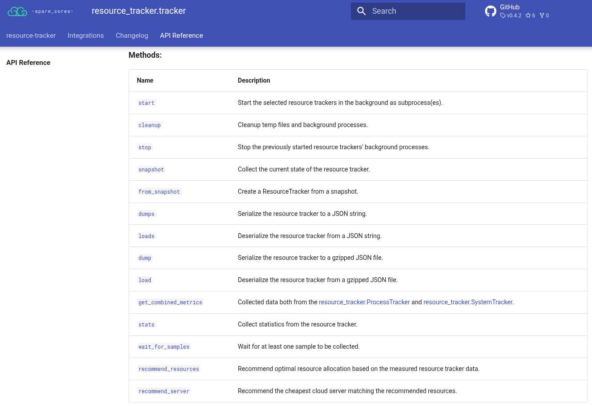
</a>

# {#bye data-transition="convex-in convex-out"}

<!-- https://carbon.now.sh/?bg=rgba%288%2C47%2C73%2C1%29&t=theme%3A0bcewbfyk9yl&wt=none&l=python&width=680&ds=false&dsyoff=20px&dsblur=68px&wc=true&wa=true&pv=5px&ph=5px&ln=false&fl=1&fm=Hack&fs=18px&lh=161%25&si=false&es=2x&wm=false&code=%253E%253E%253E%2520import%2520os%250A%253E%253E%253E%2520import%2520signal%250A%253E%253E%253E%2520os.kill%28os.getpid%28%29%252C%2520signal.SIGKILL%29%2520%2520%250A%250A%253E%253E%253E%2520visit%28%27https%253A%252F%252Fsparecores.com%27%29%250A%253E%253E%253E%2520email%28%27daroczig%2540sparecores.com%27%29%250A%253E%253E%253E%2520follow%28%27%2540SpareCores%27%29%250A%250A%253E%253E%253E%2520os._exit%28status%253D0%29%250AProcess%2520finished%2520at%2520Jan%252029%25207%253A30%2520PM%25202026%2520%2520%2520 -->

::: {.centered}
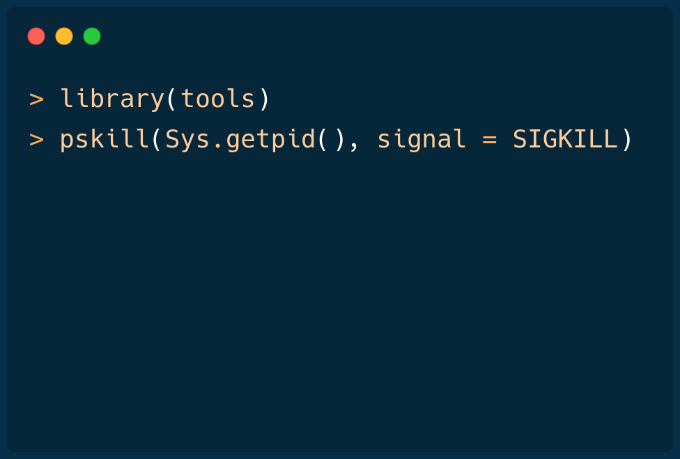
:::

## > browseURL("meet.sparecores.com") {#meet data-transition="convex-in concave-out"}

::: {.centered}

:::

## {#bye-bye data-transition="concave-in"}

::: {.centered}
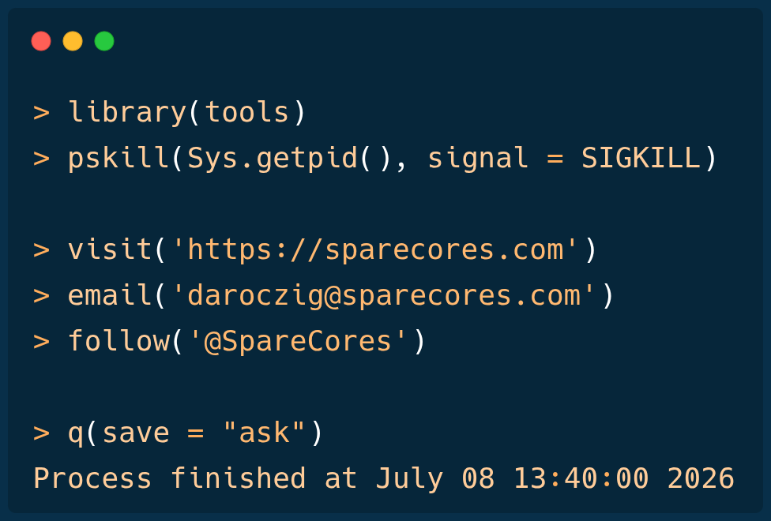
:::

<p class="author offlineMode" style="color:#eee;font-size:0.75em;text-align: center !important; margin-top:-30px; padding-top:0px;">
  Slides: <a href="https://sparecores.com/talks" target="_blank">sparecores.com/talks</a>
</p>

<!--toggle visibility of items in live mode-->
<script>
var url = document.location.href;
if (url.match("/?live")) {
  const elements = document.getElementsByClassName('offlineMode');
  for (let i = 0; i < elements.length; i++) {
    element = elements.item(i);
    element.style.display = 'none';
  }
} else {
  const elements = document.getElementsByClassName('onlineMode');
  for (let i = 0; i < elements.length; i++) {
    element = elements.item(i);
    element.style.display = 'none';
  }
}
</script>
